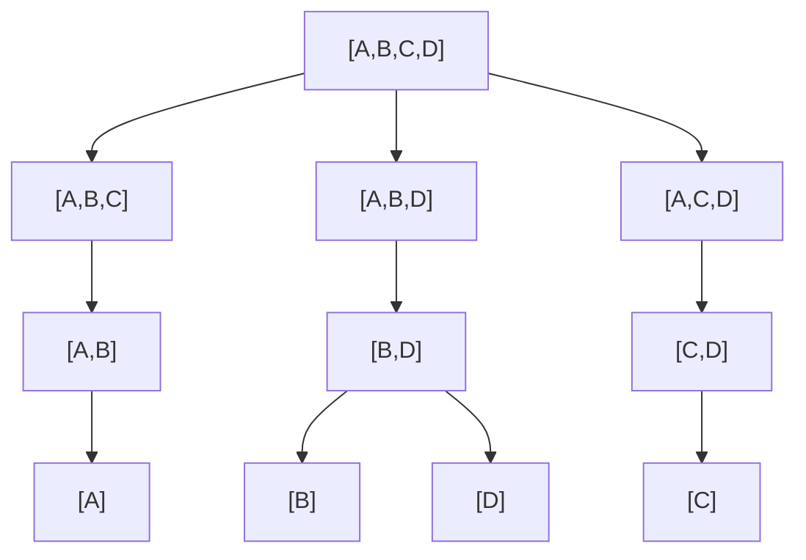
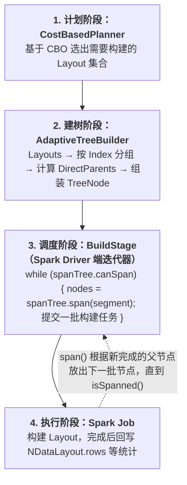

# 源码拆解：Apache Kylin 中的 Adaptive Spanning Tree —— Cuboid 构建顺序的自适应调度器

> **作者**：Huang Sheng (mrhs121)
> **日期**：2026-08-17
> **分类**：`Apache Kylin` · `OLAP` · `构建引擎` · `调度优化` · `源码剖析`

---

## 0. 导读与背景问题

在 Apache Kylin 这样的 MOLAP 引擎中，**模型构建（Build）** 是整个系统的心脏。一个 Segment 在构建时，需要物化大量 **Layout（Cuboid 聚合表）**——即各种维度组合的预聚合结果。

关键问题在于：**这些 Layout 之间存在派生关系**。例如维度集合为 `[A,B,C,D]` 的模型，其 Cuboid 格（Lattice）长这样：



构建 `[A,B]` 时，既可以**从 Flat Table（事实表+维表 Join 后的宽表）直接聚合**，也可以**从已经构建好的 `[A,B,C]` 二次聚合**。后者行数更少、扫描量更小，成本更低——这就是经典的 "Cuboid 派生构建" 优化。

那么调度器必须回答两个问题：

1. **顺序问题**：哪个 Layout 先构建、哪个后构建？
2. **来源问题**：某个 Layout 应该从哪个父 Layout 聚合而来？

Kylin 用一棵 **Spanning Tree（生成树）** 来回答这两个问题，而其中的自适应版本 **Adaptive Spanning Tree** 就是本文的主角。核心代码位于：

```
src/core-metadata/src/main/java/org/apache/kylin/metadata/cube/cuboid/AdaptiveSpanningTree.java
```

---

## 1. 架构全景：Spanning Tree 在构建链路中的位置

整个构建调度链路跨越 **计划生成**、**树构建**、**滚动调度**、**Spark 作业执行** 四个阶段：



对应代码锚点：

| 组件 | 位置 | 职责 |
|---|---|---|
| `CostBasedPlanner` | `engine-spark/.../job/step/build/CostBasedPlanner.scala:38` | 创建 `AdaptiveSpanningTree` |
| `AdaptiveSpanningTree` | `core-metadata/.../cuboid/AdaptiveSpanningTree.java` | 调度核心 |
| `BuildStage` | `engine-spark/.../job/step/build/BuildStage.scala:514` | 滚动迭代器，循环调用 `span()` |
| `PartitionSpanningTree` | `core-metadata/.../cuboid/PartitionSpanningTree.java:44` | 分区表构建场景的子类扩展 |

---

## 2. 数据模型：TreeNode / LayoutNode / Candidate

### 2.1 TreeNode —— 树的节点

每个 `TreeNode` 对应一个 **Index（维度组合）** 及其下属的若干 Layout（`AdaptiveSpanningTree.java:380`）：

```java
protected static class TreeNode {
    protected TreeNode parent;             // 选定的父节点；null 表示从 Flat Table 构建
    protected TreeNode rootNode;           // 根节点（已存在的祖先 Data Layout，虚拟节点）
    protected LayoutEntity layout;         // 父节点维护：供子树聚合用的 Data Layout
    protected final IndexEntity index;     // 维度组合，如 [A,B]
    protected final List<LayoutNode> layoutNodes;
    protected int level = -1;              // 自底向上的层号
    protected List<IndexEntity> directParents;  // 直接父候选
    protected int localPriority = -1;      // 局部性优先级（Flat Table 亲和）
}
```

几个容易混淆的概念：

- **`spanned` 不等于"数据已落盘"**。`LayoutNode` 上的注释写得很清楚（`AdaptiveSpanningTree.java:490`）："'Spanned' doesn't mean the node's data layout built." 它只表示**该节点已被纳入构建计划**，真正完成与否要看 Segment 里有没有对应的 `NDataLayout`。
- **Level 0th 节点** 是最底层节点，分两种（`getLevel0thNodes`, `AdaptiveSpanningTree.java:240`）：
  - `parent == null`：从 Flat Table 构建；
  - `parent != null`：Segment 中已存在可派生的祖先 Data Layout（断点续建场景），直接挂到那个"祖先虚拟节点"下。
- **DirectParents** 由 `getDirectParents()` 计算（`AdaptiveSpanningTree.java:365`）：在按维度数升序排列的 Index 集合中，找出所有能"完全派生"当前 Index、且**自身不被其它候选派生**的最小父集合——即 Lattice 意义上的直接上盖（immediate parents）。

### 2.2 Candidate —— 一次调度决策

`Candidate` 是"节点 + 候选父 Layout"的组合（`AdaptiveSpanningTree.java:514`），携带三个关键排序因子：

| 字段 | 含义 |
|---|---|
| `getParentLevel()` | 父节点所在层，控制自底向上推进 |
| `getParentRows()` | 父 Data Layout 的行数，越小聚合越便宜 |
| `fraction` | 已完成父节点的占比（完成度） |

---

## 3. 建树：AdaptiveTreeBuilder 自底向上分层

`AdaptiveTreeBuilder.buildTreeNodes()`（`AdaptiveSpanningTree.java:295`）做了三件事：

1. **分层**：所有 Index 按维度个数升序排列（`sortedSet0` 比较器），天然形成"维度少的在下层"的层次结构。
2. **挂父**：对没有 DirectParents 的最底层节点，尝试在 Segment 中找一个**已构建好的、可完全派生它的祖先 Layout**，选其中**行数最小**的一个作为虚拟根节点（`AdaptiveSpanningTree.java:304-318`）——这就是**断点续建**的入口：上一次构建已完成的 Layout 不需要从 Flat Table 重来。
3. **跳过已完成**：若某 Layout 已存在于 Segment（从 Checkpoint 恢复的场景），直接标记 `spanned` 并打日志跳过（`AdaptiveSpanningTree.java:323-329`）。

---

## 4. 两种 Span 策略：分层模式 vs 自适应模式

入口方法 `span(NDataSegment)` 按配置开关二选一（`AdaptiveSpanningTree.java:121`）：

```java
public List<TreeNode> span(NDataSegment dataSegment) {
    if (adaptive) {
        return adaptiveSpan(dataSegment);
    }
    return layeredSpan(dataSegment);
}
```

开关定义在 `KylinConfigBase.java:3785`：

| 配置项 | 默认值 | 含义 |
|---|---|---|
| `kylin.engine.adaptive-spanning-tree-enabled` | `false` | 是否启用自适应模式 |
| `kylin.engine.adaptive-spanning-tree-threshold` | `0.5` | 父节点完成度阈值 |
| `kylin.engine.adaptive-spanning-tree-batch-size` | `10` | 每轮最多放出的节点数 |

### 4.1 分层模式 layeredSpan（默认）

严格逐层推进（`AdaptiveSpanningTree.java:190`）：

```java
List<Candidate> parents = getParentCandidates(node, dataSegment);
if (parents.size() < node.getDirectParents().size()) {
    // 只要有一个直接父节点没完成，该节点就得等
    return null;
}
return parents.stream().min(Comparator.comparingLong(Candidate::getParentRows)).orElse(null);
```

规则很朴素：**所有直接父节点全部完成后才开工，并从中挑行数最小的作为聚合来源**。结果只按 `indexId` 排序。

缺点显而易见：上层有一个慢任务，下层整批节点全部干等，集群资源闲置。

### 4.2 自适应模式 adaptiveSpan

核心放宽在 `getOptimalCandidate()`（`AdaptiveSpanningTree.java:151`）：

```java
final double fraction = ((double) parents.size()) / directParentSize;
if (fraction < adaptiveThreshold) {
    return null;   // 完成度不足阈值，继续等
}
// 在已完成的父里选行数最小的
T candidate = parents.stream().min(Comparator.comparingLong(Candidate::getParentRows)).orElse(null);
```

**不再要求所有父节点完成，只要已完成的父占比 ≥ threshold（默认 0.5）即可开工。**

类头部的注释（`AdaptiveSpanningTree.java:57-59`）用一个例子说明了三个收益场景：

> 1. Build [A,B] without waiting for [A,C,D] to complete;
> 2. When [A,B,C] has completed, [A,B,D] is still under building, and the application has available resources at this time, it's time to initiate the building job of [A,B];
> 3. When [A,B,C], [A,B,D] have completed, if rows([A,B,C]) < rows([A,B,D]), then [A,B] is based on [A,B,C] to complete.

随后候选按五级 Comparator 排序并**限量放出**（`AdaptiveSpanningTree.java:171-187`）：

```java
final Comparator<Candidate> comparator = Comparator.comparingInt(Candidate::getParentLevel)
        .thenComparingDouble(Candidate::getParentUnfinishedFraction)
        .thenComparingLong(Candidate::getParentRows)
        .thenComparingInt(Candidate::getLocalPriority)
        .thenComparingLong(Candidate::getIndexId);

return treeNodes.stream().filter(TreeNode::nonSpanned)
        .map(...).filter(Objects::nonNull)
        .sorted(comparator)
        .limit(adaptiveBatchSize)        // 每轮最多 10 个
        .map(this::markSpanned)
        .collect(Collectors.toList());
```

| 排序键 | 作用 |
|---|---|
| `parentLevel` | 先建底层，维持 "layer controlling" |
| `parentUnfinishedFraction` | 父完成度高的优先——离产出数据最近的先做 |
| `parentRows` | 父行数小的优先，聚合代价低 |
| `localPriority` | 局部性优先，Flat Table 亲和（参考性局部原理） |
| `indexId` | 稳定兜底，保证确定性 |

### 4.3 markSpanned：落定父子关系

一个节点被"span"后（`AdaptiveSpanningTree.java:208`）：标记所有 LayoutNode 为 spanned、绑定选中的父节点、记录 `level = parent.level + 1`、把自己挂进父节点的 `subtrees`。此后 Spark 构建作业就知道该 Layout 应该**读哪个父 Data Layout 做二次聚合**，还是读 Flat Table。

---

## 5. 滚动调度：BuildStage 的迭代器循环

树建好后并不是一次性展开，而是由 `BuildStage.scala:514` 附近的迭代器**滚动驱动**：

```scala
while ((Objects.isNull(innerIter) || !innerIter.hasNext) && canSpan) {
    val nodes = spanNodeSeq(segment)   // 内部调用 spanningTree.span(segment)
    ...
}
```

每有一批 Layout 构建完成（行数等统计回写到 `NDataSegment`），迭代器再次调用 `span()`，树会根据**最新的完成状态**放出下一批可构建节点，直到 `isSpanned()` 为 true。这正是 "adaptive" 的另一层含义：**决策是滚动做出的贪心选择，而非开工前一次性定死的全局计划**。

---

## 6. 自适应模式的收益与代价

### 收益

1. **打破层间阻塞**：慢任务不再拖住整个管道，集群始终有活可干；
2. **填满资源空闲窗口**：批次滚动提交，一批完成立刻补位；batch size 同时起到限流作用，避免一次性提交所有节点造成资源挤兑；
3. **更优的父选择时机**：先完成的小父节点可以立即被用上，不必等大父节点；
4. **对断点续建友好**：已完成 Layout 直接标记跳过，level-0 节点可挂到已有祖先 Layout 上。

### 代价与权衡

- **阈值换质量**：threshold 设得太低，子 Layout 可能从"较粗糙/行数较多"的父聚合而来，结果行数偏多、存储略增——本质是**用空间换时间**；
- **贪心不保证全局最优**：滚动决策无法预知后面的父何时完成，选出的父未必是理论最优，但在增量构建、失败重跑这类不确定性强的场景下，端到端完成时间通常明显短于严格分层。

---

## 7. 总结

Adaptive Spanning Tree 的本质是一个 **Cuboid 构建顺序的自适应调度器**：

- **结构上**：把 Cuboid Lattice 收敛成一棵生成树，节点 = Index，边 = "从哪个父聚合"；
- **策略上**：把"等整层父节点全部完成才推进"放宽为"完成度过半即可开工"；
- **执行上**：按成本排序、分批滚动提交，边构建边决策；
- **目标上**：用少量存储冗余换取更高的构建并行度、更少的资源空闲和更短的端到端构建时间。

如果你正在排查 Kylin 构建慢、任务排队的问题，不妨看看 `kylin.engine.adaptive-spanning-tree-enabled` 是否开启，以及 `adaptive-spanning-tree-threshold` 是否匹配你的集群并发能力。

---

## 附：关键源码索引

| 文件 | 关键点 |
|---|---|
| `AdaptiveSpanningTree.java` | 树结构、`span()`/`adaptiveSpan()`/`layeredSpan()`、`AdaptiveTreeBuilder`、`TreeNode`/`Candidate` |
| `PartitionSpanningTree.java` | 继承 AdaptiveSpanningTree，用于分区构建 |
| `CostBasedPlanner.scala:38` | 树的创建入口 |
| `BuildStage.scala:514` | 滚动调度迭代器 |
| `KylinConfigBase.java:3785-3795` | 三个相关配置项 |
| `PartitionSpanningTreeTest.java` | 行为测试用例，适合阅读以理解边界场景 |