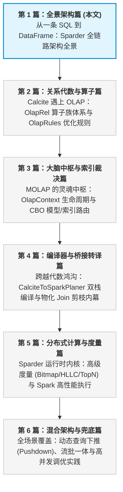
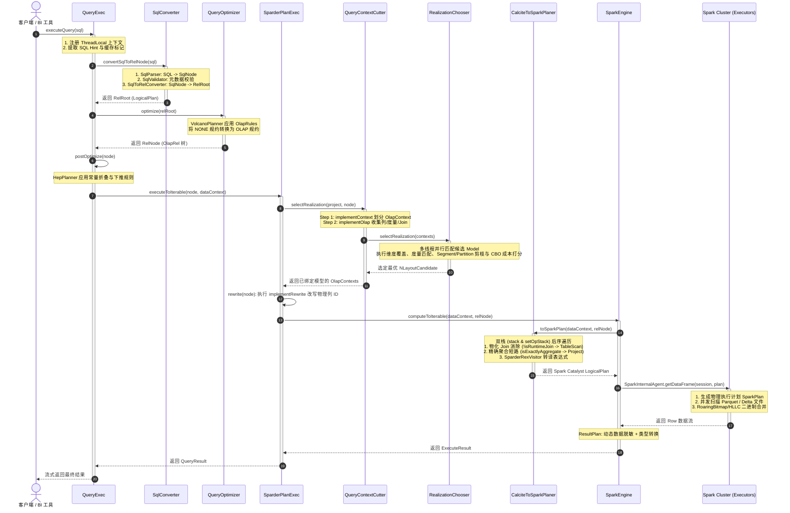

# 硬核拆解 Kylin 查询引擎 (一)：从一条 SQL 到 DataFrame —— Sparder 全链路架构全景

> **作者**：Huang Sheng (mrhs121)  
> **日期**：2026-08-18  
> **分类**：`Apache Kylin` · `Apache Spark` · `Calcite` · `OLAP` · `查询引擎` · `源码剖析`

---

## 0. 专栏导读与技术脉络

在企业级海量数据分析（OLAP）场景中，随着数据规模从百 GB 跃升至数百 TB 乃至 PB 级别，查询引擎面临着极高的吞吐与低延迟双重挑战：

- **传统现场计算模式（On-the-fly Computation，如 Presto/Trino, ClickHouse, Spark SQL）**：每次查询都需要从底层存储实时扫描巨量数据，在网络中进行海量多表 Shuffle Join 与分布式哈希聚合。当遇到复杂维度组合与高并发报表请求时，集群 CPU 与内存瞬间被吃满，查询耗时往往从秒级退化到分钟级。
- **Apache Kylin 的预计算哲学（Precomputation & Space-Time Tradeoff）**：Kylin 的核心立足于“以空间换时间”。在数据构建期，Kylin 预先将高频维度组合（Cuboid / Layout）计算完成并物化为紧凑的列式存储文件（Parquet / Delta Lake）；在查询期，将数十亿行的复杂多表关联与聚合运算，**降维打击为亚秒级的索引扫描（Index Scan）与少量的残余聚合计算**。

为了在支持 **标准 ANSI-SQL 语法、复杂 CBO 代数优化** 的同时，具备 **大规模分布式数据的高速扫描与计算能力**，Apache Kylin 深度融合了 **Apache Calcite** 与 **Apache Spark**，打造了代号为 **Sparder（Spark on Kylin Engine）** 的查询引擎体系。

本专栏将通过 **6 篇深度源码级长文**，全景式拆解 Kylin 查询内核：



作为专栏的开篇，本文将带领大家穿透整个系统的调用栈，以 **“一条多表聚合 SQL 的完整生命周期”** 为主线，从架构分工、核心数据结构、时序流转到三态蜕变，彻底打通整个查询内核的全貌。

---

## 1. 双引擎协同：Calcite 与 Spark 的两阶段分工哲学

Kylin 的查询引擎架构本质上是一个**两阶段混合架构（Two-Phase Hybrid Architecture）**。理解该架构的关键在于明白为什么 Calcite 与 Spark 各自不可或缺。

```mermaid
flowchart TD
    subgraph ClientLayer ["1. 接入层 (Client & Protocol)"]
        ClientReq["客户端请求 (JDBC / ODBC / REST API / Tableau / PowerBI)"]
    end

    subgraph CalcitePhase ["2. 前端规划与代数优化阶段 (Calcite Engine)"]
        SqlParse["SqlParser: SQL 语法解析 -> SqlNode AST"]
        SqlValidate["SqlValidator & CatalogReader: 元数据与类型校验"]
        SqlToRel["SqlToRelConverter: SqlNode -> LogicalRelNode 树"]
        VolcanoOpt["VolcanoPlanner & HepPlanner: 应用 OlapRules 优化规则"]
        OlapRelTree["生成 OlapRel 物理关系代数树 (OLAP Convention)"]
        ContextCut["QueryContextCutter: 划分 OlapContext 上下文"]
        ModelMatch["RealizationChooser: CBO 模型匹配、分区分段裁剪与最优 Layout 裁决"]
        RewriteTree["OlapRel.RewriteImpl: 物理字段映射与精准聚合标记"]

        SqlParse --> SqlValidate --> SqlToRel --> VolcanoOpt --> OlapRelTree --> ContextCut --> ModelMatch --> RewriteTree
    end

    subgraph TranspilePhase ["3. 跨引擎编译转译阶段 (Sparder Transpiler)"]
        C2S["<b>CalciteToSparkPlaner</b><br/>双栈 (stack & setOpStack) 后序遍历编译器"]
        Eliminate["物化 Join 消除 (!isRuntimeJoin -> 单表 Scan)<br/>精确聚合短路 (isExactlyAggregate -> Project)"]
        SparkLP["生成 Spark Catalyst LogicalPlan 树"]

        C2S --> Eliminate --> SparkLP
    end

    subgraph SparkPhase ["4. 分布式物理执行阶段 (Sparder Cluster)"]
        Agent["SparkInternalAgent: LogicalPlan 包装为 Dataset[Row]"]
        SparkCatalog["常驻 SparkSession (SparderEnv): Catalyst 优化与物理计划生成"]
        Executors["分布式 Executor 集群: 并发 Parquet 列存扫描 + UDAF 二进制合并"]
        ResultFormat["ResultPlan: 动态数据脱敏 (Masking) + JDBC 数据格式转换"]

        Agent --> SparkCatalog --> Executors --> ResultFormat
    end

    ClientReq --> CalcitePhase
    RewriteTree --> TranspilePhase
    SparkLP --> SparkPhase
    ResultFormat --> OutputResult["返回结果集给客户端"]
```



### 深度辨析：为什么不能只用 Spark SQL？又为什么 Calcite 不能单独执行？
1. **为什么不能只用 Spark SQL 解析？**
   Spark Catalyst 的优化器主要是面向“关系代数标准优化”（如通用谓词下推、常量折叠、Join 重排序）。它**完全缺乏对多维数据模型（MOLAP Lattice、Cuboid、生成树、分段 Segment、位图索引、派生维度）的领域感知能力**。如果在 Spark 层面做模型裁决，代码侵入性极高且无法享用成熟的 CBO 多阶段规则搜索。
2. **为什么 Calcite 需要 Spark 作为底座？**
   Calcite 自带的 `EnumerableRel` 执行器是单机内存型的，面对 TB/PB 级数据扫描与复杂 Shuffle 毫无并发能力。Calcite 擅长的是“做聪明的逻辑决策”，而 Spark 擅长的是“做强悍的分布式物理执行”。
3. **两者的完美结合点**：
   - **Calcite 阶段**：完成从 SQL 到 `OlapRel` 物理树的转换，利用 Kylin 独创的 `OlapContext` 机制，在关系代数层完成模型匹配、Layout 挑选与 Join 消除；
   - **转译阶段**：由 `CalciteToSparkPlaner` 将 `OlapRel` 树翻译为 Spark Catalyst 原生的 `LogicalPlan`；
   - **Spark 阶段**：常驻的 `SparderEnv` 直接将 `LogicalPlan` 编译为 Spark RDD DAG，以极高性能并发扫描预聚合的 Parquet 列存数据，毫秒级返回结果。

---

## 2. 核心组件全景拓扑与职责总览

在深入时序之前，我们先梳理 Kylin 查询引擎在代码库中的核心模块骨架：

```
kylin/
├── src/query/                                 # 查询入口与 Calcite 编排模块
│   └── src/main/java/org/apache/kylin/query/
│       ├── engine/
│       │   ├── QueryExec.java                 # 查询主控制器 (入口门面)
│       │   ├── SqlConverter.java              # SQL 解析、校验与 AST 转换
│       │   ├── QueryOptimizer.java            # Calcite Volcano 规则优化器
│       │   ├── QueryRoutingEngine.java        # 查询路由与下推引擎 (Pushdown)
│       │   └── exec/
│       │       └── SparderPlanExec.java       # Sparder 物理计划调度执行器
│       └── util/
│           ├── QueryContextCutter.java        # 上下文切分器 (Context Cut)
│           └── HepUtils.java                  # HepPlanner 规则集合
│
├── src/query-common/                          # OLAP 关系代数与模型路由公用模块
│   └── src/main/java/org/apache/kylin/query/
│       ├── relnode/                           # OlapRel 算子族 (TableScan, Filter, Join...)
│       │   ├── OlapRel.java                   # 关系代数核心根接口
│       │   └── OlapContext.java               # 状态黑板与上下文载体
│       └── routing/
│           ├── RealizationChooser.java        # 候选模型选择与 CBO 裁决器
│           └── CandidateSelector.java         # 最优 Layout (NLayoutCandidate) 挑选
│
└── src/spark-project/sparder/                 # Spark 查询引擎集成核心 (Sparder)
    └── src/main/
        ├── java/org/apache/kylin/query/runtime/
        │   └── SparkEngine.java               # Spark 交互执行门面
        └── scala/
            ├── org/apache/kylin/query/runtime/
            │   ├── CalciteToSparkPlaner.scala # 跨引擎双栈后序遍历编译器
            │   └── plan/                      # 算子转译工厂 (TableScanPlan, AggPlan...)
            └── org/apache/spark/sql/
                └── SparderEnv.scala           # 常驻 SparkSession 环境与 UDF 注册表
```

---

## 3. 端到端流程全景追踪：一条 SQL 的 7 步生命周期

为了精准理解各组件之间的调用链，我们通过以下时序图追踪一条标准 SQL 的完整流转过程：



### 核心源码路径逐步拆解

#### Step 1: 入口控制与 ThreadLocal 环境初始化
入口位于 `QueryExec.java:186-241`：
```java
public QueryResult executeQuery(String sql) throws SQLException {
    QueryContext queryContext = QueryContext.current();
    queryContext.setProject(project);
    try {
        beforeQuery(); // 绑定 Prepare.CatalogReader 与 KylinConnectionConfig 到 ThreadLocal
        RelRoot relRoot = sqlConverter.convertSqlToRelNode(sql);
        RelNode node = queryOptimizer.optimize(relRoot).rel;
        ...
        QueryResult queryResult = new QueryResult(executeQueryPlan(postOptimize(node)), resultFields);
        return queryResult;
    } finally {
        afterQuery(); // 清理 ThreadLocal，清理本地文件段缓存与 Gluten 标记
    }
}
```

#### Step 2 & 3: SQL 语法转换与 Volcano 规则优化
在 `SqlConverter` 中，Calcite 使用 Kylin 提供的元数据目录（`CalciteCatalogReader`）完成语法校验与 AST 构建。随后进入 `QueryOptimizer`：
```java
// VolcanoPlanner 在规则驱动下将标准 Calcite 算子转换为 OlapRel 算子
RelNode node = queryOptimizer.optimize(relRoot).rel;
```

#### Step 4: 模型匹配、剪枝与 CBO 裁决
在 `SparderPlanExec.java:74-78` 中，调用 `QueryContextCutter.selectRealization`：
```java
QueryContextCutter.selectRealization(QueryContext.current().getProject(), rel, QueryContext.current().isForModeling());
```
- `implementContext`：递归为节点树分配 `OlapContext`。如果遇到跨模型关联，主动触发 `implementCutContext` 将其拆分为多个独立的子上下文；
- `implementOlap`：遍历树节点，向 `OlapContext` 注册当前查询所需的所有字段、过滤条件、聚合函数与关联拓扑；
- `RealizationChooser`：多线程并行评估候选数据模型，进行维度覆盖度校验、度量能力推导、时间范围 Segment 剪枝与多级分区剪枝，最终以 CBO 成本模型选定最优的物理 Layout（`NLayoutCandidate`）。

#### Step 5: 物理计划改写（Rewrite）
在 `SparderPlanExec.java:168-184` 中执行 `rewrite(rel)`：
```java
OlapRel.RewriteImpl rewriteImpl = new OlapRel.RewriteImpl();
rewriteImpl.visitChild(rel, rel.getInput(0));
```
将抽象的逻辑列名替换为选定 Layout 内部的物理列 ID，并检测是否满足精准聚合条件（`isExactlyAggregate`）。

#### Step 6: 跨引擎编译与转译（Transpile）
进入 `SparkEngine.java:50-57` 与 `CalciteToSparkPlaner.scala`：
```scala
val calciteToSparkPlaner = new CalciteToSparkPlaner(dataContext)
calciteToSparkPlaner.go(relNode)
val plan: LogicalPlan = calciteToSparkPlaner.getResult()
val df: Dataset[Row] = SparkInternalAgent.getDataFrame(SparderEnv.getSparkSession, plan)
```
利用双栈后序遍历，消除已物化的 Join 节点，短路精确聚合，生成纯正的 Spark Catalyst `LogicalPlan`。

#### Step 7: Spark 分布式物理执行与脱敏输出
在 `SparkEngine.java:71-85` 中：
```java
Dataset<Row> sparkPlan = QueryResultMasks.maskResult(toSparkPlan(dataContext, relNode));
return ResultPlan.getResult(sparkPlan, relNode.getRowType());
```
执行 Spark Catalyst 物理执行计划，流式读取底层 Parquet/Delta 文件，执行 RoaringBitmap / HLLC 聚合，对敏感字段进行动态掩码脱敏，并流式输出结果。

---

## 4. 实例追踪：一条 SQL 的“三态蜕变”全景

为了最直观地展现底层的变化，我们追踪一条典型的电商多表聚合查询：

```sql
SELECT 
    b.category_name,
    SUM(a.price) AS total_sales,
    COUNT(DISTINCT a.buyer_id) AS distinct_buyers
FROM kylin_sales a
JOIN kylin_category b ON a.category_id = b.category_id
WHERE a.part_dt >= '2026-01-01'
GROUP BY b.category_name
ORDER BY total_sales DESC
LIMIT 10;
```

### 状态一：SQL 文本转换为 Calcite `OlapRel` 物理关系代数树
经过 Calcite Parser/Validator 和 VolcanoPlanner 应用 `OlapRules` 优化后，生成的物理代数树为：

```
OlapSortRel(sort0=[$1], dir0=[DESC], offset=[0], fetch=[10])
  OlapAggregateRel(group=[{0}], total_sales=[SUM($1)], distinct_buyers=[COUNT_DISTINCT($2)])
    OlapProjectRel(category_name=[$5], price=[$2], buyer_id=[$3])
      OlapFilterRel(condition=[>=($4, '2026-01-01')])
        OlapJoinRel(condition=[=($1, $0)], joinType=[inner])
          OlapTableScan(table=[DEFAULT.KYLIN_CATEGORY], alias=[T_1_A3F1])
          OlapTableScan(table=[DEFAULT.KYLIN_SALES], alias=[T_0_B2E4])
```
*此时计划树中依然保留着多表 Join、字段投影和标准的 COUNT_DISTINCT 聚合调用。*

---

### 状态二：模型裁决与计划物理重写（Rewrite）
`QueryContextCutter` 收集到查询所需维度 `[category_name, part_dt]` 和度量 `[SUM(price), COUNT_DISTINCT(buyer_id)]`：
1. 匹配到数据模型 `sales_model`；
2. 识别到 `KYLIN_SALES` 与 `KYLIN_CATEGORY` 的关联早在模型构建期就已经打平物化（`isRuntimeJoin = false`）；
3. 选定物理索引 `Layout ID: 100001`（包含预聚合维度与 `RoaringBitmap` 预计算度量）；
4. `implementRewrite` 将表名替换为模型别名，逻辑列名重写为物理列 ID。

重写后的代数树形态：
```
OlapSortRel(sort0=[$1], dir0=[DESC], offset=[0], fetch=[10])
  OlapAggregateRel(group=[{0}], total_sales=[SUM0($1)], distinct_buyers=[COUNT_DISTINCT($2)])
    OlapFilterRel(condition=[>=($3, '2026-01-01')])
      OlapTableScan(table=[Layout_100001], cols=[category_name, sum_price, bitmap_buyer_id, part_dt])
```
*注意：整棵 Join 子树和底层的两个原始 TableScan 已经被彻底折叠为针对预聚合 Layout 的单表扫描！*

---

### 状态三：跨引擎转译为 Spark Catalyst `LogicalPlan` 并执行
`CalciteToSparkPlaner` 将 `OlapRel` 树翻译为 Spark 逻辑计划：

```
GlobalLimit 10
+- LocalLimit 10
   +- Sort [total_sales#102 DESC NULLS LAST], true
      +- Aggregate [category_name#100], [category_name#100, sum(sum_price#101) AS total_sales#102, count_distinct_bitmap(bitmap_buyer_id#103) AS distinct_buyers#104]
         +- Filter (part_dt#105 >= 2026-01-01)
            +- Relation[category_name#100, sum_price#101, bitmap_buyer_id#103, part_dt#105] ParquetFileFormat
```
Spark Catalyst 接收到该 `LogicalPlan` 后，生成物理执行计划 `SparkPlan`，由常驻 Executor 节点直接发起并发 Parquet 文件扫描与位图合并，耗时通常仅数十毫秒。

---

## 5. 总结与下篇预告

本文作为专栏的第一篇，从宏观到微观全景梳理了 Kylin 查询引擎的顶层设计：
1. **两阶段架构**：明确了 Calcite（做聪明的代数优化与模型裁决）与 Spark（做强悍的分布式物理执行）的分工哲学；
2. **端到端主线**：贯穿了从客户端 SQL 接入到 DataFrame 结果输出的 7 大核心执行阶段；
3. **三态蜕变**：揭秘了一条多表 Join 聚合 SQL 如何通过预计算物化折叠为超轻量的 Spark 逻辑扫描计划。

---

> **下一篇预告**：
> 在 **《硬核拆解 Kylin 查询引擎 (二)：Calcite 遇上 OLAP —— 深入 OlapRel 算子体系与优化规则》** 中，我们将把放大镜对准 Calcite 阶段：
> - `OlapRel.CONVENTION` 规约机制与代价计算模型；
> - `OlapTableScan`、`OlapFilterRel`、`OlapAggregateRel`、`OlapJoinRel` 等核心算子的内部字段与生命周期方法；
> - `OlapRules` 优化规则集如何实现谓词下推、聚合下推、计算列（Computed Column）匹配与 `CASE WHEN` 展开。
