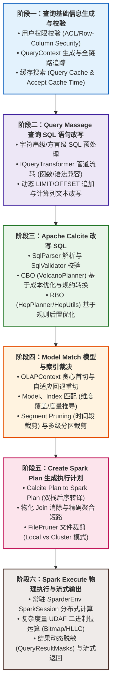
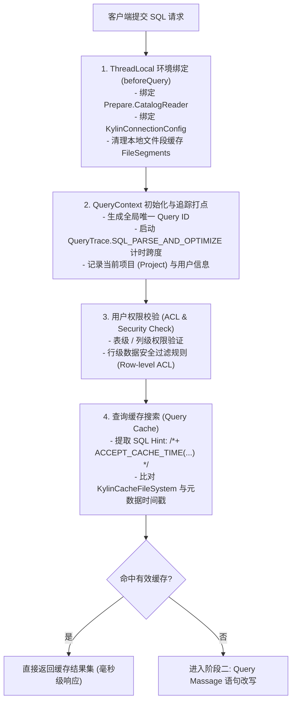
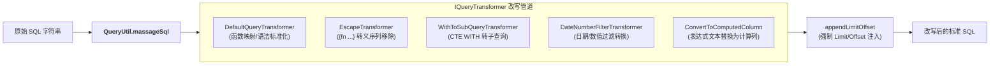
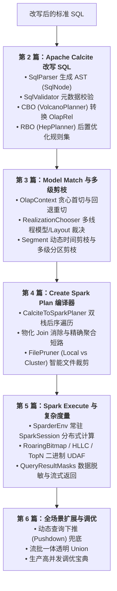

# 硬核拆解 Kylin 查询引擎 (一)：全生命周期总览 —— 基础校验、Query Massage 与六阶段流转

> **作者**：Huang Sheng (mrhs121)  
> **日期**：2026-08-18  
> **分类**：`Apache Kylin` · `Apache Spark` · `Calcite` · `OLAP` · `查询引擎` · `源码剖析`

---

## 0. 专栏导读与技术脉络

在海量数据分析（OLAP）场景中，当数据规模达到百亿甚至千亿级别时，传统计算引擎（如 Presto/Trino、ClickHouse、Spark SQL）面临着极大的计算吞吐与网络 Shuffle 压力。Apache Kylin 独辟蹊径，确立了**“以空间换时间”的预计算（MOLAP）体系**，通过在构建期将高频维度组合物化为紧凑的 Parquet/Delta 列存文件（Layout/Cuboid），在查询期将耗时的全表扫描与多表 Shuffle 关联，**降维打击为亚秒级的索引扫描与残余聚合**。

为了兼顾 ANSI-SQL 语法兼容性、复杂代数优化与大规模分布式算力，Kylin 深度融合了 **Apache Calcite**（逻辑规划与优化器）与 **Apache Spark**（分布式执行器），打造了代号为 **Sparder（Spark on Kylin Engine）** 的查询引擎内核。

在 Apache Kylin 内部，一条 SQL 的执行并非简单的“解析后直接跑 Spark”，而是严格经过以下 **六大阶段的流转与蜕变**：



本专栏将围绕这六大阶段，推出 6 篇源码级长文，彻底拆解整个查询内核。作为开篇，本文将深入剖析 **阶段一（基础校验与缓存）** 和 **阶段二（Query Massage 文本改写）**，并串联起全生命周期的调用主线。

---

## 1. 核心组件总览与模块拓扑

在 Kylin 代码仓库中，查询引擎的核心职责分布在以下模块：

```
kylin/
├── src/query/                                 # 查询入口与 Calcite 编排层
│   └── src/main/java/org/apache/kylin/query/
│       ├── engine/
│       │   ├── QueryExec.java                 # 查询主控制器 (入口门面)
│       │   ├── SqlConverter.java              # SQL 解析、校验与 AST 转换
│       │   ├── QueryOptimizer.java            # Calcite Volcano 规则优化器 (CBO)
│       │   ├── QueryRoutingEngine.java        # 查询路由与下推引擎 (Pushdown)
│       │   └── exec/
│       │       └── SparderPlanExec.java       # Sparder 物理计划调度执行器
│       └── util/
│           ├── HepUtils.java                  # HepPlanner RBO 规则集定义
│           └── QueryContextCutter.java        # 上下文切分器 (Context Cut)
│
├── src/query-common/                          # OLAP 关系代数与模型路由公用模块
│   └── src/main/java/org/apache/kylin/query/
│       ├── util/
│       │   ├── QueryUtil.java                 # Query Massage 门面与预处理逻辑
│       │   └── PushDownUtil.java              # 下推 SQL 改写与计算列注入
│       ├── relnode/                           # OlapRel 算子族与 OlapContext 状态黑板
│       └── routing/                           # RealizationChooser / CandidateSelector 裁决器
│
└── src/spark-project/sparder/                 # Spark 查询引擎集成核心 (Sparder)
    └── src/main/
        ├── java/org/apache/kylin/query/runtime/
        │   └── SparkEngine.java               # Spark 交互执行门面
        └── scala/
            ├── org/apache/kylin/query/runtime/
            │   ├── CalciteToSparkPlaner.scala # 双栈编译器 (Calcite -> Spark)
            │   └── plan/                      # 各算子物理生成工厂 (TableScanPlan...)
            └── org/apache/spark/sql/
                ├── SparderEnv.scala           # 常驻 SparkSession 与 UDF/UDAF 注册
                └── KapFunctions.scala         # 位图/HLLC/分位数自定义聚合表达式
```

---

## 2. 阶段一：查询基础信息生成与校验

当客户端通过 JDBC、ODBC、REST API 或 BI 工具（Tableau、PowerBI）向 Kylin 提交一条 SQL 时，首先进入 `QueryExec.java` 的前置处理管道：



### 2.1 用户权限与行/列级安全校验
在 `QueryExec.java` 执行前，系统结合 Spring Security 与元数据管理器，校验当前用户对目标数据表的访问权限。若开启了行级/列级安全策略（Row-Level Security / Column-Level ACL），系统会在上下文注入过滤表达式或将无权访问的列列入屏蔽列表，未授权直接抛出 `AccessDeniedException`。

### 2.2 全链路追踪与 `QueryContext`
`QueryContext`（通过 `QueryContext.current()` 访问）贯穿整个查询生命周期：
```java
QueryContext queryContext = QueryContext.current();
queryContext.setProject(project);
// 启动 SQL 解析与优化阶段打点
QueryContext.currentTrace().startSpan(QueryTrace.SQL_PARSE_AND_OPTIMIZE);
```
它记录了查询开始时间、各个阶段的详细耗时（`record("end_convert_to_relnode")`、`record("end_calcite_optimize")`）、命中的模型 ID、扫描的分段数以及最终返回行数等全景指标。

### 2.3 缓存搜索与 `ACCEPT_CACHE_TIME`
Kylin 支持查询结果缓存。用户或 BI 工具可以通过 SQL Hint 指定接受的缓存时间窗口：
```sql
SELECT * FROM sales /*+ ACCEPT_CACHE_TIME(158176387682000) */
```
在 `QueryExec.processAcceptCacheTime` 中，系统会比对数据表的最后构建时间戳（Cube Build Timestamp）。若数据未发生变更且缓存处于有效窗口内，直接读取缓存文件返回，完全跳过后续的所有编译与计算流程。

---

## 3. 阶段二：Query Massage 查询 SQL 语句改写

如果未命中缓存，SQL 文本将进入 **Query Massage（SQL 预处理与改写管道）**（主要位于 `QueryUtil.java` 与 `PushDownUtil.java`）。

许多 BI 工具（如 Cognos、Tableau、MicroStrategy）生成的 SQL 包含特定的方言语法、非标准函数或深层嵌套括号。Query Massage 在进入 Calcite 解析之前，对原始 SQL 字符串进行**精准的模式匹配与流水线变换**：



### 3.1 核心转换器体系（`IQueryTransformer`）

在 `QueryUtil.transformSql` 中，系统依次加载配置的 `IQueryTransformer` 列表：

1. **`DefaultQueryTransformer`**：
   - 替换非标准函数，例如将 `IFNULL(a, b)` 转换为 ANSI 标准的 `COALESCE(a, b)`；
   - 转换方言特有的时间差函数（`TIMESTAMPDIFF`、`EXTRACT`、`DATE_ADD` 等）；
   - 去除末尾分号与特殊控制字符；
2. **`EscapeTransformer`**：
   - 剔除 ODBC/JDBC 驱动生成的转义语法（如 `{fn CONVERT(...)}`、`{ts '2026-01-01 00:00:00'}`），转换为 Calcite 可接受的标准字面量；
3. **`WithToSubQueryTransformer`**：
   - 将部分复杂 CTE（`WITH t1 AS (SELECT ...)`）展开并转换为内联子查询，消除 Calcite 对特定 CTE 优化的局限性；
4. **`ConvertToComputedColumn`**：
   - 扫描 SQL 中出现的复杂表达式（如 `price * discount`），若与模型中预定义的计算列完全一致，预先将其替换为计算列名称。

### 3.2 动态分页追加（`appendLimitOffset`）
位于 `QueryUtil.java:232-268`：
- 若用户通过 REST/JDBC 参数传入了 `limit` 与 `offset`，且 SQL 原文中不包含 `LIMIT` 关键字，自动追加 `\nLIMIT {limit} OFFSET {offset}`；
- **防内存击穿保护（`ForceLimit`）**：若项目开启了 `forceLimit > 0` 且用户执行了无限制的 `SELECT *`，自动强制追加保护性 Limit，防止瞬间拉取海量数据导致网络与客户端崩溃。

---

## 4. 全生命周期后序阶段总览（专栏导航）

经过 Query Massage 预处理后，标准 SQL 字符串将正式交由后续四大阶段执行：



---

## 5. 总结

本文作为专栏的第一篇，系统梳理了 Kylin 查询引擎的顶层设计，并深度拆解了查询的前置处理流水线：
1. **六阶段严密流转**：确立了“基础校验 $\to$ Query Massage $\to$ Calcite RBO/CBO $\to$ Model Match $\to$ Create Spark Plan $\to$ Spark Execute”的完整脉络；
2. **安全与性能兼顾**：在最前置阶段通过 ACL 校验、全链路追踪与缓存搜索，最大化降低无效计算；
3. **强大的方言兼容性**：通过 `QueryUtil.massageSql` 与 `IQueryTransformer` 管道，将各异的 BI 方言平滑转译为标准 SQL。

---

> **下一篇预告**：
> 在 **《硬核拆解 Kylin 查询引擎 (二)：Calcite 遇上 OLAP —— 深入 OlapRel 算子体系与 RBO/CBO 优化》** 中，我们将深入剖析 **阶段三**：
> - `SqlParser` 与 `SqlValidator` 的内部机制；
> - **CBO（基于成本优化）**：`VolcanoPlanner` 动态规划搜索与 `OlapRel.CONVENTION` 物理规约机制；
> - **RBO（基于规则优化）**：`QueryExec.postOptimize` 与 `HepPlanner` / `HepUtils` 规则集深度剖析（`SumExprRules`、`CountDistinctExprRules`、`AggPushDownRules`、`ScalarSubqueryJoinRule`）。
