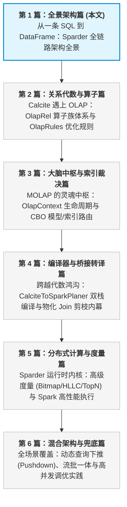
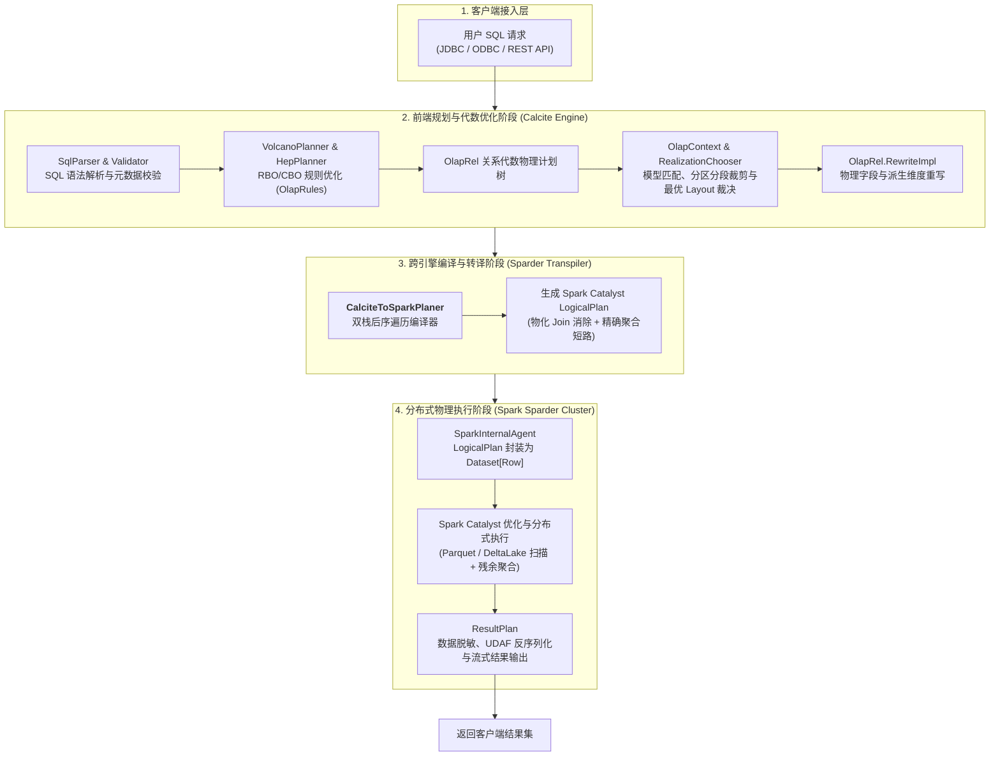
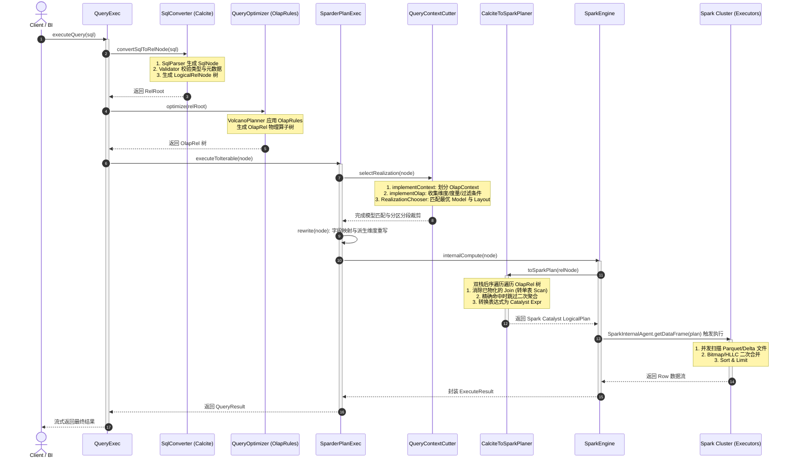

# 硬核拆解 Kylin 查询引擎 (一)：从一条 SQL 到 DataFrame —— Sparder 全链路架构全景

> **作者**：Huang Sheng (mrhs121)  
> **日期**：2026-08-18  
> **分类**：`Apache Kylin` · `Apache Spark` · `Calcite` · `OLAP` · `查询引擎` · `源码剖析`

---

## 0. 专栏导读与开篇寄语

在海量数据分析（OLAP）领域，**查询响应延迟** 与 **计算资源消耗** 始终是一对难以调和的矛盾：
- **传统 MPP / 纯计算引擎（如 Presto/Trino, ClickHouse, Spark SQL）**：采用“现场计算（On-the-fly Computation）”模式。当面对千亿级事实表多表关联与复杂 Group By 聚合时，不可避免地需要进行海量数据扫描、网络 Shuffle 以及高昂的哈希聚合计算，并发一高集群负载迅速飙升。
- **Apache Kylin**：作为经典的 **MOLAP（多维分析）** 代表，其核心哲学是 **“以空间换时间（Precomputation & Space-Time Tradeoff）”**。在构建期预先将高频维度组合聚合为 **Layout（Cuboid）**，查询期将原本耗时数分钟的复杂分布式 Join + Agg 计算，降维打击为**亚秒级的单表范围扫描（Range Scan）与少量残余计算**。

为了兼具 **标准 SQL 的通用性、复杂 CBO 代数优化的灵活性** 与 **分布式执行引擎的高吞吐算力**，Kylin 深度融合了 **Apache Calcite** 与 **Apache Spark** 两大顶级开源内核，打造了代号为 **Sparder** 的分布式查询引擎。

本专栏将通过 **6 篇硬核源码拆解**，带你由浅入深、自顶向下完整掌握 Kylin 查询引擎的底层内幕：



作为专栏的第一篇，本文将以 **“一条 SQL 的全生命周期”** 为主线，全景式俯瞰 Kylin 查询引擎在 Driver 端与分布式集群之间的两阶段流转过程。

---

## 1. 双引擎协同：Calcite + Spark 两阶段分工

Kylin 的查询引擎并非简单地在 Spark 上包了一层 SQL 解析器，而是设计了一套精妙的**两阶段混合架构（Two-Phase Hybrid Architecture）**：



### 为什么需要这种两阶段设计？
1. **Calcite 专长于“代数理解与逻辑重构”**：
   Calcite 拥有强大的 AST 解析、类型系统（TypeSystem）和基于成本（CBO）的规则优化器。Kylin 将自身的模型拓扑、多维预聚合元数据与裁剪规则无缝嵌入 Calcite，能在执行前以极小代价选出最优 Layout，并将上层复杂算子大幅简化。
2. **Spark（Sparder）专长于“大规模分布式计算”**：
   Spark 具备极致的向量化读取、列存扫描（Parquet/ORC）、分布式 Shuffle 以及动态资源调度能力。经过 Calcite 裁决后的物理操作，交给常驻的 SparkSession 并行执行，兼顾亚秒级响应与超大吞吐。

---

## 2. 端到端流程全景追踪：从 SQL 到 Result

当客户端通过 JDBC 发送一条如下的标准多表聚合查询时：

```sql
SELECT 
    b.category_name,
    SUM(a.price) AS total_sales,
    COUNT(DISTINCT a.buyer_id) AS distinct_buyers
FROM kylin_sales a
JOIN kylin_category b ON a.category_id = b.category_id
WHERE a.part_dt >= '2026-01-01'
GROUP BY b.category_name
ORDER BY total_sales DESC
LIMIT 10;
```

Kylin 内核是如何在各个核心组件之间穿梭的？

### 核心执行时序链路



---

## 3. 关键组件与核心源码导航

为了让大家在翻阅 Kylin 源码时心中有图，下面梳理整个查询引擎中最核心的类与对应模块位置：

| 阶段 | 核心类名 | 源码绝对路径 | 核心职责 |
| :--- | :--- | :--- | :--- |
| **入口控制器** | `QueryExec` | `src/query/.../engine/QueryExec.java` | 贯穿查询全流程的主入口，调度 Calcite 解析、优化、重试与结果组装 |
| **语法转换器** | `SqlConverter` | `src/query/.../engine/SqlConverter.java` | 封装 Calcite `SqlParser`、`SqlValidator`、`CatalogReader` 与视图展开 |
| **关系代数优化** | `QueryOptimizer` | `src/query/.../engine/QueryOptimizer.java` | 驱动 `VolcanoPlanner` 应用所有 `OlapRules` 进行 RBO/CBO 代数等价变换 |
| **算子体系** | `OlapRel` 族 | `src/query-common/.../relnode/` | Kylin 扩展的关系代数物理算子体系（`OlapTableScan`、`OlapJoinRel`、`OlapAggregateRel` 等） |
| **状态黑板** | `OlapContext` | `src/query-common/.../relnode/OlapContext.java` | 收集查询涉及的全部列、过滤条件、度量、Join 关系，作为模型匹配的输入载体 |
| **模型与索引裁决** | `QueryContextCutter` | `src/query/.../util/QueryContextCutter.java` | 驱动 Context 切分、Realization 选择、分段（Segment）与分区（Partition）裁剪 |
| **Sparder 执行器** | `SparderPlanExec` | `src/query/.../engine/exec/SparderPlanExec.java` | Sparder 执行门面，触发模型匹配、计划重写并转发给 `SparkEngine` |
| **跨引擎转译器** | `CalciteToSparkPlaner`| `src/spark-project/sparder/.../runtime/CalciteToSparkPlaner.scala` | 核心编译器：基于访问者模式与双栈后序遍历，将 `OlapRel` 树转为 Spark `LogicalPlan` |
| **Spark 引擎交互** | `SparkEngine` | `src/spark-project/sparder/.../runtime/SparkEngine.java` | 与 SparkSession 交互，提交 LogicalPlan，处理数据脱敏（Masking）与结果提取 |
| **Spark 运行环境** | `SparderEnv` | `src/spark-project/sparder/.../sql/SparderEnv.scala` | 管理常驻 SparkSession 生命周期、广播变量与内置 UDF/UDAF 注册表 |

---

## 4. 深入剖析：一条 SQL 的三态变换

理解 Kylin 查询引擎的最高效方式，是观察 SQL 在内核流转过程中的 **“三态蜕变”**：

### 状态一：从 SQL 文本到 Calcite `OlapRel` 物理关系代数树
在经过 `SqlConverter` 解析与 `QueryOptimizer` 优化后，原始 SQL 被转化为带有 `OLAP` 规约的 `OlapRel` 树：

```
OlapSortRel(sort0=[$1], dir0=[DESC], fetch=[10])
  OlapAggregateRel(group=[{0}], total_sales=[SUM($1)], distinct_buyers=[COUNT_DISTINCT($2)])
    OlapProjectRel(category_name=[$1], price=[$2], buyer_id=[$3])
      OlapFilterRel(condition=[>=($4, '2026-01-01')])
        OlapJoinRel(condition=[=($0, $5)], joinType=[inner])
          OlapTableScan(table=[KYLIN_SALES])
          OlapTableScan(table=[KYLIN_CATEGORY])
```

### 状态二：模型匹配、Join 消除与 `OlapRel` 重写（Rewrite）
在 `QueryContextCutter` 匹配到最优 Model 与 Layout 之后：
- 识别到 `KYLIN_SALES` 与 `KYLIN_CATEGORY` 的关联属于模型内预计算 Join（`isRuntimeJoin = false`）；
- 选中的 Layout 中已经预先物化了 `category_name` 维度以及 `SUM(price)`、`COUNT_DISTINCT(buyer_id)`（存储为精确 Bitmap）；
- 整个 `OlapJoinRel` 和下属的两张表的 TableScan 被**折叠（Folded）**为一个指向特定 Layout（如 `Layout ID: 10001`）的单表扫描！

重写后的计划形态：
```
OlapSortRel(sort0=[$1], dir0=[DESC], fetch=[10])
  OlapAggregateRel(group=[{0}], total_sales=[SUM0($1)], distinct_buyers=[COUNT_DISTINCT($2)])
    OlapFilterRel(condition=[>=($3, '2026-01-01')])
      OlapTableScan(table=[Layout_10001], cols=[category_name, sum_price, bitmap_buyer_id, part_dt])
```

### 状态三：转译为 Spark Catalyst `LogicalPlan` 并执行
`CalciteToSparkPlaner` 将上述 `OlapRel` 映射为 Spark 原生逻辑计划：

```
GlobalLimit 10
+- LocalLimit 10
   +- Sort [total_sales#12 DESC NULLS LAST], true
      +- Aggregate [category_name#10], [category_name#10, sum(sum_price#11) AS total_sales#12, count_distinct_bitmap(bitmap_buyer_id#13) AS distinct_buyers#14]
         +- Filter (part_dt#15 >= 2026-01-01)
            +- Relation[category_name#10, sum_price#11, bitmap_buyer_id#13, part_dt#15] ParquetFileFormat
```
最终，Spark Driver 将该计划编译为 RDD DAG，向集群 Executor 发起并行的列存扫描，毫秒级流式返回计算结果。

---

## 5. 总结与下篇预告

通过本文的全景拆解，我们建立起了 Kylin 查询引擎的顶层心智地图：
1. **定位明确**：Calcite 负责**聪明的决策**（代数优化、上下文聚合、模型裁决），Spark 负责**强悍的执行**（海量列存扫描、并行残余聚合）。
2. **核心红利**：Kylin 查询加速的核心精髓在于**“在代数层消灭昂贵的 Shuffle Join 与重复聚合，在执行层最大化利用预计算结果”**。
3. **架构整洁**：从 `QueryExec` 入口，经 `SparderPlanExec` 调度，再到 `CalciteToSparkPlaner` 桥接，模块间职责分明、扩展性极强。

---

> **下一篇预告**：
> 在接下来的 **《硬核拆解 Kylin 查询引擎 (二)：Calcite 遇上 OLAP —— 深入 OlapRel 算子体系与优化规则》** 中，我们将把放大镜对准 Calcite 阶段：
> - 为什么 Calcite 标准的 `LogicalJoin` 需要被替换为 `OlapJoinRel`？
> - Kylin 编写了哪些强大的 `OlapRules` 来实现谓词下推、聚合下推与 `CASE WHEN` 展开？
> - `OlapRel.CONVENTION` 规约转换的内部机制究竟如何运作？
> 
> 敬请期待！
