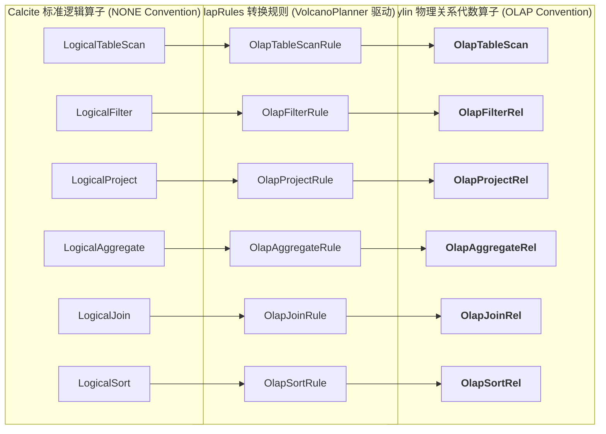
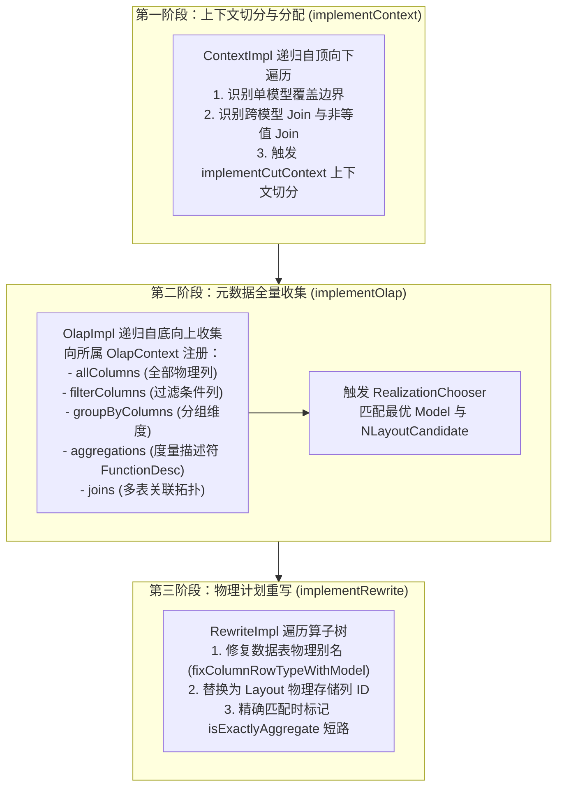
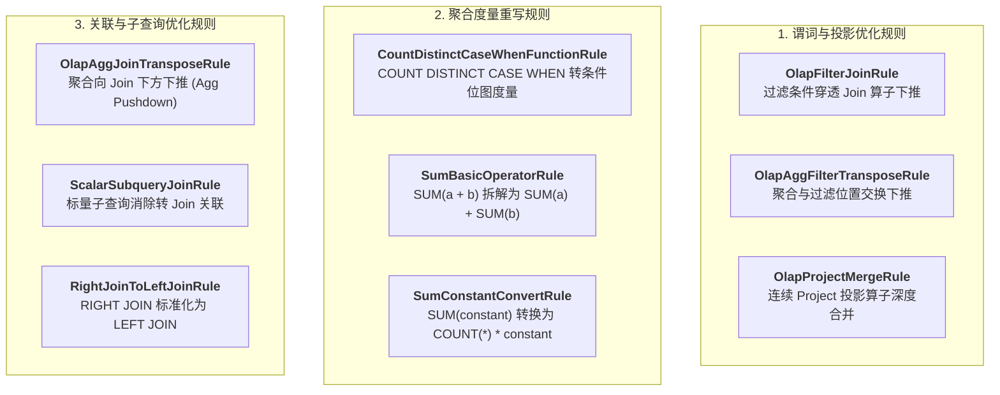

# 硬核拆解 Kylin 查询引擎 (二)：Calcite 遇上 OLAP —— 深入 OlapRel 算子体系与优化规则

> **作者**：Huang Sheng (mrhs121)  
> **日期**：2026-08-18  
> **分类**：`Apache Kylin` · `Calcite` · `OLAP` · `查询优化器` · `关系代数` · `源码剖析`

---

## 0. 导读与核心问题

在上一篇 [《硬核拆解 Kylin 查询引擎 (一)：从一条 SQL 到 DataFrame —— Sparder 全链路架构全景》](2026-08-18-kylin-query-engine-01-overview.md) 中，我们建立了 Kylin 查询引擎的两阶段全景认知。

当 Calcite 将 SQL 语句解析为关系代数语法树后，面临一个核心问题：**Calcite 标准算子（如 `LogicalTableScan`、`LogicalJoin`、`LogicalAggregate`）是纯关系型的、无状态的**，它并不理解什么是 MOLAP、什么是预聚合 Layout、什么是计算列（Computed Column）。

为了让 Calcite 能够深度感知 Kylin 的多维数据模型，Kylin 在关系代数层构建了一套专属的 **`OlapRel` 算子族体系**，并注入了数十条量身定制的 **`OlapRules` 优化规则**。

本文将深入 Calcite 扩展层源码，彻底拆解：
1. Calcite 规约机制（Convention）如何驱动优化器将逻辑算子升级为 `OlapRel`？
2. 核心 `OlapRel` 算子族（扫描、过滤、投影、聚合、关联等）的内部数据结构、字段与生命周期；
3. Kylin 核心优化规则集（`OlapRules`）是如何实现谓词下推、聚合下推、计算列匹配与表达式展开的。

---

## 1. Calcite 规约机制与 OlapRel.CONVENTION

在 Apache Calcite 中，**`Convention`（调用规约）** 代表了一种特定的数据处理协议或物理执行范式（例如 `EnumerableConvention` 代表 JVM 内存单机执行）。

Kylin 定义了自己的物理规约（位于 [`OlapRel.java:57-59`](file:///Users/huangsheng/codes/kyligence/kylin/src/query-common/src/main/java/org/apache/kylin/query/relnode/OlapRel.java#L57-L59)）：

```java
public interface OlapRel extends RelNode {
    // Calling convention for relational operations that occur in OLAP.
    Convention CONVENTION = new Convention.Impl("OLAP", OlapRel.class);
    // olapRel default cost factor
    double OLAP_COST_FACTOR = 0.05;
}
```



### 代价倾斜机制（`OLAP_COST_FACTOR = 0.05`）
Calcite 的 `VolcanoPlanner` 采用基于成本的动态规划搜索（CBO）。Kylin 为所有 `OlapRel` 算子赋予了仅为标准算子 $5\%$ 的代价因子（`0.05`）。当存在多条等价执行路径时，Volcano 优化器会以极高权重优先收敛到 `OLAP` 物理规约树上，确保进入 Kylin 预计算加速通道。

---

## 2. 算子基石：OlapRel 接口与生命周期三步曲

所有 Kylin 关系代数算子均实现了 [`OlapRel.java`](file:///Users/huangsheng/codes/kyligence/kylin/src/query-common/src/main/java/org/apache/kylin/query/relnode/OlapRel.java) 接口。

### 2.1 核心行元数据模型：ColumnRowType 与 TblColRef
与 Calcite 原生只包含字段类型名称的 `RelDataType` 不同，Kylin 设计了强类型的 [`ColumnRowType.java`](file:///Users/huangsheng/codes/kyligence/kylin/src/query-common/src/main/java/org/apache/kylin/query/relnode/ColumnRowType.java)：

```java
public class ColumnRowType {
    private List<TblColRef> columns;
    // 维护每个列的绝对来源，包括所在数据表 TableRef、物理列名、数据模型归属
}
```
每个字段被封装为 [`TblColRef`](file:///Users/huangsheng/codes/kyligence/kylin/src/core-metadata/src/main/java/org/apache/kylin/metadata/model/TblColRef.java)，保留了跨多层子查询、跨多层 Project/Join 后的原始物理列溯源能力。

### 2.2 OlapRel 核心生命周期三步曲

Calcite 生成 `OlapRel` 物理树后，驱动三大阶段的访问者（Visitor）遍历：



---

## 3. 核心 OlapRel 算子族逐一深度拆解

### 3.1 表扫描算子：`OlapTableScan`
* **源码位置**：[`OlapTableScan.java`](file:///Users/huangsheng/codes/kyligence/kylin/src/query-common/src/main/java/org/apache/kylin/query/relnode/OlapTableScan.java)
* **SQL 对应**：`FROM table`
* **关键属性与字段**：
  ```java
  public class OlapTableScan extends TableScan implements EnumerableRel, OlapRel {
      private OlapTable olapTable;          // 绑定的元数据表描述符
      private String tableName;              // 表名
      private ColumnRowType columnRowType;  // 行元数据 (TblColRef 列表)
      private String alias;                  // 临时唯一别名 (如 T_0_A3F1)
      private String backupAlias;            // 备份别名 (用于回滚)
      private boolean contextVisited;        // 防重入标记
  }
  ```
* **核心机制剖析**：
  1. **临时别名与物理别名动态切换**：在解析初期生成全局唯一的临时别名（`alias = T_0_...`）；在模型匹配成功后，通过 `fixColumnRowTypeWithModel` 切换为数据模型内部的正式别名，并在查询结束后通过 `unfixColumnRowTypeWithModel` 还原，防止元数据污染；
  2. **智能列收集判定（`needCollectionColumns`）**：
     ```java
     // OlapTableScan.java:164-193
     private boolean needCollectionColumns(Deque<RelNode> allParents) {
         // 从底向上遍历父节点栈
         // 若上层存在 OlapProjectRel，则由 Project 算子精确收集所需列，TableScan 跳过全量列收集；
         // 若上层为 OlapUnionRel 或 OlapToEnumerableConverter，则必须全量收集所有列。
     }
     ```

---

### 3.2 过滤算子：`OlapFilterRel`
* **源码位置**：[`OlapFilterRel.java`](file:///Users/huangsheng/codes/kyligence/kylin/src/query-common/src/main/java/org/apache/kylin/query/relnode/OlapFilterRel.java)
* **SQL 对应**：`WHERE condition` / `HAVING condition`
* **核心机制剖析**：
  1. **条件表达式递归解析（`FilterVisitor`）**：内部实现 `FilterVisitor`，解析 Calcite 的 `RexNode`（如 `AND`, `OR`, `LIKE`, `IN`, `BETWEEN` 等）表达式树；
  2. **过滤列抽取注入**：将条件中涉及的所有列提取为 `TblColRef`，注入所属 `OlapContext.filterColumns`；
  3. **分区分段剪枝条件提取**：识别分区列上的常量区间（如 `part_dt >= '2026-01-01' AND part_dt < '2026-02-01'`），为后续的 Segment / Partition 动态剪枝提供关键参数。

---

### 3.3 投影算子：`OlapProjectRel`
* **源码位置**：[`OlapProjectRel.java`](file:///Users/huangsheng/codes/kyligence/kylin/src/query-common/src/main/java/org/apache/kylin/query/relnode/OlapProjectRel.java)
* **SQL 对应**：`SELECT col1, col2 * 1.1 AS c2`
* **核心机制剖析**：
  1. **计算列（Computed Column）匹配算法**：如果用户查询了表达式（如 `price * qty`），`OlapProjectRel` 会将其 `RexNode` 与模型中预先定义的计算列表达式进行 AST 同构匹配。匹配成功后直接将其映射为已物化的计算列，消除运行时算术开销；
  2. **纯置换投影识别（`isMerelyPermutation`）**：若 Project 算子仅调整列顺序而无列裁剪与算术计算，将其标记为透传节点，避免生成多余的 Spark 投影算子。

---

### 3.4 聚合算子：`OlapAggregateRel`
* **源码位置**：[`OlapAggregateRel.java`](file:///Users/huangsheng/codes/kyligence/kylin/src/query-common/src/main/java/org/apache/kylin/query/relnode/OlapAggregateRel.java)
* **SQL 对应**：`GROUP BY dim1, dim2` 与 `SUM/COUNT/MAX/MIN/COUNT DISTINCT...`
* **核心机制剖析**：
  1. **度量描述符转换**：将 Calcite 的 `AggregateCall` 转换为 Kylin 的 [`FunctionDesc`](file:///Users/huangsheng/codes/kyligence/kylin/src/core-metadata/src/main/java/org/apache/kylin/metadata/model/FunctionDesc.java)；
  2. **高级度量模式识别**：
     - 精确去重：`COUNT(DISTINCT col)` 映射为 `BITMAP_UUID` / `BITMAP_BUILD`；
     - 近似去重：`COUNT(DISTINCT col)` 映射为 `HLLC`；
     - 百分位数：`PERCENTILE_APPROX`；
  3. **精确聚合短路（Exact Match）**：
     ```java
     // OlapAggregateRel.java: implementRewrite
     if (context.isExactlyAggregate()) {
         // 查询维度组合与命中的 Layout 维度完全一致，无需 Spark 二次聚合！
         // 标记为 true，后续在 Spark 转译阶段直接跳过 Aggregate 算子，直通输出。
     }
     ```

---

### 3.5 关联算子：`OlapJoinRel` 与 `OlapNonEquiJoinRel`
* **源码位置**：[`OlapJoinRel.java`](file:///Users/huangsheng/codes/kyligence/kylin/src/query-common/src/main/java/org/apache/kylin/query/relnode/OlapJoinRel.java)
* **核心机制剖析（双轨机制）**：

| Join 模式 | 条件判定 (`isRuntimeJoin`) | 优化与执行策略 |
| :--- | :--- | :--- |
| **模型内物化 Join** | `isRuntimeJoin == false`<br/>Join 的表均属于同一个 Model 定义 | **物化消除**：事实表与维表早在构建期打平物化在 Layout 中。在优化时**完全剪除 Join 算子**，直接转为单表 Scan，**零网络 Shuffle**！ |
| **运行时 Join** | `isRuntimeJoin == true`<br/>跨模型关联或未打平维表 | **上下文切分**：在 Join 处切割 Context，左右两边独立匹配各自的 Model，交由 Spark 在运行时执行 Shuffle/Broadcast Join。 |

---

## 4. Kylin 自定义优化规则集（OlapRules）深入拆解

在 Calcite 的规则优化体系中，Kylin 自定义了 40 余条规则（位于 [`org.apache.kylin.query.optrule`](file:///Users/huangsheng/codes/kyligence/kylin/src/query/src/main/java/org/apache/kylin/query/optrule)），抹平了用户灵活的 SQL 表达与预计算结构之间的差异。



### 4.1 核心规则一：`SumBasicOperatorRule` —— 聚合算术拆解
* **源码**：[`SumBasicOperatorRule.java`](file:///Users/huangsheng/codes/kyligence/kylin/src/query/src/main/java/org/apache/kylin/query/optrule/SumBasicOperatorRule.java)
* **业务痛点**：用户常写 `SELECT SUM(price + tax) FROM sales`，但模型中通常分别物化了 `SUM(price)` 和 `SUM(tax)`。
* **规则变换**：
  ```
  OlapAggregateRel(SUM($0 + $1))
        ↓ (SumBasicOperatorRule 等价变换)
  OlapProjectRel($0 + $1)
    OlapAggregateRel(SUM($0), SUM($1))
  ```
* **效果**：将复杂的复合聚合拆解为两个可直接命中 Layout 的原子度量，在最上层仅需做一次轻量级加法投影。

---

### 4.2 核心规则二：`CountDistinctCaseWhenFunctionRule` —— 条件去重重写
* **源码**：[`CountDistinctCaseWhenFunctionRule.java`](file:///Users/huangsheng/codes/kyligence/kylin/src/query/src/main/java/org/apache/kylin/query/optrule/CountDistinctCaseWhenFunctionRule.java)
* **业务痛点**：用户常写 `COUNT(DISTINCT CASE WHEN channel = 'IOS' THEN user_id ELSE NULL END)`。
* **规则变换**：通过表达式重构，将其转译为带有 Filter 谓词的条件去重调用，无缝匹配预计算模型中带有过滤条件的精确去重 Bitmap。

---

### 4.3 核心规则三：`OlapAggJoinTransposeRule` —— 聚合下推 Join（Agg Pushdown）
* **源码**：[`OlapAggJoinTransposeRule.java`](file:///Users/huangsheng/codes/kyligence/kylin/src/query/src/main/java/org/apache/kylin/query/optrule/OlapAggJoinTransposeRule.java)
* **核心机制**：在跨表运行时关联场景中，若聚合可以在 Join 之前先对事实表进行局部聚合（Local Pre-aggregation），该规则将 Aggregate 算子下推到 Join 的分支下方，将进入 Join 的数据量缩减数个数量级，极大减轻 Shuffle 负担。

---

## 5. 总结与下篇预告

通过深入剖析 `OlapRel` 算子族与 `OlapRules`，我们可以看到 Kylin 在 Calcite 层的精湛设计：
1. **统一规约**：通过 `OlapRel.CONVENTION` 与极低代价因子，使优化器优先收敛到 OLAP 预计算通道；
2. **全生命周期抽象**：通过 `ColumnRowType` 与三步遍历法，完成了从逻辑关系代数到物理模型上下文的无缝桥接；
3. **强大的规则库**：`OlapRules` 抹平了灵活 SQL 与固定预计算结构之间的鸿沟，最大化提高 Cube 命中率。

---

> **下一篇预告**：
> 在接下来的 **《硬核拆解 Kylin 查询引擎 (三)：MOLAP 的灵魂中枢 —— OlapContext 生命周期与 CBO 索引裁决》** 中，我们将深入整个查询引擎的最强大脑：
> - `OlapContext` 黑板模式与上下文切分（`QueryContextCutter`）的递归回退机制；
> - `RealizationChooser` 多线程并发模型匹配机制；
> - 维度全覆盖校验、度量代数推导、Segment / Partition 动态多级剪枝与 CBO 成本打分模型。
