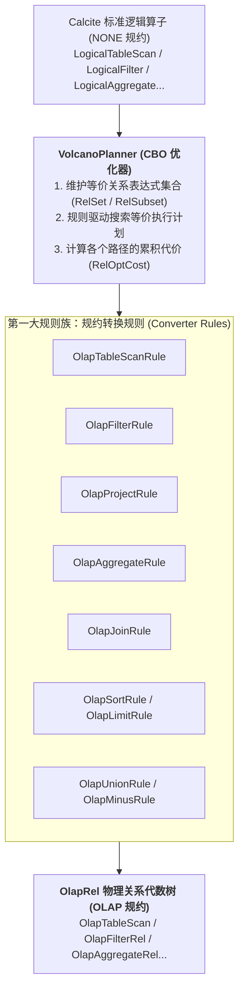
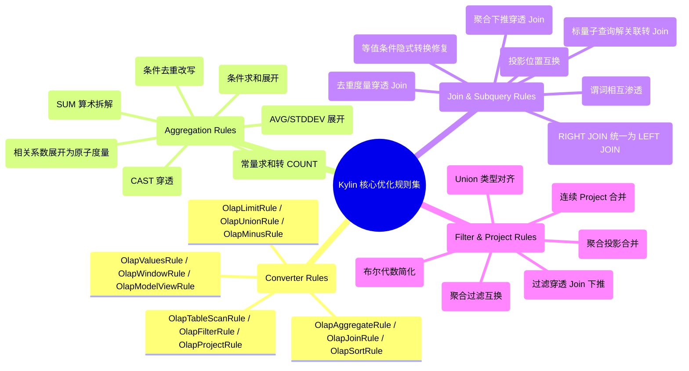
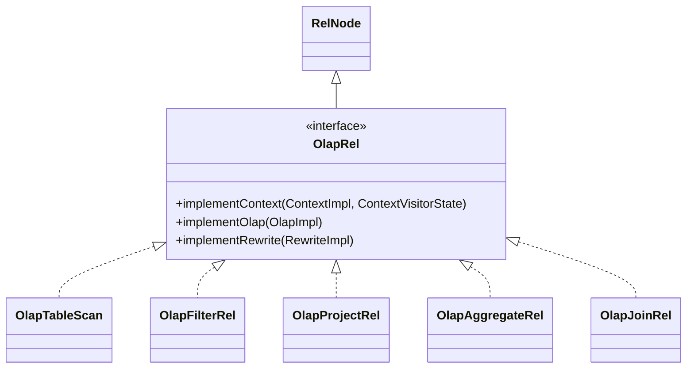

# 硬核拆解 Kylin 查询引擎 (二)：Calcite 遇上 OLAP —— 深入 OlapRel 算子体系与 40+ 优化规则全景

> **作者**：Huang Sheng (mrhs121)  
> **日期**：2026-08-18  
> **分类**：`Apache Kylin` · `Calcite` · `OLAP` · `查询优化器` · `关系代数` · `源码剖析`

---

## 0. 导读与核心问题

在上一篇 [《硬核拆解 Kylin 查询引擎 (一)：全生命周期总览 —— 基础校验、Query Massage 与六阶段流转》](2026-08-18-kylin-query-engine-01-overview.md) 中，我们建立了查询全生命周期的六阶段认知。

当原始 SQL 完成前置校验与 Query Massage 预处理后，便正式进入 **阶段三：Apache Calcite 改写 SQL 与关系代数优化**。

在这一阶段，Calcite 面临两大核心挑战：
1. **无状态逻辑算子与 MOLAP 领域的鸿沟**：Calcite 原生生成的算子（如 `LogicalTableScan`、`LogicalJoin`、`LogicalAggregate`）是通用的，无法感知 Kylin 的多维数据模型、预聚合 Layout 与物理列映射；
2. **灵活多变的 SQL 与固定预计算结构的匹配难题**：用户在 SQL 中写的表达式千变万化（例如 `SUM(price + tax)`、`SUM(CAST(x AS DOUBLE))`、`COUNT(DISTINCT CASE WHEN...)`、标量子查询关联、Join 之后聚合等），如果直接去匹配 Cube，**绝大部分查询都会因为形式上的不一致而无法命中预计算索引**！

为了解决这些问题，Kylin 在 Calcite 关系代数层构建了一套专属的 **`OlapRel` 算子族体系**，并注入了 **40 余条量身定制的 `OlapRules` 优化规则（涵盖 CBO 规约转换与 HepPlanner RBO 启发式规则集）**。

本文将深入 Calcite 扩展层源码，彻底拆解 Kylin 的 SQL 解析校验、CBO 动态规划、四大 RBO 规则族与 `OlapRel` 算子族体系。

---

## 1. 语法解析与元数据校验

在 `SqlConverter.java` 与 `QueryExec.java` 中，SQL 文本首先经过 Calcite 编译流水线：


1. **`SqlParser`**：利用 JavaCC 生成的语法解析器，将 SQL 文本解析为以 `SqlNode` 为节点的抽象语法树（AST）；
2. **`SqlValidator` 与 `CalciteCatalogReader`**：
   - 结合 Kylin 元数据（`NTableMetadataManager`、`NDataModelManager`）校验表名、列名是否存在；
   - 结合 Kylin 自定义类型系统推导各表达式的返回类型（`RelDataType`）；
   - 验证操作符与函数签名的合法性；
3. **`SqlToRelConverter`**：将校验后的 AST 转换为关系代数树 `RelRoot`，顶层算子此时为标准逻辑规约（`NONE Convention`）。

---

## 2. CBO（基于成本优化）：VolcanoPlanner 与 OlapRel 规约转换

得到 `LogicalRelNode` 树后，系统进入 `QueryOptimizer.java` 的 CBO 优化阶段。



### 2.1 物理规约机制：`OlapRel.CONVENTION`
在 `OlapRel.java:57-59` 中：
```java
public interface OlapRel extends RelNode {
    // Calling convention for relational operations that occur in OLAP.
    Convention CONVENTION = new Convention.Impl("OLAP", OlapRel.class);
    // olapRel default cost factor
    double OLAP_COST_FACTOR = 0.05;
}
```
Kylin 将自身定义为一种物理调用规约（`OLAP`）。`VolcanoPlanner` 通过注册转换规则（如 `OlapAggregateRule`），将 `NONE` 规约算子转换为 `OLAP` 规约的 `OlapRel` 算子。

### 2.2 代价倾斜机制（`OLAP_COST_FACTOR = 0.05`）
`VolcanoPlanner` 采用基于动态规划的成本搜索。Kylin 为所有 `OlapRel` 赋予了仅为标准算子 $5\%$ 的代价因子（`0.05`）。当存在多条等价代数路径时，优化器会以极高权重优先收敛到 `OLAP` 物理规约树上，确保请求进入 Kylin 预计算加速通道。

---

## 3. Kylin 优化规则全景（40+ 核心 Rules 深度分类拆解）

在 CBO 完成物理规约转换后，生成的 `OlapRel` 树会传入 `QueryExec.postOptimize(node)` 进行基于规则的后置优化（RBO）。

`HepUtils.java` 与 `org.apache.kylin.query.optrule` 包下沉淀了 **四大规则族、40 余条核心优化规则**：



---

### 3.1 规则族一：聚合与度量重写规则族（突破预计算固化限制）

#### 1. `SumBasicOperatorRule` —— 聚合算术多项式拆解
* **源码**：`SumBasicOperatorRule.java`（394 行）
* **核心场景**：
  - 用户查询：`SELECT SUM(price + tax) FROM sales`
  - 模型物化度量：分别物化了 `SUM(price)` 和 `SUM(tax)`
* **代数重写推导**：
  $$\sum (A + B) = \sum A + \sum B, \quad \sum (A \cdot c) = c \cdot \sum A$$
  ```
  OlapAggregateRel(SUM($0 + $1))
        ↓ (SumBasicOperatorRule 自动等价变换)
  OlapProjectRel($0 + $1)
    OlapAggregateRel(SUM($0), SUM($1))
  ```
* **效果**：将复杂的复合算术聚合拆解为两个可直接命中 Layout 的原子度量，在最上层仅需做一次轻量级加法投影。

#### 2. `SumConstantConvertRule` —— 常量求和转换
* **源码**：`SumConstantConvertRule.java`
* **核心场景**：用户常写 `SELECT SUM(1) FROM sales` 或 `SELECT SUM(100) FROM sales`。
* **代数重写**：将 `SUM(constant)` 自动重写为 `COUNT(*) * constant`，直接命中模型中几乎必然存在的 `COUNT(*)` 基础度量。

#### 3. `OlapSumCastTransposeRule` & `OlapSumTransCastToThenRule` —— CAST 类型穿透
* **源码**：`OlapSumCastTransposeRule.java`
* **核心场景**：许多 BI 工具会自动在聚合外层包裹类型转换：`SUM(CAST(price AS DOUBLE))`。
* **代数重写**：消除不必要的 CAST 节点或将其下推到聚合之后，使聚合参数直接对齐底层列引用，避免因类型包装导致 Cube 无法匹配。

#### 4. `CountDistinctCaseWhenFunctionRule` —— 条件去重重写
* **源码**：`CountDistinctCaseWhenFunctionRule.java`
* **核心场景**：用户查询 `COUNT(DISTINCT CASE WHEN channel = 'APP' THEN user_id ELSE NULL END)`。
* **代数重写**：将 CASE WHEN 条件转化为标准的条件过滤聚合表达式，无缝匹配预计算模型中带有过滤条件的精确去重 Bitmap。

#### 5. `CorrReduceFunctionRule` —— 相关系数与统计度量展开
* **源码**：`CorrReduceFunctionRule.java`
* **核心场景**：统计函数 `CORR(x, y)` 无法直接以单一预计算度量存储。
* **代数重写**：依据皮尔逊相关系数公式将其展开为原子度量组合：
  $$\text{Corr}(X, Y) = \frac{n \sum XY - \sum X \sum Y}{\sqrt{[n \sum X^2 - (\sum X)^2][n \sum Y^2 - (\sum Y)^2]}}$$
  底层仅需提供 `SUM(xy)`、`SUM(x)`、`SUM(y)`、`SUM(x^2)`、`SUM(y^2)`、`COUNT(*)`，查询层通过 Project 算子组合完成计算。

---

### 3.2 规则族二：关联与子查询重写规则族（解关联与 Shuffle 消除）

#### 1. `ScalarSubqueryJoinRule` —— 标量子查询解关联（837 行核心实现）
* **源码**：`ScalarSubqueryJoinRule.java`
* **核心场景**：
  ```sql
  SELECT * FROM sales WHERE price > (SELECT AVG(price) FROM sales_benchmark)
  ```
* **代数重写**：
  - Calcite 原生会将标量子查询表示为带有相关变量（`RexCorrelVariable`）的关联嵌套树；
  - `ScalarSubqueryJoinRule` 将其彻底解关联（Decorrelation），重写为标准的关系代数 `OlapJoinRel` 与 `OlapAggregateRel`，使子查询与主查询均能独立进入 Kylin 模型匹配通道。

#### 2. `OlapAggJoinTransposeRule` —— 聚合下推穿透 Join（477 行核心实现）
* **源码**：`OlapAggJoinTransposeRule.java`
* **核心场景**：在运行时多表关联场景中（如事实表关联未打平的维表）：
  ```mermaid
  flowchart TD
      subgraph Before ["优化前: Join 后再执行全局聚合"]
          Agg1["Aggregate (全局聚合)"]
          Join1["Join (多表关联 Shuffle)"]
          Fact1["Fact Table (百亿级行)"]
          Dim1["Dim Table (千级行)"]
          Agg1 --> Join1
          Join1 --> Fact1
          Join1 --> Dim1
      end

      subgraph After ["优化后: 聚合下推到 Join 下方 (Agg Pushdown)"]
          TopAgg["Top Aggregate (残余轻量合并)"]
          Join2["Join (轻量级关联)"]
          LocalAgg["<b>Local Aggregate (事实表预聚合)</b><br/>百亿级数据压降至千级"]
          Fact2["Fact Table (百亿级行)"]
          Dim2["Dim Table (千级行)"]
          TopAgg --> Join2
          Join2 --> LocalAgg
          Join2 --> Dim2
          LocalAgg --> Fact2
      end
  ```
* **效果**：在进行分布式 Join 之前，先对事实表执行局部预聚合（Local Pre-aggregation），将参与 Join 的数据量缩减数个数量级，消除网络 Shuffle 瓶颈。

---

### 3.3 规则族三：过滤与投影精简规则族（谓词下推与算子合并）

1. **`OlapFilterJoinRule`**：将 WHERE 条件穿透 Join 算子，直接下推到事实表和维表的扫描节点之上，尽早过滤数据；
2. **`OlapProjectMergeRule`**：扫描计划树中由于多层子查询产生的连续 `OlapProjectRel` 节点，通过表达式代换（Expression Substitution）将其压平融合为单一 Project；
3. **`FilterSimplifyRule`**：执行布尔代数化简（如 `A AND TRUE` $\to$ `A`，`A OR (A AND B)` $\to$ `A`），消除冗余计算分支。

---

## 4. 算子基石：OlapRel 算子族体系与生命周期

所有 Kylin 关系代数算子均实现了 `OlapRel.java` 接口，并继承自 Calcite 的核心基类。



### 4.1 核心行元数据：`ColumnRowType` 与 `TblColRef`
与 Calcite 原生只包含字段类型的 `RelDataType` 不同，Kylin 设计了强类型的 `ColumnRowType` 与 `TblColRef`：
- 每个字段被封装为 `TblColRef`，保留了所属数据表 `TableRef`、物理列名以及模型归属；
- 无论经过多少层嵌套子查询、Project 别名重命名或 Join，`TblColRef` 始终保持对底层物理列的精准溯源能力。

### 4.2 核心算子逐一深度拆解

| 算子名称 | 对应 SQL 语法 | 内部核心机制与设计细节 |
| :--- | :--- | :--- |
| **`OlapTableScan`** | `FROM table` | • **临时别名机制**：解析初期生成 `T_0_hex` 唯一别名，模型选定后通过 `fixColumnRowTypeWithModel` 切换为模型物理别名；<br>• **智能列收集判定（`needCollectionColumns`）**：若上层存在 `OlapProjectRel`，跳过全量列收集，仅收集 Project 实际引用的列。 |
| **`OlapFilterRel`** | `WHERE / HAVING` | • **条件表达式解析（`FilterVisitor`）**：递归解析 `RexNode`（`AND`, `OR`, `LIKE`, `BETWEEN`）；<br>• 提取过滤列并注入所属 `OlapContext.filterColumns`；<br>• 提取分区列时间常量，供后续 Segment / Partition 裁剪使用。 |
| **`OlapProjectRel`** | `SELECT cols, expr` | • **计算列匹配**：将表达式 `RexNode` 与模型定义的计算列（Computed Column）进行 AST 同构匹配，命中后直接替换为已物化列；<br>• **纯置换投影（`isMerelyPermutation`）**：仅调整顺序时标记为透传节点，避免生成多余的 Spark 投影。 |
| **`OlapAggregateRel`**| `GROUP BY, SUM/COUNT`| • 将 Calcite `AggregateCall` 转换为 Kylin `FunctionDesc`；<br>• **高级度量识别**：识别 `RoaringBitmap`、`HLLC`、`T-Digest` 百分位数；<br>• **精确聚合短路（`isExactlyAggregate`）**：若查询维度与 Layout 完全一致，标记为 true，后续在 Spark 端跳过聚合直接转 Project。 |
| **`OlapJoinRel`** | `JOIN ON` | • **物化消除判定（`isRuntimeJoin`）**：若属于同一模型内部的 Join，早在构建期被打平物化，**在计划转译阶段直接剪枝消除 Join 算子**，零网络 Shuffle！ |

---

## 5. 总结与下篇预告

通过深入剖析 Calcite 改写阶段，我们领略了 Kylin 在代数优化层的深厚功力：
1. **标准化解析校验**：利用 `SqlParser` 与 `SqlValidator` 完成 AST 构建与元数据类型校验；
2. **CBO 动态规划**：通过 `VolcanoPlanner` 与 `OLAP_COST_FACTOR` 将逻辑算子平滑收敛为 `OlapRel` 物理树；
3. **40+ 规则大武库**：通过 HepPlanner 执行 `SumBasicOperatorRule`、`CountDistinctCaseWhenFunctionRule`、`ScalarSubqueryJoinRule` 与 `OlapAggJoinTransposeRule` 等规则，将多变灵活的 SQL 平滑转换为能够命中 Cube 的标准化形态。

---

> **下一篇预告**：
> 在接下来的 **《硬核拆解 Kylin 查询引擎 (三)：MOLAP 的灵魂中枢 —— OlapContext 切分、Model 匹配与多级动态剪枝》** 中，我们将深入剖析 **阶段四：Model Match**：
> - `OlapContext` 状态黑板与上下文切分机制（`ContextInitialCutStrategy` 贪心首切 vs `ContextReCutStrategy` 回退重切）；
> - `RealizationChooser` 多线程候选模型评估（`selectCandidateService`）；
> - **Segment Pruning（分段剪枝）** 与 **多级分区剪枝（Partition Pruning）** 的核心算法；
> - CBO 成本打分模型与最终 `implementRewrite` 计划改写。
