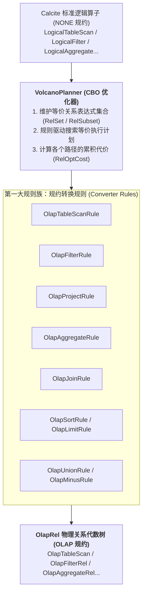
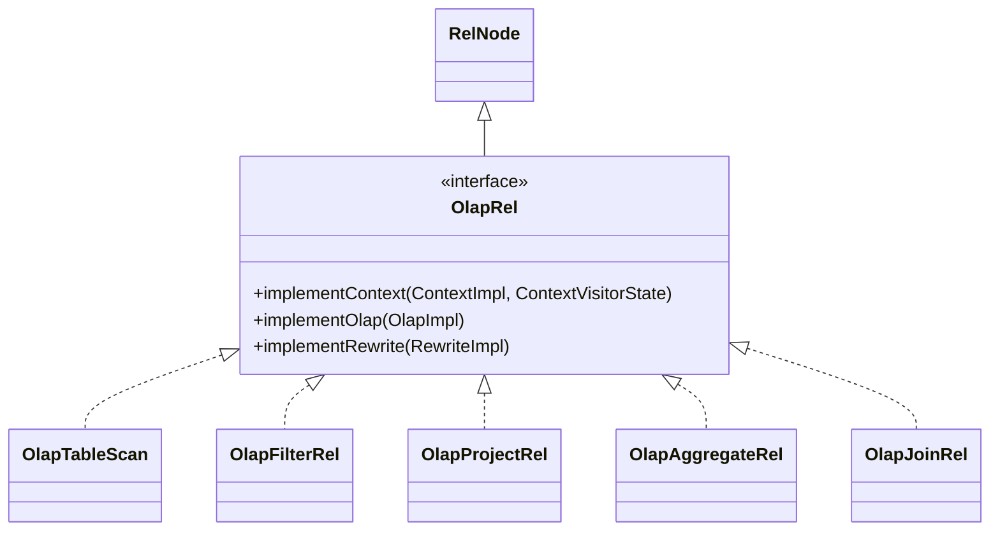
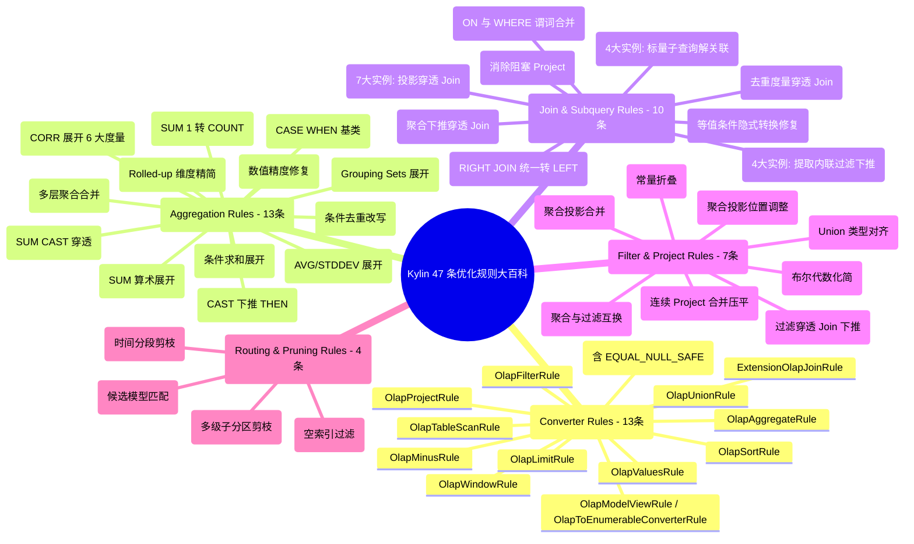

# 硬核拆解 Kylin 查询引擎 (二)：Calcite 遇上 OLAP —— 深入 OlapRel 算子体系与 47 条优化规则全百科

> **作者**：Huang Sheng (mrhs121)  
> **日期**：2026-08-18  
> **分类**：`Apache Kylin` · `Calcite` · `OLAP` · `查询优化器` · `关系代数` · `规则引擎` · `源码剖析`

---

## 0. 导读与核心问题

在上一篇 [《硬核拆解 Kylin 查询引擎 (一)：全生命周期总览 —— 基础校验、Query Massage 与六阶段流转》](2026-08-18-kylin-query-engine-01-overview.md) 中，我们建立了查询全生命周期的六阶段认知。

当原始 SQL 完成前置校验与 Query Massage 预处理后，便正式进入 **阶段三：Apache Calcite 改写 SQL 与关系代数优化**。

在这一阶段，Calcite 面临两大核心挑战：
1. **无状态逻辑算子与 MOLAP 领域的鸿沟**：Calcite 原生生成的算子（如 `LogicalTableScan`、`LogicalJoin`、`LogicalAggregate`）是通用的，无法感知 Kylin 的多维数据模型、预聚合 Layout 与物理列映射；
2. **灵活多变的 SQL 表达与固定预计算结构的匹配难题**：用户在 SQL 中写的表达式千变万化（例如 `SUM(price + tax)`、`SUM(1)`、`SUM(CAST(x AS DOUBLE))`、`COUNT(DISTINCT CASE WHEN...)`、标量子查询关联、Grouping Sets、Join 之后聚合等）。如果直接去匹配 Cube，**绝大部分查询都会因为形式上的微小差异而无法命中预计算索引**！

为了抹平这一鸿沟，Kylin 在 Calcite 关系代数层构建了一套专属的 **`OlapRel` 算子族体系**，并注入了 **47 条量身定制的优化规则（涵盖 CBO 规约转换、HepPlanner RBO 启发式规则集与 Routing 剪枝规则）**。

本文将深入 Calcite 扩展层源码，彻底拆解 Kylin 的 SQL 解析校验、CBO 动态规划机制、`OlapRel` 算子族体系，并对 **全部 47 条优化规则进行逐一地毯式深度拆解**。

---

## 1. 语法解析与元数据校验

在 `SqlConverter.java` 与 `QueryExec.java` 中，SQL 文本首先经过 Calcite 编译流水线：


1. **`SqlParser`**：利用 JavaCC 生成的语法解析器，将 SQL 文本解析为以 `SqlNode` 为节点的抽象语法树（AST）；
2. **`SqlValidator` 与 `CalciteCatalogReader`**：
   - 结合 Kylin 元数据（`NTableMetadataManager`、`NDataModelManager`）校验表名、列名是否存在；
   - 结合 Kylin 自定义类型系统推导各表达式的返回类型（`RelDataType`）；
   - 验证操作符与函数签名的合法性；
3. **`SqlToRelConverter`**：将校验后的 AST 转换为关系代数树 `RelRoot`，顶层算子此时为标准逻辑规约（`NONE Convention`）。

---

## 2. CBO（基于成本优化）：VolcanoPlanner 与 OlapRel 规约转换

得到 `LogicalRelNode` 树后，系统进入 `QueryOptimizer.java` 的 CBO 优化阶段。



### 2.1 物理规约机制：`OlapRel.CONVENTION`
在 `OlapRel.java:57-59` 中：
```java
public interface OlapRel extends RelNode {
    // Calling convention for relational operations that occur in OLAP.
    Convention CONVENTION = new Convention.Impl("OLAP", OlapRel.class);
    // olapRel default cost factor
    double OLAP_COST_FACTOR = 0.05;
}
```
Kylin 将自身定义为一种物理调用规约（`OLAP`）。`VolcanoPlanner` 通过注册转换规则（如 `OlapAggregateRule`），将 `NONE` 规约算子转换为 `OLAP` 规约的 `OlapRel` 算子。

### 2.2 代价倾斜机制（`OLAP_COST_FACTOR = 0.05`）
`VolcanoPlanner` 采用基于动态规划的成本搜索。Kylin 为所有 `OlapRel` 赋予了仅为标准算子 $5\%$ 的代价因子（`0.05`）。当存在多条等价代数路径时，优化器会以极高权重优先收敛到 `OLAP` 物理规约树上，确保请求进入 Kylin 预计算加速通道。

---

## 3. 核心算子基石：OlapRel 算子族体系与生命周期

所有 Kylin 关系代数算子均实现了 `OlapRel.java` 接口，并继承自 Calcite 的核心基类。



### 3.1 核心行元数据：`ColumnRowType` 与 `TblColRef`
与 Calcite 原生只包含字段类型的 `RelDataType` 不同，Kylin 设计了强类型的 `ColumnRowType` 与 `TblColRef`：
- 每个字段被封装为 `TblColRef`，保留了所属数据表 `TableRef`、物理列名以及模型归属；
- 无论经过多少层嵌套子查询、Project 别名重命名或 Join，`TblColRef` 始终保持对底层物理列的精准溯源能力。

### 3.2 核心算子逐一深度拆解

| 算子名称 | 对应 SQL 语法 | 内部核心机制与设计细节 |
| :--- | :--- | :--- |
| **`OlapTableScan`** | `FROM table` | • **临时别名机制**：解析初期生成 `T_0_hex` 唯一别名，模型选定后通过 `fixColumnRowTypeWithModel` 切换为模型物理别名；<br>• **智能列收集判定（`needCollectionColumns`）**：若上层存在 `OlapProjectRel`，跳过全量列收集，仅收集 Project 实际引用的列。 |
| **`OlapFilterRel`** | `WHERE / HAVING` | • **条件表达式解析（`FilterVisitor`）**：递归解析 `RexNode`（`AND`, `OR`, `LIKE`, `BETWEEN`）；<br>• 提取过滤列并注入所属 `OlapContext.filterColumns`；<br>• 提取分区列时间常量，供后续 Segment / Partition 裁剪使用。 |
| **`OlapProjectRel`** | `SELECT cols, expr` | • **计算列匹配**：将表达式 `RexNode` 与模型定义的计算列（Computed Column）进行 AST 同构匹配，命中后直接替换为已物化列；<br>• **纯置换投影（`isMerelyPermutation`）**：仅调整顺序时标记为透传节点，避免生成多余的 Spark 投影。 |
| **`OlapAggregateRel`**| `GROUP BY, SUM/COUNT`| • 将 Calcite `AggregateCall` 转换为 Kylin `FunctionDesc`；<br>• **高级度量识别**：识别 `RoaringBitmap`、`HLLC`、`T-Digest` 百分位数；<br>• **精确聚合短路（`isExactlyAggregate`）**：若查询维度与 Layout 完全一致，标记为 true，后续在 Spark 端跳过聚合直接转 Project。 |
| **`OlapJoinRel`** | `JOIN ON` | • **物化消除判定（`isRuntimeJoin`）**：若属于同一模型内部的 Join，早在构建期被打平物化，**在计划转译阶段直接剪枝消除 Join 算子**，零网络 Shuffle！ |

---

## 4. Kylin 优化规则全景（47 条 Rules 全量逐一地毯式拆解）

在 Calcite 生成 `OlapRel` 树后，系统通过 `QueryOptimizer`（CBO）与 `QueryExec.postOptimize` 驱动 `HepPlanner`（RBO）执行优化。

Kylin 内部沉淀了 **五大规则族、共计 47 条优化规则**：



---

### 4.1 第一大规则族：规约转换规则族（Converter Rules - 13条）

该规则族主要由 `VolcanoPlanner` 调度，负责将 Calcite 前端解析出的标准逻辑算子（`NONE Convention`）转换为 Kylin 专属物理算子（`OLAP Convention`）：

1. **`OlapTableScanRule`**：匹配 `LogicalTableScan`，转换为 `OlapTableScan`，绑定元数据并生成全局唯一别名；
2. **`OlapFilterRule`**：匹配 `LogicalFilter`，转换为 `OlapFilterRel`，初始化 `FilterVisitor` 并提取过滤列引用；
3. **`OlapProjectRule`**：匹配 `LogicalProject`，转换为 `OlapProjectRel`，执行计算列 AST 匹配与列映射；
4. **`OlapAggregateRule`**：匹配 `LogicalAggregate`，转换为 `OlapAggregateRel`，转换度量描述符 `FunctionDesc` 并识别位图/HLLC/分位数；
5. **`OlapJoinRule`**（包含 `INSTANCE` 与 `EQUAL_NULL_SAFE_INSTANT`）：匹配 `LogicalJoin`，转换为 `OlapJoinRel`，判定是否属于模型内物化 Join；
6. **`ExtensionOlapJoinRule`**：针对特定方言扩展 Join 语法（如非标准 Outer Join）进行安全转换为 `OlapJoinRel`；
7. **`OlapSortRule`**：匹配 `LogicalSort`，转换为 `OlapSortRel`，保留排序键 Collation 元数据；
8. **`OlapLimitRule`**：匹配带有 Offset/Fetch 的 Sort 算子，转换为轻量级 `OlapLimitRel`；
9. **`OlapUnionRule`**：匹配 `LogicalUnion`，转换为 N 元集合算子 `OlapUnionRel`；
10. **`OlapMinusRule`**：匹配 `LogicalMinus`，转换为 `OlapMinusRel`（差集运算）；
11. **`OlapValuesRule`**：匹配 `LogicalValues`（内存字面量表），转换为 `OlapValuesRel`；
12. **`OlapWindowRule`**：匹配 `LogicalWindow`（开窗函数 `OVER(...)`），转换为 `OlapWindowRel`；
13. **`OlapModelViewRule` / `OlapToEnumerableConverterRule`**：负责视图透明穿透以及最外层 `OLAP` 规约向 Calcite `Enumerable` 规约的无缝桥接。

---

### 4.2 第二大规则族：聚合与度量重写规则族（Aggregation & Measure Rules - 13条）

该规则族是 Kylin 突破“静态预计算固化限制”的灵魂所在，使得动态 SQL 能精准匹配预计算度量：

14. **`SumBasicOperatorRule`（394 行代码）**：
    - **匹配**：`OlapAggregateRel` 下包含带有加减乘除的 `OlapProjectRel`；
    - **原理**：利用代数线性性质展开：$\sum(A + B) = \sum A + \sum B$、$\sum(A - B) = \sum A - \sum B$、$\sum(A \cdot c) = c \cdot \sum A$、$\sum(A / c) = \frac{\sum A}{c}$；
    - **变换**：将 `SUM(price * 3 + tax)` 拆解为针对原子列的 `SUM(price)` 和 `SUM(tax)`，外层包裹 Project 加减乘除投影。
15. **`SumConstantConvertRule`（118 行代码）**：
    - **匹配**：`SUM(1)`、`SUM(100)`、`SUM(2.5)` 等常量求和表达式；
    - **原理**：$\sum_{i=1}^{n} c = c \cdot n = c \cdot \text{COUNT}(*)$；
    - **变换**：将常量聚合等价改写为 `COUNT(*) * constant`，直接命中几乎所有模型都内置的 `COUNT(*)` 度量。
16. **`SumCaseWhenFunctionRule`**：
    - **匹配**：`SUM(CASE WHEN status='PAID' THEN price ELSE 0 END)`；
    - **原理**：识别条件求和分支，将其等价重写为条件聚合，对齐构建期带有过滤条件的 SUM 度量。
17. **`AbstractAggCaseWhenFunctionRule`**：
    - **原理**：作为 `SumCaseWhenFunctionRule` 与 `CountDistinctCaseWhenFunctionRule` 的抽象基类框架，提供递归遍历解析 `CASE WHEN` AST 表达式树的核心工具集。
18. **`OlapSumCastTransposeRule`**：
    - **匹配**：`SUM(CAST(col AS DOUBLE))`；
    - **原理**：许多 BI 工具会自动在列外包裹类型转换，导致无法与底层的 `col` 直接匹配；
    - **变换**：将 CAST 转换上提穿透聚合算子：`CAST(SUM(col) AS DOUBLE)`，使底层聚合参数回归原子列。
19. **`OlapSumTransCastToThenRule`**：
    - **匹配**：`SUM(CAST(CASE WHEN cond THEN val ELSE 0 END AS DOUBLE))`；
    - **变换**：将包裹在整个 CASE WHEN 外层的 CAST 下推到各个 `THEN / ELSE` 分支内部，消除外层阻碍。
20. **`OlapAggSumCastRule`**：
    - **原理**：修复因聚合返回类型与底层模型 Layout 精度不一致引起的类型匹配冲突。
21. **`CountDistinctCaseWhenFunctionRule`**：
    - **匹配**：`COUNT(DISTINCT CASE WHEN channel = 'APP' THEN user_id ELSE NULL END)`；
    - **变换**：将其转换为带 Filter 谓词的条件精确去重度量，直接匹配底层物化的精确去重 Bitmap。
22. **`CorrReduceFunctionRule`**：
    - **匹配**：皮尔逊相关系数 `CORR(x, y)`；
    - **原理**：将其展开为代数公式：
      $$\text{Corr}(X, Y) = \frac{n \sum XY - \sum X \sum Y}{\sqrt{[n \sum X^2 - (\sum X)^2][n \sum Y^2 - (\sum Y)^2]}}$$
    - **变换**：底层仅需物化 `SUM(xy)`、`SUM(x)`、`SUM(y)`、`SUM(x^2)`、`SUM(y^2)`、`COUNT(*)`，查询期通过 Project 组合计算。
23. **`OlapAggregateReduceFunctionsRule`**：
    - **原理**：将复合统计聚合展开，例如 `AVG(x)` 自动展开为 `SUM(x) / COUNT(x)`，`STDDEV(x)` 展开为方差公式，避免在物理 Layout 中存储不可加度量。
24. **`ExtendedAggregateMergeRule`**：
    - **原理**：继承并扩展 Calcite 原生 `AggregateMergeRule`，处理多层嵌套聚合（Top Agg over Bottom Agg）的安全合并与度量替代。
25. **`AggregateMultipleExpandRule`**：
    - **匹配**：`GROUP BY GROUPING SETS ((A, B, C), (A, C), (B, C))`、`CUBE` 或 `ROLLUP`；
    - **原理**：将复杂的非简单聚合拆解展开为多个并行的简单聚合子分支，在外层以 `UNION ALL` 封装合并。
26. **`AggregateProjectReduceRule`**：
    - **原理**：配合 `AggregateMultipleExpandRule`，在展开的各个聚合子分支中，精确裁剪掉被 Rolled-up（置空）的冗余维度，促使每个分支能独立命中维度更少、体积更小的最优 Cuboid！

---

### 4.3 第三大规则族：关联与子查询重写规则族（Join & Subquery Rules - 10条）

该规则族负责消除分布式计算中最昂贵的网络 Shuffle 与嵌套关联：

27. **`ScalarSubqueryJoinRule`（837 行超大核心实现，包含 4 大实例）**：
    - **实例**：`AGG_JOIN`、`AGG_PRJ_JOIN`、`AGG_FLT_JOIN`、`AGG_PRJ_FLT_JOIN`；
    - **场景**：用户写标量子查询 `SELECT * FROM sales WHERE price > (SELECT AVG(price) FROM sales_benchmark)`；
    - **原理**：Calcite 原生会将标量子查询表示为带有相关变量（`RexCorrelVariable`）的关联嵌套树；
    - **变换**：彻底**解关联（Decorrelation）**，重写为标准的 `OlapJoinRel` + `OlapAggregateRel`，使主查询与子查询能分别独立走 Kylin 的模型匹配通道。
28. **`OlapAggJoinTransposeRule`（477 行核心实现，`INSTANCE_JOIN_RIGHT_AGG` 等）**：
    - **原理**：**聚合下推穿透 Join（Agg Pushdown）**。在跨表运行时关联场景中（如百亿级事实表关联千级维表），先对事实表执行局部预聚合（Local Pre-aggregation），将进入 Join 的数据量在网络传输前缩减数个数量级！
29. **`OlapCountDistinctJoinRule`（`COUNT_DISTINCT_JOIN_ONE_SIDE_AGG` 等）**：
    - **原理**：精确去重度量穿透 Join，在关联前先对一侧的 Bitmap 进行局部聚合合并。
30. **`RightJoinToLeftJoinRule`**：
    - **原理**：将所有的 `RIGHT OUTER JOIN` 标准化反转为等价的 `LEFT OUTER JOIN`，统一算子拓扑，极大简化后续模型匹配的复杂度。
31. **`OlapEquivJoinConditionFixRule`**：
    - **原理**：修复 ON 等值条件中因两端字段类型不完全一致导致的隐式转换冲突，使主外键能精准对齐模型元数据。
32. **`FilterJoinConditionMergeRule`**：
    - **原理**：将 Join 上的 ON 条件与上层 WHERE 过滤条件进行双向渗透合并，促使谓词下推。
33. **`JoinFilterRule`（4 大实例：`JOIN_LEFT_FILTER`, `JOIN_RIGHT_FILTER`, `JOIN_BOTH_FILTER`, `LEFT_JOIN_LEFT_FILTER`）**：
    - **原理**：提取 Join 算子内部的内联过滤条件，分别下推到左表或右表的 Scan 算子上。
34. **`OlapJoinProjectTransposeRule`（7 大实例：`BOTH_PROJECT`, `LEFT_PROJECT`, `RIGHT_PROJECT`...）**：
    - **原理**：将 Join 算子与其子节点的 Project 投影算子进行位置互换，促使 Project 向上提升合并，暴露底层的 TableScan 给模型匹配。
35. **`OlapProjectJoinTransposeRule`**：
    - **原理**：消除夹在 Join 算子之间的冗余 Project 节点。

---

### 4.4 第四大规则族：过滤与投影精简规则族（Filter & Project Rules - 7条）

36. **`OlapFilterJoinRule`（`FILTER_ON_JOIN`）**：将 WHERE 过滤条件强力穿透 Join 算子下推到最底层事实表与维表 Scan 之上；
37. **`OlapAggFilterTransposeRule`（`AGG_FILTER_JOIN`）**：在安全的代数前提下，将过滤算子下推到聚合算子下方，先过滤再聚合；
38. **`OlapAggProjectMergeRule`** 与 **`OlapAggProjectTransposeRule`**：将聚合算子与其下方的投影算子进行融合，消除无用的中间字段；
39. **`OlapProjectMergeRule`**：扫描计划树中由于多层子查询产生的连续 `OlapProjectRel` 链路，通过表达式递归代换压平为单一投影节点；
40. **`FilterSimplifyRule`**：执行布尔代数化简（如 `A AND TRUE` $\to$ `A`，`A OR (A AND B)` $\to$ `A`，`NOT(NOT(A))` $\to$ `A`），消除冗余计算分支；
41. **`UnionTypeCastRule`**：对齐 `UNION ALL` 各分支之间的数据类型差异，自动注入规范化的 CAST 投影；
42. **`OlapReduceExpressionRule`**：在代数树中执行常量折叠（Constant Folding）与死代码消除（如 `1 + 1` 直接折叠为 `2`，`WHERE 1 = 2` 直接短路为空结果）。

---

### 4.5 第五大规则族：路由与剪枝规则族（Routing & Pruning Rules - 4条）

该规则族工作在 Model Match 阶段（阶段四），负责物理层面的索引选择与 I/O 裁剪：

43. **`KylinTableChooserRule`**：依据查询涉及的所有事实表与维表，从项目全量模型库中筛选出具备关联拓扑覆盖能力的候选数据模型；
44. **`SegmentPruningRule`**：提取过滤条件中的时间范围常量，与模型各构建 Segment 的时间区间 `[start, end)` 做几何交集计算，剔除无关时间分段；
45. **`PartitionPruningRule`**：解析多级子分区（Multi-partition）列上的过滤常量，精确定位并仅保留目标子分区物理路径；
46. **`VacantIndexPruningRule`**：识别并剔除尚未构建目标 Layout 的历史分段，防止物理扫描阶段抛出 FileNotFound 异常。

---

## 5. 总结与下篇预告

通过对 Kylin 全部 47 条优化规则与 `OlapRel` 算子族的地毯式拆解，我们可以清晰地看到：
1. **统一规约驱动（CBO）**：通过 13 条规约转换规则与 `OLAP_COST_FACTOR = 0.05`，驱动优化器平滑收敛到 OLAP 预计算体系；
2. **多维代数等价重写（RBO）**：通过 30 余条度量重写、子查询解关联与聚合下推规则，将形态各异的复杂 SQL 转换为能够精准命中预计算 Cube 的标准代数形态；
3. **物理极速裁剪（Routing Rules）**：通过 4 大剪枝规则将底层物理扫描范围压缩至极限。

---

> **下一篇预告**：
> 在接下来的 **《硬核拆解 Kylin 查询引擎 (三)：MOLAP 的灵魂中枢 —— OlapContext 切分、Model 匹配与多级动态剪枝》** 中，我们将深入剖析 **阶段四：Model Match**：
> - `OlapContext` 状态黑板与上下文切分机制（`ContextInitialCutStrategy` 贪心首切 vs `ContextReCutStrategy` 回退重切）；
> - `RealizationChooser` 多线程候选模型评估（`selectCandidateService`）；
> - `SegmentPruningRule` 与 `PartitionPruningRule` 的底层区间几何与剪枝算法源码；
> - CBO 成本打分模型与最终 `implementRewrite` 计划改写。
