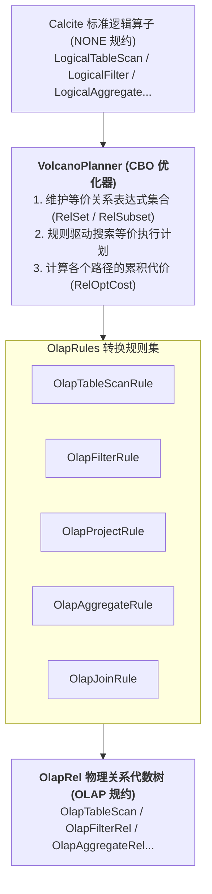
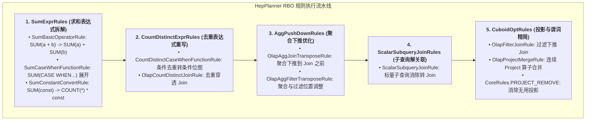
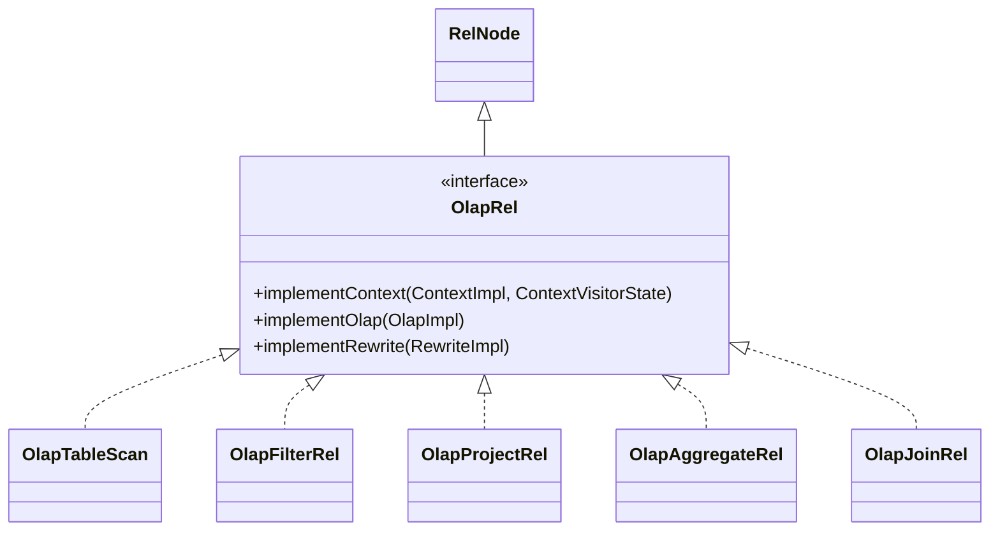

# 硬核拆解 Kylin 查询引擎 (二)：Calcite 遇上 OLAP —— 深入 OlapRel 算子体系与 RBO/CBO 优化

> **作者**：Huang Sheng (mrhs121)  
> **日期**：2026-08-18  
> **分类**：`Apache Kylin` · `Calcite` · `OLAP` · `查询优化器` · `关系代数` · `源码剖析`

---

## 0. 导读与核心问题

在上一篇 [《硬核拆解 Kylin 查询引擎 (一)：全生命周期总览 —— 基础校验、Query Massage 与六阶段流转》](2026-08-18-kylin-query-engine-01-overview.md) 中，我们建立了查询全生命周期的六阶段认知。

当原始 SQL 完成 Query Massage 预处理后，便正式进入 **阶段三：Apache Calcite 改写 SQL**。

在这一阶段，Calcite 需要解决两大核心矛盾：
1. **语法抽象与领域语义的矛盾**：Calcite 原生生成的逻辑算子（如 `LogicalTableScan`、`LogicalJoin`、`LogicalAggregate`）是通用的、无状态的，无法感知 Kylin 的多维数据模型、预聚合 Layout 与物理列映射；
2. **多阶段优化的协同矛盾**：如何通过 **CBO（基于成本优化）** 将标准逻辑算子平滑收敛为 Kylin 物理算子（`OlapRel`），并进一步利用 **RBO（基于规则优化）** 对聚合表达式、条件去重、聚合下推与子查询进行确定性的启发式重写？

本文将深入 Calcite 扩展层源码，彻底拆解 Kylin 的 SQL 解析校验、CBO 动态规划、RBO 规则库与 `OlapRel` 算子族体系。

---

## 1. 语法解析与元数据校验

在 `SqlConverter.java` 与 `QueryExec.java` 中，SQL 文本首先经过 Calcite 编译流水线：


1. **`SqlParser`**：利用 JavaCC 生成的语法解析器，将 SQL 文本解析为以 `SqlNode` 为节点的抽象语法树（AST）；
2. **`SqlValidator` 与 `CalciteCatalogReader`**：
   - 结合 Kylin 元数据（`NTableMetadataManager`、`NDataModelManager`）校验表名、列名是否存在；
   - 结合 Kylin 自定义类型系统推导各表达式的返回类型（`RelDataType`）；
   - 验证操作符与函数签名的合法性；
3. **`SqlToRelConverter`**：将校验后的 AST 转换为关系代数树 `RelRoot`，顶层算子此时为标准逻辑规约（`NONE Convention`）。

---

## 2. CBO（基于成本优化）：VolcanoPlanner 与 OlapRel 规约转换

得到 `LogicalRelNode` 树后，系统进入 `QueryOptimizer.java` 的 CBO 优化阶段。



### 2.1 物理规约机制：`OlapRel.CONVENTION`
在 `OlapRel.java:57-59` 中：
```java
public interface OlapRel extends RelNode {
    // Calling convention for relational operations that occur in OLAP.
    Convention CONVENTION = new Convention.Impl("OLAP", OlapRel.class);
    // olapRel default cost factor
    double OLAP_COST_FACTOR = 0.05;
}
```
Kylin 将自身定义为一种物理调用规约（`OLAP`）。`VolcanoPlanner` 通过注册转换规则（如 `OlapAggregateRule`），将 `NONE` 规约算子转换为 `OLAP` 规约的 `OlapRel` 算子。

### 2.2 代价倾斜机制（`OLAP_COST_FACTOR = 0.05`）
`VolcanoPlanner` 采用基于动态规划的成本搜索。Kylin 为所有 `OlapRel` 赋予了仅为标准算子 $5\%$ 的代价因子（`0.05`）。当存在多条等价代数路径时，优化器会以极高权重优先收敛到 `OLAP` 物理规约树上，确保请求进入 Kylin 预计算加速通道。

---

## 3. RBO（基于规则优化）：HepPlanner 与 HepUtils 规则集

在 CBO 完成物理规约转换后，生成的 `OlapRel` 树会传入 `QueryExec.postOptimize(node)` 进行基于规则的后置优化（RBO）。

### 为什么在 CBO 后还需要 RBO？
VolcanoPlanner（CBO）虽然强大，但搜索空间巨大、耗时较高，且对某些**具有确定性代数等价特征的重写规则**（例如 `SUM(a+b)` 拆解、常量折叠、谓词简化），通过 `HepPlanner`（单遍/循环启发式遍历）执行效率远高于 CBO。

在 `QueryExec.java:278-317` 与 `HepUtils.java` 中，系统按拓扑阶段加载并执行 RBO 规则集：



### 3.1 核心 RBO 规则深度剖析

#### 规则一：`SumBasicOperatorRule` —— 聚合算术拆解
* **源码位置**：`SumBasicOperatorRule.java`
* **业务痛点**：用户常写 `SELECT SUM(price + tax) FROM sales`，但模型中通常分别物化了 `SUM(price)` 和 `SUM(tax)`，直接匹配会导致 Cube 无法命中。
* **规则代数变换**：
  ```
  OlapAggregateRel(SUM($0 + $1))
        ↓ (SumBasicOperatorRule 等价变换)
  OlapProjectRel($0 + $1)
    OlapAggregateRel(SUM($0), SUM($1))
  ```
  将复合聚合拆解为两个可直接命中 Layout 的原子度量，在最上层仅需做一次轻量级加法投影。

#### 规则二：`CountDistinctCaseWhenFunctionRule` —— 条件去重重写
* **源码位置**：`CountDistinctCaseWhenFunctionRule.java`
* **业务痛点**：用户常写 `COUNT(DISTINCT CASE WHEN channel = 'APP' THEN user_id ELSE NULL END)`。
* **规则变换**：通过表达式重构，将其转译为带有 Filter 谓词的条件去重调用，直接匹配预计算模型中带有过滤条件的精确去重 Bitmap。

#### 规则三：`OlapAggJoinTransposeRule` —— 聚合下推 Join（Agg Pushdown）
* **源码位置**：`OlapAggJoinTransposeRule.java`
* **核心机制**：在跨表关联场景中，若聚合可以在 Join 之前先对事实表进行局部聚合（Local Pre-aggregation），该规则将 Aggregate 算子下推到 Join 下方，将进入 Join 的数据量缩减数个数量级，极大减轻后续网络 Shuffle 负担。

---

## 4. 算子基石：OlapRel 算子族体系与生命周期

所有 Kylin 关系代数算子均实现了 `OlapRel.java` 接口，并继承自 Calcite 的核心基类。



### 4.1 核心行元数据：`ColumnRowType` 与 `TblColRef`
与 Calcite 原生只包含字段类型的 `RelDataType` 不同，Kylin 设计了强类型的 `ColumnRowType` 与 `TblColRef`：
- 每个字段被封装为 `TblColRef`，保留了所属数据表 `TableRef`、物理列名以及模型归属；
- 无论经过多少层嵌套子查询、Project 别名重命名或 Join，`TblColRef` 始终保持对底层物理列的溯源能力。

### 4.2 核心算子逐一深度拆解

| 算子名称 | 对应 SQL 语法 | 内部核心机制与设计细节 |
| :--- | :--- | :--- |
| **`OlapTableScan`** | `FROM table` | • **临时别名机制**：解析初期生成 `T_0_hex` 唯一别名，模型选定后通过 `fixColumnRowTypeWithModel` 切换为模型物理别名；<br>• **智能列收集判定（`needCollectionColumns`）**：若上层存在 `OlapProjectRel`，跳过全量列收集，仅收集 Project 实际引用的列。 |
| **`OlapFilterRel`** | `WHERE / HAVING` | • **条件表达式解析（`FilterVisitor`）**：递归解析 `RexNode`（`AND`, `OR`, `LIKE`, `BETWEEN`）；<br>• 提取过滤列并注入所属 `OlapContext.filterColumns`；<br>• 提取分区列时间常量，供后续 Segment / Partition 裁剪使用。 |
| **`OlapProjectRel`** | `SELECT cols, expr` | • **计算列匹配**：将表达式 `RexNode` 与模型定义的计算列（Computed Column）进行 AST 同构匹配，命中后直接替换为已物化列；<br>• **纯置换投影（`isMerelyPermutation`）**：仅调整顺序时标记为透传节点，避免生成多余的 Spark 投影。 |
| **`OlapAggregateRel`**| `GROUP BY, SUM/COUNT`| • 将 Calcite `AggregateCall` 转换为 Kylin `FunctionDesc`；<br>• **高级度量识别**：识别 `RoaringBitmap`、`HLLC`、`T-Digest` 百分位数；<br>• **精确聚合短路（`isExactlyAggregate`）**：若查询维度与 Layout 完全一致，标记为 true，后续在 Spark 端跳过聚合直接转 Project。 |
| **`OlapJoinRel`** | `JOIN ON` | • **物化消除判定（`isRuntimeJoin`）**：若属于同一模型内部的 Join，早在构建期被打平物化，**在计划转译阶段直接剪枝消除 Join 算子**，零网络 Shuffle！ |

---

## 5. 总结与下篇预告

通过深入剖析 Calcite 改写阶段，我们领略了 Kylin 在代数优化层的深厚功力：
1. **标准化解析校验**：利用 `SqlParser` 与 `SqlValidator` 完成 AST 构建与元数据类型校验；
2. **CBO 动态规划**：通过 `VolcanoPlanner` 与 `OLAP_COST_FACTOR` 将逻辑算子平滑收敛为 `OlapRel` 物理树；
3. **RBO 启发式重写**：通过 `HepPlanner` 执行 `SumExprRules`、`CountDistinctExprRules` 与聚合下推规则，抹平灵活 SQL 与固定预计算结构之间的鸿沟。

---

> **下一篇预告**：
> 在接下来的 **《硬核拆解 Kylin 查询引擎 (三)：MOLAP 的灵魂中枢 —— OlapContext 生命周期与 CBO 索引裁决》** 中，我们将深入剖析 **阶段四：Model Match**：
> - `OlapContext` 状态黑板与上下文切分机制（`ContextInitialCutStrategy` 贪心首切 vs `ContextReCutStrategy` 回退重切）；
> - `RealizationChooser` 多线程候选模型评估（`selectCandidateService`）；
> - **Segment Pruning（分段剪枝）** 与 **多级分区剪枝（Partition Pruning）** 的核心算法；
> - CBO 成本打分模型与最终 `implementRewrite` 计划改写。
