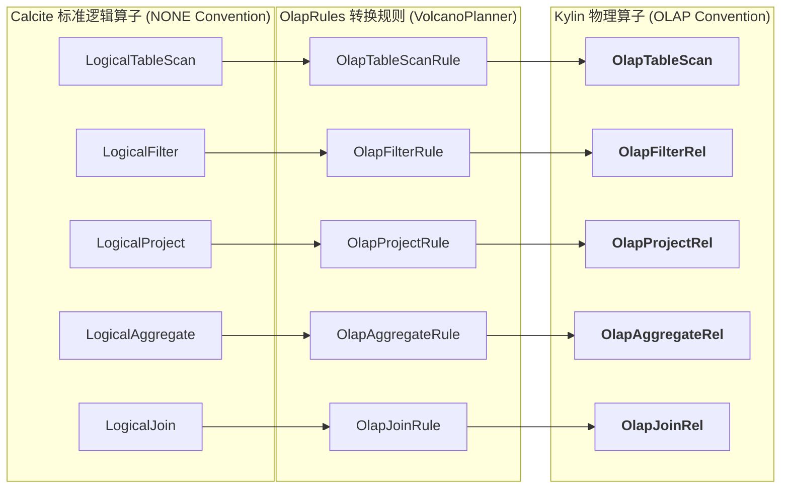
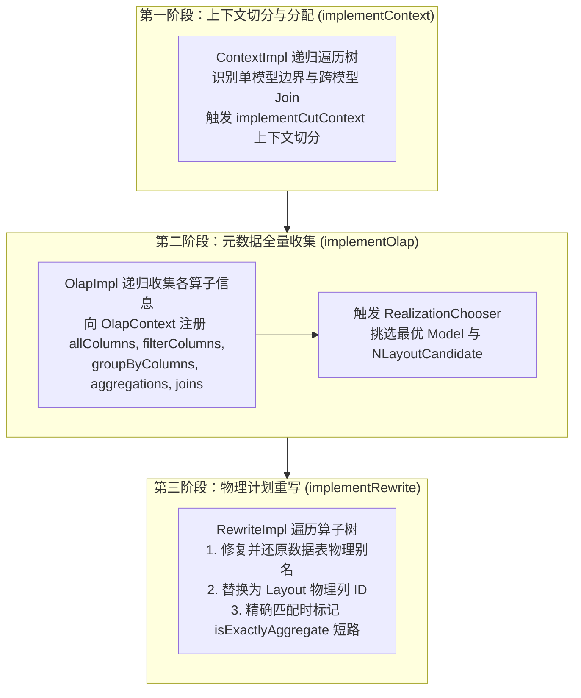

# 硬核拆解 Kylin 查询引擎 (二)：Calcite 遇上 OLAP —— 深入 OlapRel 算子体系与优化规则

> **作者**：Huang Sheng (mrhs121)  
> **日期**：2026-08-18  
> **分类**：`Apache Kylin` · `Calcite` · `OLAP` · `查询优化器` · `关系代数` · `源码剖析`

---

## 0. 导读与背景问题

在上一篇 [《硬核拆解 Kylin 查询引擎 (一)：从一条 SQL 到 DataFrame —— Sparder 全链路架构全景》](2026-08-18-kylin-query-engine-01-overview.md) 中，我们俯瞰了一条 SQL 在 Calcite 与 Spark 双引擎之间的流转全景。

当 Calcite 将 SQL 解析为标准的关系代数抽象语法树（AST / `RelNode`）后，面临一个致命问题：**Calcite 标准算子（如 `LogicalTableScan`、`LogicalJoin`、`LogicalAggregate`）是纯关系型的、无状态的**，它并不理解什么是 MOLAP、什么是预聚合 Layout、什么是计算列（Computed Column）。

为了让 Calcite 能够深度感知 Kylin 的多维数据模型，Kylin 在关系代数层构建了一套专属的 **`OlapRel` 算子族体系**，并注入了数十条量身定制的 **`OlapRules` 优化规则**。

本文将深入 Calcite 扩展层源码，彻底拆解：
1. Calcite 规约机制（Convention）如何将逻辑算子升级为 `OlapRel`？
2. 核心 `OlapRel` 算子族（扫描、过滤、投影、聚合、关联）的设计内幕与生命周期；
3. Kylin 核心优化规则集（`OlapRules`）是如何实现谓词下推、聚合下推与表达式展开的。

---

## 1. Calcite 规约机制与 OlapRel.CONVENTION

在 Apache Calcite 中，**`Convention`（调用规约）** 代表了一种特定的数据处理协议或物理执行范式（如 `EnumerableConvention` 代表 JVM 内存单机执行，`BindableConvention` 代表动态解释执行）。

Kylin 定义了自己的调用规约：

```java
// 位于 OlapRel.java:57
Convention CONVENTION = new Convention.Impl("OLAP", OlapRel.class);
double OLAP_COST_FACTOR = 0.05;
```



Calcite 的 `VolcanoPlanner`（基于动态规划与 CBO 成本模型的优化器）在搜索最优计划时，通过注册的 `OlapRule` 将 `NONE` 规约的逻辑节点转换为 `OLAP` 规约的 `OlapRel` 节点，并且赋予极低的代价因子（`OLAP_COST_FACTOR = 0.05`），确保优化器优先选择 Kylin 的加速路径。

---

## 2. 算子基石：OlapRel 接口与生命周期三步曲

所有 Kylin 关系代数算子均实现了 [`OlapRel.java`](file:///Users/huangsheng/codes/kyligence/kylin/src/query-common/src/main/java/org/apache/kylin/query/relnode/OlapRel.java) 接口。该接口不仅定义了行元数据结构（[`ColumnRowType`](file:///Users/huangsheng/codes/kyligence/kylin/src/query-common/src/main/java/org/apache/kylin/query/relnode/ColumnRowType.java)），还规定了**三大生命周期遍历方法**：



1. **`implementContext(ContextImpl contextImpl, ContextVisitorState state)`**：
   - 为子树分配并传递 [`OlapContext`](file:///Users/huangsheng/codes/kyligence/kylin/src/query-common/src/main/java/org/apache/kylin/query/relnode/OlapContext.java)；
   - 当遇到**跨模型关联、不同聚合层级冲突或非等值关联**时，主动调用 `implementCutContext` 将整棵大树切分为多个独立的子上下文（SubContext）。
2. **`implementOlap(OlapImpl implementor)`**：
   - 各算子将其包含的维度、度量、过滤条件、Join 条件注册进当前 `OlapContext`；
   - 树遍历完成后，驱动模型路由器选择最优的 Layout。
3. **`implementRewrite(RewriteImpl rewriter)`**：
   - 根据选中的 Layout，将逻辑关系代数树中的列引用映射为物理存储列，处理派生维度（Derived Column）向主键的重写。

---

## 3. 核心 OlapRel 算子族全景拆解

### 3.1 `OlapTableScan`：物理列映射与别名维护
* **源码**：[`OlapTableScan.java`](file:///Users/huangsheng/codes/kyligence/kylin/src/query-common/src/main/java/org/apache/kylin/query/relnode/OlapTableScan.java)
* **核心职责**：
  - 为底层数据源表生成全局唯一的临时别名（`alias = T_0_XXXXX`）；
  - 构建 [`ColumnRowType`](file:///Users/huangsheng/codes/kyligence/kylin/src/query-common/src/main/java/org/apache/kylin/query/relnode/ColumnRowType.java)，将每一个物理列包装为具备 `TableRef` 的 [`TblColRef`](file:///Users/huangsheng/codes/kyligence/kylin/src/core-metadata/src/main/java/org/apache/kylin/metadata/model/TblColRef.java)；
  - 提供 `fixColumnRowTypeWithModel` 与 `unfixColumnRowTypeWithModel`，在模型匹配成功后，动态将临时别名切换为数据模型中定义的正式别名。

### 3.2 `OlapFilterRel`：过滤条件抽取与分区分段剪枝
* **源码**：[`OlapFilterRel.java`](file:///Users/huangsheng/codes/kyligence/kylin/src/query-common/src/main/java/org/apache/kylin/query/relnode/OlapFilterRel.java)
* **核心职责**：
  - 内部实现 `FilterVisitor`，解析 Calcite 的 `RexNode` 表达式树；
  - 递归提取所有参与过滤的列，并注册进 `OlapContext.filterColumns`；
  - 识别分区列（Partition Column）上的常量边界，为后续的 Segment / Partition Pruning 提供精确剪枝条件。

### 3.3 `OlapProjectRel`：计算列（Computed Column）透传与映射
* **源码**：[`OlapProjectRel.java`](file:///Users/huangsheng/codes/kyligence/kylin/src/query-common/src/main/java/org/apache/kylin/query/relnode/OlapProjectRel.java)
* **核心职责**：
  - 维护输入列与输出列的投影映射与重命名；
  - **计算列匹配**：如果用户写了 `SELECT price * quantity`，`OlapProjectRel` 会尝试将该表达式与模型中预定义的计算列（CC）进行代数树比对。若匹配成功，直接将其视为一个单列物化字段，消除运行时算术计算。

### 3.4 `OlapAggregateRel`：度量抽取与精确聚合短路
* **源码**：[`OlapAggregateRel.java`](file:///Users/huangsheng/codes/kyligence/kylin/src/query-common/src/main/java/org/apache/kylin/query/relnode/OlapAggregateRel.java)
* **核心职责**：
  - 提取 `groupByColumns` 和 `aggregations`；
  - 将 SQL 聚合函数（`SUM`, `COUNT`, `MAX`, `MIN`, `COUNT(DISTINCT)` 等）转换为 Kylin 的度量描述符 [`FunctionDesc`](file:///Users/huangsheng/codes/kyligence/kylin/src/core-metadata/src/main/java/org/apache/kylin/metadata/model/FunctionDesc.java)；
  - **高级度量转译**：识别精确去重（`BITMAP_UUID` / `BITMAP_BUILD`）与近似去重（`HLLC`）；
  - **精确聚合短路（Exact Match）**：若查询的分组维度与命中的 Layout 完全一致，将 `isExactlyAggregate` 标记为 `true`，指示 Spark 执行层直接跳过聚合操作。

### 3.5 `OlapJoinRel`：模型内物化 Join 剪枝 vs 运行时 Join
* **源码**：[`OlapJoinRel.java`](file:///Users/huangsheng/codes/kyligence/kylin/src/query-common/src/main/java/org/apache/kylin/query/relnode/OlapJoinRel.java)
* **核心机制**：

```scala
// 判断该 Join 是否需要 Spark 在运行时真实执行
if (!rel.isRuntimeJoin) {
  // 模型内物化 Join: 事实表与维表已在构建期打平物化
  // 直接折叠 Join 算子，转换为读取物化 Layout 的 TableScanPlan
  createTablePlan(rel, execFunc)
} else {
  // 跨模型运行时 Join: 切割上下文，生成 Spark Join 物理算子
  plan.JoinPlan.join(Seq(left, right), rel)
}
```

---

## 4. Kylin 核心优化规则集（OlapRules）

在 Calcite 的 RBO/CBO 优化流程中，Kylin 自定义了 40 余条优化规则（位于 [`org.apache.kylin.query.optrule`](file:///Users/huangsheng/codes/kyligence/kylin/src/query/src/main/java/org/apache/kylin/query/optrule)），涵盖了代数等价变换的方方面面：

```mermaid
graph TD
    subgraph RuleGroup1 ["1. 谓词与投影优化规则"]
        R11[OlapFilterJoinRule: 过滤条件穿透 Join 下推]
        R12[OlapAggFilterTransposeRule: 聚合与过滤位置交换]
        R13[OlapProjectMergeRule: 连续 Project 算子合并]
    end

    subgraph RuleGroup2 ["2. 聚合度量重写规则"]
        R21[CountDistinctCaseWhenFunctionRule: COUNT DISTINCT CASE WHEN 转换]
        R22[SumBasicOperatorRule: SUM(a + b) 拆解为 SUM(a) + SUM(b)]
        R23[SumConstantConvertRule: SUM(const) 转换为 COUNT(*) * const]
    end

    subgraph RuleGroup3 ["3. 关联与子查询优化规则"]
        R31[OlapAggJoinTransposeRule: 聚合向 Join 下方下推 (Agg Pushdown)]
        R32[ScalarSubqueryJoinRule: 标量子查询转 Join 关联]
        R33[RightJoinToLeftJoinRule: RIGHT JOIN 标准化为 LEFT JOIN]
    end
```

### 经典规则案例剖析

#### 案例 1：`SumBasicOperatorRule` —— 算术表达式聚合拆解
用户查询：
```sql
SELECT SUM(price + tax) FROM kylin_sales;
```
如果模型中只物化了 `SUM(price)` 和 `SUM(tax)`，原始 SQL 会因为找不到 `SUM(price + tax)` 度量而导致模型无法命中。
`SumBasicOperatorRule` 会将该 AST 节点等价变换为：
```sql
SELECT SUM(price) + SUM(tax) FROM kylin_sales;
```
使得查询能够精准命中模型中预计算的两个独立度量，并在 Spark 执行层只做简单的列加法！

#### 案例 2：`CountDistinctCaseWhenFunctionRule` —— 条件去重重写
用户查询：
```sql
SELECT COUNT(DISTINCT CASE WHEN channel = 'APP' THEN user_id ELSE NULL END) FROM kylin_sales;
```
该规则能够识别 `CASE WHEN` 模式，将其转译为带过滤条件的度量表达式，无缝匹配预计算的条件 Bitmap 度量。

---

## 5. 总结与下篇预告

通过深入 `OlapRel` 算子族与 `OlapRules`，我们理解了：
1. **规约赋能**：Kylin 如何通过 `OlapRel.CONVENTION` 将 Calcite 标准逻辑计划引入 OLAP 物理优化世界；
2. **状态收集**：算子树通过 `implementContext` 和 `implementOlap` 为模型匹配准备了完整的元数据上下文；
3. **代数等价变形**：`OlapRules` 抹平了用户 SQL 书写习惯与预计算模型定义之间的语义鸿沟。

---

> **下一篇预告**：
> 在 **《硬核拆解 Kylin 查询引擎 (三)：MOLAP 的灵魂中枢 —— OlapContext 生命周期与 CBO 索引裁决》** 中，我们将深入整个查询引擎的最强大脑：
> - `OlapContext` 内部数据结构与上下文切割（Context Cut）算法；
> - `CandidateSelector` 与 `RealizationChooser` 如何从成百上千个 Layout 中挑选出成本最低的 Cuboid；
> - 分区（Partition）与分段（Segment）动态剪枝的底层实现。
