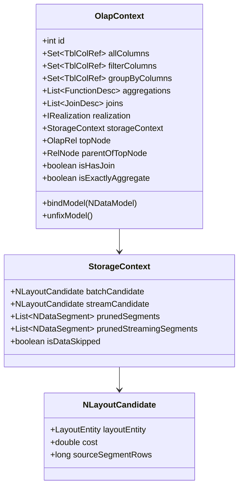
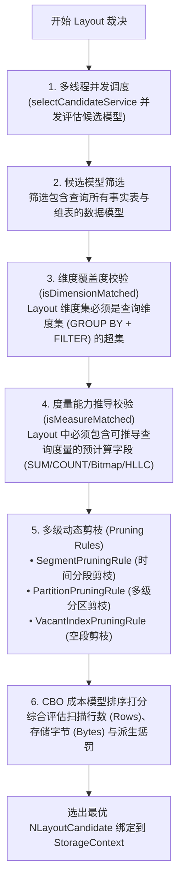

# 硬核拆解 Kylin 查询引擎 (三)：MOLAP 的灵魂中枢 —— OlapContext 切分、Model 匹配与多级动态剪枝

> **作者**：Huang Sheng (mrhs121)  
> **日期**：2026-08-18  
> **分类**：`Apache Kylin` · `OLAP` · `CBO` · `索引裁决` · `剪枝算法` · `源码剖析`

---

## 0. 导读与核心问题

在上一篇 [《硬核拆解 Kylin 查询引擎 (二)：Calcite 遇上 OLAP —— 深入 OlapRel 算子体系与 RBO/CBO 优化》](2026-08-18-kylin-query-engine-02-olap-rel-and-rules.md) 中，我们拆解了 SQL 如何经过 Calcite 的 CBO 规约转换与 RBO 启发式规则，生成最优的 `OlapRel` 物理关系代数树。

接下来，查询进入整个链路中最核心的调度决策层 —— **阶段四：Model Match（模型与索引匹配、多级剪枝）**。

在这一阶段，引擎必须精准回答四个物理层面的关键问题：
1. **多模型切分**：如果一条复杂 SQL 跨越了多个不同的业务模型，如何自动切分子上下文？如果初始切分匹配失败，如何通过**自适应回退重新切分（Re-Cut Strategy）**进行容错重试？
2. **能力校验**：当前候选模型的预计算 Layout 是否完全覆盖了查询所需的维度？度量是否具备代数可推导性？
3. **多级动态剪枝**：如何根据查询的过滤条件，在物理扫描前剔除 $90\%+$ 无关的 **Segment 时间分段** 与 **多级子分区（Multi-partition）**？
4. **最优 Layout 裁决**：当多个 Layout 均满足要求时，如何基于 CBO 成本模型（行数、字节大小、派生代价）选出最优 Cuboid？

承担这一“大脑中枢”职责的，正是 **`OlapContext` 体系**、**`QueryContextCutter`** 与 **`RealizationChooser` / `CandidateSelector`**。

---

## 1. 状态黑板：OlapContext 数据结构深度剖析

`OlapContext`（位于 `OlapContext.java`）是整个查询分析过程中的**核心上下文载体**，充当了经典黑板设计模式（Blackboard Pattern）中的“黑板”：



### 关键字段职责剖析

| 核心字段 | 类型 | 核心作用 |
| :--- | :--- | :--- |
| `allColumns` | `Set<TblColRef>` | 记录当前子树所引用的所有物理列集合 |
| `filterColumns`| `Set<TblColRef>` | 记录 WHERE / HAVING 过滤条件中涉及的所有列 |
| `groupByColumns`| `Set<TblColRef>` | 记录 GROUP BY 子句中涉及的全部维度列 |
| `aggregations` | `List<FunctionDesc>` | 记录查询涉及的所有聚合函数度量描述符 |
| `joins` | `List<JoinDesc>` | 记录当前上下文内部的所有数据表关联拓扑 |
| `realization` | `IRealization` | 最终裁决选中的物理模型实例（通常为 `NDataflow`） |
| `storageContext`| `StorageContext` | 存放最终选中的 `NLayoutCandidate`、剪枝后的 Segments 及分区分段元数据 |
| `isExactlyAggregate`| `boolean` | 标记是否精确命中 Layout 维度，若为 true 则在 Spark 端跳过二次聚合 |

---

## 2. 上下文切分与自适应回退机制：QueryContextCutter

如果用户的 SQL 关联了多张表，且这些表无法全部由单一数据模型提供服务，Kylin 必须进行 **上下文切分（Context Cut）**。

位于 `QueryContextCutter.java:69-111` 的算法流程设计极其精妙：


### 上下文切分的核心策略
1. **贪心首切（`ContextInitialCutStrategy`）**：
   - 优先尝试将整棵树或者尽可能大的子树纳入同一个 `OlapContext`，最大化利用模型内预计算物化 Join 消除 Shuffle；
2. **渐进式回退重切（`ContextReCutStrategy`）**：
   - 当大 Context 无法匹配到单一模型时，系统不会立刻报错，而是定位到导致匹配失败的 Join 算子处，将其两端强制切断为两个独立的子 Context，再次尝试分别路由到不同的小模型中；
3. **切分边界判定**：
   - **跨模型 Join**：Join 的表不属于同一个 Model；
   - **多层聚合冲突**：外层聚合与子查询聚合粒度不同；
   - **非等值 Join**：非等值关联无法由 Cube 预计算物化，强制切分并在 Spark 端运行时执行。

---

## 3. 候选模型与 Layout 裁决（RealizationChooser & CandidateSelector）

当 Context 切分完毕后，每个 `OlapContext` 会进入核心的 **模型与 Layout 匹配流程**（位于 `RealizationChooser.java` 与 `CandidateSelector.java`）。



### 3.1 多线程并发候选模型评估
在大规模数仓项目中，一个查询可能存在十几个候选模型。Kylin 设计了专用线程池（`RealizationChooser.java:115-120`）：
```java
private static final ExecutorService selectCandidateService = new ThreadPoolExecutor(
    KylinConfig.getInstanceFromEnv().getQueryRealizationChooserThreadCoreNum(),
    KylinConfig.getInstanceFromEnv().getQueryRealizationChooserThreadMaxNum(), 
    60L, TimeUnit.SECONDS,
    new SynchronousQueue<>(), new DaemonThreadFactory("RealChooser"),
    new ThreadPoolExecutor.CallerRunsPolicy());
```
多个候选模型在独立的子线程中并行执行能力校验与成本打分，显著压降了复杂查询的 Plan 阶段耗时。

---

### 3.2 规则 1：维度覆盖度匹配（Dimension Capability Check）
设当前查询所需的全部维度集合为：
$$D_{query} = D_{groupby} \cup D_{filter}$$
某个候选物理 Layout 包含的维度集合为 $D_{layout}$：
- **完全覆盖（Exact / Superset Coverage）**：若 $D_{query} \subseteq D_{layout}$，则该 Layout 具备直接回答能力；
- **派生维度覆盖（Derived Dimension Coverage）**：若某些查询维度 $d \notin D_{layout}$，但 $d$ 是维表上的属性列，且该维表的主外键列（FK/PK）包含在 $D_{layout}$ 中，则该 Layout 依然具备回答能力，但后续需要通过主键二次回查维表。

---

### 3.3 规则 2：度量能力推导校验（Measure Capability Check）
Kylin 检查 Layout 中预计算度量对 SQL 聚合函数的代数可推导性：

| 查询度量需求 | 底层 Layout 所需物化度量 | 推导计算规则 |
| :--- | :--- | :--- |
| `SUM(col)` | `SUM(col)` | 二次求和：`sum(sum_col)` |
| `COUNT(col)` | `COUNT(col)` | 累加求和：`sum(count_col)` |
| `COUNT(DISTINCT col)` | `BITMAP_UUID(col)` / `BITMAP_BUILD` | 位图合并：`bit_or_bitmap(bitmap_col)` 后取基数 |
| `COUNT(DISTINCT col)` (近似) | `HLLC(col)` | 寄存器合并：`hll_union(hll_col)` 后取基数 |
| `TOPN(col, k)` | `TOPN(col, K)` ($K \ge k$) | 优先队列流式合并 |
| `PERCENTILE(col, p)` | `PercentileCounter` / `T-Digest` | 直方图 / 质心合并 |

---

## 4. 多级动态剪枝机制（Pruning Rules）

在大规模时序与分区数据中，扫描全量文件是极其昂贵的。Kylin 在生成物理执行计划前，通过链式动态剪枝器将扫描范围压缩至极限：


### 4.1 Segment 时间分段剪枝（`SegmentPruningRule`）
- 自动提取 WHERE 条件中作用于模型分区时间列（Partition Column）的常量谓词（如 `part_dt BETWEEN '2026-01-01' AND '2026-03-31'`）；
- 与模型下属所有构建完成的 Segment 时间范围 `[seg.start, seg.end)` 进行区间交集判定；
- **完全不重叠的 Segment 直接从扫描列表中丢弃**，实现时间维度的粗粒度快速过滤。

### 4.2 多级子分区裁剪（`PartitionPruningRule`）
- 针对启用了多级物理分区（Multi-partition，如一级按日期、二级按组织机构/城市）的表；
- 解析二级分区列上的等值过滤（如 `org_id IN (101, 102)`），直接精确定位并仅保留对应分区的存储路径，剔除无关的底层目录。

---

## 5. CBO 成本模型排序打分与计划物理改写

当多个 Layout 均满足维度覆盖与度量推导要求时，系统依据以下成本公式计算最终得分：

$$\text{Score} = w_1 \cdot \text{EstimatedRows} + w_2 \cdot \text{StorageBytes} + \sum \text{Penalty}_{\text{derived}}$$

- **行数权重（Rows）**：优先选择预聚合程度更高、行数更少的聚合组索引（Agg Index）；
- **存储字节（Bytes）**：相同行数下，优先选择包含列更少、文件体积更小的索引；
- **派生惩罚（Derived Penalty）**：若需回查维表派生维度，增加额外惩罚分，促使系统优先选择直接物化该维度的 Layout。

选出的最优候选者封装为 `NLayoutCandidate` 绑定到 `OlapContext.storageContext` 中。随后触发 `implementRewrite` 完成数据表物理别名与列 ID 的替换，并标记 `isExactlyAggregate`。

---

## 6. 总结与下篇预告

`OlapContext` 与 CBO 索引裁决器构成了 Kylin 查询引擎的“超强大脑”：
1. **黑板模式**：通过 `OlapContext` 聚合查询意图，使代数优化与物理存储彻底解耦；
2. **自适应切分**：`QueryContextCutter` 的贪心切分与回退重切算法保障了复杂跨模型查询的高容错性；
3. **多维多级裁决**：维度覆盖、度量代数推导、三级动态剪枝（Segment/Partition/Vacant）与 CBO 打分模型，确保每次查询都能命中物理层面开销最小的存储单元。

---

> **下一篇预告**：
> 在接下来的 **《硬核拆解 Kylin 查询引擎 (四)：跨越代数鸿沟 —— CalciteToSparkPlaner 双栈编译与 FilePruner 深度剖析》** 中，我们将深入 **阶段五：Create Spark Plan**：
> - `CalciteToSparkPlaner` 主计算栈与集合操作栈（Dual-Stack）的双栈编译器架构；
> - 物化 Join 消除（`!isRuntimeJoin`）与精确聚合短路（`isExactlyAggregate`）；
> - **FilePruner（文件裁剪）**：`computeFilePruningMode`（LOCAL vs CLUSTER 模式）、`ParquetBloomFilter` 与 `FileSegments` 裁剪机制。
