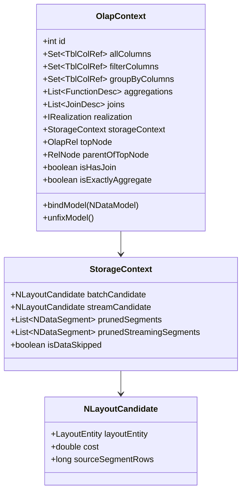
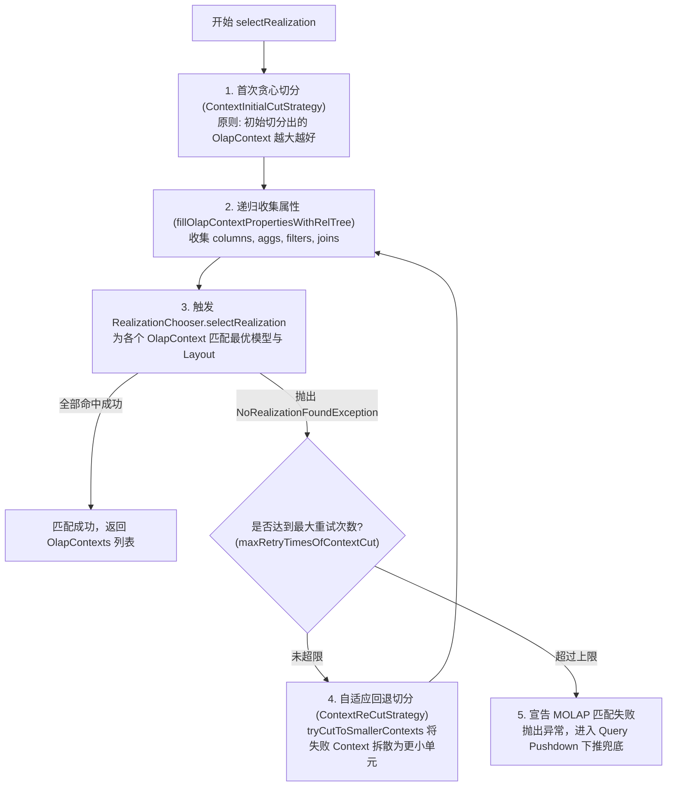
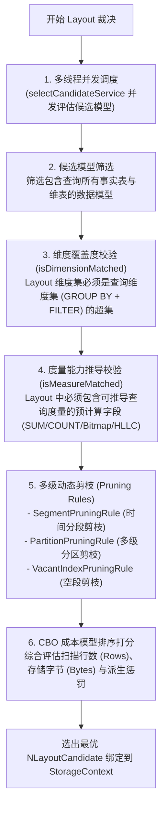

# 硬核拆解 Kylin 查询引擎 (三)：MOLAP 的灵魂中枢 —— OlapContext 生命周期与 CBO 索引裁决

> **作者**：Huang Sheng (mrhs121)  
> **日期**：2026-08-18  
> **分类**：`Apache Kylin` · `OLAP` · `CBO` · `索引裁决` · `剪枝算法` · `源码剖析`

---

## 0. 导读与核心问题

在上一篇 [《硬核拆解 Kylin 查询引擎 (二)：Calcite 遇上 OLAP —— 深入 OlapRel 算子体系与优化规则》](2026-08-18-kylin-query-engine-02-olap-rel-and-rules.md) 中，我们拆解了 Calcite 逻辑计划如何被转换为带有 OLAP 规约的 `OlapRel` 物理关系代数树。

但此时系统依然面临整个查询链路中最核心的调度抉择：
1. **模型覆盖问题**：当前查询涉及的表、过滤条件和聚合度量，应该由项目中的哪一个或哪几个数据模型（`NDataModel` / `NDataflow`）来提供服务？
2. **多模型切分与回退问题**：如果一条复杂 SQL 跨越了多个不同的业务模型，系统如何自动切分子上下文？如果首次切分失败，如何进行**自适应回退重新切分（Re-Cut Strategy）**？
3. **最优 Layout 裁决问题**：单个模型内可能构建了数十个不同维度组合的 Layout（Cuboid），系统如何以**最小的 I/O 成本和扫描行数**精确裁决出最优的那一个？

承担这一“大脑中枢”职责的，正是 Kylin 的 **`OlapContext` 体系**、**上下文切分器（`QueryContextCutter`）** 与 **CBO 索引匹配裁决器（`RealizationChooser` / `CandidateSelector`）**。

本文将深入源码，彻底揭开 Kylin 模型匹配、自适应上下文切分、多级动态剪枝与成本打分模型的核心内幕。

---

## 1. 状态黑板：OlapContext 数据结构深度剖析

`OlapContext`（位于 [`OlapContext.java`](file:///Users/huangsheng/codes/kyligence/kylin/src/query-common/src/main/java/org/apache/kylin/query/relnode/OlapContext.java)）是整个查询分析过程中的**核心上下文载体**，充当了经典黑板设计模式（Blackboard Pattern）中的“黑板”：



### 关键字段职责剖析

| 核心字段 | 类型 | 核心作用 |
| :--- | :--- | :--- |
| `allColumns` | `Set<TblColRef>` | 记录当前子树所引用的所有物理列集合 |
| `filterColumns`| `Set<TblColRef>` | 记录 WHERE / HAVING 过滤条件中涉及的所有列 |
| `groupByColumns`| `Set<TblColRef>` | 记录 GROUP BY 子句中涉及的全部维度列 |
| `aggregations` | `List<FunctionDesc>` | 记录查询涉及的所有聚合函数度量描述符 |
| `joins` | `List<JoinDesc>` | 记录当前上下文内部的所有数据表关联拓扑 |
| `realization` | `IRealization` | 最终裁决选中的物理模型实例（通常为 `NDataflow`） |
| `storageContext`| `StorageContext` | 存放最终选中的 `NLayoutCandidate`、剪枝后的 Segments 及分区分段元数据 |
| `isExactlyAggregate`| `boolean` | 标记是否精确命中 Layout 维度，若为 true 则在 Spark 端跳过二次聚合 |

---

## 2. 上下文切分与回退机制：QueryContextCutter

如果用户写了一条跨多个模型的复杂关联查询（例如销售事实模型关联用户画像模型），单一模型无法回答整条 SQL。此时，Kylin 必须进行 **上下文切分（Context Cut）**。

位于 [`QueryContextCutter.java:69-111`](file:///Users/huangsheng/codes/kyligence/kylin/src/query/src/main/java/org/apache/kylin/query/util/QueryContextCutter.java#L69-L111) 的算法流程设计极其精妙：



### 上下文切分的关键策略
1. **贪心首切（`ContextInitialCutStrategy`）**：
   - 优先尝试将整棵树或者尽可能大的子树纳入同一个 `OlapContext`，最大化利用模型内预计算物化 Join 消除 Shuffle；
2. **渐进式回退重切（`ContextReCutStrategy`）**：
   - 当大 Context 无法匹配到单一模型时，系统不会立刻放弃，而是定位到导致匹配失败的 Join 算子处，将其两端强制切断为两个独立的子 Context，再次尝试分别路由到不同的小模型中；
3. **切分边界判定**：
   - **跨模型 Join**：Join 的表不属于同一个 Model；
   - **多层聚合冲突**：外层聚合与子查询聚合粒度不同；
   - **非等值 Join**：非等值关联无法由 Cube 预计算物化，强制切分并在 Spark 端运行时执行。

---

## 3. CBO 候选模型与索引裁决（RealizationChooser & CandidateSelector）

当 Context 切分完毕后，每个 `OlapContext` 会进入核心的 **模型与 Layout 匹配流程**（位于 [`RealizationChooser.java`](file:///Users/huangsheng/codes/kyligence/kylin/src/query-common/src/main/java/org/apache/kylin/query/routing/RealizationChooser.java) 与 [`CandidateSelector.java`](file:///Users/huangsheng/codes/kyligence/kylin/src/query-common/src/main/java/org/apache/kylin/query/routing/CandidateSelector.java)）。



### 3.1 多线程并发候选模型评估
在大规模数仓项目中，一个查询可能存在十几个候选模型。Kylin 设计了专用线程池（[`RealizationChooser.java:115-120`](file:///Users/huangsheng/codes/kyligence/kylin/src/query-common/src/main/java/org/apache/kylin/query/routing/RealizationChooser.java#L115-L120)）：
```java
private static final ExecutorService selectCandidateService = new ThreadPoolExecutor(
    KylinConfig.getInstanceFromEnv().getQueryRealizationChooserThreadCoreNum(),
    KylinConfig.getInstanceFromEnv().getQueryRealizationChooserThreadMaxNum(), 
    60L, TimeUnit.SECONDS,
    new SynchronousQueue<>(), new DaemonThreadFactory("RealChooser"),
    new ThreadPoolExecutor.CallerRunsPolicy());
```
多个候选模型在独立的子线程中并行执行能力校验与成本打分，显著压降了复杂查询的 Plan 阶段耗时。

---

### 3.2 规则 1：维度覆盖度匹配（Dimension Capability Check）
设当前查询所需的全部维度集合为：
$$D_{query} = D_{groupby} \cup D_{filter}$$
某个候选物理 Layout 包含的维度集合为 $D_{layout}$：
- **完全覆盖（Exact / Superset Coverage）**：若 $D_{query} \subseteq D_{layout}$，则该 Layout 具备直接回答能力；
- **派生维度覆盖（Derived Dimension Coverage）**：若某些查询维度 $d \notin D_{layout}$，但 $d$ 是维表上的属性列，且该维表的主外键列（FK/PK）包含在 $D_{layout}$ 中，则该 Layout 依然具备回答能力，但后续需要通过主键二次回查维表。

---

### 3.3 规则 2：度量能力推导校验（Measure Capability Check）
Kylin 检查 Layout 中预计算度量对 SQL 聚合函数的代数可推导性：

| 查询度量需求 | 底层 Layout 所需物化度量 | 推导计算规则 |
| :--- | :--- | :--- |
| `SUM(col)` | `SUM(col)` | 二次求和：`sum(sum_col)` |
| `COUNT(col)` | `COUNT(col)` | 累加求和：`sum(count_col)` |
| `COUNT(DISTINCT col)` | `BITMAP_UUID(col)` / `BITMAP_BUILD` | 位图合并：`bit_or_bitmap(bitmap_col)` 后取基数 |
| `COUNT(DISTINCT col)` (近似) | `HLLC(col)` | 寄存器合并：`hll_union(hll_col)` 后取基数 |
| `TOPN(col, k)` | `TOPN(col, K)` ($K \ge k$) | 优先队列流式合并 |
| `PERCENTILE(col, p)` | `PercentileCounter` / `T-Digest` | 直方图 / 质心合并 |

---

### 3.4 规则 3：多级动态剪枝机制（Pruning Rules）
为了最大化减少文件扫描，Kylin 链式执行三层动态剪枝：
1. **分段剪枝（`SegmentPruningRule`）**：
   - 提取过滤条件中的时间范围常量（如 `part_dt BETWEEN '2026-01-01' AND '2026-03-31'`）；
   - 与各 Segment 的时间区间 `[seg_start, seg_end)` 进行几何重叠计算，不重叠的 Segment 直接从扫描列表中剔除；
2. **多级分区剪枝（`PartitionPruningRule`）**：
   - 针对多级子分区表（如按 `city` 二级分区），解析分区键过滤条件，剔除无关的物理分区子目录；
3. **空索引剪枝（`VacantIndexPruningRule`）**：
   - 若某些历史 Segment 尚未构建当前选中的 Layout，自动将其标记，防止运行时抛出 FileNotFound 异常。

---

### 3.5 规则 4：CBO 成本模型排序打分（Cost Formulation）
当多个 Layout 均满足维度覆盖与度量推导要求时，系统依据以下成本公式计算最终得分：

$$\text{Score} = w_1 \cdot \text{EstimatedRows} + w_2 \cdot \text{StorageBytes} + \sum \text{Penalty}_{\text{derived}}$$

- **行数权重（Rows）**：优先选择预聚合程度更高、行数更少的聚合组索引（Agg Index）；
- **存储字节（Bytes）**：相同行数下，优先选择包含列更少、文件体积更小的索引；
- **派生惩罚（Derived Penalty）**：若需回查维表派生维度，增加额外惩罚分，促使系统优先选择直接物化该维度的 Layout。

选出的最优候选者封装为 [`NLayoutCandidate`](file:///Users/huangsheng/codes/kyligence/kylin/src/core-metadata/src/main/java/org/apache/kylin/metadata/cube/cuboid/NLayoutCandidate.java) 绑定到 `OlapContext.storageContext` 中。

---

## 4. 计划物理重写：implementRewrite 的最后闭环

当最优 Layout 选定之后，`OlapRel` 树触发最后一步 —— [`implementRewrite`](file:///Users/huangsheng/codes/kyligence/kylin/src/query-common/src/main/java/org/apache/kylin/query/relnode/OlapRel.java#L140-L165)：

```java
// 核心逻辑概括
1. fixColumnRowTypeWithModel(selectedModel): 将逻辑表名与列名替换为选定物理模型的别名与列 ID;
2. isExactlyAggregate 判定:
   if (queryDimensions.equals(layoutDimensions) && !needDerived) {
       context.setExactlyAggregate(true); // 精准命中，指示 Spark 跳过聚合直接转 Project！
   }
3. 派生维度表达式改写: 将派生维度转换为根据主键外键进行 Lookup 关联的表达式。
```

---

## 5. 总结与下篇预告

`OlapContext` 与 CBO 索引裁决器构成了 Kylin 查询引擎的“超强大脑”：
1. **黑板解耦**：通过 `OlapContext` 聚合查询意图，使代数优化与物理存储彻底解耦；
2. **自适应切分**：`QueryContextCutter` 的贪心切分与回退重切算法保障了复杂跨模型查询的高容错性；
3. **多维多级裁决**：维度覆盖、度量代数推导、三级动态剪枝与 CBO 打分模型，确保每次查询都能命中物理层面“开销最小”的存储单元。

---

> **下一篇预告**：
> 在接下来的 **《硬核拆解 Kylin 查询引擎 (四)：跨越代数鸿沟 —— CalciteToSparkPlaner 双栈编译与物化消除》** 中，我们将深入转译核心：
> - `CalciteToSparkPlaner` 主计算栈与集合操作栈（Dual-Stack）的精妙配合；
> - 物化 Join 消除（`!isRuntimeJoin`）如何在代码层面绕过子树遍历；
> - `SparderRexVisitor` 表达式转译与 Delta Lake / Parquet 自适应文件剪枝。
