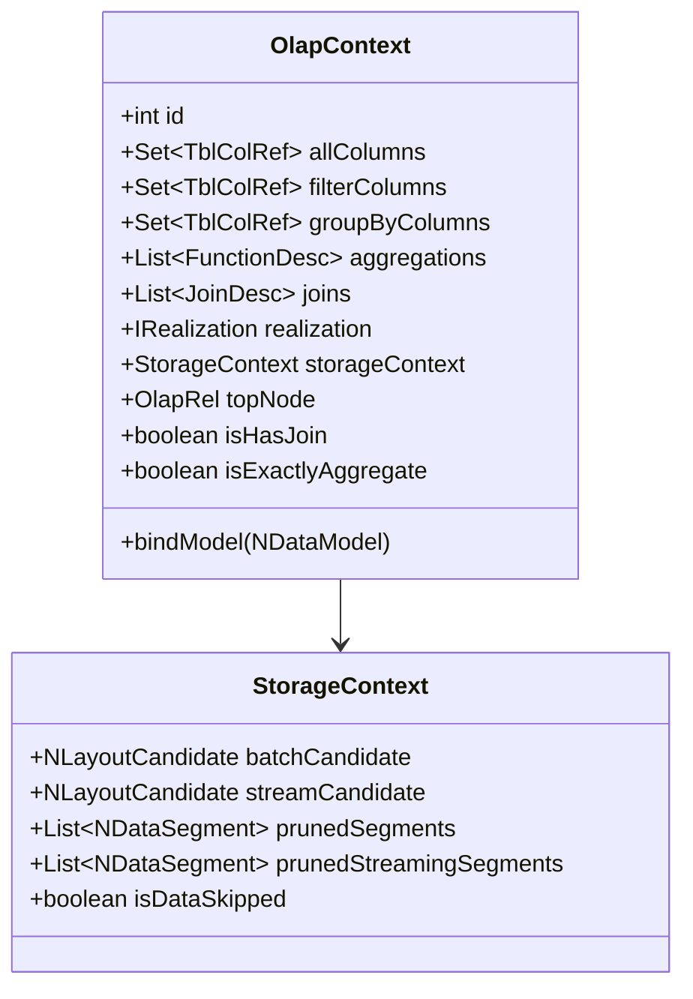
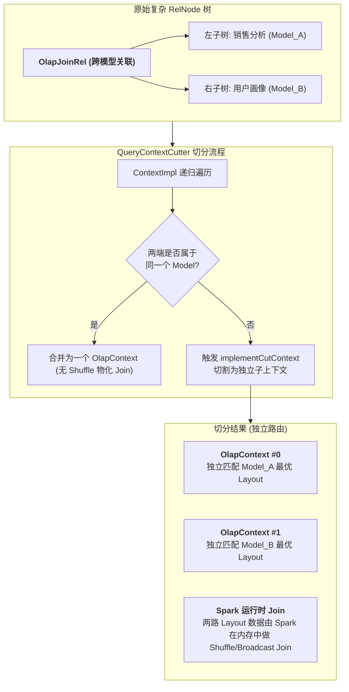
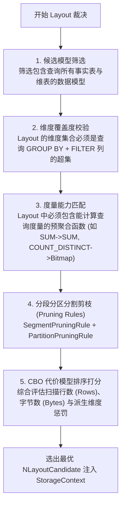

# 硬核拆解 Kylin 查询引擎 (三)：MOLAP 的灵魂中枢 —— OlapContext 生命周期与 CBO 索引裁决

> **作者**：Huang Sheng (mrhs121)  
> **日期**：2026-08-18  
> **分类**：`Apache Kylin` · `OLAP` · `CBO` · `索引裁决` · `剪枝算法` · `源码剖析`

---

## 0. 导读与背景问题

在上一篇 [《硬核拆解 Kylin 查询引擎 (二)：Calcite 遇上 OLAP —— 深入 OlapRel 算子体系与优化规则》](2026-08-18-kylin-query-engine-02-olap-rel-and-rules.md) 中，我们拆解了 Calcite 逻辑计划如何被转换为带有 OLAP 规约的 `OlapRel` 物理关系代数树。

但此时系统依然面临最核心的调度抉择：
1. **模型覆盖问题**：当前查询涉及的表、过滤条件和聚合度量，应该由项目中的哪一个或哪几个数据模型（`NDataModel` / `NDataflow`）来提供服务？
2. **多模型切分问题**：如果一条复杂 SQL 跨越了多个不同的业务模型，系统如何自动识别边界并切分子上下文？
3. **最优 Layout 裁决问题**：单个模型内可能构建了数十个不同维度组合的 Layout（Cuboid），系统如何以**最小的 I/O 成本和扫描行数**精确裁决出最优的那一个？

承担这一“大脑中枢”职责的，正是 Kylin 的 **`OlapContext` 体系** 与 **CBO 索引匹配裁决器（`RealizationChooser` / `CandidateSelector`）**。

本文将深入源码，彻底揭开 Kylin 模型匹配、上下文切分与多级剪枝的核心内幕。

---

## 1. 状态黑板：OlapContext 数据结构深度剖析

`OlapContext`（位于 [`OlapContext.java`](file:///Users/huangsheng/codes/kyligence/kylin/src/query-common/src/main/java/org/apache/kylin/query/relnode/OlapContext.java)）是整个查询分析过程中的**核心上下文载体**，充当了经典黑板设计模式（Blackboard Pattern）中的“黑板”：



### 关键字段与职责表

| 核心字段 | 类型 | 核心作用 |
| :--- | :--- | :--- |
| `allColumns` | `Set<TblColRef>` | 记录当前子树所引用的所有物理列集合 |
| `filterColumns`| `Set<TblColRef>` | 记录 WHERE / HAVING 过滤条件中涉及的所有列 |
| `groupByColumns`| `Set<TblColRef>` | 记录 GROUP BY 子句中涉及的全部维度列 |
| `aggregations` | `List<FunctionDesc>` | 记录查询涉及的所有聚合函数度量描述符 |
| `joins` | `List<JoinDesc>` | 记录当前上下文内部的所有数据表关联关系 |
| `realization` | `IRealization` | 最终裁决选中的物理模型实例（通常为 `NDataflow`） |
| `storageContext`| `StorageContext` | 存放最终选中的 `NLayoutCandidate`、剪枝后的 Segments 及分区分段元数据 |

---

## 2. 上下文切割机制：QueryContextCutter 与 Context Cut

如果用户写了一条跨多个模型的复杂关联查询（例如销售事实模型关联用户画像模型），单一模型无法回答整条 SQL。此时，Kylin 必须进行 **上下文切分（Context Cut）**。



### 上下文切分的核心触发条件
1. **跨模型关联（Cross-Model Join）**：Join 的左右两张表不存在于任何单一预定义模型的拓扑图中；
2. **多层聚合冲突（Multi-level Aggregation）**：外层聚合与子查询聚合粒度不同，无法在单次模型扫描中完成；
3. **非等值关联（Non-Equi Join）**：模型预计算通常只支持等值 Join，非等值 Join 必须交由 Spark 运行时执行。

---

## 3. CBO 索引裁决流程：挑选最优 Layout

在上下文切分完成后，每个 `OlapContext` 会进入核心的 **模型与 Layout 匹配流程（`RealizationChooser` / `CandidateSelector`）**：



### 3.1 规则 1：维度覆盖度匹配（Dimension Capability）
设查询所需维度集合为 $D_{query} = D_{groupby} \cup D_{filter}$，某个候选 Layout 的维度集合为 $D_{layout}$：
- 若 $D_{query} \subseteq D_{layout}$，则该 Layout 具备**直接回答能力**；
- 若某维度不在 Layout 中，但它是主外键关联的**派生维度（Derived Dimension）**，且 Layout 中包含了对应的外键主键，则该 Layout 依然具备**派生回答能力**（但会施加一定的代价惩罚）。

### 3.2 规则 2：度量能力匹配（Measure Capability）
Kylin 检查 Layout 中预计算的度量是否满足查询聚合函数的代数可推导性：
- `SUM(col)` $\to$ 可由底层的 `SUM(col)` 二次聚合得到；
- `COUNT(col)` $\to$ 可由底层的 `COUNT(col)` 转换为 `SUM(count_col)` 得到；
- `COUNT(DISTINCT col)` $\to$ 必须在底层 Layout 中存在对应的 `RoaringBitmap` 或 `HLLC` 度量；
- `TOPN(k)` $\to$ 底层 Layout 包含相同或更大容量的 TopN 度量。

### 3.3 规则 3：多级动态剪枝（Multi-level Pruning）
在选定 Layout 前后，Kylin 会执行三层严密的动态剪枝：
1. **分段剪枝（`SegmentPruningRule`）**：依据 SQL 中的时间过滤条件（如 `part_dt >= '2026-01-01'`），过滤掉时间范围完全不重叠的历史 Segment；
2. **分区剪枝（`PartitionPruningRule`）**：针对多分区表（Multi-Partition），依据分区键常量进一步剔除无关的物理分区；
3. **空索引剪枝（`VacantIndexPruningRule`）**：若某 Segment 尚未构建完成该 Layout，自动将其标记并路由至兜底引擎或降级处理。

### 3.4 规则 4：CBO 代价打分模型（Cost-Based Ranking）
当多个 Layout 均满足查询需求时，系统依据以下成本公式进行打分：

$$\text{Cost} = \alpha \cdot \text{EstimatedRows} + \beta \cdot \text{StorageBytes} + \sum \text{Penalty}_{\text{derived}}$$

- **行数代价（Rows）**：优先选择预聚合程度更高、行数更少的聚合组（Agg Index）；
- **字节代价（Bytes）**：优先选择扫描列更少、文件更小的索引；
- **派生惩罚（Derived Penalty）**：若需要通过主键二次回查维表派生维度，会增加惩罚分，促使系统优先选择已直接包含该维度的 Layout。

---

## 4. 计划重写：implementRewrite 的最后闭环

当最优 Layout 选定之后，`OlapRel` 树触发最后一步 —— [`implementRewrite`](file:///Users/huangsheng/codes/kyligence/kylin/src/query-common/src/main/java/org/apache/kylin/query/relnode/OlapRel.java#L140-L165)：

1. **别名与字段重映射**：调用 `fixColumnRowTypeWithModel`，将 Calcite 节点中的逻辑表名与列名，替换为选定物理 Layout 内部的列索引 ID；
2. **精准聚合标记（`isExactlyAggregate`）**：
   ```java
   if (context.isExactlyAggregate()) {
       // 查询维度与 Layout 维度完全一致，无需 Spark 二次聚合
       // 标记为 true，后续在 Spark 生成阶段直接转为 Project！
   }
   ```
3. **派生维度重写**：若使用了派生维度，重写 Project 表达式，将其转换为 `维表Lookup(外键ID)`。

---

## 5. 总结与下篇预告

`OlapContext` 与 CBO 索引裁决器是 Kylin 作为 MOLAP 引擎的核心壁垒：
1. **黑板模式**：通过 `OlapContext` 高效聚合 SQL 语义，实现了代数树与物理存储模型的彻底解耦；
2. **智能裁决**：多维覆盖校验、度量能力匹配与 CBO 代价评估，确保每次查询都能命中“最小成本”的物理存储单元；
3. **物理重写**：通过精准聚合短路与派生维度还原，将预计算红利发挥到极致。

---

> **下一篇预告**：
> 在接下来的 **《硬核拆解 Kylin 查询引擎 (四)：跨越代数鸿沟 —— CalciteToSparkPlaner 双栈编译与物化消除》** 中，我们将深入转译核心：
> - 为什么 `CalciteToSparkPlaner` 要设计 `stack` 与 `setOpStack` 双栈结构？
> - 物化 Join 消除（`!isRuntimeJoin`）在代码层面是如何实现的？
> - `SparderRexVisitor` 如何将 Calcite 表达式精确转译为 Spark Catalyst Expression？
