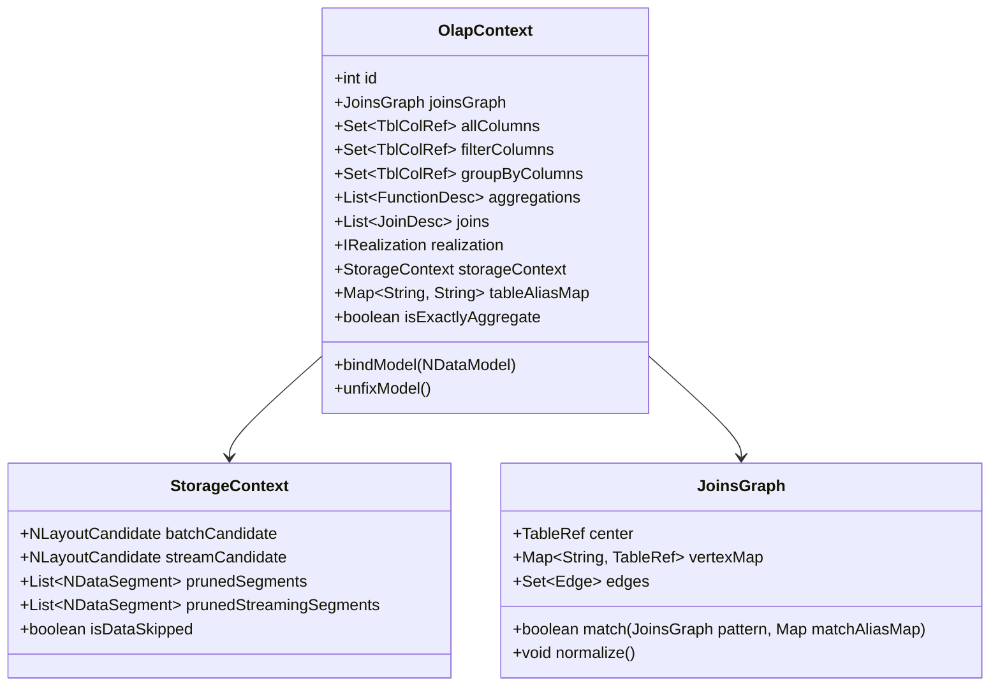
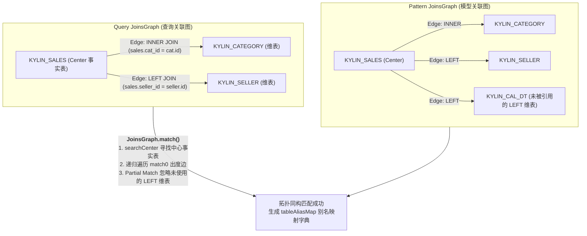
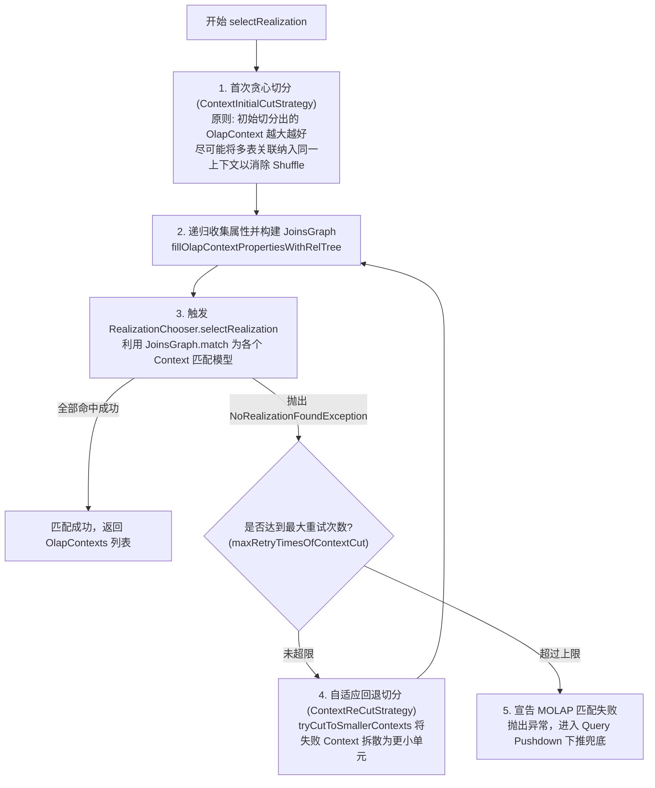
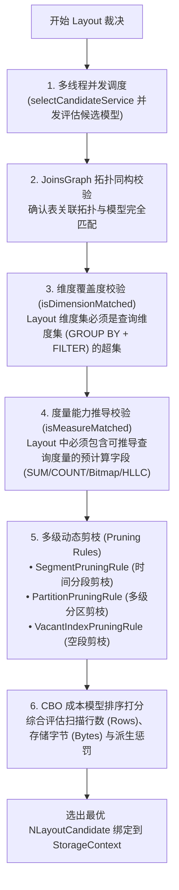

# 硬核拆解 Kylin 查询引擎 (三)：MOLAP 的灵魂中枢 —— JoinsGraph 图匹配、OlapContext 切分与多级动态剪枝

> **作者**：Huang Sheng (mrhs121)  
> **日期**：2026-08-18  
> **分类**：`Apache Kylin` · `OLAP` · `JoinsGraph` · `CBO` · `图同构匹配` · `剪枝算法` · `源码剖析`

---

## 0. 导读与核心问题

在上一篇 [《硬核拆解 Kylin 查询引擎 (二)：Calcite 遇上 OLAP —— 深入 OlapRel 算子体系与 47 条优化规则全百科》](2026-08-18-kylin-query-engine-02-olap-rel-and-rules.md) 中，我们拆解了 SQL 如何经过 Calcite 的 CBO 规约转换与 RBO 启发式规则，生成最优的 `OlapRel` 物理关系代数树。

接下来，查询进入整个链路中最核心的调度决策层 —— **阶段四：Model Match（模型与索引匹配、多级剪枝）**。

在这一阶段，引擎必须在毫秒级时间内解决以下核心拓扑与物理难题：
1. **多表关联拓扑匹配（Join Graph）**：如何用**图论（Graph Theory）**形式抽象复杂的星型（Star Schema）与雪花型（Snowflake Schema）多表关联？如何判定查询的多表 Join 是否与预计算模型构成**子图同构（Subgraph Isomorphism）**？
2. **多模型切分与回退（Context Cut & Re-Cut）**：如果一条复杂 SQL 跨越了多个不同的业务模型，如何自动切分子上下文？如果初始切分匹配失败，如何通过**自适应回退重新切分**进行容错重试？
3. **能力校验与多级动态剪枝**：如何校验维度全覆盖与度量代数可加性？如何在物理扫描前剔除 $90\%+$ 无关的 **Segment 时间分段** 与 **多级子分区（Multi-partition）**？
4. **最优 Layout 裁决**：当多个 Layout 均满足要求时，如何基于 CBO 成本模型（行数、字节大小、派生代价）选出最优 Cuboid？

承担这一“大脑中枢”职责的，正是 **`JoinsGraph` 图匹配引擎**、**`OlapContext` 体系**、**`QueryContextCutter`** 与 **`RealizationChooser` / `CandidateSelector`**。

---

## 1. 状态黑板：OlapContext 数据结构深度剖析

`OlapContext`（位于 `OlapContext.java`）是整个查询分析过程中的**核心上下文载体**，充当了经典黑板设计模式（Blackboard Pattern）中的“黑板”：



### 关键字段职责剖析

| 核心字段 | 类型 | 核心作用 |
| :--- | :--- | :--- |
| `joinsGraph` | `JoinsGraph` | 当前子查询树构建出的有向多表关联拓扑图 |
| `allColumns` | `Set<TblColRef>` | 记录当前子树所引用的所有物理列集合 |
| `filterColumns`| `Set<TblColRef>` | 记录 WHERE / HAVING 过滤条件中涉及的所有列 |
| `groupByColumns`| `Set<TblColRef>` | 记录 GROUP BY 子句中涉及的全部维度列 |
| `aggregations` | `List<FunctionDesc>` | 记录查询涉及的所有聚合函数度量描述符 |
| `joins` | `List<JoinDesc>` | 记录当前上下文内部的所有数据表关联描述符 |
| `realization` | `IRealization` | 最终裁决选中的物理模型实例（通常为 `NDataflow`） |
| `tableAliasMap` | `Map<String, String>` | 记录查询表别名到模型物理表别名的映射关系 |
| `storageContext`| `StorageContext` | 存放最终选中的 `NLayoutCandidate`、剪枝后的 Segments 及分区分段元数据 |
| `isExactlyAggregate`| `boolean` | 标记是否精确命中 Layout 维度，若为 true 则在 Spark 端跳过二次聚合 |

---

## 2. 核心图论引擎：JoinsGraph 拓扑同构匹配与归一化

在 Kylin 中，多表关联匹配绝非简单的表名集合比对，而是基于严密的**有向图拓扑匹配（Graph Matching）**。`JoinsGraph.java`（523 行核心源码）定义了这一图论体系：



---

### 2.1 图模型数据结构定义
- **顶点（Vertices / `TableRef`）**：每个参与 Join 的数据表抽象为一个顶点。模型中以事实表为中心顶点（`center`）；
- **有向边（Edges / `Edge`）**：每个 `JoinDesc` 抽象为一条有向边，连接外键表（`FKSide`，出度方）与主键表（`PKSide`，入度方），记录 Join 类型（`INNER`、`LEFT`、`LeftOrInner`）与关联条件；
- **邻接表（`vertexInfoMap`）**：每个顶点维护自身的出度边列表（`outEdges`）与入度边列表（`inEdges`）。

---

### 2.2 内连接双向交换机制（Swap Joins）
对于 Inner Join，在关系代数中满足交换律：$A \bowtie B \equiv B \bowtie A$。
用户写 SQL 时，事实表可能出现在 Join 的左侧或右侧。
位于 `JoinsGraph.java:113-141`：
```java
// 对所有 Inner Join 自动生成正向与反向双向边对 (Swap Join Edge)
if ((join.isInnerJoin() || join.isLeftOrInnerJoin()) && needSwapJoin) {
    newJoins.add(Pair.newPair(swapJoinDesc(join), true));
}
```
**效果**：无论 SQL 原文中表连接的物理顺序如何，图匹配引擎均能双向遍历，消除 SQL 书写顺序对模型匹配的干扰。

---

### 2.3 图同构与子图同构匹配算法（`match0` 递归遍历）
在 `JoinsGraph.java:159-268` 中，匹配算法以广度/深度优先递归执行：

```java
// 核心匹配主循环 match0
for (int i = 0; i < toMatchTableList.size(); i++) {
    Pair<TableRef, TableRef> pair = toMatchTableList.get(i);
    TableRef queryFKSide = pair.getFirst();
    TableRef patternFKSide = pair.getSecond();
    List<Edge> queryOutEdges = this.outwardEdges(queryFKSide);
    Set<Edge> patternOutEdges = Sets.newHashSet(pattern.outwardEdges(patternFKSide));

    Iterator<Edge> queryOutEdgesIter = queryOutEdges.iterator();
    while (queryOutEdgesIter.hasNext()) {
        Edge queryOutEdge = queryOutEdgesIter.next();
        TableRef queryPKSide = queryOutEdge.otherSide(queryFKSide);
        Edge matchedPatternEdge = findOutEdgeFromDualTable(pattern, patternOutEdges, queryPKSide, queryOutEdge);
        
        // 成功匹配边：从候选集中移除，并将对端 PK 表加入下一轮待匹配队列
        queryOutEdgesIter.remove();
        patternOutEdges.remove(matchedPatternEdge);
        addIfAbsent(toMatchTableList, Pair.newPair(queryPKSide, matchedPatternEdge.otherSide(patternFKSide)));
    }
}
```

#### 关键特性：部分子图匹配（Partial Match）
在实际数仓中，一个大宽表模型可能预先关联了 10 张维表，但用户的查询往往只涉及其中 2 张维表：
- 若模型中未被查询引用的维表全都是 **`LEFT JOIN`**，由于 Left Join 不会改变事实表的主行数，Kylin 判定其为 **合法的子图同构匹配（`unmatchedPatternOutEdges.allMatch(Edge::isLeftJoin)`）**！
- 这一机制允许数仓工程师构建统一的企业级大模型，而能够加速成千上万个轻量级子查询。

---

### 2.4 LeftOrInner 语义归一化（`normalize()`）
在复杂 SQL 中，Left Join 在特定条件下会**语义等价退化为 Inner Join**：
1. **非空过滤下推**：`A LEFT JOIN B ON A.id = B.id WHERE B.status IS NOT NULL`（由于要求 B 表字段非空，Left Join 等价于 Inner Join）；
2. **下游链式 Inner Join 传递**：`A LEFT JOIN B, B LEFT JOIN C, C INNER JOIN D`（由于 C 与 D 存在 Inner Join，上游链路的所有行若在 C 中不存在则最终会被过滤，导致 A 与 B、B 与 C 均退化为 `LeftOrInner`）。

在 `JoinsGraph.normalize()` 中，系统沿拓扑入度路径向上递归遍历，将所有受影响的 `LEFT` 边标记为 `LeftOrInner` 边，从而能同时兼容模型定义的 INNER JOIN 与 LEFT JOIN！

---

## 3. 上下文切分与自适应回退机制：QueryContextCutter

当 SQL 涉及的表无法由单一模型完全匹配（例如跨业务域关联）时，Kylin 必须进行 **上下文切分（Context Cut）**。

位于 `QueryContextCutter.java:69-111` 的算法设计：



### 上下文切分的核心策略
1. **贪心首切（`ContextInitialCutStrategy`）**：
   - 优先尝试将整棵树或者尽可能大的子树纳入同一个 `OlapContext`，最大化利用模型内预计算物化 Join 消除 Shuffle；
2. **渐进式回退重切（`ContextReCutStrategy`）**：
   - 当大 Context 无法匹配到单一模型时，系统不会立刻报错，而是定位到导致匹配失败的 Join 算子处，将其两端强制切断为两个独立的子 Context，再次尝试分别路由到不同的小模型中；
3. **切分边界判定**：跨模型 Join、不同聚合粒度层级冲突、非等值关联强制切分。

---

## 4. 候选模型与 Layout 裁决（RealizationChooser & CandidateSelector）

当 Context 切分完成且 `JoinsGraph` 拓扑匹配通过后，每个 `OlapContext` 进入 Layout 深度裁决（`RealizationChooser.java` 与 `CandidateSelector.java`）。



### 4.1 多线程并发候选模型评估
在大规模数仓项目中，一个查询可能存在十几个候选模型。Kylin 设计了专用线程池（`RealizationChooser.java:115-120`）：
```java
private static final ExecutorService selectCandidateService = new ThreadPoolExecutor(
    KylinConfig.getInstanceFromEnv().getQueryRealizationChooserThreadCoreNum(),
    KylinConfig.getInstanceFromEnv().getQueryRealizationChooserThreadMaxNum(), 
    60L, TimeUnit.SECONDS,
    new SynchronousQueue<>(), new DaemonThreadFactory("RealChooser"),
    new ThreadPoolExecutor.CallerRunsPolicy());
```

---

### 4.2 维度覆盖度匹配（Dimension Capability Check）
设当前查询所需的全部维度集合为 $D_{query} = D_{groupby} \cup D_{filter}$，候选物理 Layout 包含维度集合为 $D_{layout}$：
- **完全覆盖**：若 $D_{query} \subseteq D_{layout}$，具备直接回答能力；
- **派生维度覆盖（Derived Dimension）**：若查询维度 $d \notin D_{layout}$，但 $d$ 是维表属性列，且该维表的主外键（FK/PK）包含在 $D_{layout}$ 中，则该 Layout 依然具备回答能力（后续通过主键回查维表）。

#### 派生维度的运行机制：Snapshot 回查与谓词翻译

派生维度是 Kylin 对抗"维度爆炸"的核心武器，值得单独展开。以 SSB 模型为例：假设建模时只把外键 `LO_PARTKEY` 设为普通维度，而 `P_CATEGORY`、`P_BRAND` 声明为 PART 表的派生维度——这样聚合组的维度基数大幅缩减，Layout 数量呈指数级下降。

当查询 `WHERE P_CATEGORY = 'MFGR#12'` 到来时，匹配与改写分两步：

1. **过滤谓词翻译（构建期 Snapshot 反查）**：Layout 中没有 `P_CATEGORY` 列，Kylin 加载 PART 表的 **Snapshot（构建时冻结的维表快照）**，在其中执行 `SELECT P_PARTKEY WHERE P_CATEGORY='MFGR#12'`，把谓词翻译为 `LO_PARTKEY IN (p1, p2, ..., pn)`，再下推到只含外键的 Layout 上过滤；
2. **SELECT / GROUP BY 列还原（查询期回查 Join）**：若派生列出现在 SELECT 或 GROUP BY 中，引擎会在 Layout 扫描结果之上追加一次与 Snapshot 小表的 Join（Snapshot 通常仅数 MB，Spark 自动走 Broadcast），把外键"还原"成派生列的值，再做最终聚合。

**代价权衡**：派生维度用查询期的少量额外计算（IN 列表翻译 + 广播回查）换取构建期 Layout 数量的指数级缩减。但有两个生产雷区：
- 翻译出的 IN 列表过长（如 `P_CATEGORY` 命中数十万个 `P_PARTKEY`）会拖慢过滤甚至超出表达式限制——**高基数过滤列不适合做派生维度**；
- FK 到派生列是**一对多**关系时（一个外键对应多行维表记录），`isNeedToManyDerived` 会置位，精确聚合短路等优化会被禁用。

---

### 4.3 度量能力推导校验（Measure Capability Check）

| 查询度量需求 | 底层 Layout 所需物化度量 | 推导计算规则 |
| :--- | :--- | :--- |
| `SUM(col)` | `SUM(col)` | 二次求和：`sum(sum_col)` |
| `COUNT(col)` | `COUNT(col)` | 累加求和：`sum(count_col)` |
| `COUNT(DISTINCT col)` | `BITMAP_UUID(col)` / `BITMAP_BUILD` | 位图合并：`bit_or_bitmap(bitmap_col)` 后取基数 |
| `COUNT(DISTINCT col)` (近似) | `HLLC(col)` | 寄存器合并：`hll_union(hll_col)` 后取基数 |
| `TOPN(col, k)` | `TOPN(col, K)` ($K \ge k$) | 优先队列流式合并 |
| `PERCENTILE(col, p)` | `PercentileCounter` / `T-Digest` | 直方图 / 质心合并 |

---

## 5. 多级动态剪枝机制（Pruning Rules）

在大规模时序与分区数据中，Kylin 通过链式动态剪枝器将物理扫描范围压缩至极限：


### 5.1 Segment 时间分段剪枝（`SegmentPruningRule`）
- 自动提取 WHERE 条件中作用于模型分区时间列的常量谓词（如 `part_dt BETWEEN '2026-01-01' AND '2026-03-31'`）；
- 与模型所有已构建 Segment 的时间范围 `[seg.start, seg.end)` 进行几何区间交集判定；
- **完全不重叠的 Segment 直接从扫描列表中丢弃**，实现粗粒度极速过滤。

### 5.2 多级子分区裁剪（`PartitionPruningRule`）
- 针对启用了多级物理分区（Multi-partition，如一级按日期、二级按城市）的表；
- 解析二级分区列上的等值过滤（如 `city IN ('BJ', 'SH')`），直接精确定位并仅保留对应物理子目录。

---

## 6. CBO 成本打分模型与计划物理重写闭环

当多个 Layout 均满足要求时，依据以下成本公式计算最终得分：

$$\text{Score} = w_1 \cdot \text{EstimatedRows} + w_2 \cdot \text{StorageBytes} + \sum \text{Penalty}_{\text{derived}}$$

- **行数权重（Rows）**：优先选择预聚合程度更高、行数更少的聚合组索引（Agg Index）；
- **存储字节（Bytes）**：相同行数下，优先选择包含列更少、文件体积更小的索引；
- **派生惩罚（Derived Penalty）**：若需回查维表派生维度，增加额外惩罚分。

选出的最优候选者封装为 `NLayoutCandidate` 绑定到 `OlapContext.storageContext` 中。随后触发 `implementRewrite` 完成数据表物理别名与列 ID 的替换，并标记 `isExactlyAggregate`。

---

## 7. 总结与下篇预告

`JoinsGraph` 与 `OlapContext` 体系构成了 Kylin 查询引擎的“拓扑与索引裁决中枢”：
1. **严密的图论建模**：`JoinsGraph` 的顶点/边抽象、Inner Join 双向交换边与部分子图匹配算法，完美解决了复杂多表拓扑的匹配难题；
2. **自适应切分与回退**：`QueryContextCutter` 实现了跨模型查询的智能拆分与容错重试；
3. **多维多级裁决**：维度覆盖校验、度量代数推导、三级动态剪枝（Segment/Partition/Vacant）与 CBO 打分模型，确保每次查询都能命中物理层面开销最小的存储单元。

---

> **下一篇预告**：
> 在接下来的 **《硬核拆解 Kylin 查询引擎 (四)：跨越代数鸿沟 —— CalciteToSparkPlaner 双栈编译与 FilePruner 深度剖析》** 中，我们将深入 **阶段五：Create Spark Plan**：
> - `CalciteToSparkPlaner` 主计算栈与集合操作栈（Dual-Stack）的双栈编译器架构；
> - 物化 Join 消除（`!isRuntimeJoin`）与精确聚合短路（`isExactlyAggregate`）；
> - **FilePruner（文件裁剪）**：`computeFilePruningMode`（LOCAL vs CLUSTER 模式）、`ParquetBloomFilter` 与 `FileSegments` 裁剪机制。
