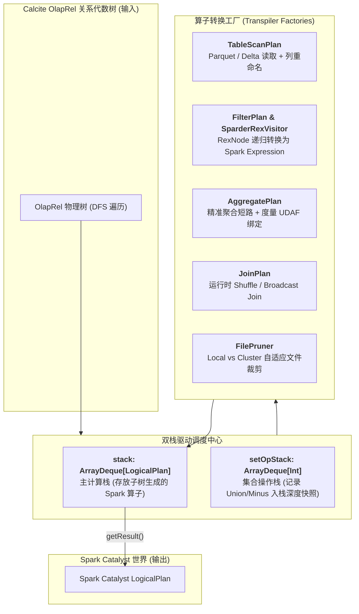
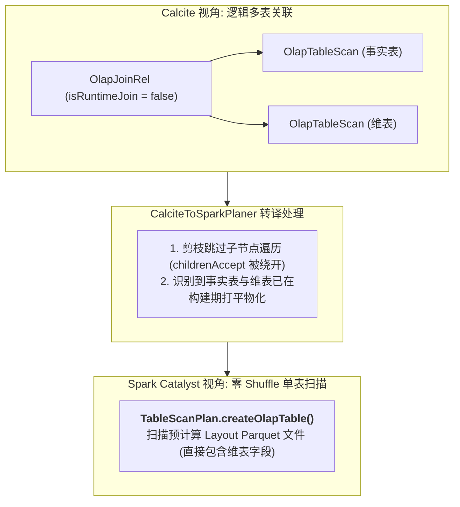
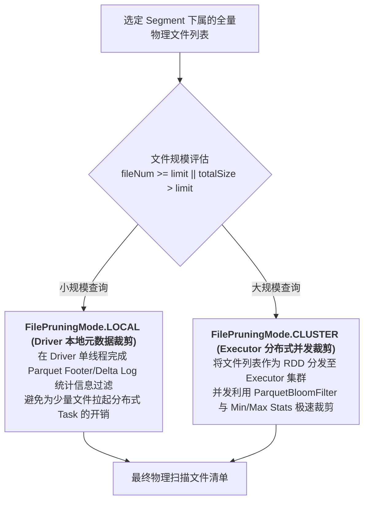

# 硬核拆解 Kylin 查询引擎 (四)：跨越代数鸿沟 —— CalciteToSparkPlaner 双栈编译与 FilePruner 深度剖析

> **作者**：Huang Sheng (mrhs121)  
> **日期**：2026-08-18  
> **分类**：`Apache Kylin` · `Apache Spark` · `Calcite` · `Catalyst` · `FilePruner` · `源码剖析`

---

## 0. 导读与核心问题

在前三篇中，我们拆解了 SQL 如何经历 Query Massage 预处理、Calcite RBO/CBO 代数优化，并在 Model Match 阶段匹配到了最优的物理 Layout（Cuboid）。

接下来，查询进入编译与物理生成层 —— **阶段五：Create Spark Plan（生成 Spark 执行计划）**。

在这一阶段，引擎必须跨越 Calcite 与 Spark 两个体系之间的代数鸿沟：
- **Calcite 体系**：基于 `RelNode`（如 `OlapTableScan`、`OlapFilterRel`、`OlapAggregateRel`）与 `RexNode`（行表达式）；
- **Spark Catalyst 体系**：基于 `LogicalPlan`（如 `UnresolvedRelation`、`Filter`、`Aggregate`）与 `Expression`。

承担这一跨引擎“编译器”重任的，是 `CalciteToSparkPlaner.scala`。同时，为了避免在大规模数据集中扫描冗余数据块，系统在此阶段注入了精细的 **FilePruner（文件裁剪）** 机制。

本文将深入源码，彻底拆解 `CalciteToSparkPlaner` 的双栈后序遍历架构、物化 Join 剪枝消除、表达式转译与 FilePruner 智能文件裁剪。

---

## 1. 架构总览：CalciteToSparkPlaner 的双栈计算模型

`CalciteToSparkPlaner` 继承了 Calcite 的 `RelVisitor`，采用了**深度优先后序遍历（Post-order Traversal）与双栈计算模型（Dual-Stack Model）**：



### 双栈设计的精妙之处
1. **主计算栈 `stack: ArrayDeque[LogicalPlan]`**：
   - 遍历子节点时，子节点生成的 Spark `LogicalPlan` 会被依次压入栈顶；
   - 当前父节点根据自身算子类型，从 `stack` 弹出对应数量的子算子（如 Filter 弹 1 个，Join 弹 2 个），组装生成新的父 `LogicalPlan` 并重新压回栈顶；
2. **集合操作栈 `setOpStack: ArrayDeque[Int]`**：
   - `UNION` 和 `MINUS` 是 N 元操作符（可包含任意多个子分支）；
   - 在进入 `OlapUnionRel` 时，`setOpStack.offerLast(stack.size())` 记录当前栈深快照；遍历完所有子节点后，通过快照差值一次性弹出该 Union 下属的全部子 `LogicalPlan`，天然支持复杂多层级嵌套集合运算。

---

## 2. 核心调度主循环与算子转译工厂

位于 `CalciteToSparkPlaner.scala:44-113` 的 `visit` 方法是整个编译器的调度引擎：

```scala
override def visit(node: RelNode, ordinal: Int, parent: RelNode): Unit = {
  // 1. 若遇到集合算子，记录当前 stack 深度快照
  if (node.isInstanceOf[OlapUnionRel] || node.isInstanceOf[OlapMinusRel]) {
    setOpStack.offerLast(stack.size())
  }

  // 2. 核心优化：若为已物化的非运行时 Join，直接跳过遍历子节点（整棵子树被剪枝消除！）
  if (!(node.isInstanceOf[OlapJoinRel] && !node.asInstanceOf[OlapJoinRel].isRuntimeJoin) &&
    !(node.isInstanceOf[OlapNonEquiJoinRel] && !node.asInstanceOf[OlapNonEquiJoinRel].isRuntimeJoin)) {
    node.childrenAccept(this) // 后序遍历递归访问子节点
  }

  // 3. 模式匹配：消费 stack 中的子 Plan，构造当前节点的 Spark LogicalPlan 并压入 stack
  stack.offerLast(node match {
    case rel: OlapTableScan       => convertTableScan(rel)
    case rel: OlapFilterRel      => logTime("filter") { FilterPlan.filter(stack.pollLast(), rel, dataContext) }
    case rel: OlapProjectRel     => logTime("project") { ProjectPlan.select(stack.pollLast(), rel, dataContext) }
    case rel: OlapAggregateRel   => logTime("agg") { AggregatePlan.agg(stack.pollLast(), rel) }
    case rel: OlapJoinRel        => convertJoinRel(rel)
    case rel: OlapNonEquiJoinRel => convertNonEquiJoinRel(rel)
    case rel: OlapSortRel        => logTime("sort") { SortPlan.sort(stack.pollLast(), rel, dataContext) }
    case rel: OlapLimitRel       => logTime("limit") { LimitPlan.limit(stack.pollLast(), rel, dataContext) }
    case rel: OlapWindowRel      => logTime("window") { WindowPlan.window(stack.pollLast(), rel, dataContext) }
    case rel: OlapUnionRel       => 
      val size = setOpStack.pollLast()
      val unionBlocks = Range(0, stack.size() - size).map(_ => stack.pollLast())
      logTime("union") { plan.UnionPlan.union(unionBlocks, rel, dataContext) }
    case rel: OlapMinusRel       => 
      val size = setOpStack.pollLast()
      logTime("minus") { plan.MinusPlan.minus(Range(0, stack.size() - size).map(_ => stack.pollLast()).reverse, rel, dataContext) }
    case rel: OlapValuesRel      => logTime("values") { ValuesPlan.values(rel) }
    case rel: OlapModelViewRel   => logTime("modelview") { stack.pollLast() }
  })
}
```

---

## 3. 物化 Join 消除与精确聚合短路

### 3.1 物化 Join 消除（Materialized Join Elimination）

这是 Kylin 在物理执行阶段实现数十倍提速的核心黑科技：



在 `CalciteToSparkPlaner.scala:125-143` 中：
```scala
private def convertJoinRel(rel: OlapJoinRel): LogicalPlan = {
  if (!rel.isRuntimeJoin) {
    // 模型内 Join: 事实表与维表早在构建期被打平成单一宽表
    val execFunc = rel.getContext.genExecFunc(rel)
    createTablePlan(rel, execFunc) // 直接生成单表扫描计划，消除多表 Join
  } else {
    // 跨模型运行时 Join: 从栈中弹出左右两路子计划，生成真正的 Spark Join
    val right = stack.pollLast()
    val left = stack.pollLast()
    plan.JoinPlan.join(Seq(left, right), rel)
  }
}
```

---

### 3.2 精确聚合短路（Exact Aggregation Shortcut）

在 `AggregatePlan.scala:59-65` 中：
```scala
if (rel.getContext != null && rel.getContext.isExactlyAggregate && !rel.getContext.isNeedToManyDerived) {
  // 精确命中 Layout 维度组合，跳过 Spark Aggregate 算子，直接转为 Project 投影！
  SparkOperation.project(projects, plan)
} else {
  // 需要做残余二次聚合，生成 Spark 原生 Aggregate 算子并绑定 UDAF
  SparkOperation.agg(groupList, aggList, plan)
}
```
若当前查询的 Group By 维度与底层物理 Layout 的维度完全一致，底层存储的数据本身就是唯一的。此时 Spark **无需在内存中构建聚合哈希表（Agg Hash Map）**，直接转为轻量级投影输出，极大节省 CPU 与内存开销。

---

## 4. FilePruner 文件裁剪机制深度剖析

在大规模分布式查询中，哪怕只扫描特定 Segment，其底层可能仍然包含数千个 Parquet / Delta 数据切片。在 `CalciteToSparkPlaner.scala:218-248` 与 `TableScanPlan.scala` 中，Kylin 设计了多层次的 **FilePruner 文件裁剪机制**：



### 4.1 自适应裁剪模式（`computeFilePruningMode`）
```scala
private def computeFilePruningMode(): PruningMode = {
  val v3FileNumLimit = config.getV3FilePruningNumLimit
  val v3FileSizeLimit = config.getV3FilePruningSizeLimit

  val isLargeScan = fileNum >= v3FileNumLimit || totalSize > v3FileSizeLimit
  if (isLargeScan) {
    // 大规模文件：下推到 Spark 集群 Executor 并行执行文件元数据裁剪 (CLUSTER 模式)
    FilePruningMode.CLUSTER
  } else {
    // 小规模文件：直接在 Driver 本地做单线程裁剪 (LOCAL 模式)，避免分布式任务启动开销
    SparderEnv.getSparkSession.sparkContext.setLocalProperty("spark.databricks.delta.stats.skipping", "false")
    FilePruningMode.LOCAL
  }
}
```

### 4.2 Parquet Bloom Filter 与列级统计信息裁剪
- 读取 Parquet 文件头部的 Min/Max 统计信息与 Bloom Filter；
- 若某文件的过滤列值区间（如 `city='Beijing'`）完全不满足查询条件，该物理文件在 I/O 阶段被直接跳过，实现真正的零 I/O 过滤。

---

## 5. 总结与下篇预告

`CalciteToSparkPlaner` 与 `FilePruner` 构成了将逻辑优化落地为高效物理执行的关键枢纽：
1. **极简双栈后序遍历**：消除了复杂的递归状态回溯，优雅支持 N 元集合操作与树形计划生成；
2. **物理剪枝与算子折叠**：通过物化 Join 消除与精确聚合短路，在生成 Spark 逻辑计划时便剔除了大量冗余计算；
3. **自适应 FilePruner**：通过 Local/Cluster 双模式文件裁剪与 BloomFilter 过滤，将物理 I/O 压降至极致。

---

> **下一篇预告**：
> 在 **《硬核拆解 Kylin 查询引擎 (五)：Sparder 运行时内核 —— 复杂度量 UDAF 与高性能执行机制》** 中，我们将深入 **阶段六：Spark Execute**：
> - `SparderEnv` 如何管理常驻 `SparkSession` 实现多租户亚秒级响应；
> - `RoaringBitmap` 精确去重与 `HLLC` 近似去重在 Spark UDAF 中的二进制合并底层实现；
> - 百分位数（`Percentile` / `T-Digest`）与 `TopN` 度量的高性能计算内幕；
> - 结果集列级动态脱敏（`QueryResultMasks`）与流式迭代输出。
