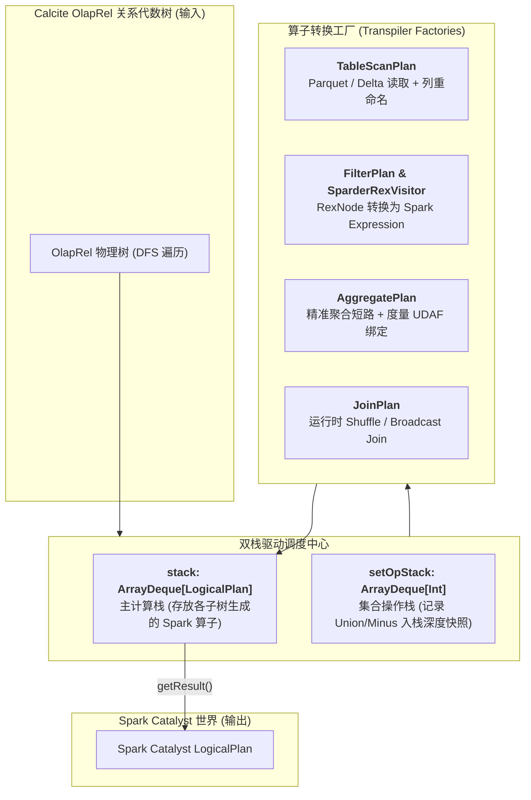
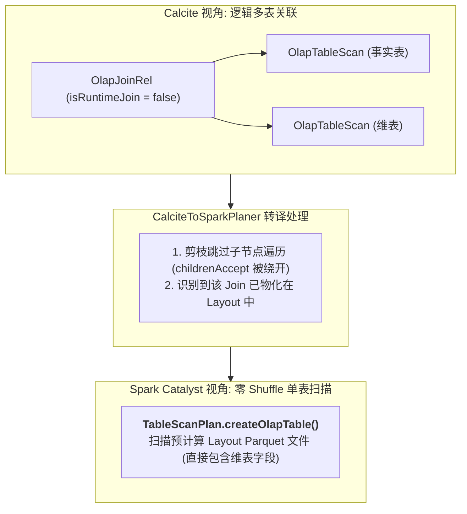

# 硬核拆解 Kylin 查询引擎 (四)：跨越代数鸿沟 —— CalciteToSparkPlaner 双栈编译与物化消除

> **作者**：Huang Sheng (mrhs121)  
> **日期**：2026-08-18  
> **分类**：`Apache Kylin` · `Apache Spark` · `Calcite` · `Catalyst` · `编译器设计` · `源码剖析`

---

## 0. 导读与背景问题

在前面几篇中，我们见证了 Calcite 如何将一条原始 SQL 解析为 `OlapRel` 物理关系代数树，并通过 `OlapContext` 匹配出了最优的物理 Layout（Cuboid）。

但至此，所有的优化仍然停留在 **Calcite 的逻辑世界** 中。要让分布式计算霸主 **Apache Spark** 真正执行这个计划，系统必须跨越一道巨大的鸿沟：
- **Calcite 体系**：基于 `RelNode`（如 `OlapTableScan`、`OlapFilterRel`、`OlapAggregateRel`）与 `RexNode`（行表达式）；
- **Spark Catalyst 体系**：基于 `LogicalPlan`（如 `UnresolvedRelation`、`Filter`、`Aggregate`）与 `Expression`。

两个世界的数据结构、类型系统和表达式语义完全不同。承担这个跨引擎“编译器/转译器”重任的，正是 [`CalciteToSparkPlaner.scala`](file:///Users/huangsheng/codes/kyligence/kylin/src/spark-project/sparder/src/main/scala/org/apache/kylin/query/runtime/CalciteToSparkPlaner.scala)。

本文将深入源码，彻底拆解 `CalciteToSparkPlaner` 的双栈后序遍历架构、物化 Join 剪枝消除、表达式转译与智能文件剪枝。

---

## 1. 架构总览：CalciteToSparkPlaner 的核心模型

`CalciteToSparkPlaner` 继承了 Calcite 的 [`RelVisitor`](file:///Users/huangsheng/codes/kyligence/kylin/src/spark-project/sparder/src/main/scala/org/apache/kylin/query/runtime/CalciteToSparkPlaner.scala#L34)，采用了**深度优先后序遍历（Post-order Traversal）与双栈计算模型（Dual-Stack Model）**：



### 双栈职责分工
1. **主计算栈 `stack: ArrayDeque[LogicalPlan]`**：
   - 遍历子节点时，子节点生成的 Spark `LogicalPlan` 会被依次压入栈顶；
   - 当前父节点根据自身算子类型，从 `stack` 弹出对应数量的子算子（如 Filter 弹 1 个，Join 弹 2 个），组装生成新的父 `LogicalPlan` 并压回栈顶。
2. **集合操作栈 `setOpStack: ArrayDeque[Int]`**：
   - `UNION` 和 `MINUS` 是 N 元操作符（可以有任意多个子分支）。
   - 在进入 `OlapUnionRel` 时，`setOpStack.offerLast(stack.size())` 记录当前栈深快照；遍历完所有子节点后，通过快照差值一次性弹出该 Union 下属的全部子 `LogicalPlan`，天然支持复杂多层级嵌套集合运算。

---

## 2. 核心调度主循环源码逐行剖析

位于 [`CalciteToSparkPlaner.scala:44-113`](file:///Users/huangsheng/codes/kyligence/kylin/src/spark-project/sparder/src/main/scala/org/apache/kylin/query/runtime/CalciteToSparkPlaner.scala#L44-L113) 的 `visit` 方法是整个编译器的调度引擎：

```scala
override def visit(node: RelNode, ordinal: Int, parent: RelNode): Unit = {
  // 1. 若遇到集合算子，记录当前 stack 深度快照
  if (node.isInstanceOf[OlapUnionRel] || node.isInstanceOf[OlapMinusRel]) {
    setOpStack.offerLast(stack.size())
  }

  // 2. 核心优化：若为已物化的非运行时 Join，直接跳过遍历子节点（整棵子树被剪枝消除！）
  if (!(node.isInstanceOf[OlapJoinRel] && !node.asInstanceOf[OlapJoinRel].isRuntimeJoin) &&
    !(node.isInstanceOf[OlapNonEquiJoinRel] && !node.asInstanceOf[OlapNonEquiJoinRel].isRuntimeJoin)) {
    node.childrenAccept(this) // 后序遍历递归访问子节点
  }

  // 3. 模式匹配：消费 stack 中的子 Plan，构造当前节点的 Spark LogicalPlan
  stack.offerLast(node match {
    case rel: OlapTableScan       => convertTableScan(rel)
    case rel: OlapFilterRel      => FilterPlan.filter(stack.pollLast(), rel, dataContext)
    case rel: OlapProjectRel     => ProjectPlan.select(stack.pollLast(), rel, dataContext)
    case rel: OlapAggregateRel   => AggregatePlan.agg(stack.pollLast(), rel)
    case rel: OlapJoinRel        => convertJoinRel(rel)
    case rel: OlapNonEquiJoinRel => convertNonEquiJoinRel(rel)
    case rel: OlapSortRel        => SortPlan.sort(stack.pollLast(), rel, dataContext)
    case rel: OlapLimitRel       => LimitPlan.limit(stack.pollLast(), rel, dataContext)
    case rel: OlapWindowRel      => WindowPlan.window(stack.pollLast(), rel, dataContext)
    case rel: OlapUnionRel       => 
      val size = setOpStack.pollLast()
      val unionBlocks = Range(0, stack.size() - size).map(_ => stack.pollLast())
      UnionPlan.union(unionBlocks, rel, dataContext)
    case rel: OlapValuesRel      => ValuesPlan.values(rel)
    case rel: OlapModelViewRel   => stack.pollLast() // 视图透明穿透
  })
}
```

---

## 3. 核心算子转译与黑科技

### 3.1 物化 Join 消除（Materialized Join Elimination）

这是 Kylin 在执行阶段实现数十倍加速的关键。



- 当 `!rel.isRuntimeJoin` 时，说明事实表与维表早已在构建期被打平成单一宽表。
- `CalciteToSparkPlaner` 在遇到该 Join 时，**直接绕过子树的递归访问**，并直接调用 `TableScanPlan.createOlapTable(rel)` 将整棵 Join 子树替换为单个读取 Layout 的单表扫描计划。
- **效果**：在 Spark 端消除了昂贵的多表 Shuffle Hash Join，只剩下本地磁盘/内存的高速列存扫描！

---

### 3.2 表达式转译器：`SparderRexVisitor`

在 [`FilterPlan.scala`](file:///Users/huangsheng/codes/kyligence/kylin/src/spark-project/sparder/src/main/scala/org/apache/kylin/query/runtime/plan/FilterPlan.scala#L32-L37) 中，Calcite 的行表达式（`RexNode`）必须翻译为 Spark Catalyst 表达式：

```scala
val visitor = new SparderRexVisitor(plan.output.map(_.name), rel.getInput.getRowType, dataContext)
val filterColumn = rel.getCondition.accept(visitor).asInstanceOf[Column]
Filter(filterColumn.expr, plan)
```

`SparderRexVisitor` 递归处理各类 Calcite 操作符映射：
- 基础比较符：`=`, `>`, `<`, `<>`, `IS NULL`, `BETWEEN`, `IN`；
- 逻辑运算符：`AND`, `OR`, `NOT`；
- 复杂函数：`CASE WHEN` 转换为 Spark `when().otherwise()` 链式调用；`CAST` 转换为 Spark `cast()` 操作；
- 动态参数替换：将 JDBC 预编译占位符（`?`）替换为 `DataContext` 中的实际常量值。

---

### 3.3 精确聚合短路（Exact Aggregation Shortcut）

在 [`AggregatePlan.scala`](file:///Users/huangsheng/codes/kyligence/kylin/src/spark-project/sparder/src/main/scala/org/apache/kylin/query/runtime/plan/AggregatePlan.scala#L59-L65) 中：

```scala
if (rel.getContext != null && rel.getContext.isExactlyAggregate && !rel.getContext.isNeedToManyDerived) {
  // 精确命中 Layout 维度组合，跳过 Spark Aggregate 算子，直接转为 Project 投影！
  SparkOperation.project(projects, plan)
} else {
  // 需要做残余二次聚合，生成 Spark 原生 Aggregate 算子并绑定 UDAF
  SparkOperation.agg(groupList, aggList, plan)
}
```

若当前查询的 Group By 维度与底层物理 Layout 的维度完全一致（如都是 `[dt, city]`），则底层存储的数据本身就是唯一的。此时 Spark **无需再在内存中维护聚合哈希表（Agg Hash Map）**，直接转为轻量级投影输出，节约大量 CPU 算力。

---

## 4. 智能文件剪枝决策：`computeFilePruningMode`

针对 Delta Lake（V3）或超大规模 Segment 文件读取，[`CalciteToSparkPlaner.scala:218-248`](file:///Users/huangsheng/codes/kyligence/kylin/src/spark-project/sparder/src/main/scala/org/apache/kylin/query/runtime/CalciteToSparkPlaner.scala#L218-L248) 设计了自适应文件剪枝策略：

```scala
private def computeFilePruningMode(): PruningMode = {
  val v3FileNumLimit = config.getV3FilePruningNumLimit
  val v3FileSizeLimit = config.getV3FilePruningSizeLimit

  val isLargeScan = fileNum >= v3FileNumLimit || totalSize > v3FileSizeLimit
  if (isLargeScan) {
    // 文件数或体积过大：下推到 Spark 集群 Executor 并行执行文件元数据裁剪 (CLUSTER 模式)
    FilePruningMode.CLUSTER
  } else {
    // 文件量较小：直接在 Driver 本地做单线程裁剪 (LOCAL 模式)，避免分布式 Task 的启动开销
    FilePruningMode.LOCAL
  }
}
```

---

## 5. 总结与下篇预告

`CalciteToSparkPlaner` 是连接 Calcite 代数世界与 Spark 计算世界的超级桥梁：
1. **极简双栈后序遍历**：消除了复杂的递归状态回溯，优雅支持 N 元集合操作；
2. **物理剪枝与算子折叠**：通过物化 Join 剪枝与精确聚合短路，在生成 Spark 逻辑计划时便剔除了大量冗余计算；
3. **全算子工厂化**：`TableScanPlan`、`AggregatePlan`、`FilterPlan` 各司其职，保证了表达式转换与文件扫描的极致性能。

---

> **下一篇预告**：
> 在 **《硬核拆解 Kylin 查询引擎 (五)：Sparder 运行时内核 —— 复杂度量 UDAF 与高性能执行机制》** 中，我们将把目光聚焦于 Spark 执行层：
> - `SparderEnv` 如何管理常驻 `SparkSession` 实现多租户亚秒级响应？
> - `RoaringBitmap` 精确去重与 `HLLC` 近似去重在 Spark UDAF 中的二进制合并实现；
> - 百分位数（`Percentile`）与 `TopN` 度量的高性能计算内幕。
