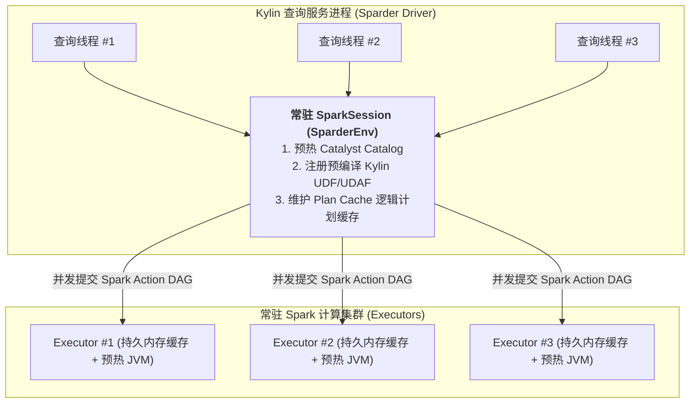
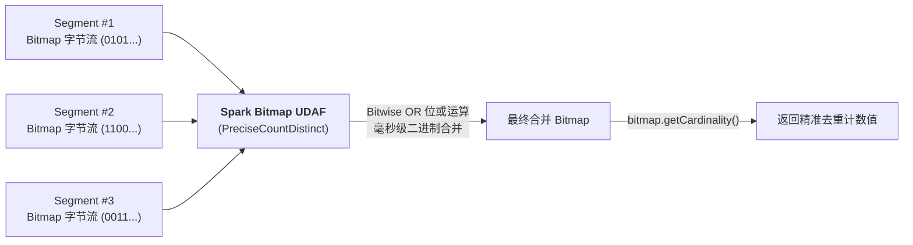
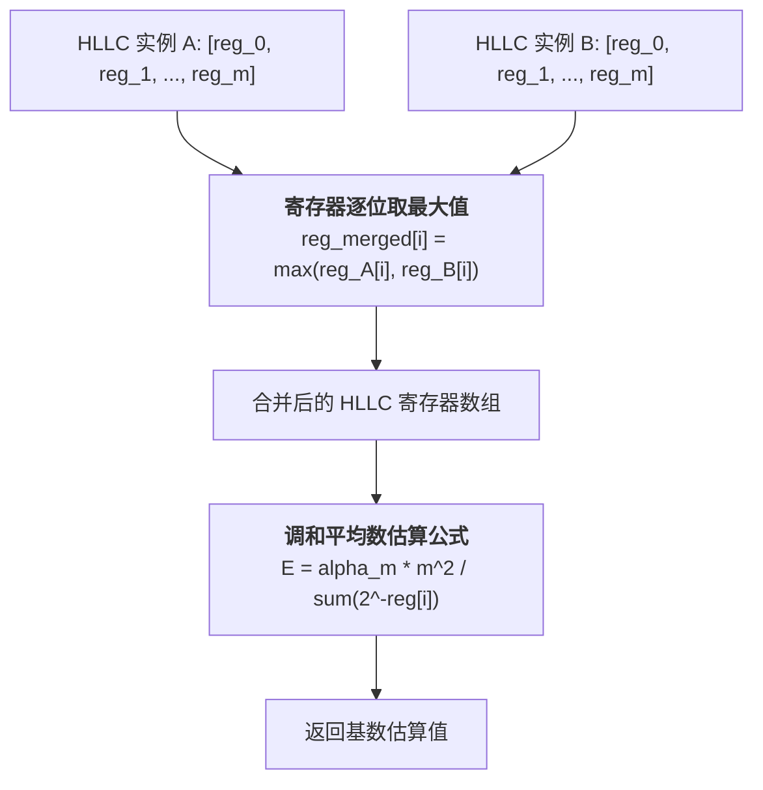
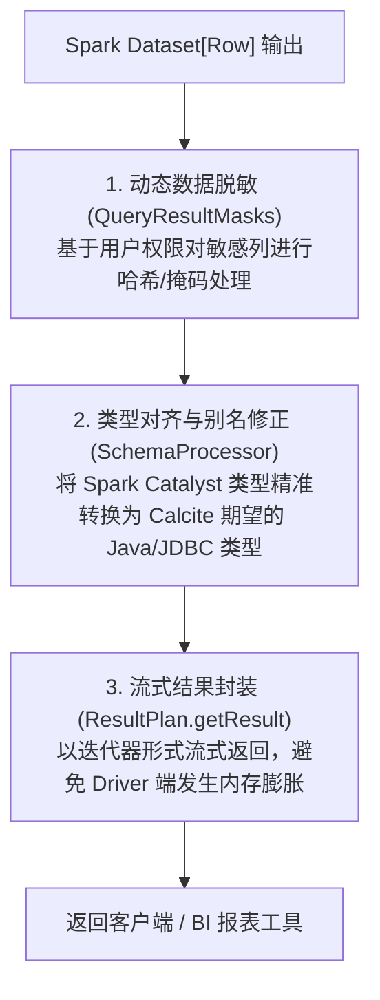

# 硬核拆解 Kylin 查询引擎 (五)：Sparder 运行时内核 —— 复杂度量 UDAF 与高性能执行机制

> **作者**：Huang Sheng (mrhs121)  
> **日期**：2026-08-18  
> **分类**：`Apache Kylin` · `Apache Spark` · `UDAF` · `RoaringBitmap` · `HLLC` · `源码剖析`

---

## 0. 导读与核心问题

在上一篇 [《硬核拆解 Kylin 查询引擎 (四)：跨越代数鸿沟 —— CalciteToSparkPlaner 双栈编译与物化消除》](2026-08-18-kylin-query-engine-04-calcite-to-spark-planer.md) 中，我们拆解了 Calcite 关系代数计划如何被转译为 Spark Catalyst `LogicalPlan`。

计划转译完成后，查询进入了最终的物理执行阶段 —— **Sparder（Spark on Kylin Engine）**。

在海量 OLAP 场景中，最耗费算力的是**复杂度量（Complex Measures）的高性能二次聚合**：
1. **千亿级精确去重（Exact Distinct Count）**：普通 SQL 引擎在千亿数据集上执行 `COUNT(DISTINCT user_id)` 会引发剧烈的全局 Shuffle 和内存暴涨，Kylin 如何利用 **RoaringBitmap 二进制序列化与位运算** 实现秒级去重？
2. **超大规模近似去重（Approximate Distinct Count）**：如何利用 **HyperLogLog (HLLC)** 寄存器合并，在固定极小内存开销下保障 99%+ 的精度？
3. **百分位数（Percentile）与 TopN**：如何结合 **T-Digest / Space-Saving 算法** 在分布式集群上高效估算分位数？
4. **留存分析（Retention Analysis）**：如何利用 `INTERSECT_COUNT` 在一个计算步骤中完成多周期跨组留存率计算？
5. **SparkSession 常驻与多租户并发**：如何避免 Spark 频繁冷启动，实现毫秒级响应？

本文将深入 Sparder 执行层源码，全面解密 Kylin 复杂度量 UDAF、数据安全脱敏与流式结果输出。

---

## 1. 运行时中枢：SparderEnv 与常驻 SparkSession

在传统离线批处理中，每次提交 Spark 任务都需要向 YARN/K8s 申请资源启动 Application。对于在线交互式 OLAP 查询，**冷启动延迟（秒级到十秒级）是不可接受的**。

Sparder 采用了 **常驻 SparkSession + 弹性常驻集群（Permanent Spark Context）** 架构（位于 [`SparderEnv.scala`](file:///Users/huangsheng/codes/kyligence/kylin/src/spark-project/sparder/src/main/scala/org/apache/spark/sql/SparderEnv.scala)）：



### 关键设计细节
1. **单例初始化与预热**：`SparderEnv.getSparkSession` 维护单例，在服务拉起阶段完成 Spark Driver 预热与基础表元数据载入；
2. **内置 UDF/UDAF 预注册**：在初始化时将 Kylin 自研的位图聚合函数（`bit_or_bitmap`、`intersect_count`）、HLLC 聚合函数、分位数计算函数注入 Spark Function Registry（通过 [`KapFunctions.scala`](file:///Users/huangsheng/codes/kyligence/kylin/src/spark-project/sparder/src/main/scala/org/apache/spark/sql/KapFunctions.scala)）；
3. **线程级上下文隔离**：通过 `SparkContext.setLocalProperty` 实现查询级别的并发线程属性隔离（如配额控制、任务取消、审计日志追踪）。

---

## 2. 复杂度量与 Spark UDAF 底层实现剖析

在 [`KapFunctions.scala`](file:///Users/huangsheng/codes/kyligence/kylin/src/spark-project/sparder/src/main/scala/org/apache/spark/sql/KapFunctions.scala) 中，Kylin 定义了一整套面向 OLAP 预计算场景的原生 Catalyst 聚合表达式（`AggregateFunction`）：

```scala
object KapFunctions {
  // 精确去重 (RoaringBitmap)
  def precise_count_distinct(column: Column): Column =
    Column(PreciseCountDistinct(column.expr, LongType).toAggregateExpression())

  // 精确去重 Base64 编码度量构建
  def precise_bitmap_build(column: Column): Column =
    Column(PreciseBitmapBuildBase64WithIndex(column.expr, StringType).toAggregateExpression())

  // 近似去重 (HLLC)
  def approx_count_distinct(column: Column, precision: Int): Column =
    Column(ApproxCountDistinct(column.expr, precision).toAggregateExpression())

  // 百分位数 (Percentile)
  def k_percentile(head: Column, column: Column, precision: Int): Column =
    Column(Percentile(head.expr, precision, Some(column.expr), DoubleType).toAggregateExpression())

  // 留存分析交集度量 (INTERSECT_COUNT)
  def intersect_count(separator: String, upperBound: Int, columns: Column*): Column = {
    val expressions = columns.map(_.expr)
    Column(IntersectCount(expressions.head, expressions(1), expressions(2),
      k_lit(IntersectCount.RAW_STRING).expr, LongType, separator, upperBound).toAggregateExpression())
  }
}
```

---

### 2.1 精确去重：RoaringBitmap 二进制聚合与留存分析

#### 1. 全局字典编码与位图物化
在构建阶段，Kylin 通过全局字典（Global Dictionary）将离散的 String/UUID 映射为连续递增的整型值（Integer/Long）。构建节点将属于同一分组的整型 ID 插入 `RoaringBitmap`，并将压缩后的二进制字节流（`byte[]`）持久化写入 Parquet 文件。

#### 2. 二进制位或聚合（`PreciseCountDistinct`）
在查询期，Spark 扫描到的每一行数据不是原始明细，而是一个个独立的预计算 Bitmap：



在 UDAF 内部：
- `update(buffer, input)`：将输入的二进制流反序列化为 `RoaringBitmap`，并调用 `bufferBitmap.or(inputBitmap)` 执行位或合并；
- `merge(buffer1, buffer2)`：在 Shuffle 分区合并阶段，直接对分区的中间位图执行 `buffer1.or(buffer2)`；
- `eval(buffer)`：调用 `bufferBitmap.getCardinality()`，纳秒级返回去重后的计数值。

#### 3. 留存分析利器：`INTERSECT_COUNT`
在漏斗转化与留存分析中，用户常需要计算“第 1 天活跃且在第 7 天依然活跃”的用户数。
传统 SQL 需要进行昂贵的多表 Self-Join。Kylin 的 `IntersectCount` UDAF 直接在单次遍历中对多个时间分组的 Bitmap 执行 **Bitwise AND（按位与）** 运算：
$$\text{Retention} = |\text{Bitmap}_{\text{Day1}} \cap \text{Bitmap}_{\text{Day7}}|$$
无需任何网络 Shuffle，单机毫秒级产出留存矩阵。

---

### 2.2 近似去重：HyperLogLog (HLLC) 寄存器合并

针对超大规模数据且允许微小误差（1%~2%）的去重场景，Kylin 提供了 `ApproxCountDistinct` UDAF：



1. **固定内存消耗**：每个 HLLC 实例通常维护 $2^{10} \sim 2^{16}$ 个 8-bit 寄存器（仅占数 KB 内存）；
2. **极速合并**：Spark 执行层仅需对寄存器数组执行 SIMD 友好的 $\max()$ 操作；
3. **偏差修正**：结合小基数下的线性计数（Linear Counting）与大基数下的偏差修正表，在极低算力消耗下保障了工业级精度。

---

### 2.3 精确与近似百分位数：Percentile & T-Digest

在业务监控中，计算 $P_{50}, P_{90}, P_{99}$ 分位数极为常见：
- **`PercentileCounter`（精确/紧凑直方图）**：针对离散整数或小范围浮点数，维护动态压缩的桶计数器（Bucket Counter），聚合时直接累加直方图桶；
- **`T-Digest` / `ApproximatePercentile`**：针对超大规模连续浮点分布，采用质心聚类算法（Centroid Clustering）。在分布式聚合时，各分区仅需合并其质心列表，内存开销恒定且尾部分位数（$P_{99.9}$）精度极高。

---

### 2.4 TopN 度量：Space-Saving 流式重排

当用户查询高频排行榜（如 `GROUP BY seller ORDER BY gmv DESC LIMIT 100`）：
- 构建期为每个维度切片预先维护容量为 $K$ 的 TopN 堆（基于 Space-Saving 频次估计或优先队列）；
- 查询期将多个 Segment 的 TopN 堆进行流式归并排序，直接截取全局 TopN，避免了查询阶段对百亿级明细做全局全量排序。

---

## 3. 结果集安全脱敏与流式输出

当 Spark 物理计划执行完成并产出 `Dataset[Row]` 后，查询并没有直接结束，还需要经过 [`SparkEngine.java`](file:///Users/huangsheng/codes/kyligence/kylin/src/spark-project/sparder/src/main/java/org/apache/kylin/query/runtime/SparkEngine.java) 与 [`ResultPlan.scala`](file:///Users/huangsheng/codes/kyligence/kylin/src/spark-project/sparder/src/main/scala/org/apache/kylin/query/runtime/plan/ResultPlan.scala) 的后置处理：



### 3.1 动态列级数据脱敏（`QueryResultMasks`）
在 [`SparkEngine.java:71`](file:///Users/huangsheng/codes/kyligence/kylin/src/spark-project/sparder/src/main/java/org/apache/kylin/query/runtime/SparkEngine.java#L71) 中：
```java
Dataset<Row> sparkPlan = QueryResultMasks.maskResult(toSparkPlan(dataContext, relNode));
```
`QueryResultMasks` 拦截当前登录用户的身份信息（User / Group / Role），若用户对某字段仅有脱敏权限，系统在 Spark 计划最上层动态注入掩码函数（如 `mask_hash()`, `mask_show_first_4()`），在数据离开 Driver 内存前完成脱敏。

### 3.2 模式对齐与流式输出（`ResultPlan`）
在 [`ResultPlan.scala`](file:///Users/huangsheng/codes/kyligence/kylin/src/spark-project/sparder/src/main/scala/org/apache/kylin/query/runtime/plan/ResultPlan.scala) 中：
- **别名与类型还原**：由于在编译阶段字段曾被重写为 Layout 内部的物理列 ID，此处通过 `SchemaProcessor` 将 Catalyst 的内部行（InternalRow）类型对齐回原始 Calcite `RelDataType` 对应的标准 JDBC 类型；
- **流式迭代（Streaming Iterator）**：结果集以分批迭代器形式返回给上层 HTTP/Avatica 服务，避免一次性在 Driver 端收集海量行引发 OOM。

---

## 4. 总结与下篇预告

通过深入 Sparder 运行时内核，我们领略了 Kylin 在执行层的深厚功底：
1. **常驻中枢**：`SparderEnv` 常驻架构消除了 Spark 容器冷启动瓶颈；
2. **位运算与草图算法**：RoaringBitmap、HLLC、T-Digest 等数学与数据结构黑科技，将复杂度量计算的耗时降至亚秒级；
3. **安全与流式输出**：完善的数据脱敏与类型流式转换保障了企业级安全与高稳定性。

---

> **下一篇预告**：
> 在专栏的收官之作 **《硬核拆解 Kylin 查询引擎 (六)：全场景覆盖 —— 动态查询下推 (Pushdown)、流批一体与高并发调优》** 中，我们将探讨：
> - 当查询无法命中任何预计算模型时的**动态下推兜底（Pushdown Engine）**机制与并发限流保护；
> - 批流一体（Batch + Streaming）混合段在 `TableScanPlan` 中的无缝合并；
> - 生产环境高并发、低延迟的核心调优宝典。
