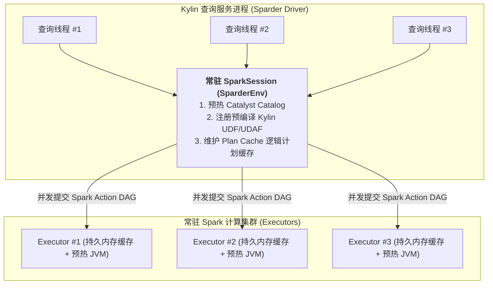
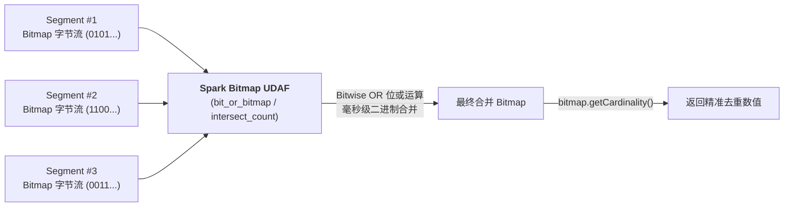
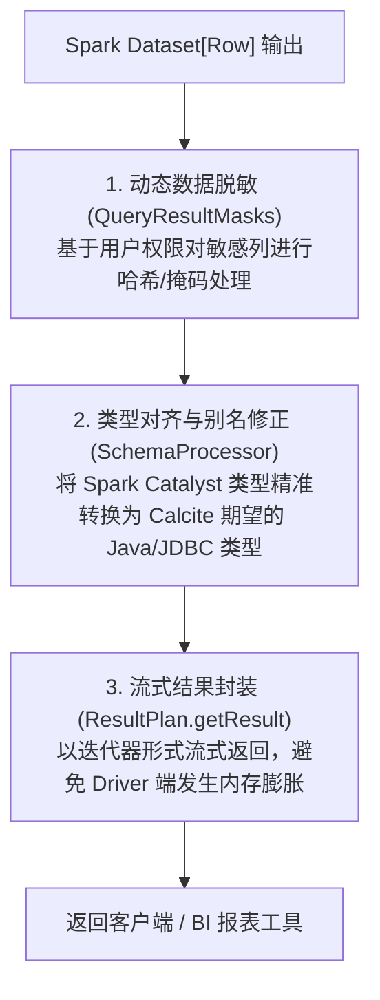

# 硬核拆解 Kylin 查询引擎 (五)：Sparder 运行时内核 —— 复杂度量 UDAF 与高性能执行机制

> **作者**：Huang Sheng (mrhs121)  
> **日期**：2026-08-18  
> **分类**：`Apache Kylin` · `Apache Spark` · `UDAF` · `RoaringBitmap` · `HLLC` · `源码剖析`

---

## 0. 导读与背景问题

在上一篇 [《硬核拆解 Kylin 查询引擎 (四)：跨越代数鸿沟 —— CalciteToSparkPlaner 双栈编译与物化消除》](2026-08-18-kylin-query-engine-04-calcite-to-spark-planer.md) 中，我们拆解了 Calcite 关系代数计划如何被转译为 Spark Catalyst `LogicalPlan`。

计划转译完成后，查询进入了最终的物理执行阶段 —— **Sparder（Spark on Kylin Engine）**。

在海量 OLAP 场景中，最耗费算力的是**复杂度量（Complex Measures）的高性能二次聚合**，例如：
1. **千亿级精确去重（Exact Distinct Count）**：普通 SQL 引擎在千亿数据集上执行 `COUNT(DISTINCT user_id)` 会引发剧烈的全局 Shuffle 和内存暴涨，Kylin 如何利用 **RoaringBitmap 二进制序列化与位运算** 实现秒级去重？
2. **超大规模近似去重（Approximate Distinct Count）**：如何利用 **HyperLogLog (HLLC)** 寄存器合并，在固定极小内存开销下保障 99%+ 的精度？
3. **百分位数（Percentile）与 TopN**：如何结合 **T-Digest / Space-Saving 算法** 在分布式集群上高效估算分位数？
4. **SparkSession 常驻与多租户并发**：如何避免 Spark 频繁冷启动，实现毫秒级响应？

本文将深入 Sparder 执行层源码，全面解密 Kylin 复杂度量 UDAF、数据安全脱敏与流式结果输出。

---

## 1. 运行时中枢：SparderEnv 与常驻 SparkSession

在传统离线批处理中，每次提交 Spark 任务都需要向 YARN/K8s 申请资源启动 Application。对于在线交互式 OLAP 查询，**冷启动延迟（秒级到十秒级）是不可接受的**。

Sparder 采用了 **常驻 SparkSession + 弹性常驻集群（Permanent Spark Context）** 架构（位于 [`SparderEnv.scala`](file:///Users/huangsheng/codes/kyligence/kylin/src/spark-project/sparder/src/main/scala/org/apache/spark/sql/SparderEnv.scala)）：

### 关键特性
1. **预热与常驻执行器**：SparkSession 在 Kylin 启动时完成初始化，预先向集群申请 Executor 算力槽位，消除容器拉取开销；
2. **内置 UDF/UDAF 预注册**：在 `SparderEnv.init()` 中自动注册 RoaringBitmap、HLLC、Percentile、字典编码等核心二进制操作函数；
3. **线程级上下文隔离**：通过 `SparkContext.setLocalProperty` 实现查询级别的并发线程属性隔离（如配额控制、任务取消、审计日志追踪）。

---

## 2. 核心黑科技：复杂度量与 Spark UDAF 实现

### 2.1 精确去重：RoaringBitmap 二进制聚合

在构建阶段，Kylin 会通过全局字典（Global Dictionary）将离散的字符串 ID 编码为连续的整型（Integer/Long），并将维度切片内的 ID 聚合存储为 **RoaringBitmap 压缩二进制字节流**。

在查询执行阶段（[`AggregatePlan.scala`](file:///Users/huangsheng/codes/kyligence/kylin/src/spark-project/sparder/src/main/scala/org/apache/kylin/query/runtime/plan/AggregatePlan.scala) 与 [`KapFunctions.scala`](file:///Users/huangsheng/codes/kyligence/kylin/src/spark-project/sparder/src/main/scala/org/apache/spark/sql/KapFunctions.scala)）：

- **极速位运算**：多个 Segment 或多分组之间的去重合并，在底层被转化为极速的 **Bitwise OR（按位或）** 运算；
- **交集过滤（`INTERSECT_COUNT`）**：针对留存分析、漏斗转化等高级场景，底层直接调用 Bitmap 的 **Bitwise AND（按位与）** 运算，极大加速留存率计算。

---

### 2.2 近似去重：HyperLogLog (HLLC) 寄存器合并

针对超大规模数据且允许微小误差（1%~2%）的去重场景，Kylin 支持 `HLLC` 度量：
- 构建期预先将哈希特征值分配到 $2^m$ 个分桶寄存器中（每个桶通常仅占 6~8 bits）；
- 查询二次聚合时，Spark 仅需对各个 HLLC 实例对应分桶的寄存器值取最大值（$\max(reg_A[i], reg_B[i])$）；
- 最终通过调和平均数公式还原基数估计值，**无论数据量是百万还是百亿，单次聚合仅消耗数 KB 内存**！

---

### 2.3 精确与近似百分位数：Percentile & T-Digest

在电商延迟监控、金融风控等场景中，`PERCENTILE(col, p)` 需求极高：
- **`PercentileCounter`**：针对小中规模数据，采用基于紧凑直方图（Compact Histogram）的桶计数合并算法；
- **`T-Digest / ApproximatePercentile`**：针对超大规模连续浮点数分布，采用分层聚类质心（Centroid Clustering）算法，在分布式并行聚合阶段动态合并质心集合，以极低的内存实现 $P_{50}, P_{90}, P_{99}, P_{99.9}$ 的高保真估算。

---

### 2.4 TopN 度量：Space-Saving 流式重排

如果用户频繁查询 `GROUP BY category ORDER BY sales DESC LIMIT 100`：
- 构建期为每个分组预先维护容量为 $K$ 的 TopN 堆（基于 Space-Saving 频次估计或优先队列）；
- 查询期将多个 Segment 的 TopN 堆进行流式合并与剪枝，直接输出最终 Top 榜单，完全避免在查询时对全量明细数据做全局排序。

---

## 3. 结果集安全脱敏与流式输出

当 Spark 物理计划执行完成并产出 `Dataset[Row]` 后，查询并没有直接结束，还需要经过 [`SparkEngine.java`](file:///Users/huangsheng/codes/kyligence/kylin/src/spark-project/sparder/src/main/java/org/apache/kylin/query/runtime/SparkEngine.java) 与 [`ResultPlan.scala`](file:///Users/huangsheng/codes/kyligence/kylin/src/spark-project/sparder/src/main/scala/org/apache/kylin/query/runtime/plan/ResultPlan.scala) 的后置处理：

1. **动态数据脱敏（`QueryResultMasks`）**：在 Driver 端拦截 DataFrame，结合当前登录用户的 RBAC / 列级权限策略，对敏感列（如手机号、身份证、交易金额）进行实时哈希或掩码打码；
2. **类型对齐与别名还原**：由于在编译阶段字段曾被重写为 Layout 物理 ID，此处需要根据原始 Calcite `RelDataType` 还原为用户最初请求的逻辑列名与标准 JDBC 数据类型；
3. **流式迭代返回**：结果集以分页流式迭代器（Iterator）返回给上层 HTTP/Avatica 服务，防止查询结果过大导致 Driver 堆内存 OOM。

---

## 4. 总结与下篇预告

通过深入 Sparder 运行时内核，我们领略了 Kylin 在执行层的深厚功底：
1. **常驻中枢**：`SparderEnv` 常驻架构消除了 Spark 容器冷启动瓶颈；
2. **位运算与草图算法**：RoaringBitmap、HLLC、T-Digest 等数学与数据结构黑科技，将复杂度量计算的耗时降至亚秒级；
3. **安全与流式输出**：完善的数据脱敏与类型流式转换保障了企业级安全与高稳定性。

---

> **下一篇预告**：
> 在专栏的收官之作 **《硬核拆解 Kylin 查询引擎 (六)：全场景覆盖 —— 动态查询下推 (Pushdown)、流批一体与高并发调优》** 中，我们将探讨：
> - 当查询无法命中任何预计算模型时的**动态下推兜底（Pushdown Engine）**机制；
> - 批流一体（Batch + Streaming）混合段在 `TableScanPlan` 中的无缝合并；
> - 生产环境高并发、低延迟的核心调优宝典。
