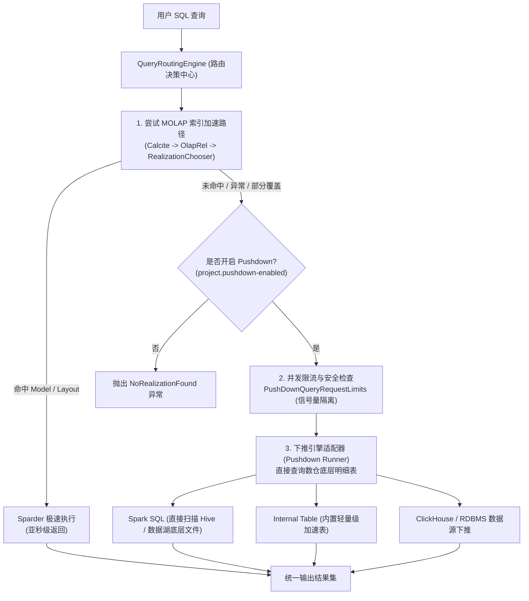
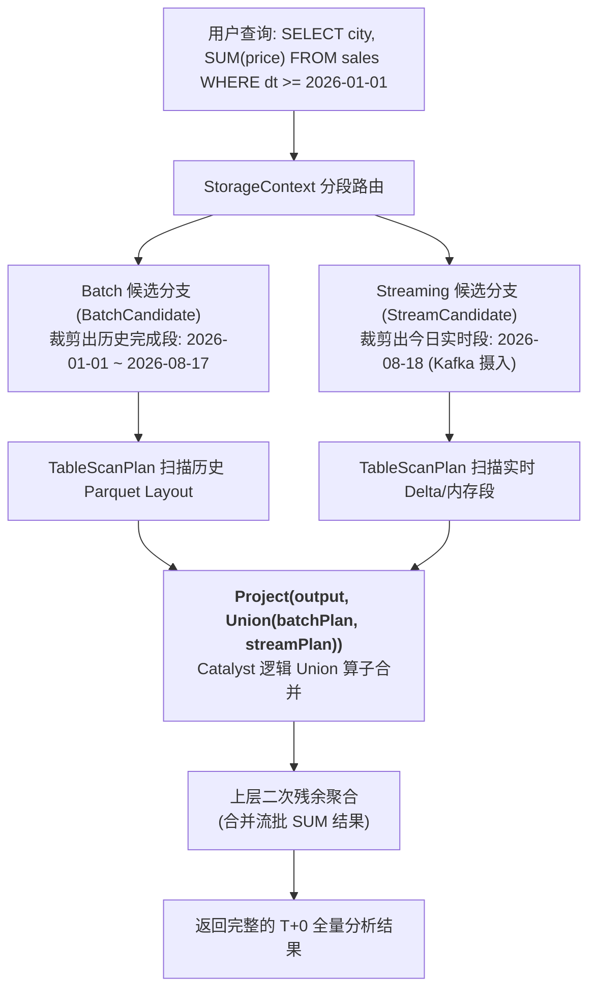
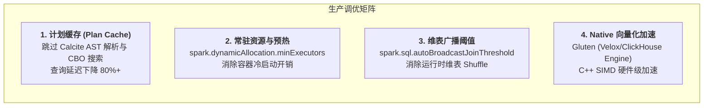
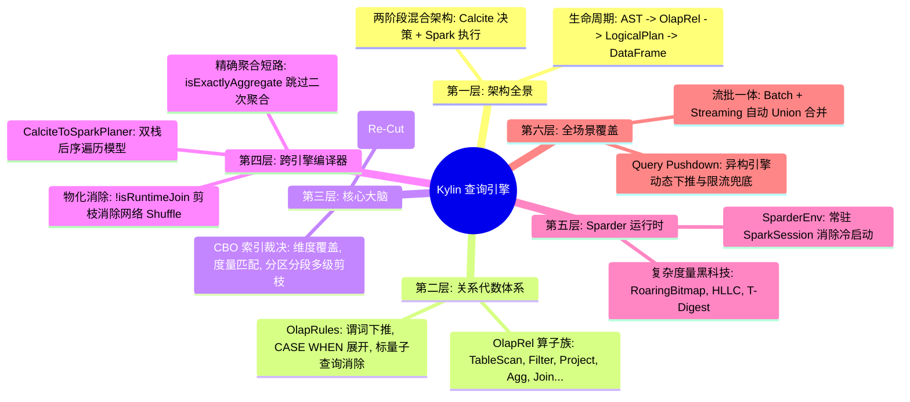

# 硬核拆解 Kylin 查询引擎 (六)：全场景覆盖 —— 动态查询下推 (Pushdown)、流批一体与高并发调优

> **作者**：Huang Sheng (mrhs121)  
> **日期**：2026-08-18  
> **分类**：`Apache Kylin` · `Apache Spark` · `查询下推` · `流批一体` · `生产调优` · `源码剖析`

---

## 0. 专栏收官寄语

在前五篇中，我们完整穿越了 Apache Kylin 查询引擎的技术腹地：
- [第 1 篇：全生命周期总览](2026-08-18-kylin-query-engine-01-overview.md)：基础校验、Query Massage 与全生命周期六阶段流转；
- [第 2 篇：OlapRel 算子族与 RBO/CBO](2026-08-18-kylin-query-engine-02-olap-rel-and-rules.md)：`OlapRel.CONVENTION` 规约机制、VolcanoPlanner CBO 与 HepPlanner RBO 优化；
- [第 3 篇：Model Match 与多级动态剪枝](2026-08-18-kylin-query-engine-03-olap-context-and-cbo.md)：OlapContext 贪心首切与回退重切、Segment / Partition 动态多级剪枝；
- [第 4 篇：CalciteToSparkPlaner 与 FilePruner](2026-08-18-kylin-query-engine-04-calcite-to-spark-planer.md)：双栈后序遍历编译器、物化 Join 剪枝消除与 Local/Cluster FilePruner；
- [第 5 篇：Sparder 运行时与复杂度量 UDAF](2026-08-18-kylin-query-engine-05-sparder-runtime-and-udaf.md)：常驻 SparkSession、RoaringBitmap/HLLC/TopN 二进制位运算与数据安全脱敏。

作为专栏的收官之作，本文将探讨 Kylin 查询引擎在**企业级生产环境中的全场景扩展能力**：
1. 当查询**无法命中任何预计算模型**时，系统如何通过 **动态查询下推（Query Pushdown）** 实现 100% SQL 语法覆盖与柔性兜底？
2. 面对实时分析诉求，Kylin 如何在查询层实现 **历史批段（Batch）与实时流段（Streaming）的流批一体无缝联合查询**？
3. 支撑超高并发与毫秒级延迟的 **生产调优实战宝典**。

---

## 1. 柔性兜底：智能查询下推（Query Pushdown）

### 1.1 为什么需要查询下推？
MOLAP 预计算模型无法提前覆盖用户的所有即席探索（Ad-hoc）需求。如果某条查询使用了未建模的维度列、或者模型尚未构建完成，如果直接给用户抛出 `NoRealizationFoundException`，会严重破坏 BI 报表的用户体验。

为此，Kylin 设计了 **智能查询下推机制（Query Pushdown）**（位于 `QueryRoutingEngine.java` 与 `PushDownUtil.java`）：



---

### 1.2 下推引擎的核心设计与并发熔断保护

位于 `QueryRoutingEngine.java:257-333` 的下推调度逻辑：

```java
private QueryResult pushDownQuery(SQLException sqlException, QueryParams queryParams) {
    QueryContext.current().getQueryTagInfo().setPushdown(true);
    // 1. 信号量限流保护：防止并发下推大查询把底层集群打垮
    Semaphore semaphore = PushDownQueryRequestLimits.getSingletonInstance();
    if (!semaphore.tryAcquire()) {
        throw new BusyQueryException("Query rejected. Caused by PushDown query server is too busy.");
    }
    try {
        // 2. 调度具体的下推执行器（如 Spark SQL、Hive、ClickHouse）
        PushdownResult result = PushDownUtil.tryIterQuery(queryParams);
        return new QueryResult(result.getRows(), result.getRows().size(), result.getColumnMetas());
    } finally {
        semaphore.release();
    }
}
```

1. **并发限流（`PushDownQueryRequestLimits`）**：
   - 下推查询需要全量扫描底层数据湖明细，计算开销极大；
   - 系统通过 `Semaphore` 控制全局并发下推任务数（由 `kylin.query.pushdown.max-concurrent-queries` 配置控制），超出上限时快速拒绝，保护集群资源；
2. **增强聚合下推（`tryEnhancedAggPushDown`）**：
   - 在 `QueryExec.java:447-485` 中，当事实表已命中 Layout，但关联的某张维表尚未打平时，系统自动触发 `AggPushDownRules`，将聚合先下推到事实表 Layout 执行，再与维表进行下推关联，兼顾部分加速与灵活性。

---

## 1.5 实战附录：查询未命中模型（掉 Pushdown）的排查清单

生产上最高频的疑问是"这条 SQL 为什么没走 Cube"。掉入 Pushdown 的原因可以按模型匹配的三级流程逐项排除：

### 第一级：Join 拓扑不匹配

| 症状 | 根因 | 处理 |
| :--- | :--- | :--- |
| 查询 INNER JOIN，模型 LEFT JOIN（或反之）| Join 类型严格比对失败 | 开启 `kylin.query.join-match-optimization-enabled`，利用 LeftOrInner 归一化兼容两者 |
| 查询只用了模型部分维表，仍不命中 | 模型中未引用的维表是 INNER JOIN（会改变事实表行数，不能忽略）| 将纯轻量维表改为 LEFT JOIN 建模；或开启 partial inner join match 配置（需保证 FK 完整性）|
| ON 条件列一致但仍失配 | 两端字段类型不一致产生了隐式 CAST | 检查 `OlapEquivJoinConditionFixRule` 是否覆盖该类型对；从源头对齐 FK/PK 类型 |
| 查询多了一张模型外的表 | Context 切分后该子树无模型可路由 | 为该业务域补建模型，或接受该 Context 走 Pushdown |

### 第二级：维度 / 度量能力不足

| 症状 | 根因 | 处理 |
| :--- | :--- | :--- |
| GROUP BY / WHERE 用了未建模的列 | $D_{query} \not\subseteq D_{layout}$ 且无法派生 | 把该列加入聚合组，或声明为派生维度（低基数过滤列适用）|
| `SUM(price * qty)` 不命中 | 表达式与预计算度量不同构，且重写规则未覆盖 | 建计算列（Computed Column）物化该表达式，再定义 SUM 度量 |
| `COUNT(DISTINCT x)` 不命中 | 模型只建了近似去重（HLLC），查询要求精确（或反之）| 按需求补建 Bitmap 精确去重度量 |
| 只查明细（`SELECT *`）不命中 | 只建了聚合索引，没有 Table Index | 补建明细索引，或接受 Pushdown |

### 第三级：物理数据不可用

| 症状 | 根因 | 处理 |
| :--- | :--- | :--- |
| 时间范围能匹配，但部分时段掉下推 | 该时段 Segment 未构建（存在空洞）| 补构建缺失 Segment；确认自动合并/构建调度正常 |
| 新加的索引对历史查询不生效 | 历史 Segment 尚未回刷新索引，`VacantIndexPruningRule` 剔除后无可用 Layout | 对历史 Segment 执行索引补建（Index Refresh）|

### 排查工具链

1. **Query History**：Web UI 每条查询记录了命中的 Model/Index ID 或 Pushdown 标记，是第一入口；
2. **日志检索**：按 Query ID 在 `kylin.log` 中检索，`RealizationChooser` 会打出每个候选模型被淘汰的具体原因（`Exclude this model because ...`）；
3. **模型试算**：新版 Web UI 的 SQL 建模/试算入口可以直接输入 SQL 查看可命中的模型与缺失能力提示，适合建模阶段前置验证。

> 心法：**Join 图 → 维度/度量 → Segment 物理可用性**，按这个顺序排查，90% 的"为什么没命中"三步内可定位。

---

在实时 OLAP 场景中，数据通常分为两部分：
- **历史数据（Batch Segments）**：T-1 日及以前的数据，在构建期已固化为 Parquet / Delta 格式的聚合 Layout；
- **实时数据（Streaming Segments）**：当天通过 Kafka 流式消费摄入的微批（Micro-batch）数据。

在查询时，用户只需要编写一条标准 SQL（如 `WHERE part_dt >= '2026-01-01'`），Kylin 的 `TableScanPlan.scala:62-89` 会自动执行 **流批混合段透明 Union**：



```scala
// TableScanPlan.scala:62-89 核心流批合并代码
val plans = realizations.map(_.asInstanceOf[NDataflow]).map(dataflow => {
  if (dataflow.isStreaming) {
    tableScan(rel, dataflow, olapContext, session, streamSeg, storage.getStreamCandidate)
  } else {
    tableScan(rel, dataflow, olapContext, session, batchSeg, storage.getBatchCandidate)
  }
})

// 若同时存在历史批段与实时流段，以 Catalyst Union 算子封装合并
if (plans.size == 1) plans.head else Project(plans.head.output, Union(plans))
```
用户无需关心底层数据是存储在历史冷存储还是实时热存储中，查询引擎在物理计划生成期完成了自动拆分、裁剪与 Union 合并。

---

## 3. 企业级生产环境调优宝典

在高并发、低延迟的生产场景中，推荐以下核心调优策略：



### 关键配置调优清单

| 调优维度 | 核心配置参数 | 生产推荐值与调优原理 |
| :--- | :--- | :--- |
| **计划缓存 (Plan Cache)** | `kylin.query.plan-cache-enabled` | 建议设为 `true`。对于 BI 报表看板等重复高频查询，跳过 Calcite 的 AST 解析与 CBO 规则搜索，直接复用已生成的 Spark `LogicalPlan`，将解析延迟降低 80%+。 |
| **执行线程池并发度** | `kylin.engine.segment-exec-max-threads` | 建议设为 `100~200`。控制 SegmentExec 内部线程并发上限，防止过多线程导致 Driver 端线程栈或 GC 开销过高。 |
| **Spark 动态资源分配** | `spark.dynamicAllocation.enabled`<br/>`spark.dynamicAllocation.minExecutors` | 启用动态伸缩，并设置合理的 `minExecutors`（如 4~8 个常驻 Executor），在低并发时保证秒级响应，高并发时自动弹性扩容。 |
| **向量化与 Native 加速** | `kylin.query.engine.gluten.enabled` | 在支持的硬件环境下可开启 Gluten (Velox / ClickHouse Native Engine) 插件，利用 C++ 向量化执行器替换 JVM 原生执行，大幅加速 Parquet 扫描与 Bitwise OR 运算。 |
| **广播维表阈值** | `spark.sql.autoBroadcastJoinThreshold` | 针对运行时 Join（Runtime Join），适当增大广播阈值（如 `50MB~100MB`），促使 Spark 将未打平的小维表自动广播，消除 Shuffle。 |

---

## 4. 全专栏知识体系大结网

历经六篇文章的深度拆解，我们完整绘制了 Apache Kylin 查询引擎的技术全貌：



### 结语
Apache Kylin 查询引擎的精妙之处，在于它既没有重复造“分布式执行器”的轮子，也没有停留在“纯关系型优化器”的传统范畴，而是**以 Calcite 的代数表达力为脑、以 Spark 的分布式吞吐力为身、以预计算 MOLAP 理论为魂**，构建了一座现代高性能数据仓库的坚实灯塔。

希望本专栏能够帮助大家在深入理解 OLAP 内核、数据库查询优化器与分布式计算协同设计的道路上提供清晰而硬核的指引！
