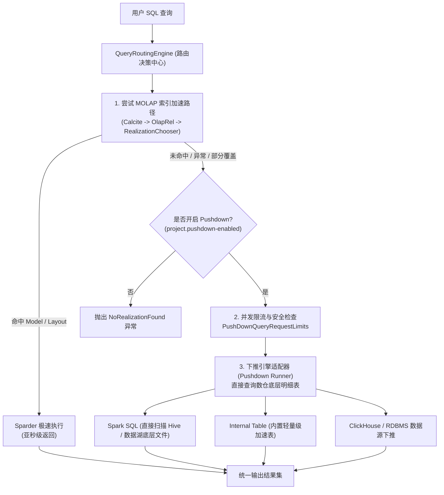
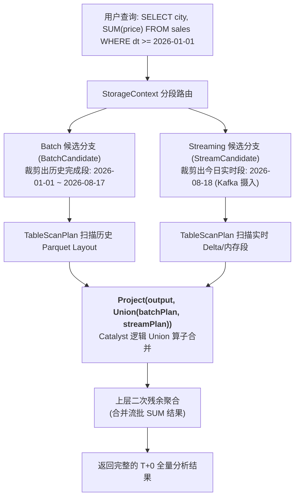
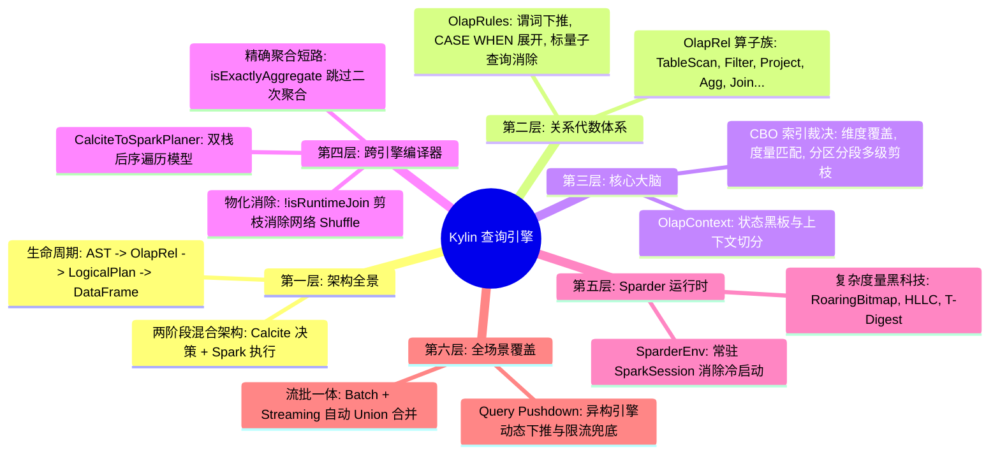

# 硬核拆解 Kylin 查询引擎 (六)：全场景覆盖 —— 动态查询下推 (Pushdown)、流批一体与高并发调优

> **作者**：Huang Sheng (mrhs121)  
> **日期**：2026-08-18  
> **分类**：`Apache Kylin` · `Apache Spark` · `查询下推` · `流批一体` · `生产调优` · `源码剖析`

---

## 0. 专栏收官寄语

在前五篇中，我们完整穿越了 Apache Kylin 查询引擎的技术腹地：
- 从 [第 1 篇：Sparder 全链路架构全景](2026-08-18-kylin-query-engine-01-overview.md) 建立双引擎全局图景；
- 到 [第 2 篇：OlapRel 算子族与优化规则](2026-08-18-kylin-query-engine-02-olap-rel-and-rules.md) 掌握关系代数抽象；
- 到 [第 3 篇：OlapContext 与 CBO 索引裁决](2026-08-18-kylin-query-engine-03-olap-context-and-cbo.md) 解密模型与 Layout 匹配；
- 到 [第 4 篇：CalciteToSparkPlaner 双栈编译](2026-08-18-kylin-query-engine-04-calcite-to-spark-planer.md) 洞悉跨引擎转译与物化 Join 剪枝；
- 到 [第 5 篇：Sparder 运行时内核与 UDAF](2026-08-18-kylin-query-engine-05-sparder-runtime-and-udaf.md) 理解复杂度量位运算。

作为专栏的收官之作，本文将探讨 Kylin 查询引擎在**企业级生产环境中的全场景扩展能力**：
1. 当查询**无法命中任何预计算模型**时，系统如何通过 **动态查询下推（Query Pushdown）** 实现 100% SQL 语法覆盖与柔性兜底？
2. 面对实时分析诉求，Kylin 如何在查询层实现 **历史批段（Batch）与实时流段（Streaming）的流批一体无缝联合查询**？
3. 支撑超高并发与毫秒级延迟的 **生产调优实战宝典**。

---

## 1. 柔性兜底：智能查询下推（Query Pushdown）

### 1.1 为什么需要查询下推？
MOLAP 预计算模型无法提前覆盖用户的所有即席探索（Ad-hoc）需求。如果某条查询使用了未建模的维度列、或者模型尚未构建完成，如果直接给用户抛出 `NoRealizationFoundException`，会严重破坏 BI 报表的用户体验。

为此，Kylin 设计了 **智能查询下推机制（Query Pushdown）**（位于 [`QueryRoutingEngine.java`](file:///Users/huangsheng/codes/kyligence/kylin/src/query/src/main/java/org/apache/kylin/query/engine/QueryRoutingEngine.java) 与 [`PushDownUtil.java`](file:///Users/huangsheng/codes/kyligence/kylin/src/query/src/main/java/org/apache/kylin/query/util/PushDownUtil.java)）：

### 1.2 下推引擎的核心设计细节
1. **多引擎适配器模式**：支持将 SQL 路由至 Spark SQL、Hive、ClickHouse、MySQL 等异构底层引擎；
2. **并发限流保护（`PushDownQueryRequestLimits`）**：由于下推查询直接扫描底层大表，极耗集群资源。系统通过信号量机制（`Semaphore`）严格控制并发下推数，防止慢查询拖垮集群；
3. **部分命中与增强下推（`tryEnhancedAggPushDown`）**：支持将部分已物化的表与未物化的维表进行混合下推关联。

---

## 2. 流批一体：实时与离线数据的无缝合并

在实时 OLAP 场景中，数据通常分为两部分：
- **历史数据（Batch Segments）**：T-1 日及以前的数据，在构建期已固化为 Parquet / Delta 格式的聚合 Layout；
- **实时数据（Streaming Segments）**：当天通过 Kafka 流式消费摄入的微批（Micro-batch）数据。

在查询时，用户只需要编写一条标准 SQL（如 `WHERE part_dt >= '2026-01-01'`），Kylin 的 [`TableScanPlan.scala:62-89`](file:///Users/huangsheng/codes/kyligence/kylin/src/spark-project/sparder/src/main/scala/org/apache/kylin/query/runtime/plan/TableScanPlan.scala#L62-L89) 会自动执行 **流批混合段透明 Union**：

用户无需关心底层数据是存储在历史冷存储还是实时热存储中，查询引擎在物理计划生成期完成了自动拆分、裁剪与 Union 合并。

---

## 3. 企业级生产环境调优宝典

在高并发、低延迟的生产场景中，推荐以下核心调优策略：

| 调优维度 | 核心配置参数 | 生产推荐值与调优原理 |
| :--- | :--- | :--- |
| **计划缓存 (Plan Cache)** | `kylin.query.plan-cache-enabled` | 建议设为 `true`。对于 BI 报表看板等重复高频查询，跳过 Calcite 的 AST 解析与 CBO 规则搜索，直接复用已生成的 Spark `LogicalPlan`，将解析延迟降低 80%+。 |
| **执行线程池并发度** | `kylin.engine.segment-exec-max-threads` | 建议设为 `100~200`。控制 SegmentExec 内部线程并发上限，防止过多线程导致 Driver 端线程栈或 GC 开销过高。 |
| **Spark 动态资源分配** | `spark.dynamicAllocation.enabled` `spark.dynamicAllocation.minExecutors` | 启用动态伸缩，并设置合理的 `minExecutors`（如 4~8 个常驻 Executor），在低并发时保证秒级响应，高并发时自动弹性扩容。 |
| **向量化与 Native 加速** | `kylin.query.engine.gluten.enabled` | 在支持的硬件环境下可开启 Gluten (Velox / ClickHouse Native Engine) 插件，利用 C++ 向量化执行器替换 JVM 原生执行，大幅加速 Parquet 扫描与 Bitwise OR 运算。 |
| **广播维表阈值** | `spark.sql.autoBroadcastJoinThreshold` | 针对运行时 Join（Runtime Join），适当增大广播阈值（如 `50MB~100MB`），促使 Spark 将未打平的小维表自动广播，消除 Shuffle。 |

---

## 4. 全专栏知识体系大结网

历经六篇文章的深度拆解，我们完整绘制了 Apache Kylin 查询引擎的技术全貌：

### 结语
Apache Kylin 查询引擎的精妙之处，在于它既没有重复造“分布式执行器”的轮子，也没有停留在“纯关系型优化器”的传统范畴，而是**以 Calcite 的代数表达力为脑、以 Spark 的分布式吞吐力为身、以预计算 MOLAP 理论为魂**，构建了一座现代高性能数据仓库的坚实灯塔。

希望本专栏能够帮助大家在深入理解 OLAP 内核、数据库查询优化器与分布式计算协同设计的道路上提供清晰而硬核的指引！
