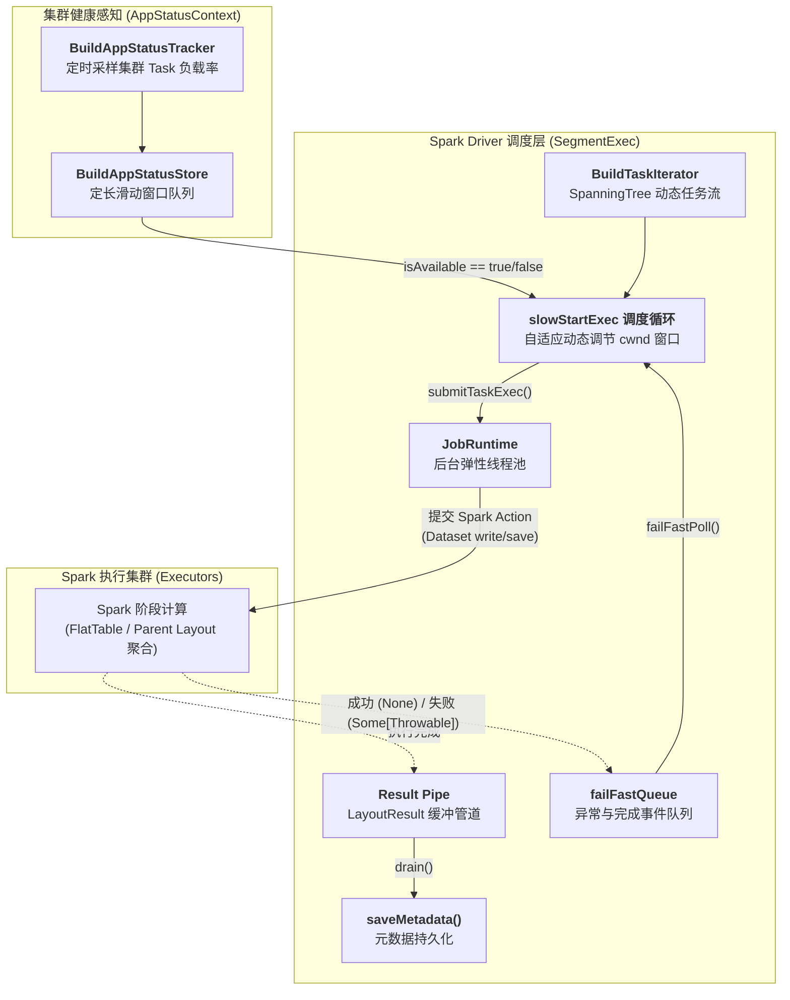
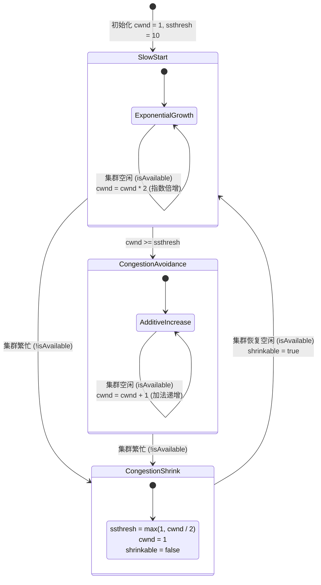
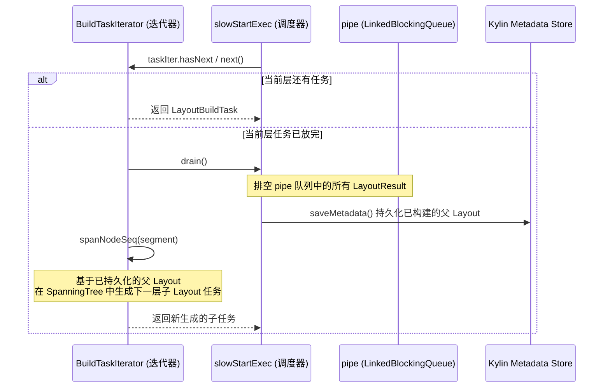

# 源码拆解：Apache Kylin 构建引擎中的 TCP 慢启动机制 —— SegmentExec#slowStartExec 详解

> **作者**：Huang Sheng (mrhs121)  
> **日期**：2026-08-18  
> **分类**：`Apache Kylin` · `Apache Spark` · `OLAP` · `并发调度` · `拥塞控制` · `源码剖析`

---

## 0. 导读与背景问题

在 Apache Kylin（特别是基于 Spark 引擎的 Kylin 4 / 5）中，**Segment 构建与索引物化（Index/Layout Build）** 是最为消耗计算资源的核心链路。一个复杂的 Cube 或数据模型，往往包含由数十乃至上千个维度组合（Cuboid / Layout）构成的生成树（Spanning Tree）。

在将这些 Layout 提交给 Spark 集群执行时，调度器面临着极其尖锐的资源矛盾：

1. **若无节制并发提交（Unbounded Concurrency）**：Driver 端一次性将大量 Spark Action 抛入集群，会导致 Spark 内部 Stage/Task 调度队列严重堆积、Executor 堆内存与 Off-Heap 迅速吃紧，极易引发 **Driver OOM、Executor GC 风暴、数据 Shuffle 倾斜甚至集群雪崩**。
2. **若保守串行或固定低并发（Fixed Concurrency）**：无法灵活感知 Spark 集群中动态伸缩、闲置的 Core 和内存算力，导致构建长尾严重、任务耗时数倍拉长。
3. **任务动态派生依赖**：Layout 之间存在拓扑依赖关系（子 Layout 可以直接从已经计算完成的父 Layout 中二次聚合），计算任务并非静态就绪，而是随着构建推进**动态跨层生成**。

为了在**最大化资源吞吐**与**保护集群稳定性**之间取得动态平衡，Kylin 借鉴了计算机网络领域经典的 **TCP 拥塞控制（Slow Start & Congestion Avoidance）算法**，在调度层设计了自适应调度器 —— `SegmentExec#slowStartExec`。

本文将深入 Kylin 构建引擎底层源码，从算法模型、集群状态监测、调度主循环、Fail-Fast 容错以及元数据回收等维度，全方位拆解这一经典设计。

---

## 1. 架构全景：SegmentExec 在调度链路中的位置

在整个构建流程中，`SegmentExec` 作为核心 Trait，承载了所有与 Segment 相关的异步任务调度、线程控制、失败拦截与元数据回收工作。



### 核心代码锚点

| 核心组件 | 代码位置 | 核心职责 |
| :--- | :--- | :--- |
| `SegmentExec` | `engine-spark/.../job/SegmentExec.scala:46` | 调度 Trait：包含 `slowStartExec`、`failFastPoll`、`drain` |
| `BuildStage` | `engine-spark/.../job/step/build/BuildStage.scala:125` | 索引构建 Stage，实现 `BuildTaskIterator` 并调用 `slowStartExec` |
| `AppStatusContext` | `engine-spark/.../spark/tracker/AppStatusContext.scala:29` | 资源上下文外包装，提供 `isAvailable` 统一判定接口 |
| `BuildAppStatusTracker` | `engine-spark/.../spark/tracker/BuildAppStatusTracker.scala:32` | 守护监控线程，定时采集 Spark Task 运行/等待数并维护滑动窗口 |
| `SparkUtils` | `engine-spark/.../utils/SparkUtils.scala:41` | 底层调用 `SparkContext.statusTracker` 提取当前核心负载率 |
| `JobRuntime` | `engine-spark/.../scheduler/JobRuntime.scala:25` | 异步任务线程池管理者（默认最大 200 线程） |

---

## 2. 核心算法模型：TCP 拥塞控制的跨界映射

`slowStartExec` 机制几乎完整复刻了 TCP Tahoe / Reno 拥塞控制算法的核心思想：

| 算法概念 | TCP 网络协议语义 | Kylin `slowStartExec` 语义 |
| :--- | :--- | :--- |
| **`cwnd`** (Congestion Window) | 发送端在收到 ACK 前能发送的最大报文段数量 | 当前允许同时向 Spark 提交并在运行中的**最大任务并发数**（初始 `1`） |
| **`ssthresh`** (Slow Start Threshold) | 慢启动阈值，决定从指数增长切换为线性增长的分水岭 | 慢启动阈值（初始默认 `10`） |
| **`inflight`** | 链路上已发送但尚未被 ACK 确认的报文数量 | 已通过线程池提交、尚未执行完毕的**在途 Spark 任务数** |
| **`isAvailable`** | 网络通畅、无丢包/拥塞信号 | Spark 集群各 Executor 负载率低于配置阈值（资源空闲） |
| **ACK 确认** | 收到接收端的确认包 | 子线程完成 Task 并向 `failFastQueue` 塞入完成信号 |
| **丢包 / 超时** | 发生拥塞，丢包或 RTO 超时 | `isAvailable == false`（检测到 Spark 集群排队或过载） |

### 窗口状态转换机



1. **慢启动阶段（Slow Start）**：
   - 处于初建期或拥塞恢复期时，任务以试探性质进入。
   - 当检测到集群资源空闲（`isAvailable == true`）且 $2 \times cwnd < ssthresh$ 时，窗口**指数倍增**：$cwnd = cwnd \times 2$（如 $1 \to 2 \to 4 \to 8$）。
2. **拥塞避免阶段（Congestion Avoidance）**：
   - 当 $cwnd \ge ssthresh$ 时，意味着已逼近系统承载水线，此时从激进模式切换为稳健模式。
   - 窗口转为**线性加法递增**：$cwnd = cwnd + 1$（如 $10 \to 11 \to 12 \dots$），稳步压榨集群剩余算力。
3. **拥塞收缩阶段（Multiplicative Decrease & Reset）**：
   - 当检测到集群负载过高（`isAvailable == false`）时：
     - **阈值减半（乘法减小）**：$ssthresh = \max(1, \lfloor cwnd / 2 \rfloor)$；
     - **窗口重置**：$cwnd = 1$（立即阻断后续任务并发提交，让出集群资源给已在运行的任务）；
     - **防抖标记**：`shrinkable = false`，防止在集群连续高负载的一个周期内被反复重复削减。

---

## 3. 源码深度剖析

### 3.1 调度核心主循环

我们来看位于 `SegmentExec.scala:82-125` 的核心实现：

```scala
protected def slowStartExec[T <: Task](taskIter: Iterator[T], taskExec: T => Unit): Unit = {
  // Slow Start and Congestion Avoidance
  // 拥塞窗口，初始为 1
  var cwnd = 1
  // 慢启动阈值，初始为 10
  var ssthresh = 10
  var inflight = 0
  var shrinkable = true
  var reportable = false

  while (taskIter.hasNext) {
    // 1. 评估 Spark 集群资源可用性
    if (appStatusContext.isAvailable) {
      shrinkable = true
      // 只要迭代器中还有任务，且当前在途任务数未达到窗口上限，持续并发提交
      while (taskIter.hasNext && inflight < cwnd) {
        val task = taskIter.next()
        submitTaskExec(task, taskExec)
        inflight += 1
        recordTaskInfo(task)
        reportable = true
      }
      // 2. 集群可用，扩大并发窗口 cwnd
      cwnd = adjustCwnd(cwnd, ssthresh)
    } else if (shrinkable) {
      // 3. 集群繁忙/排队严重，触发拥塞收缩：阈值折半，窗口重置为 1
      ssthresh = Math.max(1, cwnd >> 1)
      cwnd = 1
      shrinkable = false
    }

    // 4. 阶段性上报构建进度
    if (reportable) {
      reportTaskProgress()
      reportable = false
    }

    // 5. 轮询已完成的任务并执行快速失败检查（超时阻塞最多 3 秒）
    inflight -= failFastPoll(3L, TimeUnit.SECONDS)
  }

  // 6. 所有任务提交完毕，循环等待剩余的 inflight 任务全部执行完成
  while (inflight > 0) {
    inflight -= failFastPoll()
  }
  
  // 7. 任务全部完成，立即回收并落盘所有 Layout 的结果与元数据
  drain()
}
```

### 3.2 窗口调整逻辑：`adjustCwnd`

`adjustCwnd` 实现了平滑的阶段跃迁：

```scala
private def adjustCwnd(cwnd: Int, ssthresh: Int): Int = {
  if (cwnd << 1 < ssthresh) {
    // 慢启动阶段：指数倍增 (cwnd * 2)
    cwnd << 1
  } else if (cwnd < ssthresh) {
    // 跃迁边界：若翻倍将超过 ssthresh，直接对齐到 ssthresh
    ssthresh
  } else {
    // 拥塞避免阶段：线性递增 (+1)
    cwnd + 1
  }
}
```

### 3.3 异步任务包装与线程安全传递：`submitTaskExec`

每个具体的构建任务（例如 `buildLayout`、`sanityTask`、`mergeLayout`）是如何被提交并运行的？

```scala
private def submitTaskExec[T <: Task](task: T, taskExec: T => Unit): Unit = {
  runtime.submit(() => try {
    // 绑定 KylinConfig 到当前子线程 ThreadLocal
    setConfig4CurrentThread()
    // 执行实际的任务逻辑 (如触发 Spark Dataset 的 write 落盘操作)
    taskExec(task)
    // 成功完成，往 failFastQueue 发送 None 占位符
    failFastQueue.offer(None)
  } catch {
    case t: Throwable =>
      logError(s"Segment $segmentId task exec failed", t)
      // 发生异常，往 failFastQueue 发送封装后的 Throwable
      failFastQueue.offer(Some(t))
  })
}
```

- **线程隔离与配置同步**：`setConfig4CurrentThread()` 确保在后台线程池中，Spark 任务依然能透明访问与当前 Segment 绑定的 `KylinConfig` 上下文。
- **状态通知**：任务成功提交 `None`，任务失败提交 `Some(Throwable)`，完全解耦了主控调度线程与执行线程。

---

## 4. 集群负载感知：如何判断 `isAvailable`？

`slowStartExec` 的窗口伸缩完全建立在 `appStatusContext.isAvailable` 之上。系统是如何精准、平滑地采集 Spark 集群状态的？

### 4.1 负载指标计算：`SparkUtils.currentResourceLoad`

位于 `SparkUtils.scala:41-53`：

```scala
def currentResourceLoad(sc: SparkContext): (Int, Int) = {
  val statusTracker = sc.statusTracker
  val executorInfos = statusTracker.getExecutorInfos
  // 1. 获取所有 Executor 正在运行的 Task 数量之和
  val runningTaskNum = executorInfos.map(_.numRunningTasks()).sum
  // 2. 获取所有活跃 Stage 中待处理 (未完成) 的 Task 数量之和
  val pendingTaskNum = statusTracker.getActiveStageIds().map(statusTracker.getStageInfo)
    .map(_.map(stg => stg.numTasks() - stg.numCompletedTasks()).sum).sum
  
  // 3. 计算集群理论总算力槽位数 (CoresPerExecutor * ExecutorNum)
  val coresPerExecutor = sc.getConf.getInt("spark.executor.cores", 1)
  val appTaskThreshold = coresPerExecutor * executorInfos.length
  
  // 返回：(当前总任务负荷, 集群算力阈值)
  (runningTaskNum + pendingTaskNum, appTaskThreshold)
}
```

当前总负载综合考量了 **“正在运行的 Task”** 和 **“排队等待的 Pending Task”**，避免因为任务还在调度队列中尚未分配给 Executor 而误判集群闲置。

### 4.2 滑动窗口平滑判定：`BuildAppStatusTracker`

单次采样的瞬时负载容易出现毛刺波动（例如某个 Stage 刚结束与下个 Stage 刚拉起的间隙），为此 Kylin 设计了一个基于队列的滑动窗口判定（`BuildAppStatusTracker.scala:69-93` 与 `BuildAppStatusStore.scala`）：

```scala
private def getResourceState: ResourceState = {
  val stateWind = statusStore.resourceStateQueue
  // 若滑动窗口尚未收集满足够的采样数据，倒计时等待采样填满
  if (stateWind.remainingCapacity() > 0) {
    val cdl = new CountDownLatch(1)
    stateWindTimer.scheduleAtFixedRate(new TimerTask {
      override def run(): Unit = {
        if (stateWind.remainingCapacity() <= 0) {
          this.cancel()
          cdl.countDown()
        }
      }
    }, 0, TimeUnit.SECONDS.toMillis(Math.max(1, buildResourceStateCheckInterval >> 1)))
    cdl.await(buildResourceStateCheckInterval, TimeUnit.SECONDS)
  }

  // 核心判定规则：窗口内所有采样点的负载比率均严格低于阈值
  if (stateWind.asScala.forall(state => (state._1.toDouble / state._2) < buildResourceLoadRateThreshold)) {
    // 窗口向右平移一个采样点
    stateWind.poll(1, TimeUnit.SECONDS)
    return ResourceState.Idle
  }

  ResourceState.Fulled
}
```

> **判定精髓**：必须连续 $N$ 次（由 `kylin.build.resource.consecutive-idle-state-num` 设定，默认 3）采样结果的负载率 $\frac{\text{running} + \text{pending}}{\text{totalCores}}$ 均小于阈值，系统才会裁定为 `Idle`。只要出现一次超标，立即判定为 `Fulled`。这种“严进宽出”的策略极大提升了调度的抗抖动能力。

---

## 5. 协同机制：Fail-Fast 容错与管道 Drain

### 5.1 快速失败机制（Fail-Fast）

在大规模分布式计算中，若数百个并发任务中某一个因数据倾斜或内存溢出挂掉，最糟糕的处理方式是让其它任务继续傻傻跑几个小时才报错。

`failFastPoll` 提供了极速熔断能力：

```scala
protected final def failFastPoll(timeout: Long = 1, unit: TimeUnit = TimeUnit.SECONDS): Int = {
  handleFailure(anonymousFailure)
  var count = 0
  // 非阻塞或带超时阻塞获取完成事件
  var failure = failFastQueue.poll(timeout, unit)
  while (Objects.nonNull(failure)) {
    // 若捕获到异常，handleFailure 立即触发 drain 并抛出异常中断作业！
    handleFailure(failure)
    count += 1
    // 一次性排空队列中已就绪的所有完成事件
    failure = failFastQueue.poll()
  }
  count // 返回本轮完成的任务数，用于 inflight 递减
}
```

当任何一个子任务抛出异常时，主线程在下一次 `failFastPoll`（最多延迟 3 秒）中便会立刻捕捉到 `Some(Throwable)`，并在 `handleFailure` 中中断构建、释放资源，避免集群算力浪费。

### 5.2 任务迭代与元数据管道落盘

在 `BuildStage.scala` 中，`taskIter` 的实现与 `slowStartExec` 的交互极为精妙：



`BuildTaskIterator#hasNext` 在上一层任务耗尽时，会主动调用 `drain()`。`drain()` 会将所有已完工 Layout 的文件路径、行数、数据大小等元数据批量落盘并写入缓存（`cachedLayouts`），使得 `SpanningTree` 能够紧接着派生下一层依赖这些父 Layout 的子任务，形成**边构建、边落盘、边派生、边调窗**的高效流水线。

---

## 6. 核心参数调优指南

针对不同规模的集群，可通过 Kylin 的配置文件对 `slowStartExec` 及状态探测器进行定制调优：

| 参数配置项 | 默认值 | 调优建议与生产经验 |
| :--- | :--- | :--- |
| `kylin.engine.segment-exec-max-threads` | `200` | 控制 `JobRuntime` 线程池最大上限。若 Driver 内存充裕且任务数极多，可适当调大；若 Driver 内存受限（如仅 4G），建议保持在 50~100，避免过多线程导致 Driver 端线程栈或 GC 开销过高。 |
| `kylin.build.resource.state-check-interval-seconds` | `1s` | 资源负载状态检测周期。高负载大集群可保持 1~3 秒；若集群节点较少，适当增大该值可降低 Spark StatusTracker 的轮询开销。 |
| `kylin.build.resource.consecutive-idle-state-num` | `3` | 判定为集群空闲所需的连续达标采样次数。增大该值会使并发扩容更为保守稳健，降低该值会使扩容反应更灵敏。 |
| `kylin.build.resource.load-rate-threshold` | `10` | 资源过载率阈值。当 $(\text{running} + \text{pending}) / \text{totalCores}$ 超过该比率时判定为拥塞。对于计算密集型作业，调小此值（如 1.5~3.0）可更早触发拥塞保护，防止 Executor 任务过载。 |

---

## 7. 总结与架构启示

Kylin 的 `SegmentExec#slowStartExec` 是大数据领域**将网络协议经典理论应用于分布式计算任务调度**的典范设计：

1. **动态自适应代替静态配置**：抛弃了“固定写死并发线程数”的传统思维，通过实时监测集群实际承受能力实现弹性的并发调度。
2. **渐进式探测与快速收缩**：慢启动阶段的指数增长保障了低负载时的算力拉升速度，加法递增保障了高负载水线下的平稳探索，乘法减小与窗口重置则为突发过载提供了坚实的容灾兜底。
3. **闭环配合**：与 `BuildTaskIterator` 动态树生成、`failFastQueue` 毫秒级错误拦截、`drain` 元数据流水线落盘紧密联动，构建了一套高吞吐、高容错、自适应的现代 OLAP 构建执行引擎。
