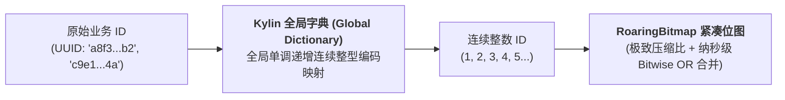
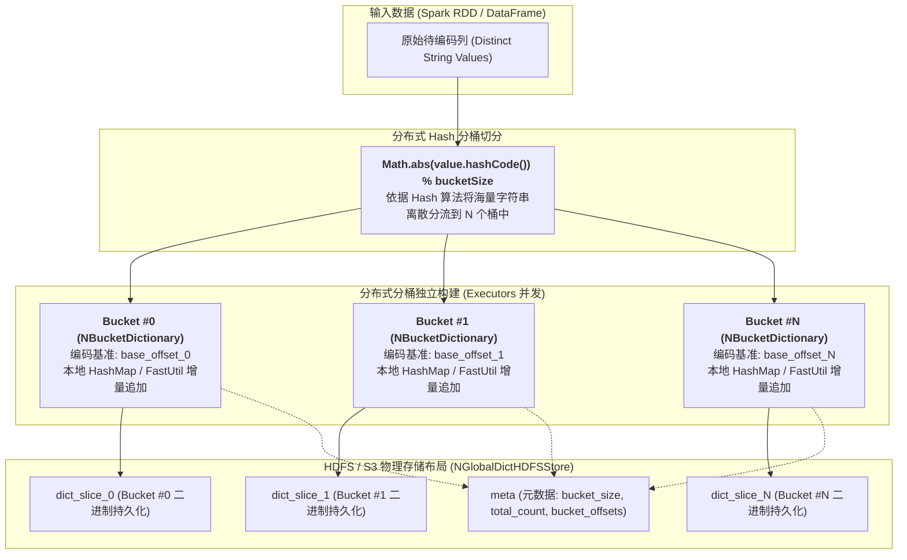
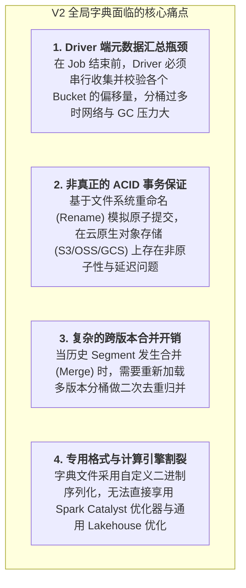

# 硬核拆解 Kylin 全局字典 (上)：从 Trie 树到分布式分桶 —— V2 字典架构与高并发编码内幕

> **作者**：Huang Sheng (mrhs121)  
> **日期**：2026-08-19  
> **分类**：`Apache Kylin` · `全局字典` · `RoaringBitmap` · `分布式分桶` · `精确去重` · `源码剖析`

---

## 0. 导读与核心问题

在海量 OLAP 业务分析中，**精确去重（`COUNT(DISTINCT user_id)` / UV 统计）** 是最基础、同时也是对集群计算与存储挑战最大的度量类型：
- 普通关系型计算引擎在千亿数据集上计算精确去重时，必须发起全局分布式 Shuffle Hash，网络开销和内存消耗极高；
- Apache Kylin 采用 **预计算 RoaringBitmap 位图索引** 技术，在构建期将海量用户 ID 聚合为紧凑的二进制位图，在查询期仅需执行纳秒级的位或（Bitwise OR）合并即可秒级返回。

然而，RoaringBitmap 的高效压缩严重依赖于一个前提：**输入的 ID 必须是连续递增的整型数值（Integer / Long）**。但在实际生产数仓中，绝大部分用户 ID 是离散的字符串（如 UUID、手机号、设备 MAC 地址、OpenID）。

为了将任意长度的字符串**无损、唯一、连续**地映射为整型 ID，Kylin 研发了核心组件 —— **全局字典（Global Dictionary）**。

本文作为全局字典专题的上篇，将深入源码彻底拆解：
1. 从 V1 单机 Trie 树字典到 V2 分布式分桶字典的演进背景；
2. V2 分布式分桶字典（`NGlobalDictionaryV2` / `NBucketDictionary`）的核心数据结构与 Hash 分桶算法；
3. 多版本目录（`version_{id}`）设计、元数据持久化与分布式锁并发控制；
4. V2 字典在大规模场景下的架构瓶颈与痛点。

---

## 1. 为什么精确去重必须依赖全局字典？

### 1.1 离散字符串对位图索引的致命打击
RoaringBitmap 是将 32 位整型划分为 $2^{16} = 65536$ 个逻辑分桶（Container）：
- 若 ID 是密集且连续的（如 $1, 2, 3, \dots, 1000000$），位图会高效收敛为 **RunContainer（行程长度压缩）** 或 **BitmapContainer**，存储仅需数 KB 且 CPU 缓存命中率极高；
- 若直接对 UUID 进行哈希（如 MD5 / MurmurHash 产生离散的 64 位整型），ID 将极其稀疏地打散在数万个 Container 中，退化为 **ArrayContainer**，内存体积暴涨数十倍，失去了预计算位图的性能优势。



---

## 2. 架构演进：从 V1 单机 Trie 树到 V2 分布式分桶

在 Kylin 早期架构（V1）中，全局字典采用单机内存 Trie 树（前缀树）构建：
- **V1 痛点**：每次构建新 Segment 时，Driver 节点需要将历史全量 Trie 树加载到单机 JVM 堆内存中，与新数据合并后再全量写回 HDFS；
- 当基数突破 **千万级到上亿** 时，单机 Trie 树动辄消耗数十 GB 堆内存，极易引发 Driver OOM 崩溃，成为构建链路最严重的单点瓶颈。

为了打破单机内存上限，Kylin 设计了 **V2 分布式分桶全局字典（`NGlobalDictionaryV2`）**（位于 `spark-common` 模块）：



---

## 3. V2 核心数据结构与分布式算法深度拆解

### 3.1 分桶数据结构：`NBucketDictionary`
位于 `NBucketDictionary.java`，每个分桶是一个独立的轻量级字典：

```java
public class NBucketDictionary {
    private final int bucketId;
    private final long baseOffset; // 当前分桶的全局起始偏移量
    private final Object2LongOpenHashMap<String> strToIdMap; // FastUtil 高性能原始类型哈希表
    private final LongArrayList idList; // ID 到字符串的反向索引
}
```

#### 分布式编码计算公式
设全局字典共划分为 $N$ 个分桶（Bucket Count），某个字符串 $S$ 计算得到的分桶 ID 为：
$$\text{bucketId} = |\text{hashCode}(S)| \pmod N$$
该字符串在所属分桶内的局部相对偏移为 $\text{localId}$，则其最终全局唯一 ID 为：
$$\text{GlobalID} = \text{baseOffset}_{\text{bucketId}} + \text{localId}$$
通过为每个 Bucket 预先分配互不重叠的连续偏移区间，**各个 Bucket 在 Spark Executor 上可以完全并发、无锁地独立增量追加编码**！

---

### 3.2 多版本目录与原子提交：`NGlobalDictHDFSStore`

位于 `NGlobalDictHDFSStore.java`，字典在底层文件系统中采用严格的**多版本快照隔离结构**：

```
/kylin/working-dir/{project}/global_dict/{table}/{column}/
├── meta                          # 全局最新版本指向与分桶元数据
├── version_1/                    # 构建版本 1
│   ├── meta                      # 版本 1 元数据 (总基数、各桶偏移量)
│   ├── dict_slice_0              # Bucket 0 字典数据分片
│   ├── dict_slice_1              # Bucket 1 字典数据分片
│   └── dict_slice_N
├── version_2/                    # 构建版本 2 (增量更新后产生)
│   ├── meta
│   ├── dict_slice_0
│   └── ...
└── working/                      # 正在并发构建的临时工作目录
```

```java
// NGlobalDictHDFSStore.java: 核心写入与版本提交流转
@Override
public void commit(String workingDir, long version) throws IOException {
    Path working = new Path(workingDir);
    Path targetVersionDir = getVersionDir(version);
    // 1. 将临时 working 目录原子重命名为目标版本目录
    fileSystem.rename(working, targetVersionDir);
    // 2. 更新根目录下的 meta 软链接指针
    updateMeta(version);
    logger.info("Global dict version {} committed successfully.", version);
}
```

---

### 3.3 分布式锁与并发冲突控制

在多个 Segment 并发构建或高频流式摄入场景中，多个 Spark 任务可能同时尝试追加字典。
Kylin V2 引入了基于 ZooKeeper / HDFS 的分布式文件锁机制：
1. **写锁争抢**：在准备向 `working/` 写入前，必须成功获取分布式互斥锁（`dict_lock`）；
2. **防脏读机制**：查询或编码任务通过读取根目录下的 `meta` 获取已提交的稳定版本号（`buildVersion`），即使后台有新的构建任务正在写入 `working/`，已运行的查询依然只读取历史稳定快照，实现读写无锁并发。

---

## 4. V2 全局字典的架构瓶颈与局限性

虽然 V2 分布式分桶字典成功将单机 Trie 树升级为分布式构建，但在超大规模企业级场景下，依然暴露出明显的架构天花板：



这些痛点促使 Kylin 架构团队在下一代架构中进行了彻底的自我颠覆 —— **全面拥抱现代数据湖仓事务格式，推出了基于 Delta Lake 的 V3 全局字典**。

---

## 5. 总结与下篇预告

通过深入剖析 V2 全局字典内核，我们掌握了精确去重背后的编码基石：
1. **连续整型映射**：为 RoaringBitmap 提供了高压缩比的单调连续编码输入；
2. **分布式 Hash 分桶**：利用 `NBucketDictionary` 将千亿基数打散至各个 Executor 并行追加，打破单机内存瓶颈；
3. **多版本目录隔离**：通过 `NGlobalDictHDFSStore` 实现了读写分离与快照隔离。

---

> **下一篇预告**：
> 在 **《硬核拆解 Kylin 全局字典 (下)：拥抱湖仓事务 —— 基于 Delta Lake 与 Catalyst 转换的 V3 分布式字典》** 中，我们将深入解密 Kylin 5.x 现代湖仓架构下的重大跃迁：
> - 为什么 V3 字典彻底废弃专用二进制文件，转向 **Delta Lake 湖仓表**？
> - `PreCountDistinctTransformer` 如何在 Spark Catalyst 逻辑计划中拦截并重写 CountDistinct？
> - 基于 `Left Anti Join` 与 `row_number() OVER () + maxOffset` 的分布式增量编码算法；
> - 乐观锁与并发冲突自适应重试机制（`DeltaConcurrentModificationException`）。
