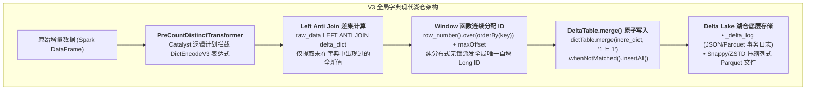
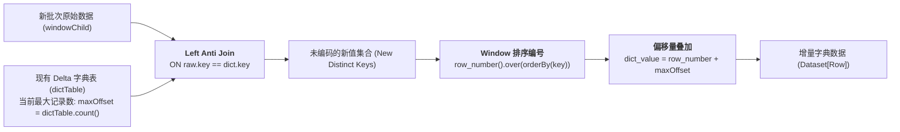
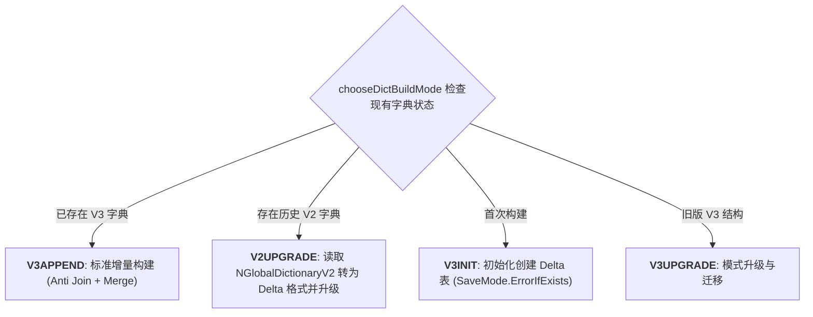

# 硬核拆解 Kylin 全局字典 (下)：拥抱湖仓事务 —— 基于 Delta Lake 与 Catalyst 转换的 V3 分布式字典

> **作者**：Huang Sheng (mrhs121)  
> **日期**：2026-08-19  
> **分类**：`Apache Kylin` · `Delta Lake` · `全局字典` · `Catalyst` · `Lakehouse` · `源码剖析`

---

## 0. 导读与架构跃迁

在上一篇 [《硬核拆解 Kylin 全局字典 (上)：从 Trie 树到分布式分桶 —— V2 字典架构与高并发编码内幕》](2026-08-19-kylin-global-dictionary-v2-distributed-bucket.md) 中，我们拆解了 V2 分布式分桶字典（`NGlobalDictionaryV2` / `NBucketDictionary`）如何通过 Hash 分桶和多版本目录打破单机内存瓶颈。

然而，随着数据规模进一步膨胀到**数百亿至千亿级基数**，以及云原生对象存储（S3 / OSS / GCS / ABS）的广泛应用，V2 字典暴露出难以逾越的底层缺陷：
1. **重命名一致性缺陷**：云原生对象存储没有原生的目录原子 Rename 操作（S3 Rename 本质是 `Copy + Delete`），导致多版本目录切换存在一致性风险与性能骤降；
2. **小文件与 Driver 内存瓶颈**：随着分段不断增量构建，每个分桶切片文件（`dict_slice_N`）持续分裂，小文件膨胀严重，且 Driver 端合并元数据开销过大；
3. **计算与存储割裂**：V2 字典采用自定义二进制序列化协议，Spark 无法将其作为一个标准关系表直接利用 Catalyst 优化器进行并行的 Hash/Broadcast Join 编码。

为了彻底解决上述痛点，Apache Kylin 在 5.x 架构中进行了自我革命 —— **推出基于 Delta Lake 现代湖仓事务表的 V3 全局字典（`V3Dict`）**。

本文将深入 `engine-spark` 源码，全面拆解：
1. V3 字典如何通过 **Delta Lake ACID 事务日志** 彻底消除单点文件锁与 S3 Rename 缺陷；
2. `PreCountDistinctTransformer` 在 Spark Catalyst 逻辑计划中的**拦截与占位重写机制**；
3. 基于 `Left Anti Join` 与 `row_number() OVER () + maxOffset` 的**纯分布式增量编码算法**；
4. 乐观并发重试（`DeltaConcurrentModificationException` + 指数退避）与字典自适应 Compaction/Vacuum 治理；
5. 四大构建模式（`V3INIT`, `V3APPEND`, `V2UPGRADE`, `V3UPGRADE`）与 V2/V3 演进对比。

---

## 1. 架构革新：为什么全面转向 Delta Lake？

V3 全局字典不再将字典视为“特殊的黑盒文件”，而是将其**直接抽象为一张标准的 Delta Lake 事务维表**：
- **Schema 结构**：`dict_key (StringType)` $\leftrightarrow$ `dict_value (LongType)`；
- **存储路径**：`/kylin/working-dir/{project}/v3_dict/{db}/{table}/{column}/`；
- **ACID 事务保障**：借助 Delta Lake 的 `_delta_log` 事务机制，实现天然的 **多版本并发控制（MVCC）**、**乐观并发控制（OCC）** 与 **快照隔离（Snapshot Isolation）**。



### 核心收益
1. **云原生零风险提交**：Delta Lake 基于事务日志提交，完全废弃了文件系统的 `Rename` 操作，在 S3/OSS 上具备 $100\%$ 的原子性；
2. **纯分布式 Catalyst 优化**：字典构建全流程退化为纯正的 Spark SQL 算子（`Join`, `Window`, `Project`），消除了 Driver 单点汇总开销；
3. **自动化湖仓生命周期管理**：天然支持 `OPTIMIZE`（小文件合并）与 `VACUUM`（过期无用版本清理）。

---

## 2. Catalyst 计划拦截：PreCountDistinctTransformer

在 Spark 执行物理构建前，Kylin 通过注入自定义 Catalyst 规则 `PreCountDistinctTransformer.scala` 对逻辑计划树进行透明改写：

```scala
class PreCountDistinctTransformer(spark: SparkSession) extends Rule[LogicalPlan] with PredicateHelper {
  override def apply(plan: LogicalPlan): LogicalPlan = plan transform {
    case project @ Project(_, child) =>
      val relatedFields = scala.collection.mutable.Queue[CountDistExprInfo]()
      // 1. 扫描表达式中的 DictEncodeV3 标记
      project.transformExpressions {
        case DictEncodeV3(child, dbName) =>
          val deAttr = AttributeReference("dict_encoded_" + child.prettyName, LongType, nullable = false)(NamedExpression.newExprId, Seq.empty[String])
          relatedFields += CountDistExprInfo(child, deAttr, dbName)
          createColumn(deAttr).expr
      }.withNewChildren {
        // 2. 为每个待编码列生成 GlobalDictionaryPlaceHolder 占位符算子
        val dictionaries = relatedFields.map { case CountDistExprInfo(childExpr, encodedAttr, dbName) =>
          val windowSpec = Window.orderBy(createColumn(childExpr))
          val exprName = childExpr match {
            case ne: NamedExpression => ne.name
            case _ => childExpr.prettyName
          }
          val dictPlan = GlobalDictionaryPlaceHolder(exprName, getLogicalPlan(
            getDataFrame(spark, child).groupBy(createColumn(childExpr)).agg(createColumn(childExpr)).select(
              createColumn(childExpr).cast(StringType) as "dict_key",
              row_number().over(windowSpec).cast(LongType) as "dict_value")), dbName)
          val (key, value) = (dictPlan.output.head, dictPlan.output(1))
          val valueAlias = Alias(value, encodedAttr.name)(encodedAttr.exprId)
          (Project(Seq(key, valueAlias), dictPlan), (childExpr, encodedAttr))
        }

        // 3. 将原数据流与字典表通过 LeftOuter Join 关联，产出编码后的 dict_encoded_* 列
        val result = dictionaries.foldLeft(child) { (joined, dict) =>
          val (childExpr, encodedAttr, map) = (dict._2._1, dict._2._2, dict._1)
          Project(joined.output :+ encodedAttr,
            Join(joined, map, LeftOuter, Some(EqualTo(childExpr, map.projectList.head)), JoinHint.NONE))
        }
        Seq(result)
      }
  }
}
```

---

## 3. 分布式增量编码算法深度推导：DictionaryBuilder

位于 `DictionaryBuilder.scala:88-118` 的 `transformerDictPlan` 展示了如何利用纯关系代数实现无锁增量编码：



### 源码实现解析

```scala
private def transformerDictPlan(
    spark: SparkSession,
    context: DictionaryContext,
    plan: LogicalPlan): LogicalPlan = {

  val dictPath = getDictionaryPathAndCheck(context)
  val dictTable: DeltaTable = DeltaTable.forPath(dictPath)
  // 1. 获取现有字典的最大基数偏移量 maxOffset
  val maxOffset = dictTable.toDF.count()

  plan match {
    case Project(_, Project(_, Window(_, _, _, windowChild))) =>
      val column = context.expr
      val windowSpec = org.apache.spark.sql.expressions.Window.orderBy(col(column))
      val joinCondition = createColumn(EqualTo(col(column).cast(StringType).expr, getLogicalPlan(dictTable.toDF).output.head))
      val filterKey = getLogicalPlan(dictTable.toDF).output.head.name

      // 2. 利用 left_anti join 高效计算补集差集
      val antiJoinDF = getDataFrame(spark, windowChild)
        .filter(col(filterKey).isNotNull)
        .join(dictTable.toDF, joinCondition, "left_anti")
        .select(
          col(column).cast(StringType) as "dict_key",
          (row_number().over(windowSpec) + lit(maxOffset)).cast(LongType) as "dict_value" // 3. 叠加偏移量
        )
      getLogicalPlan(antiJoinDF)
    case _ => plan
  }
}
```

- **高吞吐差集计算**：Spark Catalyst 会根据数据规模自适应将 `left_anti` 转换为 **BroadcastHashJoin** 或 **SortMergeJoin**，在百亿基数下依然具备线性扩展能力；
- **连续单调递增**：新值的 ID 严格从 $\text{maxOffset} + 1$ 开始连续分配，完美契合 RoaringBitmap 对 ID 连续性的苛刻要求。

---

## 4. 并发写入与乐观重试机制

在多 Segment 并发构建或多个任务同时写入同一列字典时，Delta Lake 会产生并发冲突（`DeltaConcurrentModificationException`）。

Kylin V3 采用 **分布式锁 + 乐观退避重试** 双重防线：

```scala
// 1. 隐式重试策略：随机退避 5s ~ 15s，最多重试 20 次
implicit val retryStrategy: RetryStrategyProducer =
  RetryStrategy.randomBackOff(5.seconds, 15.seconds, maxAttempts = 20)

// 2. 增量 Merge 写入
private def mergeIncrementDict(spark: SparkSession, context: DictionaryContext, plan: LogicalPlan): Unit = {
  ZKHelper.tryZKJaasConfiguration(spark)
  val lock: Lock = KylinConfig.getInstanceFromEnv.getDistributedLockFactory
    .getLockForCurrentThread(getDictionaryLockPath(context))
  lock.lock()
  try {
    val dictPlan = transformerDictPlan(spark, context, plan)
    val incrementDictDF = getDataFrame(spark, dictPlan)
    val dictPath = getDictionaryPathAndCheck(context)
    val dictTable = DeltaTable.forPath(dictPath)
    
    // 3. 利用 Delta Merge API 执行高效批量 Insert
    dictTable.alias("dict")
      .merge(incrementDictDF.alias("incre_dict"), "1 != 1")
      .whenNotMatched().insertAll()
      .execute()
  } finally {
    lock.unlock()
  }
}
```

---

## 5. 字典自动治理：Compaction 与 Vacuum

随着字典持续增量追加，Delta Lake 会产生较多细碎的 Parquet 数据分片。
位于 `DictionaryBuilder.scala:218-242` 的 `optimizeDictTable` 会自动触发治理：

```scala
private def optimizeDictTable(spark: SparkSession, context: DictionaryContext): Unit = {
  val dictPath = getDictionaryPathAndCheck(context)
  val deltaLog = DeltaLog.forTable(spark, dictPath)
  val numFile = deltaLog.snapshot.numOfFiles

  val config = KylinConfig.getInstanceFromEnv
  val v3DictFileNumLimit = config.getV3DictFileNumLimit // 默认阈值: 10
  if (numFile > v3DictFileNumLimit) {
    val dictTable = DeltaTable.forPath(dictPath)
    // 1. 合并小文件 (Compaction)
    dictTable.optimize().executeCompaction()
    // 2. 清理超过保留周期的历史垃圾版本 (Vacuum)
    val v3DictRetention = config.getV3DictFileRetentionHours
    dictTable.vacuum(v3DictRetention)
  }
}
```

---

## 6. 四大构建模式与 V2/V3 演进对比

在 `DictionaryBuilder.scala:120-159` 中，系统支持平滑迁移与构建模式自适应判定：



### 全球字典架构演进全方位对比

| 维度 | V1 单机 Trie 树字典 | V2 分布式分桶字典 (`NGlobalDictionaryV2`) | V3 湖仓事务字典 (`V3Dict`) |
| :--- | :--- | :--- | :--- |
| **底层存储格式** | 单一二进制文件 | 分桶自定义二进制分片 (`dict_slice_N`) | **通用 Delta Lake 事务表 (Parquet)** |
| **单点瓶颈** | Driver 堆内存爆仓（千万级上限）| Driver 端元数据汇总（亿级上限） | **无单点瓶颈（支持千亿级基数）** |
| **事务与快照一致性** | 无事务 | 基于文件系统 Rename 模拟版本快照 | **完整 ACID 事务日志 (`_delta_log`)** |
| **对象存储兼容性** | 差 | 较差（S3 模拟 Rename 延迟高且非原子）| **原生完美兼容（S3 / OSS / GCS / HDFS）** |
| **计算引擎结合度** | 独立编码过程 | 独立 RDD 分桶构建 | **深度融入 Spark Catalyst 优化器与 SQL 计划** |
| **小文件治理** | 不涉及 | 需离线重跑合并 | **自动执行 `OPTIMIZE` 与 `VACUUM`** |

---

## 7. 总结

从 V1 到 V3，Kylin 全局字典的演进史正是现代大数据 OLAP 引擎架构演进的缩影：
1. **解耦单点**：彻底摆脱单机内存与 Driver 节点的束缚，将所有算力与存储下沉到分布式计算集群；
2. **拥抱标准**：废弃私有文件协议，拥抱 Delta Lake 湖仓开放格式，获得了工业级的 ACID 事务保障；
3. **代数优化**：通过 `PreCountDistinctTransformer` 将编码逻辑融入 Spark Catalyst 关系代数流水线，实现了极致的高性能与高可扩展性。
