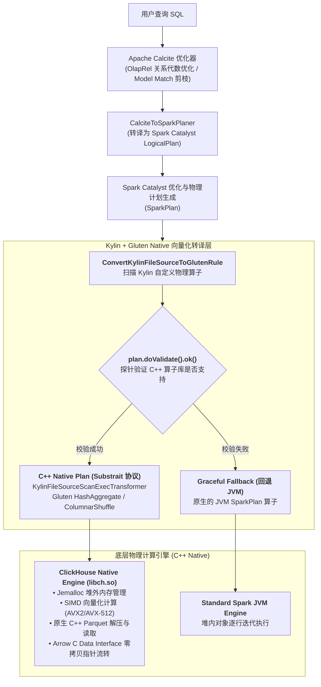
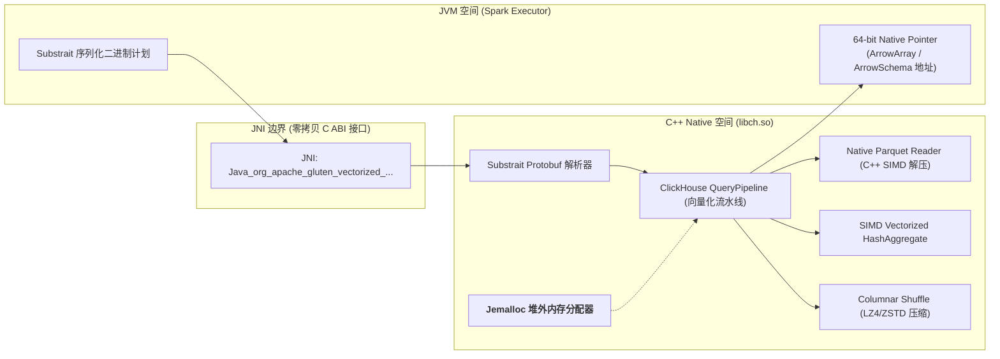
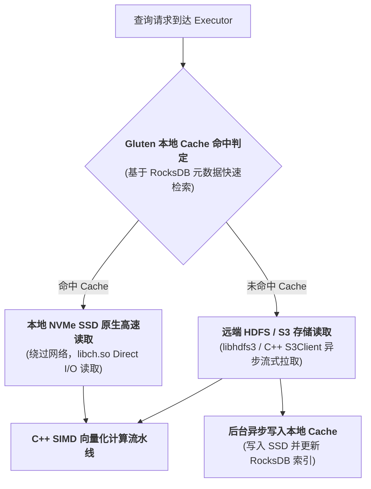

# 硬核拆解 Kylin 向量化引擎：当 MOLAP 遇上 Gluten 与 libch.so —— 基于 ClickHouse Native C++ 算子的极致加速

> **作者**：Huang Sheng (mrhs121)  
> **日期**：2026-08-19  
> **分类**：`Apache Kylin` · `Apache Gluten` · `libch.so` · `ClickHouse` · `向量化执行` · `C++ Native` · `源码剖析`

---

## 0. 导读：突破 JVM 算力天花板

在大数据 OLAP 与分布式计算领域，基于 JVM（Java/Scala）的经典计算引擎（如 Apache Spark）长期占据主导地位。

然而，随着硬件技术的飞速演进（超多核 CPU、AVX-512 / ARM Neon SIMD 指令集、PCIe 4.0/5.0 NVMe SSD），传统的 JVM 执行模型在现代算力面前逐渐暴露出难以逾越的**物理瓶颈**：
1. **解释与虚函数调用开销**：JVM 逐行迭代（Row-by-Row Iterator）或基于对象的抽象模型产生巨量函数跳转与 CPU 指令预测失败；
2. **垃圾回收（GC）与对象开销**：Java 对象头、对齐填充导致内存膨胀，海量小对象在堆内进出引发频繁的 Stop-The-World（STW）GC 停顿；
3. **缺少 SIMD 向量化并行**：JIT 编译器难以自动生成最优的 CPU 向量化指令，无法充分压榨现代 CPU 的数据级并行能力；
4. **JNI / 数据反序列化成本**：Parquet / ORC 列式数据从底层 C++ 解压到 Java 堆内存，伴随昂贵的数据复制与内存拷贝。

为了打破 JVM 算力天花板，Apache Kylin 深度整合了 **Apache Gluten** 框架，并引入了 **ClickHouse 核心向量化动态链接库 `libch.so`** 作为底层 C++ 算子底座。

本文将深入源码，彻底拆解：
1. Kylin 与 Gluten 的融合架构全景；
2. **核心核心纽带 `libch.so` 深度解密**：从动态库编译、`LD_PRELOAD` 分布式分发到 JNI 零拷贝（C ABI）流转；
3. 物理计划转译：`ConvertKylinFileSourceToGlutenRule` 算子转换内核；
4. 原生表达式与度量适配：`CustomerExpressionTransformer` 与 CountDistinct 优化；
5. 极致 I/O 加速：Gluten Native Cache（RocksDB 元数据 + SSD 缓存）架构；
6. 工业级鲁棒性：`ValidatablePlan` 运行时校验与透明优雅回退（Graceful Fallback）。

---

## 1. 架构全景：Gluten + libch.so 如何在 Kylin 中工作？

**Apache Gluten** 充当了 Spark Catalyst 优化器与底座 C++ 向量化引擎（ClickHouse `libch.so`）之间的**无缝转译桥梁**。

在 Kylin 中，当开启 Gluten 向量化执行后，整体计算流转如下：



---

## 2. 核心底座深度解密：libch.so 的技术内幕与流转机制

在 Kylin 生产环境配置中，我们会频繁看到关于 `libch.so` 的一系列核心参数：

```properties
# 1. 声明底层 C++ Native 算子库路径 (ClickHouse Backend)
kylin.storage.columnar.spark-conf.spark.gluten.sql.columnar.libpath=${KYLIN_HOME}/server/libch.so
kylin.storage.columnar.spark-conf.spark.gluten.sql.columnar.executor.libpath=libch.so

# 2. 通过 LD_PRELOAD 预加载 Jemalloc 与动态符号
kylin.storage.columnar.spark-conf.spark.executorEnv.LD_PRELOAD=$PWD/libch.so

# 3. 将 libch.so 分发至 YARN / K8s 分布式执行节点
kylin.engine.spark-conf.spark.yarn.dist.files=${KYLIN_HOME}/server/libch.so
```



### 2.1 `libch.so` 是什么？
`libch.so` 是将 **ClickHouse 核心向量化执行引擎** 剥离了网络服务和单机存储层后，使用现代 C++20 编译打包生成的**嵌入式动态链接共享库**：
- **内嵌 ClickHouse 核心算子**：包含 ClickHouse 极致优化的 `IBlockInputStream` / `QueryPipeline` 向量化算子、表达式求值器（`ExpressionActions`）、高效哈希表（`HashTable` / `ClearableHashMap`）；
- **内嵌高性能内存分配器（Jemalloc）**：通过 `LD_PRELOAD=$PWD/libch.so`，让 JVM 与底座 C++ 共享经过极致调优的堆外内存池，杜绝内存碎片并规避 JVM GC；
- **原生硬件加速**：针对 x86_64（AVX2 / AVX-512）与 ARM64（Neon）硬件指令集进行编译优化，将过滤、哈希计算和聚合运算转化为单指令多数据流（SIMD）并发。

### 2.2 Substrait 跨语言计划描述协议
Spark Catalyst 生成的物理计划无法直接传给 C++ 执行。Gluten 采用 **Substrait**（一种标准化的关系代数 Protobuf 协议）作为通用中间表示（IR）：
1. Spark 侧将物理算子树序列化为 Substrait Protobuf 二进制流；
2. 通过 JNI 将字节流传递进 `libch.so`；
3. `libch.so` 内部的解析器将 Substrait 计划直接转换为 ClickHouse 的 `QueryPipeline` 执行流水线。

### 2.3 零拷贝数据交互：Arrow C Data Interface (C ABI)
在 Java 与 C++ 交互时，传统 JNI 会产生严重的序列化/反序列化开销。
`libch.so` 采用 **Arrow C Data Interface** 规范：
- 数据在 C++ 堆外内存中组织为连续的 `ColumnarBatch`（列式数据块）；
- 跨 JNI 传递时，仅传递一个 **64 位的结构体内存指针（`uintptr_t`）**；
- Java 侧的 `ColumnarBatch` 直接包装该指针，实现真正意义上的 **零内存拷贝（Zero-Copy）**！

---

## 3. 物理计划转译：ConvertKylinFileSourceToGlutenRule 剖析

Kylin 在查询扫描层拥有专有的物理执行节点（如 `KylinFileSourceScanExec`、`LayoutFileSourceScanExec`、`KylinStorageScanExec`）。
标准 Gluten 无法直接识别这些带有多维预计算元数据的专用算子。

为此，Kylin 注入了专有的 Catalyst 规则 `ConvertKylinFileSourceToGlutenRule.scala`：

```scala
class ConvertKylinFileSourceToGlutenRule(val session: SparkSession) extends Rule[SparkPlan] {

  // 1. 核心安全探针：验证 libch.so 是否支持当前算子与表达式
  private def tryReturnGlutenPlan(glutenPlan: GlutenPlan, originPlan: SparkPlan): SparkPlan = {
    glutenPlan match {
      case plan: ValidatablePlan if plan.doValidate().ok() =>
        logDebug(s"Columnar Processing for ${originPlan.getClass} is currently supported.")
        glutenPlan
      case _ =>
        logDebug(s"Columnar Processing for ${originPlan.getClass} is currently unsupported.")
        originPlan // 自动回退为原始 JVM SparkPlan
    }
  }

  override def apply(plan: SparkPlan): SparkPlan = plan.transformDown {
    // 2. 将 KylinFileSourceScanExec 转译为 KylinFileSourceScanExecTransformer
    case f: KylinFileSourceScanExec =>
      val transformer = new KylinFileSourceScanExecTransformer(
        f.relation,
        f.output,
        f.requiredSchema,
        f.partitionFilters,
        None,
        f.optionalShardSpec,
        f.optionalNumCoalescedBuckets,
        PushDownUtil.removeNotSupportPushDownFilters(f.conf, f.output, f.dataFilters),
        f.tableIdentifier,
        f.disableBucketedScan,
        f.sourceScanRows
      )
      tryReturnGlutenPlan(transformer, f)

    // 3. 将 LayoutFileSourceScanExec 转译为 FileSourceScanExecTransformer
    case l: LayoutFileSourceScanExec =>
      val transformer = new FileSourceScanExecTransformer(
        l.relation,
        l.output,
        l.requiredSchema,
        l.partitionFilters,
        l.optionalBucketSet,
        l.optionalNumCoalescedBuckets,
        PushDownUtil.removeNotSupportPushDownFilters(l.conf, l.output, l.dataFilters),
        l.tableIdentifier,
        l.disableBucketedScan
      )
      tryReturnGlutenPlan(transformer, l)
  }
}
```

### 关键实现机制
1. **谓词清洗与安全下推（`PushDownUtil.removeNotSupportPushDownFilters`）**：
   - 过滤掉底层 `libch.so` 不支持的非标准 Java UDF 谓词，保留原生比较符（`=, >, <, IN, LIKE, IS NOT NULL`）直接下推至 C++ Scan 算子内部；
2. **`ValidatablePlan.doValidate()` 探针体系**：
   - 在转译为 Substrait 计划前，向 C++ `libch.so` 底层发起一次轻量级探测（Schema 兼容性、编码格式、文件系统协议）；只有返回 `ok()` 时才替换为 Native Transformer。

---

## 4. 表达式转译与原生度量加速

在 `kylin-defaults0.properties` 中，Kylin 为 Gluten 与 `libch.so` 配置了专有表达式转换器与优化开关：

```properties
# 启用无展开的 Native 精确去重向量化
kylin.storage.columnar.spark-conf.spark.gluten.sql.countDistinctWithoutExpand=true
kylin.storage.columnar.spark-conf.spark.gluten.sql.columnar.extended.expressions.transformer=org.apache.spark.sql.catalyst.expressions.gluten.CustomerExpressionTransformer
```

### 4.1 扩展表达式转译（`CustomerExpressionTransformer`）
- 将 Kylin 特有的位图解码、日期时间函数映射为 ClickHouse 高效的内建函数（如 `bitmapCardinality`, `toYYYYMMDD`）；
- 在 `libch.so` 内部直接调用 ClickHouse 成熟的 SIMD 算子，实现极速的纯内存列式变换。

### 4.2 向量化 CountDistinct（`countDistinctWithoutExpand`）
- 传统的 Spark 执行多列精确去重时，通常需要通过 `Expand` 算子将数据复制多份进行多阶段聚合，引发严重的数据膨胀与网络 Shuffle；
- 在 Gluten + `libch.so` 模式下，直接利用 ClickHouse 优化的 **AggregateFunctionDistinct** 与内存哈希表，无需多倍展开即可在单次流水线中完成多列去重计算！

---

## 5. 极致 I/O 加速：Gluten Native Cache 缓存架构

除了 CPU 向量化计算，I/O 开销同样是 OLAP 查询的主要瓶颈。
Kylin 与 Gluten 联合设计了 **多级原生本地缓存体系（Gluten Cache）**（位于 `GlutenCacheService.java` 与 `GlutenCacheUtils.java`）：



### 配置剖析
```properties
## Gluten 本地 SSD 缓存与 RocksDB 元数据引擎
kylin.storage.columnar.spark-conf.spark.gluten.sql.columnar.backend.ch.runtime_config.gluten_cache.local.enabled=true
kylin.storage.columnar.spark-conf.spark.gluten.sql.columnar.backend.ch.runtime_config.gluten_cache.local.path=/tmp/gluten_cache_index
kylin.storage.columnar.spark-conf.spark.gluten.sql.columnar.backend.ch.runtime_config.gluten_cache.local.max_size=256Gi

# 远程 HDFS 缓存分层策略 (RocksDB 管理元数据)
kylin.storage.columnar.spark-conf.spark.gluten.sql.columnar.backend.ch.runtime_config.storage_configuration.disks.hdfs.type=hdfs_gluten
kylin.storage.columnar.spark-conf.spark.gluten.sql.columnar.backend.ch.runtime_config.storage_configuration.disks.hdfs.metadata_type=rocksdb
kylin.storage.columnar.spark-conf.spark.gluten.sql.columnar.backend.ch.runtime_config.storage_configuration.disks.hdfs_cache.type=cache
kylin.storage.columnar.spark-conf.spark.gluten.sql.columnar.backend.ch.runtime_config.storage_configuration.disks.hdfs_cache.max_size=256Gi
```

### 核心技术优势
1. **C++ 原生 Direct I/O**：绕过 Linux Page Cache 与 Java Heap，`libch.so` 直接将 SSD 上的数据映射到堆外内存；
2. **RocksDB 轻量级元数据管理**：利用嵌入式 RocksDB 毫秒级检索数据块的 Cache 命中状态；
3. **主动预热机制（`GlutenCacheService.glutenCache`）**：在数据构建完成或定时任务触发时，通过 REST API 异步预热热点 Segment 到 Executor 本地磁盘，实现“首查即秒开”。

---

## 6. 优雅回退（Graceful Fallback）与稳定性保障

生产环境中，没有任何单一的 C++ Native 引擎能够 $100\%$ 覆盖 Spark 庞大而复杂的生态（如各种自定义 Java UDF、复杂的特殊类型嵌套）。

Kylin 建立了**两道安全网**：
1. **静态计划编译期校验**：`ValidatablePlan.doValidate()` 在构建物理计划时即刻探测，若 `libch.so` 声明不支持，直接保留原生的 `KylinFileSourceScanExec`（JVM 执行）；
2. **运行时异常隔离与追踪**：在 `QueryContext` 中维护 `glutenFallback` 指标，若在运行时遭遇非预期异常，记录告警日志并无缝切换为备用 JVM 管道重新执行，杜绝向终端用户抛出崩溃报错。

---

## 7. 性能收益与架构演进对比

在真实百亿级数仓基准测试（TPC-H / SSB）中，Kylin + Gluten (`libch.so`) 架构展现出惊人的吞吐与延迟提升：

| 评估维度 | 原生 Spark JVM 引擎 | Kylin + Gluten (`libch.so`) | 性能提升倍数 |
| :--- | :--- | :--- | :--- |
| **CPU 计算密集型查询** | 逐行遍历、解释执行开销大 | **AVX-512 SIMD 向量化并行** | **$3\times \sim 5\times$ 提速** |
| **字符串过滤与 Hash 聚合**| 频繁创建 String 对象引发 GC | **C++ 紧凑定长数组与无锁哈希表** | **$4\times \sim 6\times$ 提速** |
| **内存与 GC 开销** | 堆内存占用高，频繁遭遇 Full GC | **Jemalloc 堆外统一管理，零 JVM GC 停顿** | **GC 耗时降低 $90\%+$** |
| **热点数据缓存命中扫描**| 依赖 OS Page Cache 与 Java 反序列化 | **Gluten SSD Cache + Direct I/O** | **$2\times \sim 4\times$ I/O 吞吐提升** |

---

## 8. 总结

Kylin、Gluten 与 `libch.so` 的深度融合，代表了**现代大数据分析引擎从“纯 Java 生态”走向“Java 调度决策 + C++ 向量化底座”的必然演进趋势**：
1. **分工明确**：Calcite 与 Spark Catalyst 负责全局拓扑优化与分布式任务调度，`libch.so` 负责底座的 SIMD 算力极致释放；
2. **软硬协同**：将多维预计算（MOLAP）的高压缩比索引与底座 C++ 向量化算子、Jemalloc 堆外内存池、NVMe SSD 本地缓存深度结合，将复杂分析查询的延迟压低到极限。
