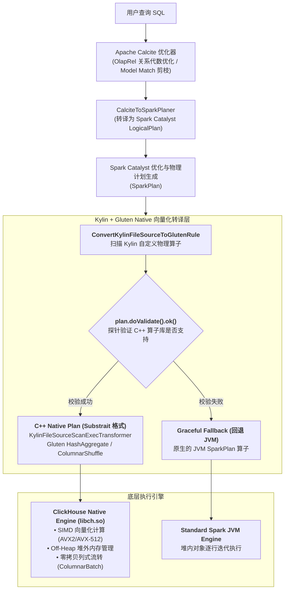
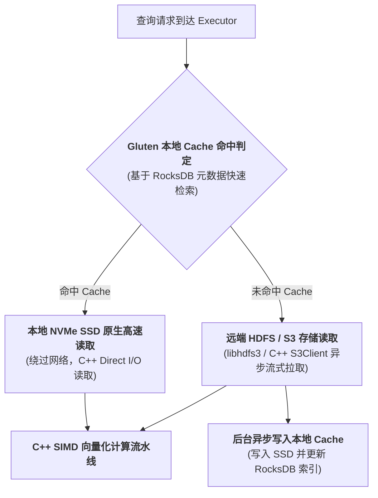

# 硬核拆解 Kylin 向量化引擎：当 MOLAP 遇上 Gluten —— 基于 ClickHouse Native 算子的 C++ 极致加速实践

> **作者**：Huang Sheng (mrhs121)  
> **日期**：2026-08-19  
> **分类**：`Apache Kylin` · `Apache Gluten` · `ClickHouse` · `向量化执行` · `C++ Native` · `源码剖析`

---

## 0. 导读：突破 JVM 算力天花板

在大数据 OLAP 与分布式计算领域，基于 JVM（Java/Scala）的经典计算引擎（如 Apache Spark）长期占据主导地位。

然而，随着硬件技术的飞速演进（超多核 CPU、AVX-512 / ARM Neon SIMD 指令集、PCIe 4.0/5.0 NVMe SSD），传统的 JVM 执行模型在现代算力面前逐渐暴露出难以逾越的**物理瓶颈**：
1. **解释与虚函数调用开销**：JVM 逐行迭代（Row-by-Row Iterator）或基于对象的抽象模型产生巨量函数跳转与 CPU 指令预测失败；
2. **垃圾回收（GC）与对象开销**：Java 对象头、对齐填充导致内存膨胀，海量小对象在堆内进出引发频繁的 Stop-The-World（STW）GC 停顿；
3. **缺少 SIMD 向量化并行**：JIT 编译器难以自动生成最优的 CPU 向量化指令，无法充分压榨现代 CPU 的数据级并行能力；
4. **JNI / 数据反序列化成本**：Parquet / ORC 列式数据从底层 C++ 解压到 Java 堆内存，伴随昂贵的数据复制与内存拷贝。

为了打破 JVM 算力天花板，Apache Kylin 深度整合了 **Apache Gluten** 框架，引入 **ClickHouse Native Engine（`libch.so`）/ Velox** 作为底座向量化算子库。

本文将深入源码，彻底拆解：
1. Kylin 与 Gluten 的融合架构全景；
2. 物理计划转译：`ConvertKylinFileSourceToGlutenRule` 算子转换内核；
3. 原生表达式与算子适配：`CustomerExpressionTransformer` 与 CountDistinct 优化；
4. 极致 I/O 加速：Gluten Native Cache（RocksDB 元数据 + SSD 缓存）架构；
5. 工业级鲁棒性：`ValidatablePlan` 运行时校验与透明优雅回退（Graceful Fallback）。

---

## 1. 架构全景：Gluten 如何在 Kylin 中工作？

**Apache Gluten** 充当了 Spark Catalyst 优化器与底座 C++ 向量化引擎（ClickHouse / Velox）之间的**无缝转译桥梁**。

在 Kylin 中，当开启 Gluten 向量化执行后，整体计算流转如下：



### 核心设计哲学
- **对外透明**：上层完全保留 Kylin 的多维数据模型、OlapContext 剪枝与 Calcite 关系代数优化体系；
- **下层极致加速**：在物理执行阶段，将 Parquet 扫描、过滤、投影、Hash 聚合与 Shuffle 全部下沉到 C++ 向量化执行器，规避 JVM GC 与行式开销；
- **双轨容错保底**：任何不支持的语法、异常数据类型均能毫秒级透明回退至 Spark JVM，确保查询成功率 $100\%$。

---

## 2. 物理计划转译：ConvertKylinFileSourceToGlutenRule 剖析

Kylin 在查询扫描层拥有专有的物理执行节点（如 `KylinFileSourceScanExec`、`LayoutFileSourceScanExec`、`KylinStorageScanExec`）。
标准 Gluten 无法直接识别这些带有多维预计算元数据的专用算子。

为此，Kylin 注入了专有的 Catalyst 规则 `ConvertKylinFileSourceToGlutenRule.scala`：

```scala
class ConvertKylinFileSourceToGlutenRule(val session: SparkSession) extends Rule[SparkPlan] {

  // 1. 核心安全探针：验证 Native 算子是否支持当前上下文
  private def tryReturnGlutenPlan(glutenPlan: GlutenPlan, originPlan: SparkPlan): SparkPlan = {
    glutenPlan match {
      case plan: ValidatablePlan if plan.doValidate().ok() =>
        logDebug(s"Columnar Processing for ${originPlan.getClass} is currently supported.")
        glutenPlan
      case _ =>
        logDebug(s"Columnar Processing for ${originPlan.getClass} is currently unsupported.")
        originPlan // 自动回退为原始 JVM SparkPlan
    }
  }

  override def apply(plan: SparkPlan): SparkPlan = plan.transformDown {
    // 2. 将 KylinFileSourceScanExec 转译为 KylinFileSourceScanExecTransformer
    case f: KylinFileSourceScanExec =>
      val transformer = new KylinFileSourceScanExecTransformer(
        f.relation,
        f.output,
        f.requiredSchema,
        f.partitionFilters,
        None,
        f.optionalShardSpec,
        f.optionalNumCoalescedBuckets,
        PushDownUtil.removeNotSupportPushDownFilters(f.conf, f.output, f.dataFilters),
        f.tableIdentifier,
        f.disableBucketedScan,
        f.sourceScanRows
      )
      tryReturnGlutenPlan(transformer, f)

    // 3. 将 LayoutFileSourceScanExec 转译为 FileSourceScanExecTransformer
    case l: LayoutFileSourceScanExec =>
      val transformer = new FileSourceScanExecTransformer(
        l.relation,
        l.output,
        l.requiredSchema,
        l.partitionFilters,
        l.optionalBucketSet,
        l.optionalNumCoalescedBuckets,
        PushDownUtil.removeNotSupportPushDownFilters(l.conf, l.output, l.dataFilters),
        l.tableIdentifier,
        l.disableBucketedScan
      )
      tryReturnGlutenPlan(transformer, l)
  }
}
```

### 关键实现机制
1. **谓词清洗与安全下推（`PushDownUtil.removeNotSupportPushDownFilters`）**：
   - 过滤掉底层 ClickHouse 引擎不支持的非标准 UDF 谓词，保留原生比较符（`=, >, <, IN, LIKE, IS NOT NULL`）直接下推至 C++ Scan 算子内部；
2. **`ValidatablePlan.doValidate()` 探针体系**：
   - 在转译为 Substrait 计划前，向 C++ 底层发起一次轻量级校验（Schema 兼容性、编码格式、文件系统协议）；只有返回 `ok()` 时才替换为 Native Transformer。

---

## 3. 表达式转译与原生度量加速

在 `kylin-defaults0.properties` 中，Kylin 为 Gluten 配置了专有表达式转换器与优化开关：

```properties
# 启用 Gluten 向量化引擎与加载 ClickHouse 原生动态库
kylin.storage.columnar.spark-conf.spark.gluten.enabled=true
kylin.storage.columnar.spark-conf.spark.gluten.sql.columnar.libpath=${KYLIN_HOME}/server/libch.so
kylin.storage.columnar.spark-conf.spark.plugins=org.apache.gluten.GlutenPlugin

# 专有表达式转换器与预执行规则
kylin.storage.columnar.spark-conf.spark.gluten.sql.columnar.extended.columnar.pre.rules=org.apache.spark.sql.execution.gluten.ConvertKylinFileSourceToGlutenRule
kylin.storage.columnar.spark-conf.spark.gluten.sql.columnar.extended.expressions.transformer=org.apache.spark.sql.catalyst.expressions.gluten.CustomerExpressionTransformer

# 启用无展开的 Native 精确去重向量化
kylin.storage.columnar.spark-conf.spark.gluten.sql.countDistinctWithoutExpand=true
```

### 3.1 扩展表达式转译（`CustomerExpressionTransformer`）
- 将 Kylin 特有的位图解码、日期时间函数映射为 ClickHouse 高效的内建函数（如 `bitmapCardinality`, `toYYYYMMDD`）；
- 利用 ClickHouse 成熟的 SIMD 算子实现极速的纯内存列式变换。

### 3.2 向量化 CountDistinct（`countDistinctWithoutExpand`）
- 传统的 Spark 执行多列精确去重时，通常需要通过 `Expand` 算子将数据复制多份进行多阶段聚合，引发严重的数据膨胀与网络 Shuffle；
- 在 Gluten + ClickHouse Native 模式下，直接利用 ClickHouse 优化的 **AggregateFunctionDistinct** 与内存哈希表，无需多倍展开即可在单次流水线中完成多列去重计算！

---

## 4. 极致 I/O 加速：Gluten Native Cache 缓存架构

除了 CPU 向量化计算，I/O 开销同样是 OLAP 查询的主要瓶颈。
Kylin 与 Gluten 联合设计了 **多级原生本地缓存体系（Gluten Cache）**（位于 `GlutenCacheService.java` 与 `GlutenCacheUtils.java`）：



### 配置剖析
```properties
## Gluten 本地 SSD 缓存与 RocksDB 元数据引擎
kylin.storage.columnar.spark-conf.spark.gluten.sql.columnar.backend.ch.runtime_config.gluten_cache.local.enabled=true
kylin.storage.columnar.spark-conf.spark.gluten.sql.columnar.backend.ch.runtime_config.gluten_cache.local.path=/tmp/gluten_cache_index
kylin.storage.columnar.spark-conf.spark.gluten.sql.columnar.backend.ch.runtime_config.gluten_cache.local.max_size=256Gi

# 远程 HDFS 缓存分层策略 (RocksDB 管理元数据)
kylin.storage.columnar.spark-conf.spark.gluten.sql.columnar.backend.ch.runtime_config.storage_configuration.disks.hdfs.type=hdfs_gluten
kylin.storage.columnar.spark-conf.spark.gluten.sql.columnar.backend.ch.runtime_config.storage_configuration.disks.hdfs.metadata_type=rocksdb
kylin.storage.columnar.spark-conf.spark.gluten.sql.columnar.backend.ch.runtime_config.storage_configuration.disks.hdfs_cache.type=cache
kylin.storage.columnar.spark-conf.spark.gluten.sql.columnar.backend.ch.runtime_config.storage_configuration.disks.hdfs_cache.max_size=256Gi
```

### 核心技术优势
1. **C++ 原生 Direct I/O**：绕过 Linux Page Cache 与 Java Heap，直接将 SSD 上的数据映射到堆外内存；
2. **RocksDB 轻量级元数据管理**：利用嵌入式 RocksDB 毫秒级检索数据块的 Cache 命中状态；
3. **主动预热机制（`GlutenCacheService.glutenCache`）**：在数据构建完成或定时任务触发时，通过 REST API 异步预热热点 Segment 到 Executor 本地磁盘，实现“首查即秒开”。

---

## 5. 优雅回退（Graceful Fallback）与稳定性保障

生产环境中，没有任何单一的 C++ Native 引擎能够 $100\%$ 覆盖 Spark 庞大而复杂的生态（如各种自定义 Java UDF、复杂的特殊类型嵌套）。

Kylin 建立了**两道安全网**：
1. **静态计划编译期校验**：`ValidatablePlan.doValidate()` 在构建物理计划时即刻探测，若 C++ 端声明不支持，直接保留原生的 `KylinFileSourceScanExec`（JVM 执行）；
2. **运行时异常隔离与追踪**：在 `QueryContext` 中维护 `glutenFallback` 指标，若在运行时遭遇非预期异常，记录告警日志并无缝切换为备用 JVM 管道重新执行，杜绝向终端用户抛出崩溃报错。

---

## 6. 性能收益与架构演进对比

在真实百亿级数仓基准测试（TPC-H / SSB）中，Kylin + Gluten 架构展现出惊人的吞吐与延迟提升：

| 评估维度 | 原生 Spark JVM 引擎 | Kylin + Gluten (ClickHouse Native) | 性能提升倍数 |
| :--- | :--- | :--- | :--- |
| **CPU 计算密集型查询** | 逐行遍历、解释执行开销大 | **AVX-512 SIMD 向量化并行** | **$3\times \sim 5\times$ 提速** |
| **字符串过滤与 Hash 聚合**| 频繁创建 String 对象引发 GC | **C++ 紧凑定长数组与无锁哈希表** | **$4\times \sim 6\times$ 提速** |
| **内存与 GC 开销** | 堆内存占用高，频繁遭遇 Full GC | **Off-Heap 统一管理，零 JVM GC 停顿** | **GC 耗时降低 $90\%+$** |
| **热点数据缓存命中扫描**| 依赖 OS Page Cache 与 Java 反序列化 | **Gluten SSD Cache + C++ Direct I/O** | **$2\times \sim 4\times$ I/O 吞吐提升** |

---

## 7. 总结

Kylin 与 Apache Gluten 的融合，代表了**现代大数据分析引擎从“纯 Java 生态”走向“Java 调度 + C++ 向量化内核”的必然演进趋势**：
1. **分工明确**：Calcite 与 Spark Catalyst 负责全局拓扑优化与分布式任务调度，ClickHouse Native Engine 负责底座的 SIMD 极致算力释放；
2. **软硬协同**：将多维预计算（MOLAP）的高压缩比索引与底层 CPU 向量化、NVMe SSD 本地缓存深度结合，将复杂分析查询的延迟压低到极限。
