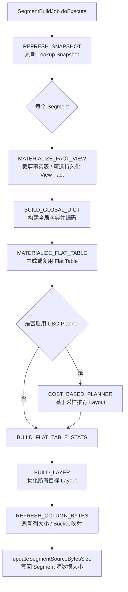

# 硬核拆解 Kylin 构建引擎：Spark Segment Build 全链路 —— 从事实表快照到 Layout 物化落盘

> **作者**：Huang Sheng (mrhs121)  
> **日期**：2026-08-20  
> **分类**：`Apache Kylin` · `Apache Spark` · `构建引擎` · `Segment Build` · `Layout 物化` · `源码剖析`

---

## 0. 导读：查询快，代价一定发生在构建期

在 Apache Kylin 的 MOLAP 架构里，用户看到的是查询阶段的亚秒级响应：SQL 被改写、匹配模型、裁剪 Segment 与 Layout，然后直接扫描预聚合结果。

但所有这些“查询快”的前提，都来自构建期提前完成的一系列重活：

1. 从事实表与维表中抽取当前 Segment 覆盖的数据范围；
2. 按模型 Join Graph 拼出扁平化明细表（Flat Table）；
3. 为精确去重等复杂度量构建全局字典并完成编码；
4. 根据 IndexPlan / LayoutEntity / Spanning Tree 推导出要物化的 Cuboid；
5. 用 Spark DataFrame 执行 GroupBy 聚合、排序、分桶、落盘；
6. 将行数、文件数、字节数、分区信息写回 Kylin 元数据。

这篇文章要拆的就是这条链路：**Kylin 的一个 Segment Build Job，到底如何从源表一步步变成可查询的物化 Layout？**

本文基于 Kylin Spark 构建引擎源码，重点围绕以下核心类展开：

| 模块 | 关键类 | 作用 |
|---|---|---|
| Job 入口 | `SegmentBuildJob` | Segment 构建主入口，编排各 Stage |
| Job 上下文 | `SegmentJob` | 解析 dataflow / segment / layout 参数，维护运行时资源 |
| Stage 枚举 | `StageEnum` | 将构建流程拆成可展示、可恢复的阶段 |
| 扁平表 | `FlatTableStage` / `MaterializeFlatTable` | 事实表裁剪、维表 Join、CC 计算、Flat Table 持久化 |
| 字典 | `BuildDict` / `DFDictionaryBuilder` / `DFTableEncoder` | 全局字典构建与编码 |
| Layout 构建 | `BuildStage` / `BuildLayer` | 基于 AdaptiveSpanningTree 逐层/自适应构建 Layout |
| 聚合计算 | `CuboidAggregator` | 将维度与度量翻译成 Spark groupBy + UDAF |
| 落盘元数据 | `SegmentExec` / `StorageStoreFactory` | 保存 Layout 文件并写回 `NDataLayout` |

---

## 1. 总览：SegmentBuildJob 的七阶段流水线

Kylin 5.x 的 Spark 构建入口是 `SegmentBuildJob`。它继承自 `SegmentJob`，真正执行时会先刷新维表快照，然后针对每个 Segment 创建一个 `BuildStepExec`，依次加入一组 Stage：

```java
step.addStage(MATERIALIZE_FACT_VIEW.createExec(this, segment, params));
step.addStage(BUILD_GLOBAL_DICT.createExec(this, segment, params));
step.addStage(MATERIALIZE_FLAT_TABLE.createExec(this, segment, params));

if (usePlanner) {
    step.addStage(COST_BASED_PLANNER.createExec(this, segment, params));
}

step.addStage(BUILD_FLAT_TABLE_STATS.createExec(this, segment, params));
step.addStage(BUILD_LAYER.createExec(this, segment, params));
step.addStage(REFRESH_COLUMN_BYTES.createExec(this, segment, params));
```

把它展开成流程图，大致如下：



这条流水线有几个很重要的设计点：

- **Stage 化**：每个阶段都有独立的 `StageExec`，便于前端展示进度、失败定位、重试恢复；
- **ParamPropagation 传参**：各阶段不直接互相调用，而是通过 `ParamPropagation` 传递 `flatTable`、`dict`、`spanningTree`、统计信息等中间结果；
- **Segment 可并行**：`config.isSegmentParallelBuildEnabled()` 打开后，多个 Segment 可以并行进入这条流水线；
- **Layout 可自适应并发**：到了 `BUILD_LAYER` 阶段，具体 Layout 的构建由 `SegmentExec#slowStartExec` 做 TCP 慢启动式调度；
- **元数据延迟 Drain**：Layout 构建线程只把结果塞进 `pipe`，主线程或定时 checkpoint 再批量写回元数据。

---

## 2. SegmentJob：构建任务的上下文装配器

`SegmentBuildJob` 的父类 `SegmentJob` 负责把一次构建请求里的核心参数装配成运行时上下文：

```java
protected IndexPlan indexPlan;
protected String dataflowId;
protected Set<LayoutEntity> readOnlyLayouts;
protected Set<NDataSegment> readOnlySegments;
protected JobRuntime runtime;
protected AppStatusContext appStatusContext;
```

初始化逻辑集中在 `extraInit()`：

1. 从参数中读取 `P_SEGMENT_IDS`、`P_DATAFLOW_ID`、`P_LAYOUT_IDS`；
2. 通过 `NDataflowManager` 找到当前 Dataflow 与 IndexPlan；
3. 将 layout id 转成 `LayoutEntity` 集合，作为本次 Job 的目标物化范围；
4. 将 segment id 转成 `NDataSegment` 集合，并过滤掉异常 Segment；
5. 创建 `JobRuntime(config.getSegmentExecMaxThreads())` 作为 Layout 并发执行线程池。

这意味着一次 Build Job 并不一定构建整个模型的所有 Layout，而是由参数明确指定：

```text
JobParam / ExecutableParams
  ├─ dataflowId     -> 哪个模型 / Dataflow
  ├─ segmentIds     -> 哪些 Segment
  └─ layoutIds      -> 哪些 Layout
```

这个设计非常关键：

- 新增 Segment 时，可以只构建当前 Segment 的全部或部分 Layout；
- 刷新 Segment 时，可以复用已有参数做重建；
- Partial Build 时，可以只补建新增索引；
- Cost Based Planner 启用后，还可以在构建过程中改写目标 Layout 列表。

---

## 3. Refresh Snapshot：先让维表静态化

在构建 Flat Table 之前，Kylin 会先刷新 Lookup 表快照：

```java
REFRESH_SNAPSHOT.createThenExecute(this);
```

`SegmentBuildJob#refreshSnapshot()` 内部使用 `SnapshotBuilder`：

- 如果开启手动快照管理，则跳过构建，只计算总行数；
- 如果本次 Job 参数声明不需要构建 Snapshot，也只计算总行数；
- 否则调用 `snapshotBuilder.buildSnapshot(...)` 为模型中的 Lookup 表构建快照。

为什么构建阶段要先做 Snapshot？

因为 Kylin 的模型通常是星型或雪花模型：事实表按 Segment 时间范围增量构建，但 Lookup 维表往往没有与事实表完全一致的时间切分。如果直接读实时维表，构建期间维表发生变化，就可能出现：

- 同一个事实行在不同构建批次 Join 到不同维度值；
- 已构建 Segment 与新 Segment 的维表版本不一致；
- 查询时不同 Segment 的语义不稳定。

因此，Snapshot 的作用可以理解为：**把维表在构建时刻冻结成稳定版本，为后续 Flat Table Join 提供一致输入。**

---

## 4. MaterializeFactView：事实表裁剪与 View Fact 持久化

真正进入 Segment 内部构建后，第一个 Stage 是 `MaterializeFactView`：

```scala
class MaterializeFactView(jobContext: SegmentJob, dataSegment: NDataSegment, params: ParamPropagation)
  extends FlatTableStage(jobContext, dataSegment, params) {

  override def execute(): Unit = {
    logInfo(s"Build SEGMENT $segmentId")
    persistFactView()
    if (params.isSkipPersistFactView) {
      onStageSkipped()
    }
  }
}
```

`persistFactView()` 的核心动作在 `FlatTableStage`：

```scala
def persistFactView(): Unit = {
  initSpanningTree()
  initFlatTableDesc()
  initFactTable()
}
```

这里会完成三件事。

### 4.1 初始化 AdaptiveSpanningTree

```scala
protected def initSpanningTree(): Unit = {
  val spanTree = new AdaptiveSpanningTree(config, new AdaptiveTreeBuilder(dataSegment, readOnlyLayouts))
  params.setSpanningTree(spanTree)
}
```

`AdaptiveSpanningTree` 决定后续 Layout 的派生关系：哪些 Layout 必须从 Flat Table 构建，哪些 Layout 可以从已经物化的父 Layout 二次聚合。

这正好承接前面《Adaptive Spanning Tree》那篇文章：

- 那篇讲的是 **Cuboid 构建顺序如何生成**；
- 本文讲的是 **这个顺序如何落到 Spark DataFrame 构建流水线里执行**。

### 4.2 初始化 SegmentFlatTableDesc

```scala
protected def initFlatTableDesc(): Unit = {
  val flatTableDesc: SegmentFlatTableDesc = if (jobContext.isPartialBuild) {
    val parser = new IndexDependencyParser(dataModel)
    val relatedTableAlias = parser.getRelatedTablesAlias(jobContext.getReadOnlyLayouts)
    new SegmentFlatTableDesc(config, dataSegment, spanningTree, relatedTableAlias)
  } else {
    new SegmentFlatTableDesc(config, dataSegment, spanningTree)
  }
  params.setFlatTableDesc(flatTableDesc)
}
```

`SegmentFlatTableDesc` 可以看作 Flat Table 的“设计图纸”，它定义了：

- 本 Segment 的时间范围；
- 是否需要 Join Lookup 表；
- Flat Table 的列顺序与列 ID；
- Flat Table 的 HDFS / 对象存储路径；
- 是否需要持久化 Flat Table / Fact View；
- Partial Build 时涉及哪些表。

### 4.3 初始化事实表与分区事实表

```scala
def initFactTable(): Unit = {
  val factTable: Dataset[Row] = createFactTable()
  params.setFactTable(factTable)
  val partFactTable: Dataset[Row] = createPartFactTable()
  params.setPartFactTable(partFactTable)
}
```

其中 `createPartitionedFactTable()` 会加载事实表，并应用 Segment 的分区条件：

```scala
val table = createTable(factTableRef)(sparkSession)
val partTable = applyPartitionDesc(table)
```

`applyPartitionDesc()` 会根据模型的 `PartitionDesc` 和当前 Segment 的 `SegmentRange` 生成过滤条件：

```scala
val condition = descDRP.getPartitionConditionBuilder
  .buildDateRangeCondition(descDRP, tableDesc.getDataSegment, segmentRange)
originDS.where(condition)
```

因此，Build Job 一开始就会把源事实表裁剪到当前 Segment 的时间范围，后续所有字典、Flat Table、Layout 都只基于这个范围构建。

如果事实表本身是 View，且配置允许持久化，则会先将裁剪后的 View Fact 写成 Parquet：

```scala
view.write.mode(SaveMode.Overwrite).parquet(factViewPath.toString)
DFBuilderHelper.checkPointSegment(dataSegment, copied => copied.setFactViewReady(true))
```

这个 Checkpoint 标记很重要：如果 Job 中途失败，下次重试可以识别 `segment.isFactViewReady` 并复用已持久化的 Fact View。

---

## 5. Build Global Dict：为复杂度量准备连续编码

第二个 Stage 是 `BuildDict`：

```scala
class BuildDict(jobContext: SegmentJob, dataSegment: NDataSegment, params: ParamPropagation)
  extends FlatTableStage(jobContext, dataSegment, params) {

  override def execute(): Unit = {
    val dict: Dataset[Row] = buildDictIfNeed()
    params.setDict(dict)
  }
}
```

这里名字叫 `dict`，但返回值其实已经是经过必要编码后的 Dataset，后续 `MaterializeFlatTable` 会直接拿它作为 Flat Table 的基础输入。

`buildDictIfNeed()` 的主流程如下：

```scala
val (dictCols, encodeCols, dictColsWithoutCc, encodeColsWithoutCc) = prepareForDict()
val factTable = buildDictIfNeed(partFactTable, dictCols, encodeCols)

var flatTable = if (canJoinLookups) {
  val joinTableMap = createJoinTableMap(joinTableSeq, createSnapshot)
    .map(lookup => (lookup._1, buildDictIfNeed(lookup._2, dictColsWithoutCc, encodeColsWithoutCc)))

  val jointTable = joinAsFlatTable(factTable, joinTableMap, dataModel)

  buildDictIfNeed(concatCCs(jointTable, factTableCCs), ...)
} else {
  factTable
}

DFBuilderHelper.checkPointSegment(dataSegment, copied => copied.setDictReady(true))
flatTable = applyFilterCondition(flatTable)
flatTable = changeSchemeToColumnId(flatTable, tableDesc)
```

这一段的设计有几个细节值得展开。

### 5.1 只为本次构建相关列建字典

```scala
protected def prepareForDict(): (Set[TblColRef], Set[TblColRef], Set[TblColRef], Set[TblColRef]) = {
  val dictCols = DictionaryBuilderHelper.extractTreeRelatedGlobalDictToBuild(dataSegment, spanningTree.getIndices)
  val encodeCols = DictionaryBuilderHelper.extractTreeRelatedGlobalDicts(dataSegment, spanningTree.getIndices)
  ...
}
```

字典列不是从整个模型粗暴扫描，而是从 `spanningTree.getIndices` 中提取：

- 本次目标 Layout 需要哪些复杂度量；
- 这些复杂度量引用了哪些列；
- 哪些列需要构建全局字典；
- 哪些列需要在 Flat Table 中追加 `_KYLIN_ENCODE` 编码列。

这避免了“模型里有字典列就全部重建”的浪费。

### 5.2 尽量在 Join 前建字典

注释里写得很直白：

```scala
/**
 * If need to build and encode dict columns, then
 * 1. try best to build in fact-table.
 * 2. try best to build in lookup-tables (without cc dict).
 * 3. try to build in fact-table.
 */
```

原因很简单：Join 后的 Flat Table 行数可能远大于单表输入，如果能在 Fact / Lookup 单表阶段完成字典构建与编码，就可以减少数据放大后的计算压力。

只有计算列（Computed Column）等必须依赖 Join 后字段的场景，才会在拼接后的 Flat Table 上处理。

### 5.3 V2 / V3 字典分支

```scala
if (config.isV3DictEnable) {
  buildV3DictIfNeeded(table, encodeCols)
} else {
  encodeColumn(table, encodeCols)
}
```

- V2 字典：通过 `DFDictionaryBuilder` 构建字典文件，再由 `DFTableEncoder.encodeTable()` 追加编码列；
- V3 字典：通过 `dict_encode_v3()` 注入 Catalyst 表达式，再调用 `DictionaryBuilder.buildGlobalDict()` 生成全局字典与编码计划。

这与前面两篇全局字典文章形成闭环：

- 字典专题讲的是 **字典本身如何存储与并发编码**；
- 本文讲的是 **字典在 Segment Build 流水线中如何被调用**。

---

## 6. MaterializeFlatTable：拼出构建 Layout 的明细宽表

第三个 Stage 是 `MaterializeFlatTable`：

```scala
override def execute(): Unit = {
  params.setFlatTable(createFlatTable())
  params.setLightFlatTable(createLightFlatTable())
  params.setFlatTableStage(this)

  if (!checkDataCountPass()) {
    drainEmptyLayoutOnDataCountCheckFailed()
    return
  }
}
```

Flat Table 是 Kylin 构建引擎里非常关键的中间层。它把模型中的事实表、维表、计算列、过滤条件、字典编码列统一转成一张列名为数字 ID 的 Spark DataFrame：

```text
原始列名：  ORDER.ORDER_ID, USER.USER_ID, ITEM.PRICE, ...
Flat Table： 0, 1, 2, 3, 4, 2_KYLIN_ENCODE, ...
```

这种数字列名设计看起来不够“人性化”，但对后续构建非常友好：

- LayoutEntity 中的维度、度量本来就是用列 ID / measure ID 表达；
- Spark select / groupBy 时可以直接用列 ID 定位；
- 查询侧读取 Layout 时也能按元数据映射回业务列。

### 6.1 复用已有 Flat Table

```scala
private def recoverFlatTable(): Option[Dataset[Row]] = {
  if (tableDesc.isPartialBuild) return None
  else if (!isReady4FlatTable) return None

  val table = sparkSession.read.parquet(flatTablePath.toString)
  ...
  if (nones.nonEmpty) return None
  Some(table)
}
```

Kylin 会检查：

- 当前 Segment 是否标记 `flatTableReady`；
- Flat Table 路径是否存在；
- 已有 Flat Table schema 是否覆盖当前构建所需列；
- 编码列是否齐备、数据类型是否匹配。

如果满足条件，就直接复用，避免重新 Join 全量 Fact + Lookup。

### 6.2 生成新的 Flat Table

如果不能复用，则进入 `persistFlatTable(params.getDict)`：

```scala
private def persistFlatTable(table: Dataset[Row]): Dataset[Row] = {
  if (!canPersistFlatTable) {
    return table
  }
  table.write.mode(SaveMode.Overwrite).parquet(flatTablePath.toString)
  DFBuilderHelper.checkPointSegment(dataSegment, copied => copied.setFlatTableReady(true))
  sparkSession.read.parquet(flatTablePath.toString)
}
```

注意这里的 `table` 通常来自上一阶段 `BuildDict` 返回的 Dataset，它已经完成：

- 事实表分区裁剪；
- Lookup Snapshot Join；
- 计算列拼接；
- 模型过滤条件；
- 字典编码列追加；
- schema 从业务列名转换为列 ID。

如果配置不要求持久化 Flat Table，则 Kylin 会直接把这个 Dataset 留在内存逻辑计划中，后续 Layout 构建直接引用它。

### 6.3 Data Count Check：构建前的一致性闸门

`MaterializeFlatTable` 还会做数据行数校验：

```scala
if (jobContext.getConfig.isDataCountCheckEnabled) {
  val result = checkDataCount()
  return result
}
```

它主要检查两类一致性：

1. 已有 Agg Layout / Table Layout 的 count 是否内部一致；
2. 如果本次仍需要从 Flat Table 构建，则已有 Layout count 是否与 Flat Table count 一致。

如果检查失败，会把后续待构建 Layout 写成异常空 Layout：

```scala
readOnlyLayouts.asScala.foreach(newEmptyDataLayout(_, NDataLayout.AbnormalType.DATA_INCONSISTENT))
drain()
```

这相当于在 Layout 物化前加了一道保护：**如果旧物化结果与当前源数据不一致，就不要继续基于它派生更多错误结果。**

---

## 7. Cost Based Planner：构建时动态推荐 Layout

如果参数 `P_JOB_ENABLE_PLANNER=true`，`SegmentBuildJob` 会插入 `COST_BASED_PLANNER`：

```java
if (usePlanner) {
    step.addStage(COST_BASED_PLANNER.createExec(this, segment, params));
}
```

Planner 的输入是 Flat Table 统计：

```scala
protected def generateCostTable(): (java.util.Map[BigInteger, java.lang.Long], Long) = {
  val javaRddFlatTable = FLAT_TABLE.javaRDD
  val cuboIdsCost = FlatTableToCostUtils.generateCost(javaRddFlatTable, config, indexPlan.getRuleBasedIndex, tableDesc)
  val sourceCount = FLAT_TABLE.count()
  val cuboIdToRowCount = FlatTableToCostUtils.getCuboidRowCountMapFromSampling(cuboIdsCost)
  (cuboIdToRowCount, sourceCount)
}
```

然后把采样得到的 Cuboid 行数 / 大小估算交给 `CostBasePlannerUtils`：

```scala
val cuboids = CostBasePlannerUtils.getRecommendCuboidList(...)
val allRecommendedAggColOrders = CuboIdToLayoutUtils.convertCuboIdsToAggIndexColOrders(...)
jobContext.setRecommendAggColOrders(allRecommendedAggColOrders)
```

`SegmentJob#updateIndexPlanIfNeed()` 会把推荐结果写回 IndexPlan，并重写本次 Job 的 `P_LAYOUT_IDS` 参数。

这意味着 Kylin 的构建并非永远只按照静态规则物化 Layout：

- 规则索引给出候选空间；
- Flat Table 采样估计真实数据分布；
- CBO Planner 从候选空间中筛出更有价值的 Layout；
- 后续 `BuildLayer` 基于更新后的 Layout 集合继续执行。

---

## 8. BuildFlatTableStats：统计、Inferior Flat Table 与 Sanity Cache

进入真正物化 Layout 前，`BuildFlatTableStats` 会做三类准备工作：

```scala
override def execute(): Unit = {
  if (params.getSpanningTree.fromFlatTable()) {
    val stats = buildStats()
    params.setFlatTableStats(stats)

    if (config.isInferiorFlatTableEnabled) {
      buildInferior()
    }
  }

  buildSanityCache()
  cleanupLayoutTempData(dataSegment, readOnlyLayouts.asScala.toSeq)
}
```

### 8.1 Flat Table 统计

`gatherStats()` 会计算：

- Flat Table 总行数；
- 每列采样字节数；
- 按采样比例估算的列级源数据大小。

```scala
val totalRowCount = table.count()
val sampled = table.take(sampleRowCount).flatMap(...)
val evaluated = evaluateColumnBytes(totalRowCount, sampled)
Statistics(totalRowCount, evaluated)
```

这些信息最终会在 `REFRESH_COLUMN_BYTES` 阶段写回 Segment 元数据，用于容量评估、资源估算和管理端展示。

### 8.2 Inferior Flat Table：列裁剪版 Flat Table 缓存

`buildInferior()` 是一个很有意思的优化。它会把从 Flat Table 直接构建、且无法从父 Layout 派生的节点按“所需列集合”聚类：

```scala
val nonSpanned = spanningTree.getFromFlatTableNodes.asScala.filter(_.nonSpanned())
val clustered = nonSpanned.groupBy(node => node.getDimensionSize / dimensionFactor)
  .values
  .flatMap(cluster)
```

然后为每组节点创建一个只包含必要列的 Dataset：

```scala
val tableDS = flatTable.select(grouped.columns.map(col): _*)
val inferior = InferiorGroup(tableDS, reapCount)
```

后续构建 Layout 时，如果某个 index 命中这个 InferiorGroup，就会先 `persist()` 这张小表，用完后再 `unpersist()`。

这背后的思想是：

> 与其让多个小 Cuboid 都反复扫描一张很宽的 Flat Table，不如先裁出几张窄表，按局部性缓存起来复用。

### 8.3 Sanity Cache：为派生构建准备校验基准

如果开启 Sanity Check，`buildSanityCache()` 会对根节点已有 Layout 计算行数，并缓存到 `params.cachedLayoutSanity`：

```scala
val rootNodes = spanningTree.getRootNodes.asScala
val taskIter = rootNodes.map { node =>
  val layout = node.getLayout
  val layoutDS = getCachedLayout(dataSegment, layout)
  new SanityTask(layout, layoutDS)
}.iterator

slowStartExec(taskIter, sanityTask => {
  val sanityCount = SanityChecker.getCount(layoutDS, layout)
  sanityResultQueue.offer(new SanityResult(layout.getId, sanityCount))
})
```

后续从父 Layout 派生子 Layout 时，会用这个行数作为 `SanityChecker` 的输入，避免派生过程中出现异常丢数。

---

## 9. BuildLayer：从 Flat Table 到 Layout 的核心物化阶段

最核心的 Stage 是 `BuildLayer`：

```scala
override def execute(): Unit = {
  scheduleCheckpoint()
  buildLayouts()
  drain()
}
```

真正的构建逻辑在 `BuildStage#buildLayouts()`：

```scala
protected def buildLayouts(): Unit = {
  val taskIter = new BuildTaskIterator[LayoutBuildTask] {
    override def canSpan: Boolean = spanningTree.canSpan
    override def spanNodeSeq(segment: NDataSegment): Seq[TreeNode] = spanningTree.span(segment).asScala
    override def genTask(segment: NDataSegment, node: TreeNode): Seq[LayoutBuildTask] = getLayoutTasks(segment, node)
  }
  slowStartExec(taskIter, buildLayout)
}
```

这里有一个非常漂亮的抽象：

```text
AdaptiveSpanningTree.span(segment)
      ↓
TreeNode
      ↓
LayoutBuildTask
      ↓
SegmentExec.slowStartExec
      ↓
buildLayout(task)
```

也就是说：

- `AdaptiveSpanningTree` 只负责告诉你“下一批可以构建哪些节点”；
- `BuildStage` 负责把 TreeNode 转成 Spark Dataset 构建任务；
- `SegmentExec` 负责并发调度、fail-fast、checkpoint、drain；
- `StorageStore` 负责最终落盘。

### 9.1 getLayoutTasks：决定从 Flat Table 还是父 Layout 构建

```scala
private def getLayoutTasks(segment: NDataSegment, node: TreeNode): Seq[LayoutBuildTask] = {
  val layouts = node.getLayouts.asScala.filterNot(layout => needSkipLayout(layout.getId, segment))
  val columns = if (node.parentIsNull) {
    columnsFromFlatTable(node.getIndex)
  } else {
    columnsFromParentLayout(node.getIndex)
  }

  if (node.parentIsNull) {
    val inferior = getCachedIndexInferior(node.getIndex)
    val tableDS = if (inferior.isDefined) inferior.get.tableDS else flatTable
    val parentDS = tableDS.select(columns.map(col): _*)
    layouts.map(layout => LayoutBuildTask(layout, None, parentDS, sanityCount, segment, inferior))
  } else {
    val parentLayout = node.getParent.getLayout
    val tableDS = getCachedLayout(segment, parentLayout)
    val parentDS = tableDS.select(columns.map(col): _*)
    layouts.map(layout => LayoutBuildTask(layout, Some(parentLayout), parentDS, sanityCount, segment))
  }
}
```

这里就是 Kylin “以父 Cuboid 派生子 Cuboid”的核心：

- 根节点：从 Flat Table 构建；
- 非根节点：读取父 Layout 的物化文件，再二次聚合；
- 如果当前 Segment 已经存在某 Layout，则跳过，支持失败恢复 / partial build；
- 如果启用了 Inferior Flat Table，则优先使用裁剪版 Flat Table。

### 9.2 columnsFromFlatTable：只扫描必要列

从 Flat Table 构建时，不会把整张宽表都送入聚合，而是只选择当前 Index 需要的列：

```scala
def columnsFromFlatTable(index: IndexEntity): Seq[String] = {
  val columns = mutable.Set[String]()
  index.getEffectiveDimCols.keySet().asScala.foreach(id => columns.add(s"$id"))
  index.getEffectiveMeasures.keySet().asScala.foreach { measureId =>
    cachedMeasureMap.getOrElse(measureId, Seq.empty[String]).foreach(columns.add)
  }
  columns.toSeq
}
```

维度列来自 `getEffectiveDimCols`，度量列来自 measure function 的参数。如果某个度量需要全局字典编码列，例如 Bitmap 精确去重，则会自动引用 `${columnId}_KYLIN_ENCODE`。

### 9.3 columnsFromParentLayout：父 Layout 已经是聚合态

从父 Layout 派生时，需要的是：

```scala
index.getEffectiveDimCols.keySet()
index.getEffectiveMeasures.keySet()
```

此时父 Dataset 里已经没有原始业务列，而是：

```text
维度列 ID + 度量 ID
```

所以度量不再引用原始参数列，而是直接读取父 Layout 的 measure 列进行二次合并。

---

## 10. CuboidAggregator：把 Layout 语义翻译成 Spark 聚合

每个 LayoutBuildTask 最终都会进入 `buildLayout()`：

```scala
private def buildLayout(task: LayoutBuildTask): Unit = {
  tryCacheInferior(task.inferior)

  val layoutDS = wrapLayoutDS(task.layout, task.parentDS)
  newDataLayout(task.segment, task.layout, layoutDS, readableDesc, Some(new SanityChecker(task.sanityCount)))

  tryReapInferior(task.inferior)
}
```

`wrapLayoutDS()` 会根据 Layout 类型分成两类：

```scala
if (IndexEntity.isTableIndex(layout.getId)) {
  wrapTblLayoutDS(layout, parentDS)
} else {
  wrapAggLayoutDS(layout, parentDS)
}
```

### 10.1 Table Index：投影 + 去重语义

Table Index 没有 measures，本质上是明细级索引：

```scala
private def wrapTblLayoutDS(layout: LayoutEntity, parentDS: Dataset[Row]): Dataset[Row] = {
  val dimensions = wrapDimensions(layout)
  val columns = NSparkCubingUtil.getColumns(dimensions)
  parentDS.select(columns: _*)
}
```

在旧版 `DFBuildJob#buildIndex()` 中，Table Index 会直接 `select` 维度列并按 row key 排序；新版逻辑把主要语义封装进 `wrapTblLayoutDS()` 和后续 Storage 写入流程。

### 10.2 Agg Index：groupBy + measures

聚合 Layout 走 `wrapAggLayoutDS()`：

```scala
private def wrapAggLayoutDS(layout: LayoutEntity, parentDS: Dataset[Row]): Dataset[Row] = {
  val dimensions = wrapDimensions(layout)
  val measures = layout.getOrderedMeasures.keySet()
  val selectColumns = NSparkCubingUtil.getColumns(NSparkCubingUtil.combineIndices(dimensions, measures))
  val aggregated = CuboidAggregator.aggregate(parentDS, dimensions, layout.getIndex.getEffectiveMeasures, columnIdFunc)
  aggregated.select(selectColumns: _*)
}
```

`CuboidAggregator.aggregate()` 会把 Kylin 的 measure function 翻译成 Spark 表达式：

| Kylin Measure | 从 Flat Table 构建 | 从父 Layout 复用 |
|---|---|---|
| `SUM` | `sum(raw_col)` | `sum(measure_col)` |
| `COUNT` | `count(raw_col)` | `sum(count_col)` |
| `COUNT_DISTINCT` Bitmap | `EncodePreciseCountDistinct` | `ReusePreciseCountDistinct` |
| `COUNT_DISTINCT` HLLC | `EncodeApproxCountDistinct` | `ReuseApproxCountDistinct` |
| `TOP_N` | `EncodeTopN` | `ReuseTopN` |
| `PERCENTILE_APPROX` | `Percentile` | `Percentile` |
| `COLLECT_SET` | `collect_set` | `array_distinct(flatten(collect_set))` |
| `SUM_LC` | `EncodeSumLC` | `ReuseSumLC` |

关键判断是：

```scala
val reuseLayout = dataset.schema.fieldNames.contains(measures.keySet().asScala.head.toString)
```

如果输入 Dataset 已经含有 measure id 列，就说明它来自父 Layout；否则说明它来自 Flat Table，需要从原始列编码生成度量中间态。

这就是 Kylin 构建引擎中“二次聚合”的本质：

```text
Flat Table 原始列
  -> Encode* UDAF
  -> 父 Layout 度量中间态
  -> Reuse* UDAF
  -> 子 Layout 度量中间态
```

Bitmap、HLLC、TopN 这些复杂度量之所以能被多层 Cuboid 派生，就是因为它们的中间态是可合并的。

---

## 11. StorageStore：Layout 如何真正落盘

聚合得到 `layoutDS` 后，`SegmentExec#newDataLayout()` 负责落盘：

```scala
protected final def newDataLayout(segment: NDataSegment,
                                  layout: LayoutEntity,
                                  layoutDS: Dataset[Row],
                                  readableDesc: String,
                                  storageListener: Option[StorageListener]): Unit = {
  val taskStats = saveWithStatistics(layout, layoutDS, segment, readableDesc, storageListener)
  if (segment.getModel.getDataStorageType.isV3Storage) {
    pipe.offer(LayoutDetailResult(segment, layout.getId))
  } else {
    val sourceStats = newSourceStats(layout, taskStats)
    pipe.offer(LayoutResult(layout.getId, taskStats, sourceStats, null))
  }
}
```

真正的写入发生在 `saveWithStatistics()`：

```scala
val store = StorageStoreFactory.create(segment.getModel.getStorageType)
store.setStorageListener(new SanityChecker(...))
ParquetBloomFilter.registerBloomColumnIfNeed(project, dataflowId)
val stats = store.saveSegmentLayout(layout, segment, KapConfig.wrap(config), layoutDS, bucketId)
```

`StorageStoreFactory` 会根据模型存储类型选择不同实现：

- V1 / Parquet 存储：写到 Layout 对应的 Parquet 目录；
- V3 / Delta 存储：写到 Delta 表，并额外记录 Delta table version、文件数、大小等细节。

写入返回的 `WriteTaskStats` 包含：

```text
numRows       Layout 行数
sourceRows    源输入行数
numBucket     分桶数
partitionValues 分区值
numFiles      文件数
numBytes      字节数
```

这些统计不是日志附属品，而是查询裁剪、容量展示、后续优化的重要元数据。

---

## 12. Drain：为什么 Layout 结果不是立即写元数据？

`SegmentExec` 里有一个 `pipe`：

```scala
protected final lazy val pipe = Queues.newLinkedBlockingQueue[ResultType]()
```

Layout 构建线程完成后，并不直接更新 Kylin 元数据，而是把 `LayoutResult` 塞进队列。随后由 `drain()` 批量消费：

```scala
protected def drain(timeout: Long = 1, unit: TimeUnit = TimeUnit.SECONDS): Unit = synchronized {
  val results = Lists.newArrayList[LayoutResult]()
  ...
  saveMetadata(results)
  saveV3Metadata(v3results)
}
```

`saveMetadata()` 在事务中更新 Dataflow：

```scala
val dataLayout = NDataLayout.newDataLayout(df, segmentId, layoutId)
dataLayout.setBuildJobId(jobId)
dataLayout.setSourceRows(sourceStats.rows)
dataLayout.setRows(taskStats.numRows)
dataLayout.setPartitionNum(taskStats.numBucket)
dataLayout.setPartitionValues(taskStats.partitionValues)
dataLayout.setFileCount(taskStats.numFiles)
dataLayout.setByteSize(taskStats.numBytes)

updates.setToAddOrUpdateLayouts(dataLayouts: _*)
manager.updateDataflow(updates)
```

这种异步 Drain 的好处是：

1. Layout 构建线程专注计算和落盘，不阻塞在元数据事务上；
2. 多个 Layout 可以批量更新，减少元数据写放大；
3. `scheduleCheckpoint()` 可以定时 Drain，即使长时间构建也能阶段性保存进度；
4. 失败重试时，已经成功写回的 Layout 可以被 `needSkipLayout()` 跳过。

换句话说，Kylin 的 Build Job 并不是“一口气全部完成才提交”，而是带有**渐进式 checkpoint** 的物化流水线。

---

## 13. RefreshColumnBytes：收尾元数据刷新

最后一个 Segment 内 Stage 是 `RefreshColumnBytes`：

```scala
override def execute(): Unit = {
  tryRefreshColumnBytes()
  tryRefreshBucketMapping()
  cleanup()
  logInfo(s"Finished SEGMENT $segmentId")
}
```

其中 `tryRefreshColumnBytes()` 会把前面 `BuildFlatTableStats` 收集到的源行数与列级字节数写回 Segment：

```scala
copiedSegment.setSourceCount(stats.totalCount)
copiedSegment.getColumnSourceBytes.putAll(stats.columnBytes)
dataflowManager.updateDataflow(dataflowUpdate)
```

如果开启 dimension range filter，还会计算维度最小值 / 最大值：

```scala
copiedSegment.setDimensionRangeInfoMap(calDimRange(dataSegment, flatTableStage.getFlatTable))
```

`tryRefreshBucketMapping()` 则把构建过程中得到的 Layout bucket num mapping 刷回 IndexPlan。

所有 Segment 构建完成后，`SegmentBuildJob#doExecute()` 还会调用：

```java
updateSegmentSourceBytesSize();
```

从 Resource Detect 共享目录中读取 Segment 源数据大小，并更新到 Dataflow 元数据。

至此，一个 Segment 的构建产物才完整闭环：

```text
Layout 文件已落盘
Layout 元数据已写回
Segment source count 已更新
Segment source bytes 已更新
Column bytes 已更新
Bucket mapping 已更新
```

---

## 14. 新旧构建链路对比：DFBuildJob 到 SegmentBuildJob

源码中还能看到一个被标记为 `@Deprecated` 的旧入口：`DFBuildJob`。

旧版 `DFBuildJob#doExecute()` 的流程相对直接：

1. 构建 Snapshot；
2. 为每个 Segment 创建 `NSpanningTree`；
3. 通过 `DFChooser` 决定从 Flat Table 还是复用已有 Layout；
4. 构建或持久化 Flat Table；
5. 按层 `buildLayer()`；
6. `buildIndex()` 中调用 `CuboidAggregator.agg()`；
7. `saveAndUpdateLayout()` 直接保存 Layout 并更新。

核心代码类似：

```java
val theFirstLevelBuildInfos = buildLayer(buildSourceInfos, segId, st);
val queue = new LinkedList<List<NBuildSourceInfo>>();

while (!queue.isEmpty()) {
    val buildInfos = queue.poll();
    val theNextLayer = buildLayer(buildInfos, segId, st);
    if (!theNextLayer.isEmpty()) {
        queue.offer(theNextLayer);
    }
}
```

新版 `SegmentBuildJob` 则把这条链路重构成更细粒度的 Stage：

| 维度 | 旧版 `DFBuildJob` | 新版 `SegmentBuildJob` |
|---|---|---|
| 流程组织 | 单个 `doExecute()` 串起大流程 | `StageEnum` + `BuildStepExec` |
| 中间状态 | 局部变量 / `NBuildSourceInfo` | `ParamPropagation` |
| 构建树 | `NSpanningTree` | `AdaptiveSpanningTree` |
| 并发 | `BuildLayoutWithUpdate` | `SegmentExec#slowStartExec` + `JobRuntime` |
| 元数据提交 | 构建后集中 update | `pipe` + `drain()` 渐进式 checkpoint |
| 可观测性 | 日志为主 | Stage 级状态、进度、warning |
| 扩展性 | 插入新逻辑困难 | 可插入 Cost Planner、Partition Stage 等 |

这也是 Kylin 构建引擎从“能跑”走向“可恢复、可观测、可扩展”的关键演进。

---

## 15. 端到端调用链速查

下面给出一份源码阅读路线，方便按调用链跟进：

```text
SegmentBuildJob.main
  -> SparkApplication.execute
    -> SegmentJob.extraInit
      -> 解析 dataflow / segment / layout 参数
      -> 创建 JobRuntime
    -> SegmentBuildJob.doExecute
      -> REFRESH_SNAPSHOT
      -> for each segment:
        -> BuildStepExec
          -> MaterializeFactView.execute
            -> FlatTableStage.persistFactView
              -> initSpanningTree
              -> initFlatTableDesc
              -> initFactTable
          -> BuildDict.execute
            -> FlatTableStage.buildDictIfNeed
              -> prepareForDict
              -> buildDict / buildV3DictIfNeeded
              -> encodeColumn / dict_encode_v3
              -> joinAsFlatTable
              -> changeSchemeToColumnId
          -> MaterializeFlatTable.execute
            -> recoverFlatTable or persistFlatTable
            -> checkDataCount
          -> CostBasedPlanner.execute(optional)
            -> generateCostTable
            -> getRecommendedLayoutAndUpdateMetadata
          -> BuildFlatTableStats.execute
            -> gatherStats
            -> buildInferior
            -> buildSanityCache
            -> cleanupLayoutTempData
          -> BuildLayer.execute
            -> scheduleCheckpoint
            -> buildLayouts
              -> AdaptiveSpanningTree.span
              -> getLayoutTasks
              -> slowStartExec
                -> buildLayout
                  -> wrapLayoutDS
                    -> wrapTblLayoutDS / wrapAggLayoutDS
                    -> CuboidAggregator.aggregate
                  -> newDataLayout
                    -> saveWithStatistics
                    -> StorageStore.saveSegmentLayout
                    -> pipe.offer(LayoutResult)
              -> drain
                -> saveMetadata / saveV3Metadata
          -> RefreshColumnBytes.execute
            -> tryRefreshColumnBytes
            -> tryRefreshBucketMapping
            -> cleanup
      -> updateSegmentSourceBytesSize
```

如果把它压缩成一句话：

> `SegmentBuildJob` 负责搭流水线，`FlatTableStage` 负责准备宽表和字典，`AdaptiveSpanningTree` 负责生成构建任务，`CuboidAggregator` 负责把 Layout 语义翻译成 Spark 聚合，`SegmentExec` 负责并发调度、落盘和元数据提交。

---

## 16. 生产视角：这条链路最容易出问题的地方

最后从生产排障角度总结几个关键观察点。

### 16.1 Snapshot / Lookup 表异常

表现：Flat Table Join 行数异常、维表字段为空、Lookup count 采集慢。

关注点：

- `REFRESH_SNAPSHOT` 是否被跳过；
- Lookup 表是否是 View；
- `createSnapshot()` 是否复用了已有 Snapshot；
- `countTableInFiniteTimeOrDefault()` 是否超时返回默认值。

### 16.2 Flat Table 过宽或 Join 爆炸

表现：`MATERIALIZE_FLAT_TABLE` 极慢、Shuffle 巨大、Executor OOM。

关注点：

- `tableDesc.shouldJoinLookupTables` 是否必须 Join；
- `createJoinTableMap()` 是否过滤了不可 flatten 的维表；
- 模型 Join 关系是否存在一对多误建模；
- `persistFlatTable` 是否导致重复写宽表。

### 16.3 全局字典构建慢

表现：`BUILD_GLOBAL_DICT` 长时间运行，尤其是高基数字符串列。

关注点：

- `prepareForDict()` 提取了哪些列；
- 是否开启 V3 Dict；
- 是否有整数列被不必要编码；
- Bitmap 精确去重是否真的需要全局字典。

### 16.4 Layout 构建长尾

表现：`BUILD_LAYER` 阶段大部分 Layout 完成，但少数 Layout 长时间运行。

关注点：

- `AdaptiveSpanningTree` 是否生成了合理父子关系；
- 是否大量根节点必须从 Flat Table 构建；
- `Inferior Flat Table` 是否启用；
- `slowStartExec` 的并发窗口是否被资源状态频繁打回；
- 高基数维度组合是否导致某些 Cuboid 行数接近 Flat Table。

### 16.5 元数据未更新或重试重复构建

表现：文件已写出但页面未显示 Layout ready，或重试时重复构建已完成 Layout。

关注点：

- `pipe.offer(LayoutResult)` 是否成功；
- `drain()` 是否被异常中断；
- `saveMetadata()` 事务是否成功；
- `needSkipLayout()` 是否能在重试时识别已有 Layout。

---

## 17. 总结：Kylin Build 是一个分布式物化编译器

回到开头的问题：Kylin 为什么能快？

不是因为查询阶段凭空变快，而是因为构建阶段把一个复杂 SQL 可能需要的 Join、GroupBy、Distinct、TopN、Percentile 等昂贵计算，提前编译成了一组可复用的物化 Layout。

从源码看，Kylin 的 Spark Segment Build 本质上是一个“分布式物化编译器”：

```text
模型语义 / IndexPlan / SegmentRange
        ↓
Flat Table 逻辑计划
        ↓
字典编码与复杂度量中间态
        ↓
AdaptiveSpanningTree 构建图
        ↓
Spark DataFrame 聚合计划
        ↓
Parquet / Delta 物化文件
        ↓
NDataLayout 元数据
```

这套链路把 MOLAP 预计算拆成了可恢复、可观测、可并发、可优化的多个 Stage，也让 Kylin 能在大规模数据上稳定完成从源表到 Cuboid 的物化。

至此，构建引擎的三块核心拼图已经连起来：

1. **Adaptive Spanning Tree**：决定 Layout 之间的构建依赖与顺序；
2. **SegmentExec Slow Start**：决定 Layout 构建任务如何并发提交；
3. **Spark Segment Build Pipeline**：决定从源表到最终 Layout 文件的完整执行链路。

理解这三者，基本就抓住了 Kylin 构建引擎的主干。下一篇可以继续往下拆：**Segment Merge / Refresh / 自动调度构建如何复用这套物化体系，让数据持续保鲜。**
