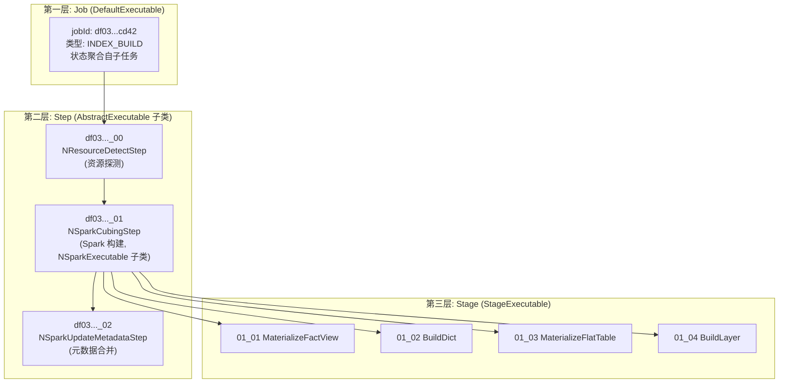
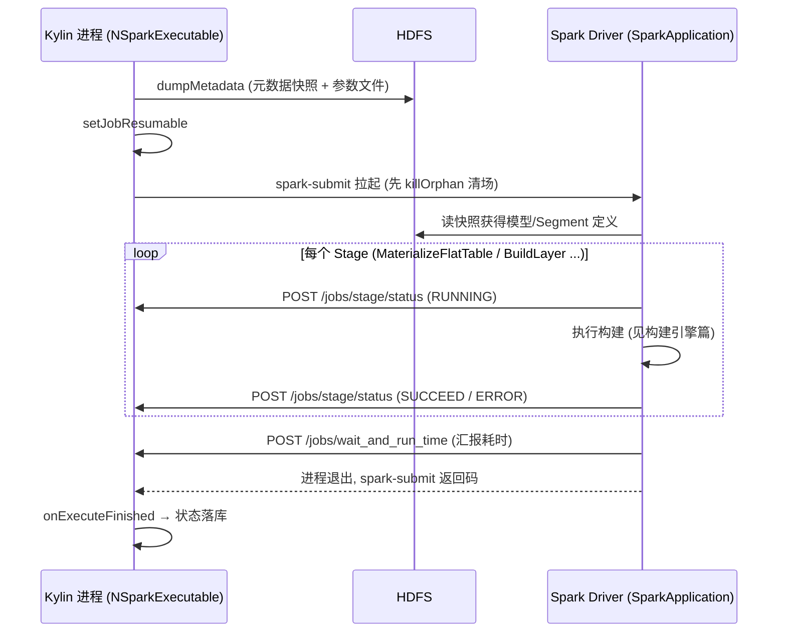

# 硬核拆解 Kylin 任务执行框架：Executable 三层树、DAG 并行调度与 Spark 进程协同 —— 抢到锁之后发生的一切

> **作者**：Huang Sheng (mrhs121)  
> **日期**：2026-08-21  
> **分类**：`Apache Kylin` · `任务执行` · `DAG 调度` · `状态机` · `spark-submit` · `源码剖析`

---

## 0. 导读：从"抢到锁"到"Segment 构建完成"之间隔着什么？

前两篇我们拆完了 Kylin 多节点架构的两块基石：[元数据靠 AuditLog 复制保持一致](2026-08-21-kylin-metadata-resourcestore-unitofwork-auditlog.md)，[任务靠 job_lock 租约保证互斥](2026-08-21-kylin-job-scheduler-jdbc-lock-leader-election.md)。上一篇结束在 `JdbcJobScheduler.executeJob()` 抢到 Job 锁、把任务丢进执行线程池的那一刻。

但"执行一个构建任务"远不是调一个函数那么简单。一个 Segment 构建 Job 实际上是：

- **一棵三层任务树**：Job（`DefaultExecutable`）→ 步骤（`NSparkExecutable` 等）→ Stage（`StageExecutable`）；
- **两个进程的协同**：任务树运行在 Kylin 进程（Job 节点）里，但真正的重活跑在 **spark-submit 拉起的独立 Spark Driver 进程**中，两边靠元数据快照 + REST 回调通信；
- **一台随时可能被外力拨动的状态机**：用户可以暂停、恢复、重启、丢弃任务，节点可能宕机重启——执行线程必须在任何一步感知"世界变了"并正确退场。

本篇拆解 `core-job` 的 execution 包与 `engine-spark` 的任务接入层，把"抢到锁之后发生的一切"讲清楚。核心源码索引：

| 组件 | 位置 | 职责 |
|---|---|---|
| `ExecutableManager` | `core-job/.../execution/ExecutableManager.java`（2000+ 行） | 任务 CRUD、状态推进、PO↔对象互转 |
| `AbstractExecutable` | `core-job/.../execution/AbstractExecutable.java` | 执行生命周期模板：start → doWork(重试) → finished |
| `DefaultExecutable` | `core-job/.../execution/DefaultExecutable.java` | 任务树根节点：CHAIN / DAG 两种子任务调度 |
| `StageExecutable` | `core-job/.../execution/StageExecutable.java` | 第三层 Stage 节点（执行体在 Spark 侧） |
| `NSparkExecutable` | `engine-spark/.../job/NSparkExecutable.java` | 元数据快照 + spark-submit + 断点续跑 |
| `StageExec` | `engine-spark/.../job/step/StageExec.scala` | Spark Driver 侧的 Stage 汇报协议 |

---

## 1. 任务的解剖学：三层 Executable 树

一个构建 Job 在 Web UI 上显示为"一个任务 + 若干步骤 + 每步若干子阶段"，对应代码里的三层结构：



三层的分工：

- **Job 层**（`DefaultExecutable`）：只是容器与聚合器。它的 `doWork` 不干实事，只负责调度子任务；它的最终状态由 `checkState()` 遍历子任务算出（全部 SUCCEED/SKIP → SUCCEED；有 ERROR → ERROR；有 DISCARDED → DISCARDED...）；
- **Step 层**：真正的执行单元。`addTask()` 时被赋予 `{jobId}_00 / _01 / _02` 形式的 ID 与 stepId，串成执行序列；
- **Stage 层**（`StageExecutable`）：**它的 `doWork` 直接返回 null**（`StageExecutable.java:43`）——因为 Stage 的执行体不在 Kylin 进程里，而在 Spark Driver 进程里（第 5 节），Kylin 侧的 StageExecutable 只是一个**状态投影**，供前端展示进度。注意它的 `getOutput(segmentId)` 带 Segment 参数：多 Segment 并行构建时，同一个 Stage 对每个 Segment 各有一份状态。

任务树的持久化形态是 `ExecutablePO`（JSON 序列化后存元数据 JOB_INFO 表），`ExecutableManager.fromPO()` 负责反序列化重建对象树——上一篇 `consumeJob` 里的 `getJobExecutable(jobInfo)` 调的就是它。**任务树是无状态的、随用随建的**：每次调度、每次前端查询都从 PO 重建，状态永远以元数据为准，这让任务对象天然支持跨节点漂移。

---

## 2. AbstractExecutable：一个执行单元的生命周期模板

所有层级共享同一个模板方法（`AbstractExecutable.java:369`）：

```java
public final ExecuteResult execute(JobContext jobContext) throws ExecuteException {
    onExecuteStart();                       // ① 状态推进 PENDING → RUNNING
    do {
        if (retry > 0) pauseOnRetry();      // 重试前按配置间隔休眠
        try {
            result = wrapWithExecuteException(() -> doWork(jobContext));   // ② 干活
        } catch (JobStoppedException jse) {
            result = ExecuteResult.createSucceed();   // 被叫停不算失败, 走 finished 收尾
        } catch (Exception e) {
            result = ExecuteResult.createError(e);
        }
        retry++;
    } while (needRetry(this.retry, result.getThrowable()));   // ③ 白名单重试
    onExecuteFinished(result);              // ④ 终态落库
    return result;
}
```

模板本身平平无奇，精髓在三个配套机制：

### 2.1 协作式取消：abortIfJobStopped

执行线程与用户操作（暂停/重启/丢弃）之间是典型的并发竞争：用户在 Web UI 点了"重启"，把所有 Step 状态拨回 READY，但旧执行线程可能还活着，正打算把 Step 1 标记为 SUCCEED——这一写就破坏了重启语义。

Kylin 的解法是**在每个状态写入点前置检查父任务状态**（`abortIfJobStopped`，`AbstractExecutable.java:470`）：

```java
Boolean aborted = JobContextUtil.withTxAndRetry(() -> {
    ExecutableState state = getParent().getStatus();
    switch (state) {
    case READY: case PENDING: case PAUSED: case DISCARDED:
        // 父任务被外力拨动了, 本线程应当自我了断
        if (applyChange) updateJobOutput(project, getId(), state, ...);
        return true;
    default:
        return false;
    }
});
if (aborted) throw new JobStoppedNonVoluntarilyException();
```

所有状态写入都被包在 `wrapWithCheckQuit(Callback)` 里，形成"**检查-写入**"在同一个元数据事务中的原子组合（`AbstractExecutable.java:236`）：先事务外检查一次（快速失败），再在事务内复查一次（防止检查与写入之间的窗口期）。若事务内抛出 JobStoppedException，说明"这个短窗口里用户又改了状态"，外层循环 `tryAgain` 重来。

`JobStoppedNonVoluntarilyException` 沿调用栈上抛，在 `execute()` 里被转换为 `createSucceed()`——**被外力停止的任务不算执行失败**，它只是安静退场，把舞台留给用户期望的新状态。这套协作式取消不依赖 Thread.interrupt，而是依赖"每个写入点都是检查点"，代价是取消有延迟（要等到下一个写入点），换来的是永远不会出现半提交状态。

### 2.2 白名单重试

`needRetry`（`AbstractExecutable.java:511`）的规则：

- `DefaultExecutable`（Job 层）永不重试——重试只发生在 Step 粒度，Job 重试没有意义；
- 次数上限 `kylin.job.retry`（默认 0，即不重试）；
- **异常白名单** `kylin.job.retry-exception-classes`：只有命中白名单的异常才重试。这是生产上很实用的开关——比如把 YARN 队列偶发的提交超时异常加进白名单，让瞬态故障自愈，而代码 Bug 类异常立即失败。

### 2.3 终态钩子与 DAG 联动

`onExecuteFinished` 失败分支里有一个容易错过的调用：`killOtherPipelineApplicationOrUpdateOtherPipelineStepStatus()`——当 DAG 模式下某条流水线的 Step 失败时，**主动找出并行流水线里还在 RUNNING 的兄弟 Step，逐个暂停/杀掉其 Spark Application**。没有这一步，一条流水线失败后其它流水线还会傻跑几十分钟，白烧集群资源。

---

## 3. DefaultExecutable：CHAIN 与 DAG 两种子任务调度

Job 层的 `doWork`（`DefaultExecutable.java:70`）按 `JobSchedulerModeEnum` 分流：

### 3.1 CHAIN 模式（默认）：朴素串行

```java
public void chainedSchedule(List<Executable> executables, JobContext context) {
    for (Executable subTask : executables) {
        executeStep(subTask, context);    // 逐个执行, isRunnable 检查支持断点跳过
    }
}
```

`executeStep` 的三分支值得注意：`isRunnable()`（READY/PENDING）则执行；状态已是 SUCCEED/SKIP 则**跳过**——这就是 Job 级断点续跑的实现：重启的任务从上次失败的 Step 继续，已成功的 Step 不重跑。

### 3.2 DAG 模式：每个节点一根线程的递归展开

多 Segment 并行构建等场景下，Step 之间不是链而是图——每个 Step 的 PO 里带 `previousStep`（前驱 ID）与 `nextSteps`（后继 ID 集合）。`dagSchedule`（`DefaultExecutable.java:95`）：

```java
// 1. 找出无前驱的顶层节点
List<Executable> dagTopExecutables = executables.stream()
        .filter(e -> StringUtils.isBlank(e.getPreviousStep())).collect(toList());
// 2. 从顶层开始递归执行
dagExecute(dagTopExecutables, dagExecutablesMap, context);
// 3. 主线程轮询等待所有节点到达终态
waitAllDagExecutablesFinished(executables);
```

`dagExecute` 的并行策略很直白：**单个候选节点就地执行，多个候选节点各起一根 `ExecutableThread`**；每个节点执行完毕后递归调度自己的 `nextSteps`（`executeDagExecutable`：检查前驱 SUCCEED → 执行自身 → 递归后继）。汇合等待用的是 10 秒轮询而非闭锁：

```java
while (true) {
    long runningCount = dagExecutables.stream()
            .filter(e -> RUNNING/PENDING/READY).count();
    if (runningCount == 0) break;                    // 全部到达终态
    if (存在 ERROR/PAUSED/DISCARDED 节点) break;      // 快速退出, 不等无谓的尾巴
    TimeUnit.SECONDS.sleep(10);
}
```

这个实现的取舍很"Kylin"：没有引入任何 DAG 执行库，用"线程 per 分支 + 状态轮询"实现了够用的并行度——因为 Step 数量级是个位数到几十，每个 Step 动辄分钟级，调度开销完全不敏感，简单可调试压倒一切。**汇合点判断依赖的状态读的是元数据**（`getStatus()` 走 ExecutableManager），所以 DAG 推进天然与用户暂停/丢弃操作联动：外力拨动任何节点状态，轮询循环下一拍就感知。

分叉失败的联动清理由 2.3 节的 `killOtherPipeline...` 完成——失败 Step 沿 `previousStep` 找到同源的兄弟流水线，递归定位其 RUNNING 节点并暂停。

---

## 4. NSparkExecutable：跨进程执行的三个关键设计

第二层 Step 里最重要的实现是 `NSparkExecutable`（Spark 构建步骤基类，`engine-spark/.../NSparkExecutable.java:92`）。它的 `doWork`（`NSparkExecutable.java:236`）不做任何计算，职责是**把一个 Spark 进程安全地拉起来**：

```
doWork:
  1. 环境检查 (SPARK_HOME / kylin job jar / hive-site.xml)
  2. dumpKylinProps + MetadataDumpUtil.dumpMetadata   ← 元数据快照
  3. setJobResumable                                   ← 断点标记
  4. createArgsFileOnHDFS                              ← 参数落 HDFS
  5. runSparkSubmit                                    ← 拉起独立 Spark Driver
```

### 4.1 元数据快照：Spark 进程不连元数据库

`MetadataDumpUtil.dumpMetadata(dumpInfo)` 把本次构建涉及的元数据（模型、IndexPlan、Segment、表定义...）**导出成文件快照**放到 HDFS 的 job 临时目录，并 `setDistMetaUrl(config.getJobTmpMetaStoreUrl(...))` 让 Spark 进程从快照读元数据。

这个设计一石三鸟：

- **隔离**：Spark Driver/Executor 不需要元数据库连接与凭证，集群侧攻击面和连接数都大幅缩小；
- **一致性**：构建全程使用提交时刻的元数据快照，中途用户改模型不会让构建读到"半新半旧"的定义（这可以看作元数据引擎篇 MVCC 思想在进程边界上的延伸——快照即隔离级别）;
- **可重放**：快照在，失败的 Spark 任务可以原样重跑。

### 4.2 断点续跑：isResumable 标记

快照导出成功后，任务被标记 `resumable`。此后如果节点宕机、任务被其它节点接管重跑（上一篇的 resume 自愈闭环），`doWork` 检测到 `isResumable()` 就**跳过元数据快照重建**——直接复用 HDFS 上已有的快照与参数文件。配合构建引擎篇讲过的 Segment 内部 checkpoint（`isFactViewReady` / `isDictReady` / Layout 级跳过），Kylin 的构建恢复是三级粒度的：**Job 级（跳过已成功 Step）→ Step 级（复用元数据快照）→ Stage/Layout 级（跳过已物化产物）**。

### 4.3 孤儿进程治理

`runSparkSubmit` 的第一行是 `killOrphanApplicationIfExists`：提交前先按 jobStepId 去 YARN/K8s 查杀同名的历史 Application。场景：上次执行的 Kylin 节点崩溃，但它拉起的 Spark Application 还活着——不杀掉就会出现两个 Spark 任务同时写同一个 Segment 目录。**锁的租约只能保证 Kylin 侧互斥，Spark 侧的互斥要靠"提交前清场"**。

### 4.4 反向通道：Spark Driver 的 REST 汇报

Spark 进程里的执行体是 `SparkApplication`（如 `SegmentBuildJob`，见构建引擎篇），其中每个 Stage（`StageExec.scala:48`）在开始/结束时通过 REST 回调 Kylin 节点：

```scala
def onStageStart(): Unit = updateStageInfo(ExecutableState.RUNNING.toString, null, null)
def onStageFinished(state: ExecutableState): Unit = updateStageInfo(state.toString, ...)
// updateStageInfo → POST /kylin/api/jobs/stage/status
```

这就补全了第 1 节的谜题：**StageExecutable 的 doWork 为什么返回 null**——Stage 状态不是 Kylin 侧推进的，而是 Spark Driver 侧通过 `/kylin/api/jobs/stage/status` 回调写入的。两个进程的职责边界清晰：



Kylin 侧同时监视 spark-submit 子进程的返回码作为兜底——REST 回调丢了（网络分区），进程退出码仍能驱动 Step 终态。

---

## 5. ExecutableManager：所有状态变更的唯一闸口

贯穿全文的 `updateJobOutput` 都汇聚到 `ExecutableManager`（2000+ 行，任务体系的"户籍科"）。它做三件事：

1. **状态机护栏**：所有状态推进先过 `ExecutableState.VALID_STATE_TRANSFER` 合法性检查（上一篇展示过这张转移表）——`PENDING→SUCCEED` 这类跳变会被直接拒绝，任何代码路径都无法绕过；
2. **事务化写入**：状态、输出、耗时统计的更新全部走 `UnitOfWork` 事务（元数据引擎篇的通道），并通过 AuditLog 复制到所有节点——**这就是为什么前端连到任意 Query 节点都能看到实时任务进度**；
3. **大字段分流**：任务日志（Spark 输出）不进元数据库，走 `updateJobOutputToHDFS` 写 HDFS，元数据里只存路径——防止构建日志把元数据表撑爆。

至此可以画出一条完整的因果链，把三篇文章串起来：

```
用户提交构建
  → ExecutableManager 创建 ExecutablePO (READY)          [本篇]
  → Master 节点 produceJob: 插 job_lock 空锁, READY→PENDING  [上一篇]
  → 某节点 consumeJob: CAS 抢锁, 内存准入, 线程池执行        [上一篇]
  → DefaultExecutable.execute: CHAIN/DAG 调度子 Step        [本篇]
  → NSparkExecutable: 元数据快照 → spark-submit             [本篇]
  → SegmentBuildJob: FlatTable → 字典 → Layout 物化         [构建引擎篇]
  → Stage 状态 REST 回调, Layout 元数据 pipe+drain 落库     [本篇+元数据篇]
  → 状态变更写 AuditLog, 复制到全部节点                     [元数据篇]
  → 前端任意节点可见: 任务 SUCCEED
```

---

## 6. 生产排障速查

| 现象 | 机制定位 | 排查方向 |
|---|---|---|
| 点了"重启"但任务日志显示旧线程还在写状态 | 2.1 协作式取消 | 正常竞态，旧线程会在下一个写入点自我了断；若持续数分钟，检查该 Step 是否卡在无写入点的长操作（如 spark-submit 等待队列资源） |
| Step 失败但没有按预期重试 | 2.2 白名单重试 | `kylin.job.retry` 是否 >0；异常类是否在 `kylin.job.retry-exception-classes` 白名单内（注意匹配的是全类名） |
| DAG 任务一条流水线失败，其它流水线还在跑 | 2.3 联动清理 | 检查失败 Step 的日志里有无 `kill other piper line` 记录；PAUSED 的兄弟步骤属于预期行为 |
| YARN 上出现同一 jobStepId 的两个 Application | 4.3 孤儿治理 | 说明 killOrphan 查杀失败（YARN RM 通信问题），需手工 kill 旧 Application 防止双写 |
| 任务卡在 RUNNING 但 Spark UI 上早已结束 | 4.4 反向通道 | REST 回调与进程返回码双双丢失（极少见）；检查 Kylin 节点是否发生过重启，用 resume 机制重跑 |
| 前端 Stage 进度长时间不动 | 4.4 | Stage 粒度较粗（BuildLayer 一个 Stage 可能占全程 80% 时间），先看 Spark UI 的 Job/Stage 明细再下结论 |
| 重启任务后从头开始跑而非断点续跑 | 4.2 | 检查任务是否在元数据快照完成前失败（未到 resumable 标记点）；HDFS job 临时目录是否被清理策略误删 |

---

## 7. 总结

Kylin 任务执行框架回答了"抢到锁之后"的三个问题：

1. **怎么组织**：Job → Step → Stage 三层树，PO 持久化 + 随用随建，状态永远以元数据为准，任务对象天然可跨节点漂移；
2. **怎么推进**：模板方法固定生命周期，"每个状态写入点都是取消检查点"实现无中断标志的协作式取消；CHAIN 顺序执行保简单，DAG 线程递归展开保并行，白名单重试保瞬态自愈；
3. **怎么跨进程**：元数据快照实现"Spark 不连元数据库"的隔离与一致性，resumable 三级断点降低故障重跑成本，REST 回调 + 进程返回码双通道保证状态终能闭合。

连同前两篇，"Kylin 元数据引擎"系列的完整版图：**AuditLog 复制解决状态一致，job_lock 租约解决动作互斥，Executable 框架解决执行编排**——三者层层依赖，共同构成 Kylin 多节点架构的底盘。

---

> **交叉阅读**：
> - Spark Driver 进程里的构建全流程 → [构建引擎:Spark Segment Build 全链路](2026-08-20-kylin-spark-segment-build-pipeline.md)；
> - 状态写入走的事务与复制通道 → [元数据引擎:ResourceStore、UnitOfWork 与 AuditLog 复制](2026-08-21-kylin-metadata-resourcestore-unitofwork-auditlog.md)；
> - 抢锁与调度的上半场 → [作业调度:JdbcJobScheduler 与租约选主](2026-08-21-kylin-job-scheduler-jdbc-lock-leader-election.md)。
