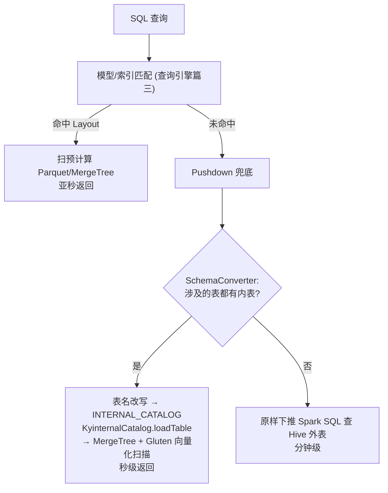

# 硬核拆解 Kylin 内表 (Internal Table)：明细查询的"第二引擎" —— 从 Hive 外表到 MergeTree 内表的加速之路

> **作者**：Huang Sheng (mrhs121)  
> **日期**：2026-08-21  
> **分类**：`Apache Kylin` · `Internal Table` · `Gluten` · `MergeTree` · `DataSource V2` · `源码剖析`

---

## 0. 导读：预计算的盲区，内表来补

Kylin 的看家本领是预计算：聚合查询命中 Layout，亚秒返回。但有两类查询始终是预计算的盲区：

1. **即席明细查询**：`SELECT * FROM lineorder WHERE ...` 这类没建 Table Index、或维度组合无法穷举的探索式查询，只能 Pushdown 直查 Hive/数据湖——而 Hive 外表往往是 TextFile/ORC 小文件、无合理分区排序，一查就是分钟级；
2. **维表回查**：查询引擎系列讲过的派生维度 Snapshot 回查、维表直查，走的是构建期冻结的 Snapshot 文件，大维表场景下既慢又占空间。

Kylin 5 的 **Internal Table（内表）** 正是为这两个盲区设计的"第二引擎"：**把源表数据以查询友好的格式（默认 ClickHouse MergeTree，配合 Gluten 向量化引擎）重新装载一份到 Kylin 自管的存储里**，Pushdown 查询不再打到 Hive，而是扫这份分区 + 排序 + 分桶都优化过的"内部副本"。一句话定位：

> **模型/索引加速聚合，内表加速明细与 Pushdown ——两者合起来才是完整的查询加速版图。**

本文基于源码拆解内表的完整实现：元数据定义 → 数据装载 → 自定义 Spark Catalog → 查询路由 → 维表策略 → Gluten 缓存预热。核心源码索引：

| 组件 | 位置 | 职责 |
|---|---|---|
| `InternalTableDesc` / `InternalTablePartition` | `core-metadata/.../metadata/table/` | 内表元数据实体（`MetadataType.INTERNAL_TABLE`）|
| `InternalTableService` / `InternalTableLoadingService` | `datasource-service/.../rest/service/` | 建表/装载/分区管理 API |
| `InternalTableLoadJob` + `InternalTableLoader` | `engine-spark/.../job/` 与 `builder/` | Spark 装载作业 |
| `KyinternalCatalog` | `spark-project/kylin-internal-catalog/` | Spark DataSource V2 自定义 Catalog |
| `SchemaConverter` | `query-common/.../query/util/` | Pushdown SQL 的表名改写器 |
| `OlapContext#deduceLookupPolicy` | `query-common/.../relnode/OlapContext.java:460` | 维表回查策略裁决 |
| `InternalTableLoadCacheStep` | `engine-spark/.../job/` | Gluten 缓存预热步骤 |

---

## 1. 元数据：InternalTableDesc 与"一表两面"

内表不是独立的新表，而是**已加载源表（TableDesc）的一个优化副本**。`InternalTableDesc`（`InternalTableDesc.java:56`）继承 `ATable`，与源表同名同列，核心增量字段：

```java
public enum StorageType {
    PARQUET("parquet"),       // 开发调试用
    GLUTEN("clickhouse"),     // MergeTree, 生产默认
    DELTALAKE("delta"),       // 规划中
    ICEBERG("iceberg");       // 规划中
}

@JsonProperty("tbl_properties")  Map<String, String> tblProperties;  // 分桶/主键/排序键等
@JsonProperty("location")        String location;                    // 自管存储路径
@JsonProperty("table_partition") InternalTablePartition tablePartition; // 分区列+日期格式
@JsonProperty("partition_range") List<String[]> partitionRange;      // 已装载的分区范围
@JsonProperty("hit_count")       long hitCount;                      // 查询命中计数
```

几个关键点：

- **存储位置自管**：`generateInternalTableLocation()` 生成 `{workingDir}/{project}/Internal/{db}/{table}`——数据离开 Hive 的地盘，进入 Kylin 工作目录，生命周期完全由 Kylin 管理；
- **tblProperties 是性能的核心**：`getBucketColumn()/getBucketNumber()`（分桶）、`getPrimaryKey()/getOrderByKey()`（MergeTree 的主键与排序键——源码注释明确约束 *primaryKey must be sub-set and prefix of orderByKey*，与 ClickHouse 语义一致）、`isPreloadedCacheEnable()`（装载完成后是否预热 Gluten 缓存）；
- **源表打标**：创建内表后，源 `TableDesc.hasInternal` 置位（`TableDesc.java:97`）——查询期就是靠这个标记判断"这张表有内表副本可用"；
- 元数据类型为 `MetadataType.INTERNAL_TABLE`，一等公民，走元数据引擎篇的全套事务与复制通道。

配置总开关：`kylin.internal-table-enabled`（默认 false）。

---

## 2. 数据装载：InternalTableLoader 的一次"格式再造"

建好内表定义后，需要把源表数据装载进来。装载是一个标准构建作业（`InternalTableJobHandler` 创建，走作业调度篇的 job_lock 抢单），Spark 侧入口 `InternalTableLoadJob extends SparkApplication`，实际写入逻辑在 `InternalTableLoader.loadInternalTable`（`InternalTableLoader.scala:62`）：

```scala
// 1. 读源表 (Hive), 按需过滤
var sourceData = getSourceData(ss, table, startDate, endDate, partitions, incremental)
// 全量: ss.table(源表)
// 增量: .where(分区列 BETWEEN startDate AND endDate)   ← 与 Segment 时间范围同构
// 指定分区: .filter(分区列.isin(partitions))

// 2. 可选: 按分区列全局排序后再写 (提升每个分区文件内的局部性)
if (table.isSortByPartitionEnabled) {
    sourceData = sourceData.sort(partitionColumns: _*)
}

// 3. 组装 writer: 分区 + 分桶 + MergeTree 键
writer = sourceData.write.option("clickhouse.storage_policy", storagePolicy)
writer = writer.partitionBy(partitionColumn: _*)                      // 目录级分区
writer = writer.option("clickhouse.bucketColumnNames", bucketColumn)  // 分桶
              .option("clickhouse.numBuckets", bucketNum)
writer = writer.option("clickhouse.primaryKey", primaryKey)           // MergeTree 主键索引
              .option("clickhouse.orderByKey", orderByKey)            // 数据排序键

// 4. 增量装载 = Spark 动态分区覆盖
if (incremental) ss.conf.set("spark.sql.sources.partitionOverwriteMode", "dynamic")
writer.format("clickhouse").mode("overwrite").save(location)
```

这段代码信息量很大：

1. **`format("clickhouse")` 写出的是 MergeTree**：Gluten 的 ClickHouse backend 提供了 Delta 协议包装的 MergeTree 表（`ClickHouseTableV2`，delta 事务日志管理 MergeTree part 文件）。装载完成后，数据带有 MergeTree 的稀疏主键索引与有序 part——这就是内表比 Hive 外表快的物理根源：**分区裁剪（partitionBy）+ 主键跳数索引（primaryKey）+ 有序扫描（orderByKey）+ 分桶（bucket）四层加速全部在装载期固化**；
2. **增量装载复用了 Segment 的思维**：按日期分区列圈定范围、动态分区覆盖写入，重复装载同一天幂等——`partitionRange` 字段记录已装载范围，与 Segment 的时间线管理如出一辙；
3. **分区管理是 Delta 语义**：`dropPartitions`（`InternalTableLoader.scala:180`）先 `DeltaTable.delete(partition条件)` 删事务日志记录，再直接删文件系统目录（源码注释坦率地说：vacuum 太慢，暂时用文件系统删除）；`getPartitionInfos` 则从 Delta snapshot 的 AddFile 列表聚合出每个分区的大小与文件数，回写 `InternalTablePartitionDetail` 供前端展示。

---

## 3. KyinternalCatalog：一个只读的 Spark V2 Catalog

装载完的数据如何被查询到？这是内表实现里最优雅的一块——Kylin 注册了一个自定义 Spark Catalog（`KyinternalCatalog.scala:42`）：

```scala
class KyinternalCatalog extends TableCatalog with SupportsNamespaces {
  override def name(): String = "INTERNAL_CATALOG"

  override def loadTable(ident: Identifier): Table = {
    // ident = INTERNAL_CATALOG.{project}.{db}.{table}
    val internalDesc = InternalTableManager.getInstance(kylinConfig, project)
        .getInternalTableDesc(db + "." + table)
    internalDesc.getStorageType match {
      case PARQUET    => ParquetTable(..., Seq(internalDesc.getLocation), ...)
      case CLICKHOUSE => new ClickHouseTableV2(spark, new Path(internalDesc.getLocation))
      case DELTA      => DeltaTableV2(spark, new Path(internalDesc.getLocation))
    }
  }
  // createTable/alterTable/dropTable: 空实现 —— DDL 只能走 Kylin API
}
```

设计意图非常清晰：

- **Catalog 是元数据的翻译官**：`loadTable` 读 Kylin 自己的 `InternalTableManager` 元数据，按存储类型返回对应的 Spark V2 Table 对象——Spark 后续的分区裁剪、谓词下推、向量化扫描全部走各格式的原生实现（MergeTree 表配合 Gluten 就进入 C++ 向量化通道，见向量化引擎篇）；
- **三级命名空间**：`INTERNAL_CATALOG.{project}.{db}.{table}`——把项目编码进 namespace，一个 Sparder 实例天然支持多项目内表隔离；
- **只读**：createTable/dropTable 等 DDL 全是空实现，内表的生命周期只能通过 Kylin 的 REST API + 构建作业管理——存储与元数据的一致性由 Kylin 兜底，不给 Spark SQL 旁路留口子。

---

## 4. 查询路由：SchemaConverter 的"偷天换日"

最后一块拼图：用户的 SQL 写的是 `SELECT * FROM SSB.LINEORDER`，怎么让它查到 `INTERNAL_CATALOG` 里去？

答案藏在 Pushdown 转换器链里（`KylinConfigBase.java:2583`）：

```java
public String[] getPushDownConverterClassNames() {
    return new String[] { ...,
            "org.apache.kylin.query.util.SchemaConverter",       // ← 内表改写器
            "org.apache.kylin.query.util.SparkSQLFunctionConverter" };
}
```

回忆查询引擎第 6 篇：查询无法命中模型时进入 Pushdown 兜底，下推前 SQL 会过一遍转换器管道。`SchemaConverter`（`SchemaConverter.java:95`）就挂在这条管道上：

```java
// 1. Calcite 解析 SQL, TableNameVisitor 收集所有表名及其在原文中的位置
// 2. 对每个表名: 查 InternalTableManager, 存在内表 → 字符串替换为
//    "INTERNAL_CATALOG"."{project}"."{db}"."{table}"
// 3. 不存在内表 → 抛 IllegalStateException (该 SQL 退回普通 Hive 下推)
// 4. 记录 QueryMetrics.INTERNAL_TABLE 的 NativeQueryRealization
sql = sql.substring(0, pos.start) + table.getDoubleQuoteInternalIdentity() + sql.substring(pos.end);
```

于是完整的查询路由变成三级瀑布：



同时记录的 `NativeQueryRealization(INTERNAL_TABLE)` 会出现在查询历史里——排查时看 Query History 的 realization 类型即可确认一条 Pushdown 查询走的是内表还是裸 Hive。

### 4.1 维表回查的第三种答案

内表还悄悄改写了另一条链路。查询引擎第 3 篇讲过：维表直查/派生维度回查历来靠构建期冻结的 **Snapshot**。`OlapContext.deduceLookupPolicy`（`OlapContext.java:460`）现在做三选一：

```java
if (olapConfig.isInternalTableEnabled() && tableDesc.isHasInternal()) {
    policy = isDigestOfRawQuery ? Policy.INTERNAL_TABLE          // 明细直查维表
                                : Policy.AGG_THEN_INTERNAL_TABLE; // 聚合查维表
} else if (!internalTableEnabled && snapshotPath != null) {
    policy = ... Policy.SNAPSHOT / AGG_THEN_SNAPSHOT;             // 传统 Snapshot
}
```

开启内表后，维表查询**优先走内表而非 Snapshot**。收益是双份的：维表数据不再需要在每次构建时刷 Snapshot（增量装载即可保鲜），且 MergeTree + Gluten 的扫描性能远好于 Snapshot Parquet。这实际上为"去 Snapshot 化"铺了路。

---

## 5. 锦上添花：装载完成即预热 Gluten 缓存

装载作业的最后一步 `InternalTableLoadCacheStep`（`InternalTableLoadCacheStep.java:52`）：

```java
var cacheTableCommand = GlutenCacheUtils.generateCacheTableCommand(
        getConfig(), getProject(), table, start, ...);
// 生成 Gluten CACHE 命令, 把新装载的 MergeTree part 预热到 Executor 本地 SSD
```

这与向量化引擎篇讲的 Gluten Native Cache（RocksDB 元数据 + SSD 缓存）直接联动：数据落盘 → 立刻推给各 Executor 预热 → **首查即命中本地缓存**。开关链条是 `kylin.internal-table.preloaded-cache.enabled && isInternalTableEnabled && queryUseGlutenEnabled`（`KylinConfigBase.java:521`）——三者齐备才预热，缺一则静默跳过。

到这里可以看清内表与 Gluten 的关系：**内表负责"数据长成查询友好的样子"（MergeTree 排序/分桶/主键），Gluten 负责"用最快的方式扫它"（C++ 向量化 + SSD 缓存）**——两者是一对设计上的连体特性，这也是内表默认存储类型是 `GLUTEN` 的原因。

---

## 6. 全景与对比

把内表放进 Kylin 的存储版图：

| 维度 | Hive 外表 (Pushdown) | Snapshot | 预计算 Layout | **Internal Table** |
|---|---|---|---|---|
| 数据内容 | 源明细 | 维表全量冻结 | 聚合结果 | **源明细副本** |
| 存储格式 | Text/ORC/Parquet 不可控 | Parquet | Parquet/MergeTree | **MergeTree (默认)** |
| 排序/分桶/主键索引 | 无保证 | 无 | 按 Layout 定义 | **建表时声明, 装载期固化** |
| 数据保鲜 | 实时(源) | 每次构建刷新 | Segment 构建 | **增量装载 (动态分区覆盖)** |
| 加速对象 | — | 维表回查 | 聚合查询 | **明细/即席/维表查询** |
| 查询通道 | Spark SQL | 内置回查 | 模型匹配 | **SchemaConverter + 自定义 Catalog** |

设计上值得抽象的三点：

1. **用 Catalog 抽象隔离存储演进**：查询侧只认 `INTERNAL_CATALOG`，存储类型（Parquet/MergeTree/Delta/Iceberg）在 `loadTable` 一处切换——枚举里预留的 DELTALAKE/ICEBERG 说明内表未来可以直接"长"在开放湖格式上；
2. **改写而非改引擎**：内表加速完全通过 SQL 文本改写（SchemaConverter）+ Catalog 注册实现，Calcite/Sparder 主链路零侵入——这与全局字典 V3 "把字典变成 Delta 表"是同一种品味：能用标准机制组合解决的，不发明新机制；
3. **明细与聚合的双引擎收敛**：查询首先尝试预计算（最快），失败后落到内表（次快），最后才是裸 Hive（兜底）——三级瀑布让"没建模的查询"也有了可预期的性能下限。

---

## 7. 生产实践与排障速查

| 现象 | 排查方向 |
|---|---|
| 建了内表但 Pushdown 还是查 Hive | `kylin.internal-table-enabled` 是否为 true；SQL 涉及的**所有**表是否都有内表（SchemaConverter 遇到无内表的表会整条退回）；查询历史 realization 是否为 INTERNAL_TABLE |
| 内表查询不如预期快 | 确认 Gluten 已开启（否则 MergeTree 由 JVM 解析，优势打折）；`orderByKey` 是否覆盖高频过滤列；分区列是否与查询时间谓词一致 |
| 增量装载后数据重复 | 增量走动态分区覆盖，幂等的前提是分区列一致；检查 `partition_range` 与作业的 start/end 是否重叠错位 |
| 装载作业成功但首查仍慢 | 预热三开关（internal-table / preloaded-cache / gluten）是否齐备；`InternalTableLoadCacheStep` 日志中 CACHE 命令是否下发成功 |
| 删分区后存储未释放 | 删除走"Delta delete + 文件系统直删"，检查作业日志中 `Trying to delete` 路径；`_delta_log` 目录保留是预期行为 |
| 维表查询还在走 Snapshot | `deduceLookupPolicy` 只在内表开关开启且该维表 `hasInternal` 时切换；查询含 CC/不支持聚合函数/带 Join 时不走 lookup 通道 |

---

## 8. 总结

Internal Table 补上了 Kylin 查询加速版图的最后一块：

1. **定位**：预计算管聚合，内表管明细——Pushdown 从"兜底的慢路径"升级为"有性能下限保证的次快路径"；
2. **实现**：元数据一等公民（INTERNAL_TABLE 类型）、装载即优化（分区/排序/分桶/主键固化进 MergeTree）、Catalog 桥接查询（KyinternalCatalog）、文本改写路由（SchemaConverter）、Gluten 缓存预热收尾；
3. **演进方向**：Snapshot 的替代者、开放湖格式（Delta/Iceberg）的预留位——内表很可能是 Kylin 从"MOLAP 引擎"走向"湖仓查询加速层"的桥头堡。

---

> **交叉阅读**：
> - 内表的最佳拍档 Gluten 向量化与 SSD 缓存 → [Kylin 向量化引擎:当 MOLAP 遇上 Gluten 与 libch.so](2026-08-19-kylin-gluten-native-vectorized-engine.md)；
> - Pushdown 转换器链与三级查询路由 → [查询引擎 (六):Pushdown、流批一体与调优](2026-08-18-kylin-query-engine-06-pushdown-hybrid-and-tuning.md)；
> - 被内表替代的 Snapshot 机制 → [查询引擎 (三):OlapContext 与模型匹配](2026-08-18-kylin-query-engine-03-olap-context-and-cbo.md)；
> - 装载作业的调度与执行框架 → [作业调度:JdbcJobScheduler](2026-08-21-kylin-job-scheduler-jdbc-lock-leader-election.md) / [任务执行框架](2026-08-21-kylin-executable-framework-dag-spark-submit.md)。
