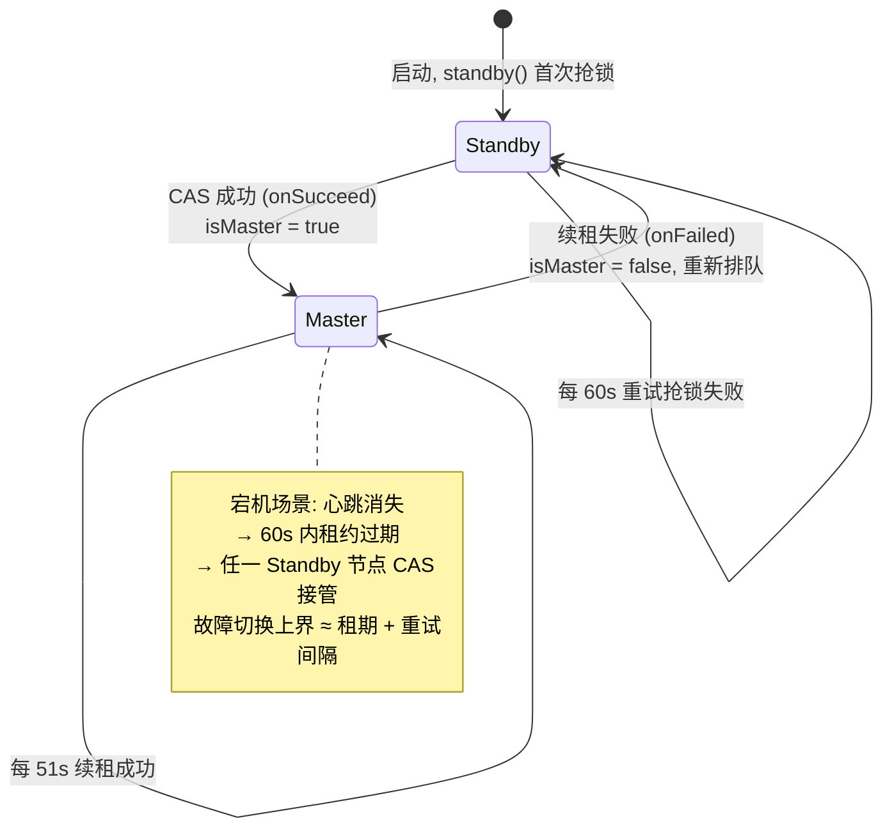
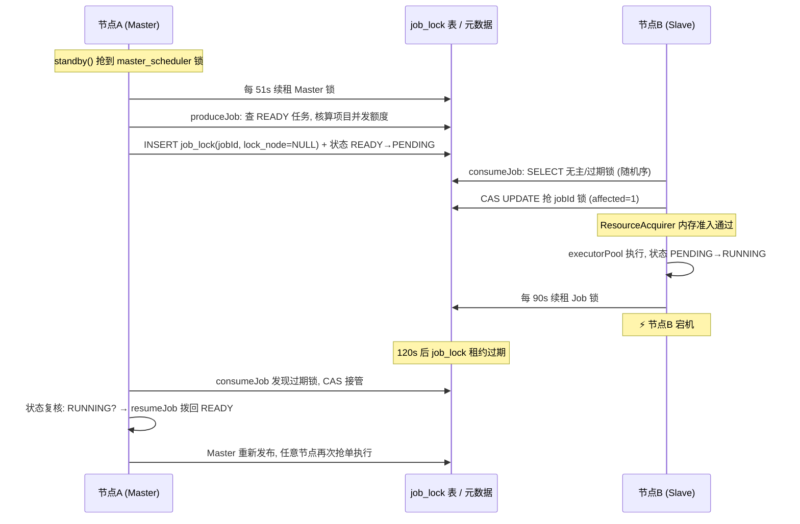

# 硬核拆解 Kylin 作业调度：从 EpochManager 到 JdbcJobScheduler —— 一张数据库表实现选主、抢占与租约续期

> **作者**：Huang Sheng (mrhs121)  
> **日期**：2026-08-21  
> **分类**：`Apache Kylin` · `作业调度` · `分布式锁` · `Leader 选举` · `租约` · `源码剖析`

---

## 0. 导读：调度器的三个分布式难题

在[上一篇元数据引擎](2026-08-21-kylin-metadata-resourcestore-unitofwork-auditlog.md)中，我们看到 Kylin 用一个 RDBMS 同时承载了元数据状态、WAL 日志与复制协议。本篇继续这条"把分布式问题压进数据库"的主线，拆解**作业调度体系**——构建任务（Segment Build / Merge / 索引刷新）在多节点集群里如何被安全地分发与执行。

任何多节点调度器都绕不开三个问题：

1. **谁来派活（选主）**：多个 Job 节点同时扫描任务表，同一个 Job 会被重复调度。必须选出唯一的 Master 负责"发布"任务；
2. **谁来干活（抢占）**：任务发布后，哪个节点执行？如何保证一个任务恰好被一个节点拿到？
3. **人挂了怎么办（租约）**：执行中节点宕机，任务不能永久卡死，锁必须能自动过期并被别人接管。

早期 Kylin 5 用 **EpochManager** 解决这些问题：每个项目一个 Epoch（纪元），Job 节点抢占项目级 Epoch，持有者独占该项目的全部任务调度。这个设计有明显短板：**锁粒度是项目**——一个项目的所有构建任务只能由一个节点调度执行，其它 Job 节点看着它忙死自己闲死；Epoch 的抢占、续期、广播还需要一套独立的管理代码。

当前版本的 Kylin（本文基于源码 `core-job` 模块）已经**移除了 EpochManager**，代之以 `JdbcJobScheduler` + `JdbcJobLock`：**选主、任务抢占、租约续期三件事，全部收敛为对一张 `job_lock` 表的同一条 CAS UPDATE 语句**。锁粒度从"项目"细化到"单个 Job"，所有节点都能执行任何项目的任务。这是一个教科书级的"少即是多"重构，本文将彻底拆解它。

核心源码索引：

| 组件 | 位置 | 职责 |
|---|---|---|
| `JdbcJobScheduler` | `core-job/.../scheduler/JdbcJobScheduler.java` | 调度主体：standby 抢主、produce 发布、consume 抢单执行 |
| `JdbcJobLock` | `core-job/.../core/lock/JdbcJobLock.java` | 锁的值对象：lockId + lockNode + 租约参数 |
| `JdbcLockClient` | `core-job/.../core/lock/JdbcLockClient.java` | 锁客户端：acquire / release / 自动续租调度 |
| `JobLockMapper.xml` | `core-job/.../resources/mybatis-mapper/` | 锁表 SQL（CAS 的真身） |
| `ExecutableState` | `core-job/.../execution/ExecutableState.java` | 任务状态机 |
| `ResourceAcquirer` | `core-job/.../scheduler/JobExecutor.java` 同包 | 节点本地内存信号量准入 |

---

## 1. 前置：节点角色与部署形态

`KylinConfigBase`（`KylinConfigBase.java:2509` 附近）定义了节点角色判定：

```java
public boolean isJobNode()   { return !"query".equals(getServerMode()) && getMicroServiceMode() == null; }
public boolean isQueryNode() { return !"job".equals(getServerMode()) && ... }
```

- **经典部署**：`kylin.server.mode` 取 `all` / `job` / `query`。Query 节点只服务查询（元数据只读 + AuditLog 回放），Job 节点额外运行本文的调度器；
- **微服务部署**：`kylin.micro.service=true` 时按 Spring 应用名拆分为 `query-booter` / `data-loading-booter` / `smart`（推荐服务）/ `ops` / `common`（元数据服务）等独立进程——源码里 `src/*-booter` 模块即对应各微服务入口。

无论哪种形态，**运行 `JobContext` 的节点（Job/data-loading 角色）都是对等的**：没有静态配置的主节点，主是"抢"出来的。

---

## 2. 一张表定乾坤：job_lock 与 CAS 租约

先看地基。所有魔法都在元数据库的 `{identifier}_job_lock` 表：

```
id                BIGINT        自增主键
lock_id           VARCHAR       锁标识: 任务的 jobId, 或特殊值 'master_scheduler'
lock_node         VARCHAR       当前持有者: "host:port", 空闲时为 NULL
lock_expire_time  TIMESTAMP     租约到期时间
project / job_type / priority / create_time / update_time
```

获取与续租是**同一条 SQL**（`JobLockMapper.xml:133`）：

```sql
UPDATE job_lock
SET lock_node = #{lockNode},
    lock_expire_time = TIMESTAMPADD(SECOND, #{renewalSec}, CURRENT_TIMESTAMP),
    update_time = #{updateTime}
WHERE lock_id = #{lockId}
  AND (lock_node IS NULL                          -- 情况1: 无人持有
       OR lock_expire_time < CURRENT_TIMESTAMP    -- 情况2: 持有者租约已过期
       OR lock_node = #{lockNode})                -- 情况3: 我自己(续租/重入)
```

这条 SQL 值得细品，它一次性实现了四种语义：

| 场景 | 命中的 WHERE 分支 | 返回 |
|---|---|---|
| 首次抢锁（无人持有） | `lock_node IS NULL` | affected=1，抢到 |
| 抢过期锁（原持有者宕机） | `expire_time < NOW` | affected=1，接管 |
| 自己续租 | `lock_node = 我` | affected=1，租约顺延 |
| 别人持有且未过期 | 无分支命中 | affected=0，失败 |

**没有 SELECT-then-UPDATE 的竞态窗口**——判断与写入在一条语句里，由数据库行锁保证原子性，天然就是 CAS。释放锁同样一条 DELETE（`removeLock(lockId, lockNode)`，带 lockNode 条件防止误删别人的锁）。

**故障接管不需要任何"检测节点存活"的机制**：宕机节点不再续租，租约到期后 `expire_time < NOW` 分支自动放行下一个竞争者。数据库的时钟成为唯一的仲裁者（这也意味着各节点无需时钟同步——比较全部发生在 DB 端的 `CURRENT_TIMESTAMP` 上，这是个容易被忽略的巧妙之处）。

### 2.1 JdbcLockClient：自动续租的心跳闭环

`JdbcLockClient`（`JdbcLockClient.java:69`）在 acquire 成功后注册自动续租：

```java
public boolean tryAcquire(JdbcJobLock jobLock) throws LockException {
    boolean acquired = tryAcquireInternal(jobLock);   // 执行上面的 CAS UPDATE
    if (acquired) {
        renewalMap.put(jobLock.getLockId(), jobLock); // 登记续租
        scheduler.schedule(() -> renewal(jobLock),
                jobLock.getRenewalDelaySec(), TimeUnit.SECONDS);  // 提前续租
    }
    return acquired;
}

private void renewal(JdbcJobLock jobLock) {
    if (!renewalMap.containsKey(jobLock.getLockId())) return;   // 已主动释放, 停止心跳
    boolean acquired = tryAcquireInternal(jobLock);             // 续租 = 再抢一次
    if (acquired) {
        scheduler.schedule(() -> renewal(jobLock), jobLock.getRenewalDelaySec(), ...);
    }
    // 续租失败则心跳链条自然断开 —— 锁已易主, 不再挣扎
}
```

关键参数是**续租比例**（`renewalDelaySec = renewalRatio × renewalSec`）：

| 锁 | 租期 | 续租比例 | 实际心跳间隔 |
|---|---|---|---|
| Master 锁 | `kylin.job.master-lock-renew-sec` = 60s | 0.85 | 51s |
| Job 锁 | `kylin.job.slave-lock-renew-sec` = 120s | 0.75 | 90s |

**在租约还剩 15%~25% 时提前续租**，留出数据库抖动的缓冲窗口。注意 `tryAcquireInternal` 的 finally 块会回调 `LockAcquireListener.onSucceed/onFailed`——这个监听器就是下一节选主状态翻转的入口。

---

## 3. 选主：Master 只是一把名为 `master_scheduler` 的锁

`JdbcJobScheduler.start()` 启动三个执行体（`JdbcJobScheduler.java:151`）：

```java
master = 单线程调度器("JdbcJobScheduler-Master");   // 抢主 + 发布任务
slave  = 单线程调度器("JdbcJobScheduler-Slave");    // 抢单
executorPool = 弹性线程池(1..consumerMaxThreads);   // 执行任务
```

选主的全部实现是 `standby()`（`JdbcJobScheduler.java:192`）：

```java
private void standby() {
    // 幂等地插入 lock_id='master_scheduler' 的哨兵行 (project='_global')
    if (jobLockMapper.selectByJobId(MASTER_SCHEDULER) == null) {
        jobLockMapper.insertSelective(new JobLock(MASTER_SCHEDULER, "_global", 0, MASTER));
    }
    masterLock.tryAcquire();   // 走第 2 节的 CAS, 挂 MasterAcquireListener
}
```

**Master 身份 = 持有 `lock_id='master_scheduler'` 这一行的租约**，没有独立的选举协议。身份翻转由监听器驱动（`JdbcJobScheduler.java:639`）：

```java
private class MasterAcquireListener implements LockAcquireListener {
    @Override public void onSucceed() {
        if (isMaster.compareAndSet(false, true)) log.info("Job scheduler become master.");
    }
    @Override public void onFailed() {
        if (isMaster.compareAndSet(true, false)) log.info("Job scheduler fallback standby.");
        // 关键: 失败后按租期间隔重新排队抢主
        master.schedule(JdbcJobScheduler.this::standby, masterLock.getRenewalSec(), SECONDS);
    }
}
```

由此形成一个漂亮的状态机——**每个节点永远在"当主"或"排队当主"两种状态之一**：



对比老 EpochManager：不再有每个项目一个的 Epoch 记录、不再有 Epoch 广播通知、不再有"Epoch 持有者才能写该项目元数据"的隐式耦合（事务资格校验退化为 `UnitOfWorkParams.epochChecker` 的可选钩子）。**全集群只有一把 Master 锁，且 Master 的职责被压缩到极小**——只做发布，不做执行，见下一节。

---

## 4. 任务流转：produce / consume 的两级流水线

任务状态机（`ExecutableState.java:36`）中与调度直接相关的主链路：

```
READY ──(Master 发布)──► PENDING ──(任意节点抢到 Job 锁)──► RUNNING ──► SUCCEED / ERROR
```

### 4.1 Master 侧：produceJob，只发令不干活

`produceJob()`（`JdbcJobScheduler.java:210`）每 `master-poll-interval-second`（10s）执行一轮，职责有三：

1. **清理孤锁**（`releaseExpiredLock`）：扫描 `job_lock` 表中已过期或无主的锁，若对应任务已终态（SUCCEED/DISCARDED/SUICIDAL），批量删除锁记录——防止锁表膨胀；
2. **并发额度核算**：统计每个项目 PENDING+RUNNING 的任务数，与项目级 `kylin.job.max-concurrent-jobs` 相减得出本轮可发布额度；READY 任务按 `priority, create_time` 排序进入每个项目的优先级队列（`readyJobCache`）；
3. **发布**（`doProduce`）：对每个待发布任务，**在事务里**插入一行 `job_lock`（lock_node 为 NULL 的"空锁"）+ 调用 `ExecutableManager.publishJob` 把状态推进为 PENDING：

```java
return JobContextUtil.withTxAndRetry(() -> {
    if (jobLockMapper.selectByJobId(jobId) == null
            && jobLockMapper.insertSelective(new JobLock(jobId, project, priority, OFFLINE)) == 0) {
        return false;                    // 锁行创建失败, 本轮放弃
    }
    ExecutableManager.getInstance(config, project).publishJob(jobId, executable);
    return true;
});
```

注意发布前有一行不起眼但极重要的 `StreamingUtils.replayAuditlog()`——**强制追平元数据后再做决策**。Master 的并发核算依赖 Job 元数据，而元数据是异步复制的（上一篇的 AuditLog 回放）；不追平就可能基于陈旧状态超发任务。这是"调度体系构建在元数据体系之上"的直接证据。

另一个细节：`markSuicideJobWithTransaction` 会在发布前检查任务依赖的 Segment/模型是否已被删除，是则直接标记 SUICIDAL（自杀）——源头拦截无意义任务。

### 4.2 Slave 侧：consumeJob，所有节点公平抢单

`consumeJob()`（`JdbcJobScheduler.java:432`）在**每个** Job 节点（包括 Master 自己）以 `poll-interval`（默认 30s）运行：

```java
// 1. 本地准入: 执行线程池还有几个空位?
int exeFreeSlots = consumerMaxThreads - runningJobMap.size();
// 2. 候选发现: 查 job_lock 表里"无主或已过期"的 OFFLINE 锁
List<String> jobIdList = findNonLockIdListInOrder(batchSize, projects);
// 3. 非 Master 节点先追平元数据再执行
if (!isMaster.get()) StreamingUtils.replayAuditlog();
// 4. 逐个尝试抢锁执行
jobIdList.forEach(jobId -> { ...; executorPool.execute(() -> executeJob(...)); });
```

候选发现的 SQL（`JobLockMapper.xml:164`）正是第 2 节 CAS 条件的查询版：

```sql
SELECT lock_id, priority FROM job_lock
WHERE (lock_node IS NULL OR lock_expire_time < CURRENT_TIMESTAMP)
  AND job_type = 'OFFLINE'
ORDER BY priority ASC, create_time ASC LIMIT #{batchSize}
```

多节点同时抢单必然冲突，Kylin 用一个小技巧调和"公平"与"冲突率"（`findNonLockIdListInOrder`，`JdbcJobScheduler.java:484`）：查询结果封装为 `PriorityFistRandomOrderJob`——**空闲节点（无运行任务）按随机序抢**（降低多节点撞锁概率），**忙碌节点按优先级序抢**（保证高优任务先被消化）。抢锁失败（`tryJobLock` 返回 null）不报错不重试，静默跳过——反正别的节点抢到了。

真正执行前还有最后两道闸（`canSubmitJob` + `executeJob`）：

- **ResourceAcquirer 内存准入**：节点级 `Semaphore`，容量 = 可用内存 × `max-local-consumption-ratio`。每个任务按预估内存 `tryAcquire`，不足则放弃本次抢单——避免单节点撑爆自己；
- **状态复核**：抢到锁后再读一次任务状态。若发现状态是 RUNNING（而非预期的 PENDING），说明**原执行节点在运行中途宕机**——当前节点持锁调用 `resumeJob` 把状态拨回 READY，让 Master 重新发布。这就是宕机任务的自愈闭环。

### 4.3 全景时序



---

## 5. 设计对比：EpochManager vs JdbcJobScheduler

| 维度 | 旧 EpochManager | 新 JdbcJobScheduler |
|---|---|---|
| 锁粒度 | 项目级（Epoch per project） | **任务级**（Lock per job）+ 一把全局 Master 锁 |
| 负载均衡 | 项目绑定节点，忙闲不均 | 所有节点抢单，天然均衡；内存信号量自适应节流 |
| 故障切换单位 | 整个项目的调度权转移 | 单个任务的锁转移，影响面最小化 |
| 发布与执行 | Epoch 持有者一肩挑 | Master 只发布（轻），执行全员参与（重活分摊） |
| 与元数据事务耦合 | 事务前强制 checkEpoch | 解耦为可选 epochChecker 钩子 |
| 实现载体 | 独立 Epoch 表 + 管理器 + 广播 | 一张 job_lock 表 + 一条 CAS SQL |

值得抽象出来的三条通用经验：

1. **租约(Lease)是分布式互斥的最低成本方案**：不需要 ZK/etcd，只要有一个支持行级原子更新和时钟的共享存储，`WHERE 无主 OR 过期 OR 是我` 三分支 CAS 就是完整的租约协议；
2. **把"判断谁死了"转化为"等租约过期"**：主动探活（心跳检测、gossip）复杂且易误判；被动过期把活性检测外包给时间，代价只是一个有上界的接管延迟（租期长短的权衡：短租期切换快但 DB 压力大、网络抖动易误失主）；
3. **发布与执行分离**：Master 干的是纯元数据操作（毫秒级），几乎不可能成为瓶颈，也就几乎没有"Master 能力不足"的扩展性焦虑——真正的重活（Spark 构建）由全体节点水平扩展。

---

## 6. 生产排障速查

| 现象 | 排查方向 |
|---|---|
| 任务长期停在 READY | Master 是否存在：查 `job_lock` 表 `lock_id='master_scheduler'` 行的 `lock_node` 与 `lock_expire_time`；日志搜 `become master` / `fallback standby` 判断是否频繁易主（DB 抖动或 GC 停顿导致续租超时） |
| 任务停在 PENDING 无人执行 | 各节点 `No free slots to execute job`（执行槽满）或 `Acquire resource failed`（内存信号量不足）；检查 `kylin.job.max-concurrent-jobs` 与节点内存配比 |
| 同一任务疑似被执行两次 | 正常机制下不会：抢锁 CAS + `runningJobMap` 去重双保险；若出现，检查两节点是否配置了相同的 `server address`（lock_node 撞名会让 CAS 的"是我"分支误判） |
| 节点宕机后任务恢复慢 | 恢复上界 ≈ job 锁租期(120s) + slave 轮询间隔(30s)；可调小 `kylin.job.slave-lock-renew-sec`，代价是续租心跳更频繁 |
| `Renewal lock failed` 频繁出现 | 元数据库连接池耗尽或慢查询；注意续租线程池只有 `lock-client-renewal-threads`(3) 个线程，大量并发任务时确认心跳没有排队延迟 |
| 日志出现 `Resume <RUNNING> job` | 有节点在执行中途异常退出，当前节点正在自愈接管——关注的是"谁退出了、为什么"，而非这条日志本身 |

---

## 7. 总结

Kylin 作业调度的演进方向与元数据体系一脉相承：**把分布式协调问题翻译成单条原子 SQL，把活性问题翻译成租约时间**。最终的运行时图景非常简洁：

- 一张 `job_lock` 表，一条三分支 CAS UPDATE，承载了选主、抢占、续租、故障接管全部语义；
- Master 是"抢到特殊锁的普通节点"，只负责 READY→PENDING 的发布与额度核算；
- 执行权全员平等竞争，本地内存信号量自我节流，宕机任务靠租约过期 + 状态复核自动回炉。

配合前一篇的元数据引擎，Kylin 多节点架构的两块基石就完整了：**元数据靠 AuditLog 复制保持一致，任务靠 job_lock 租约保证互斥**——两者共用同一个 RDBMS，零额外组件。

---

> **交叉阅读**：
> - 任务抢到后执行的正是构建流水线 → [构建引擎:Spark Segment Build 全链路](2026-08-20-kylin-spark-segment-build-pipeline.md)（`SegmentBuildJob` 就是这里 `executeJob` 最终驱动的 Executable）；
> - Master 发布前 `replayAuditlog` 追平的机制 → [元数据引擎:ResourceStore、UnitOfWork 与 AuditLog 复制](2026-08-21-kylin-metadata-resourcestore-unitofwork-auditlog.md)。
