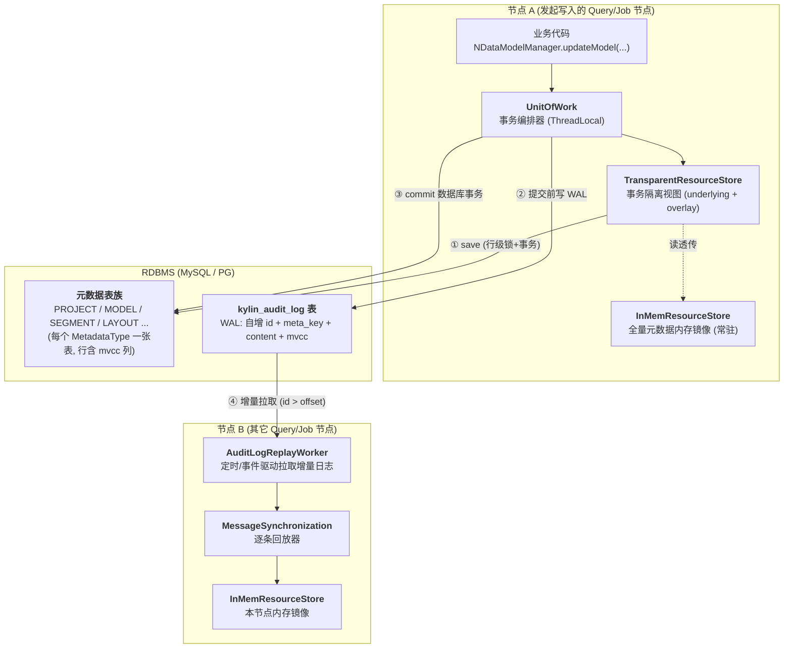
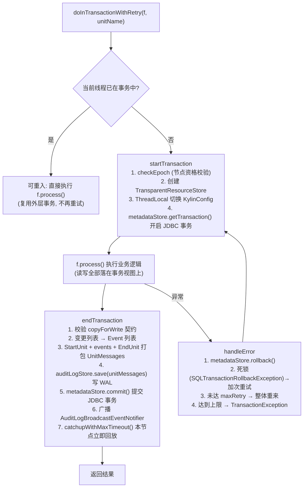
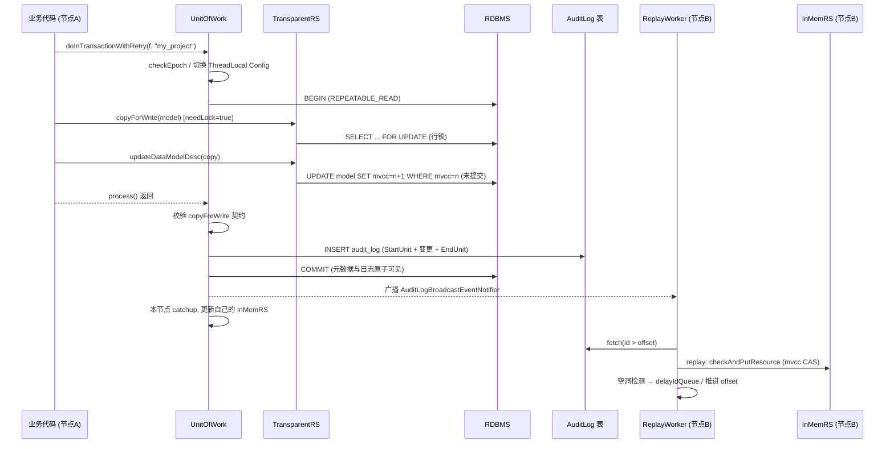

# 硬核拆解 Kylin 元数据引擎：ResourceStore、UnitOfWork 事务与 AuditLog 复制 —— 一套藏在 OLAP 内核里的"微型分布式数据库"

> **作者**：Huang Sheng (mrhs121)  
> **日期**：2026-08-21  
> **分类**：`Apache Kylin` · `元数据` · `事务` · `MVCC` · `AuditLog` · `多节点同步` · `源码剖析`

---

## 0. 导读：为什么元数据体系是 Kylin 源码里最难啃的部分？

读 Kylin 源码的人，大多是从查询引擎或构建引擎入手的——这两条链路虽然长，但都是"单向数据流"，顺着调用链读总能读通。而 `core-common/persistence` 这个包完全不同：

1. **五层抽象嵌套**：`ResourceStore` 有三个实现（`InMemResourceStore` / `TransparentResourceStore` / `FileSystemMetadataStore` 相关），彼此之间不是并列关系而是**运行时互相包裹**，一个事务里你拿到的 ResourceStore 和事务外拿到的根本不是同一个对象；
2. **双时间线并行**：本地写走 JDBC 事务 + 内存缓存，跨节点同步走 AuditLog 异步回放，两条时间线通过 MVCC 交汇，任何一篇只讲其中一条线的分析都会让读者"懂了但没完全懂"；
3. **隐式线程魔法**：`KylinConfig.setAndUnsetThreadLocalConfig` 在事务开始时偷偷替换了当前线程的配置对象，导致同一行 `ResourceStore.getKylinMetaStore(config)` 代码在事务内外返回完全不同的 store——这是初读源码最大的迷惑点，没有之一。

而理解它的回报也是巨大的：**Kylin 的元数据体系本质上是一个内嵌在 OLAP 引擎里的"微型分布式数据库"**——有 MVCC、有 WAL（AuditLog）、有主从复制（Replay）、有快照恢复（Image）、有冲突消解。本文将以"一次元数据写入的完整旅程"为主线，把这套体系一次性讲透。

> 说明：本文基于 Kylin 5.x 代码结构（元数据按类型分表存储于 RDBMS）。Kylin 4.x 的路径式元数据（`/{project}/model_desc/xxx.json`）在概念上可以对应理解，但物理组织已完全不同。

---

## 1. 全景图：五个角色与两条时间线

先给出全景，后文逐层展开：



五个核心角色：

| 角色 | 类 | 一句话职责 |
|---|---|---|
| 内存镜像 | `InMemResourceStore` | 每个节点常驻的全量元数据缓存，读请求从不碰数据库 |
| 事务视图 | `TransparentResourceStore` | 事务线程专属的"叠加层"，隔离未提交的修改 |
| 事务编排 | `UnitOfWork` | 提供 `doInTransactionWithRetry`，管理开启/提交/回滚/重试 |
| 持久层 | `JdbcMetadataStore` + `JdbcAuditLogStore` | 元数据分表落库 + WAL 审计日志 |
| 复制层 | `AuditLogReplayWorker` + `MessageSynchronization` | 其它节点拉取 WAL 增量并回放进内存镜像 |

两条时间线：

- **写路径（同步）**：业务代码 → UnitOfWork → TransparentResourceStore → JDBC 事务提交；
- **复制路径（异步）**：AuditLog 表 → ReplayWorker 拉取 → 回放进各节点 InMemResourceStore。

---

## 2. 数据模型：RawResource、MetadataType 与 MVCC

### 2.1 从"文件路径"到"类型化表"

Kylin 4.x 时代，元数据是一棵路径树（`/{project}/dataflow/xxx.json`），底层存 HBase 或文件系统。Kylin 5 彻底重构为**类型化关系表**：`MetadataType` 枚举（`MetadataType.java:66`）定义了全部 30+ 种元数据类型，**枚举名即表名**：

```java
public enum MetadataType {
    ALL(RawResource.class),
    PROJECT(ProjectRawResource.class),
    MODEL(ModelRawResource.class),
    INDEX_PLAN(IndexPlanRawResource.class),
    DATAFLOW(DataflowRawResource.class),
    SEGMENT(SegmentRawResource.class),
    LAYOUT(LayoutRawResource.class),
    COMPUTE_COLUMN(ComputeColumnRawResource.class),
    TABLE_INFO(TableInfoRawResource.class),
    // ... 共 30+ 种
}
```

资源定位符也从路径变为 `TYPE/metaKey` 二元组（如 `MODEL/f1234-abcd`），由 `MetadataType.splitKeyWithType / mergeKeyWithType` 负责拼接与拆分。每种类型对应一个 `XxxRawResource` 子类（`resources/` 包下），映射该表的列结构（project、model_uuid 等业务列被"提升"为可过滤的数据库列——这正是 `RawResourceFilter` 能做条件下推的基础）。

这个重构的动机值得体会：**路径树只能按前缀 list，类型表可以按任意列过滤、按需选列（`needContent=false` 时不拉大字段）、按行加锁**——为后面的细粒度事务铺平了道路。

### 2.2 MVCC：贯穿内存与数据库的乐观并发控制

每条元数据都携带一个单调递增的版本号 `mvcc`。它同时存在于三个地方，且必须一致：

1. **实体对象**：`RootPersistentEntity.mvcc` 字段，随 JSON 序列化；
2. **内存镜像**：`VersionedRawResource` 用 `AtomicLong` 持有，更新走 CAS（`VersionedRawResource.java:42`）：

```java
public void update(RawResource r) {
    if (mvcc.compareAndSet(r.getMvcc() - 1, r.getMvcc())) {
        this.rawResource = r;
    } else {
        throw new VersionConflictException(rawResource, r, "Overwriting conflict ...");
    }
}
```

3. **数据库行**：`JdbcMetadataStore.save()` 更新时带 `where meta_key = ? and mvcc = ?（旧值）` 条件（`updateByPrimaryKeyAndMvcc`），配合**行级记录锁**（`selectOneWithColumnsAndRecordLock`，即 `SELECT ... FOR UPDATE`）实现悲观 + 乐观双保险。

源码里 `VersionedRawResource` 有一句很诚实的注释：

> *In theory, mvcc is not necessary since we have project lock for all meta change... we keep it just in case project lock protocol is breached somewhere.*

**mvcc 是防御性设计**：正常情况下项目级锁已经串行化了写入，mvcc 是锁协议被破坏时的最后一道防线——而在异步回放场景（第 5 节）它会真正派上用场。

---

## 3. 三种 ResourceStore：一场精心设计的"偷梁换柱"

这是整个体系最容易读晕的部分。关键认知：**`ResourceStore.getKylinMetaStore(config)` 返回什么，取决于你传入的 `config` 是哪个对象**——Kylin 用 `META_CACHE`（以 KylinConfig 实例为 key 的 Guava Cache）+ ThreadLocal 配置切换，实现了"同一行代码，事务内外行为不同"。

### 3.1 InMemResourceStore：常驻内存镜像

节点启动时创建（`ResourceStore.createResourceStore`），内部是一个双层 Map（`InMemResourceStore.java:53`）：

```java
private final Map<MetadataType, Map<String, VersionedRawResource>> data;
// 外层: 元数据类型 -> 内层: metaKey -> 带版本的资源
```

启动时 `reload()` 从 MetadataStore 全量加载（`metadataStore.reloadAll()`），此后**所有非事务读全部命中内存，零数据库访问**。这就是 Kylin 各类 Manager（`NDataModelManager`、`NDataflowManager`...）高频 get 却不产生 DB 压力的原因。

它有一个重要的自我保护（`checkEnv()`，`InMemResourceStore.java:225`）：**普通业务线程禁止直接写它**——写入只允许两种身份：回放线程（`UnitOfWork.isReplaying()`）或 UT 环境。换句话说，InMemResourceStore 的内容只能通过"事务提交后的回放"更新，保证内存镜像永远与 AuditLog 时间线一致。

### 3.2 TransparentResourceStore：事务的叠加视图

`UnitOfWork.startTransaction()`（`UnitOfWork.java:190`）里发生了那场"偷梁换柱"：

```java
KylinConfig configCopy = KylinConfig.createKylinConfig(config);          // 1. 复制一份配置
TransparentResourceStore rs = new TransparentResourceStore(
        (InMemResourceStore) underlying, configCopy);                    // 2. 创建事务视图
ResourceStore.setRS(configCopy, rs);                                     // 3. 注册进 META_CACHE
unitOfWork.setLocalConfig(KylinConfig.setAndUnsetThreadLocalConfig(configCopy)); // 4. 替换线程配置
```

第 4 步之后，当前线程再调用 `KylinConfig.getInstanceFromEnv()` 拿到的是 `configCopy`，于是 `ResourceStore.getKylinMetaStore(...)` 命中的就是 `TransparentResourceStore`。**业务代码（各类 Manager）完全无感知**——这就是"Transparent"的含义。

它的内部结构是经典的 **Copy-on-Write 叠加层**（`TransparentResourceStore.java:48`）：

```
读:  overlay(本事务的修改) 命中则返回 → 否则透传 underlying(内存镜像)
写:  直接写 MetadataStore(数据库, 带行锁) → 同时记入 overlay + resources 列表
删:  写入 TombRawResource 墓碑标记 (读到墓碑返回 null, list 时过滤)
```

三个细节值得注意：

1. **写直达数据库**：`checkAndPutResource` 不是先攒在内存最后一起刷，而是**立即执行 SQL**（在未提交的 JDBC 事务里），行锁在此刻就已持有——事务隔离靠数据库（`ISOLATION_REPEATABLE_READ`，见 `JdbcTransactionHelper.java:42`），而不是靠 Java 层；
2. **`resources` 列表**：按序记录本事务全部变更，提交时用于生成 AuditLog 事件；
3. **墓碑（Tomb）模式**：删除并不真删 overlay 条目，而是放一个单例 `TombRawResource`，让"本事务删除了 X"与"X 本来就不存在"可区分。

### 3.3 带锁读：copyForWrite 的强制契约

事务里修改一个实体前，必须调用 Manager 的 `copyForWrite()`，其底层是 `getResource(resPath, needLock=true)`——`TransparentResourceStore.getResourceImpl` 对带锁读会绕过缓存直接查库并加行锁（`getMetadataStore().get(type, filter, needLock, needContent)`）。

这个契约由 `UnitOfWork.endTransaction` 强制校验（`UnitOfWork.java:240`）：

```java
if (x.getContent() != null && !(x instanceof SystemRawResource)
        && !copyForWriteResources.contains(resPath)) {
    throw new IllegalStateException(
            "Transaction try to modify a resource without copyForWrite: " + x.getMetaKey());
}
```

**任何没有先带锁读就直接写的行为会在提交时被当场拒绝**。这是排查 `Transaction try to modify a resource without copyForWrite` 报错的根因：不是并发问题，是代码违反了"先 copyForWrite 再改"的协议。

---

## 4. UnitOfWork：事务的完整生命周期

业务代码里最常见的 Kylin 代码模式：

```java
UnitOfWork.doInTransactionWithRetry(() -> {
    NDataModelManager mgr = NDataModelManager.getInstance(
            KylinConfig.getInstanceFromEnv(), project);
    NDataModel copy = mgr.copyForWrite(model);   // 带行锁读, 登记 copyForWrite
    copy.setAlias("new_name");
    mgr.updateDataModelDesc(copy);               // 写入 TransparentResourceStore
    return null;
}, project);                                     // unitName = 项目名(锁粒度)
```

完整生命周期（`UnitOfWork.java:87-175`）：



几个设计要点：

### 4.1 WAL 先行 + 同事务提交

`endTransaction` 的顺序是：**先写 AuditLog，再 commit**——而两者在同一个 JDBC 事务里（AuditLog 表与元数据表同库）。因此不存在"元数据成功但日志丢失"或"日志存在但元数据回滚"的中间态：**AuditLog 与元数据表的可见性是原子的**。AuditLog 表结构（`JdbcAuditLogStore`）：

```sql
-- {identifier}_audit_log
id          BIGINT AUTO_INCREMENT   -- 全局连续递增, 复制协议的核心
meta_key    VARCHAR                 -- TYPE/metaKey
meta_content BLOB                   -- 变更后全量内容 (或 JSON diff)
meta_ts     BIGINT
meta_mvcc   BIGINT                  -- 目标版本号
unit_id     VARCHAR                 -- 事务 ID (同事务的多条变更共享)
operator / instance / project      -- 审计信息
diff_flag   BOOLEAN                 -- content 是全量还是 JSON patch
```

### 4.2 提交后的"自我追赶"

注意生命周期第 7 步：提交完成后，**本节点也要走一遍回放**（`catchupWithMaxTimeout`）——因为 InMemResourceStore 禁止业务线程直接写（3.1 节），本事务的变更此刻还只在数据库里。让写入节点与其它节点走**完全相同的回放路径**更新内存镜像，消灭了"写入节点特殊化"的分支逻辑，这是一个非常干净的一致性设计：内存镜像的唯一写入来源就是 AuditLog 时间线。

### 4.3 重试语义与可重入

- **整体重试**：任何异常（含 mvcc 冲突、死锁）回滚后**从 `f.process()` 头部整体重来**（默认 3 次），所以事务闭包必须写成幂等的——这就是为什么闭包里总是重新 `getInstance` + 重新 `copyForWrite`，绝不能复用闭包外的实体引用；
- **死锁宽限**：捕获 `SQLTransactionRollbackException` 时动态增加重试次数（`retryMoreTimeForDeadLockException`），直到超出配置的时间窗；
- **可重入**：嵌套调用直接复用外层事务上下文，`checkReentrant` 校验 unitName 一致性——内层不提交、不重试，一切由最外层收口。

### 4.4 Epoch：写入资格的前置校验

`startTransaction` 的第一步 `checkEpoch` 关联到另一个体系：**Epoch（纪元）选主**。`Epoch` 实体（`Epoch.java`）记录 `epoch_target`（通常是项目名）、`current_epoch_owner`（持有者节点）、`last_epoch_renew_time`（租约续期时间）。Job 节点通过数据库 CAS 抢占并周期续租某个项目的 Epoch，只有 Epoch 持有者才有资格执行该项目的元数据变更类任务——这避免了多个 Job 节点同时调度同一项目的构建任务。事务开始前校验 Epoch，等于把"我还是不是这个项目的主"的判断内联进了每次写入。

---

## 5. 跨节点复制：AuditLogReplayWorker 的增量追赶协议

写入节点提交后，其它节点如何感知？答案是**双通道**：

1. **推（低延迟）**：提交后广播 `AuditLogBroadcastEventNotifier`，其它节点收到后立即触发一次 catchup；
2. **拉（兜底）**：每个节点的 `AuditLogReplayWorker` 以 `kylin.metadata.audit-log.catchup-interval`（默认 5s）定时轮询。

推保证秒级可见，拉保证广播丢失也终能收敛——最终一致性由"拉"兜底，"推"只是加速器。

### 5.1 滑动窗口追赶

核心逻辑在 `catchupToMaxId`（`AuditLogReplayWorker.java:193`）：

```
本地水位 logOffset ──────────────► auditLogStore.getMaxId()
        └── FixedWindow(currentId, maxId)
             └── SlideWindow 每次前进 STEP 条
                  └── fetch(start, size) → replayLogs → 前进
```

按 `id > offset` 分批拉取、逐条回放、推进水位。回放动作本身（`MessageSynchronization.replayInTransaction`）：

```java
UnitOfWork.replaying.set(true);        // 亮出"回放身份", 获得写 InMemResourceStore 的权限
messages.getMessages().forEach(event -> {
    if (event instanceof ResourceCreateOrUpdateEvent) {
        replayUpdate(...);             // checkAndPutResource(带 mvcc CAS) 更新内存镜像
        eventListener.onUpdate(...);   // 通知各 Manager 失效局部缓存
    } else if (event instanceof ResourceDeleteEvent) {
        replayDelete(...);
    }
});
UnitOfWork.replaying.remove();
```

`eventListener.onUpdate` 这步容易被忽略但非常关键：各类 Manager（ModelManager 等）内部还有二级缓存，回放后必须精准失效对应条目，否则内存镜像新了、Manager 缓存还是旧的。

### 5.2 空洞检测：自增 ID 不连续怎么办？

这是复制协议里最精妙的细节。AuditLog 的 `id` 是数据库自增列，但**自增值分配与事务提交是两回事**：事务 A 拿到 id=100，事务 B 拿到 id=101；B 先提交，A 还没提交甚至最终回滚——此刻读取窗口 `(99, 101]` 只能看到 101，**id=100 是一个"暂时的空洞"**。如果直接把水位推到 101，A 稍后提交的 100 就永远丢了。

`AuditLogReplayWorker` 的处理（`recordStepAbsentIdList` + `delayIdQueue`）：

1. 每个窗口回放后，比对"窗口应有的 id 区间"与"实际拉到的 id 集合"，找出缺失 id；
2. 缺失 id 进入 `delayIdQueue` 延迟队列，**下一轮 catchup 优先重试**这些 id；
3. 重试成功则移除；超过 `idTimeoutMills` 仍拉不到（说明那个事务真的回滚了），超时丢弃并告警；
4. 配置 `isNeedReplayConsecutiveLog` 开启时，还会先 `waitLogCommit` 等待窗口内日志数量对齐，尽量把空洞消灭在等待阶段。

### 5.3 冲突消解与终极兜底

回放时 mvcc CAS 失败（`VersionConflictException`）意味着本节点内存镜像与日志流出现了错位。`handleConflictOnce`（`AuditLogReplayWorker.java:271`）的策略是**以数据库为准做定点修复**：按 metaKey 从元数据表重新拉取当前版本，构造一条修正日志强制回放，再把 offset 对齐到该资源最新 AuditLog 的 id。若修复重试次数耗尽或出现其它不可恢复异常，则触发**终极兜底 `handleReloadAll`**：调用 `MessageSynchronization.replayAllMetadata`，暂停回放线程、全量 reload 内存镜像、重新对齐水位——相当于复制状态机的"快照重装"。

### 5.4 JSON Diff：给 WAL 瘦身

大实体（如包含数百 Segment 的 Dataflow）每次小改动都写全量 JSON 会让 AuditLog 迅速膨胀。开启 `kylin.metadata.audit-log-json-patch-enabled` 后，`TransparentResourceStore.checkAndPutResource` 会调用 `raw.fillContentDiffFromRaw(before)` 生成 **JSON Patch** 存入日志（`diff_flag=true`）；回放侧 `MessageSynchronization.replayUpdate` 检测到 diff 则先取本地旧值再 `applyContentDiffFromRaw` 打补丁。这也解释了回放对**顺序和完整性**的苛刻要求——patch 链条断一环，后续全部无法应用（所以冲突处理里才有"以数据库全量值修复"的设计）。

---

## 6. 快照与恢复：Image 机制

如果一个节点宕机一周后重启，从 offset=0 回放全部历史日志显然不现实。Kylin 的方案是**快照 + 增量**：

- `ResourceStore.METASTORE_IMAGE`（`SYSTEM/_image`）记录一个 `ImageDesc{offset}`——全量元数据快照对应的日志水位；
- 节点启动：`reload()` 全量加载元数据表 → `catchup()` 读取 image offset → 从该水位开始回放增量（`ResourceStore.java:373`）；
- AuditLog 表本身由 `rotate()` 按保留策略删除旧日志（`delete from ... where id < ?`）——正因为有全量表兜底，日志才敢删。

这套"全量表 = 最新快照，AuditLog = 增量 WAL"的组合，同时服务于**节点重启恢复**、**新节点加入**与**metastore 备份**（`dumpResources` 导出的就是某一时刻的全量镜像）三个场景。

---

## 7. 一次写入的全链路时序（把所有角色串起来）

以"改模型名"为例，两节点部署下的完整时序：



---

## 8. 生产排障对照表

| 症状 / 报错 | 对应机制 | 排查方向 |
|---|---|---|
| `Transaction try to modify a resource without copyForWrite` | 3.3 节契约校验 | 代码在事务里改了未带锁读取的实体；检查是否复用了闭包外的对象引用 |
| `VersionConflictException: Overwriting conflict` | MVCC CAS | 单节点出现多为绕过 UnitOfWork 直写；回放线程出现则关注 5.3 的自动修复日志 |
| `transaction failed due to inconsistent state` + 已重试 3 次 | 4.3 重试耗尽 | 看首次失败的根因日志（`transaction failed at first time`）；死锁频繁则检查是否有跨项目大事务 |
| 节点间元数据不一致（B 节点看不到 A 的修改） | 第 5 节复制链路 | 依次检查：audit_log 表 max(id) 与 B 节点日志中的 offset 差距、catchup-interval 配置、replay 线程是否因异常触发过 reloadAll |
| `UnitOfWork ... takes too long time to catchup audit log` | 4.2 提交后自追赶 | 本节点回放慢，通常是单事务变更条目过多或 DB 延迟高 |
| `find absent id list` 频繁出现 | 5.2 空洞检测 | 正常现象（并发提交必然产生）；只有伴随 `delay timeout id` 才说明真有事务回滚或日志异常 |
| 重启后启动极慢 | 第 6 节 | 元数据基数过大（检查 SEGMENT/LAYOUT 表行数）；确认 image offset 正常推进、AuditLog rotate 是否在跑 |

---

## 9. 总结：一个教科书级的复制状态机实现

把视角拉高，Kylin 元数据体系就是分布式系统教科书里的 **Replicated State Machine**：

| 教科书概念 | Kylin 实现 |
|---|---|
| State（状态） | InMemResourceStore 内存镜像 + RDBMS 元数据表 |
| WAL（预写日志） | JdbcAuditLogStore（自增 id 全序） |
| Replication（复制） | AuditLogReplayWorker 拉取 + 广播加速 |
| MVCC | RootPersistentEntity.mvcc 三处一致 + CAS |
| Snapshot（快照） | Image offset + 全量元数据表 |
| Conflict Resolution | 定点修复 → 全量 reload 的两级兜底 |
| Leader Lease | Epoch 租约选主 |

它的工程亮点在于**没有引入任何额外组件**——不依赖 ZooKeeper 做元数据一致性（仅分布式锁场景可选）、不依赖消息队列做复制，一个 RDBMS 承载了状态、日志与选主三重职责，把运维复杂度压到了最低。而代价是源码层面五层抽象的高耦合——希望本文这张"全景图 + 写入旅程"能帮你把这块最难啃的骨头一次性啃下来。

---

> **交叉阅读**：
> - 元数据里的 Dataflow/Segment/Layout 实体如何被构建流水线创建与更新 → [构建引擎：Spark Segment Build 全链路](2026-08-20-kylin-spark-segment-build-pipeline.md)（第 12 节的 `pipe`+`drain()` 批量元数据提交，正是走的本文 UnitOfWork 通道）；
> - 查询引擎如何消费这些元数据（Model/IndexPlan 匹配） → [查询引擎 (三)：OlapContext 与模型匹配](2026-08-18-kylin-query-engine-03-olap-context-and-cbo.md)。
